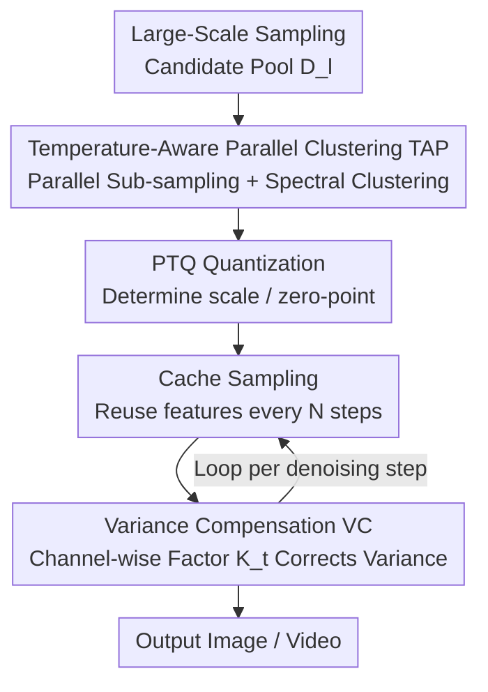

# Q&C: When Quantization Meets Cache in Efficient Generation

**Conference**: ICLR 2026  
**OpenReview**: [https://openreview.net/forum?id=AH7hbA7Zkk](https://openreview.net/forum?id=AH7hbA7Zkk)  
**Code**: To be confirmed  
**Area**: Model Compression / Diffusion Model Acceleration  
**Keywords**: Post-Training Quantization, Feature Cache, Diffusion Models, Calibration Dataset, Exposure Bias

## TL;DR
This paper presents the first systematic study of the joint effects of "quantization + cache" acceleration mechanisms. It identifies that the superposition of these two techniques compromises the sample effectiveness of PTQ calibration sets and amplifies exposure bias in the sampling distribution. It proposes Temperature-Aware Parallel Clustering (TAP) to re-select calibration samples and training-free Variance Compensation (VC) to correct distribution variance, achieving up to a $12.7\times$ speedup on DiT with almost no loss in generation quality.

## Background & Motivation
**Background**: Generative diffusion models (DiT, LDM, Sora, FLUX, etc.) deliver impressive results but require massive computational resources; generating a 512×512 image takes 20 seconds and 105 GFLOPs on an A6000. Researchers have pursued two main routes for acceleration: **Quantization** (specifically Post-Training Quantization, PTQ, which requires only a small calibration set) to reduce weights/activations to low bits, and **Caching**, which exploits feature redundancy in adjacent denoising steps to recompute features every $N$ steps and reuse them otherwise.

**Limitations of Prior Work**: These two routes have traditionally been used independently, and whether they can be stacked for further acceleration has not been rigorously studied. The authors found that while speedup ratios do stack, generation quality collapses—a simple combination of SOTA quantization and SOTA caching degraded the FID from 5.45 to 13.67.

**Key Challenge**: The authors attribute the quality collapse to two overlooked side effects. First, **caching leads to "inbreeding" in the PTQ calibration set**. Reusing historical features causes the cosine similarity of calibration samples from adjacent timesteps to skyrocket (exceeding 60% in later stages). Consequently, the calibration set fails to cover the overall distribution despite having many samples, leading to inaccurate quantization error estimation. Second, **the synergy of quantization and caching amplifies exposure bias**. While bias remains stable when quantization or caching is used alone, their combined use significantly increases the error between predicted samples and ground truth, which accumulates over sampling steps. Further analysis reveals this amplification is essentially **variance drift**: the variance of ground truth samples is distributed in $(0, 0.6)$, while the joint quantization + cache setup drifts to $(0.1, 0.7)$, matching the trend of exposure bias (whereas the mean shows no such phenomenon).

**Goal**: To preserve the acceleration dividends of stacking quantization and caching while mitigating these two side effects—one addressing calibration set failure and the other addressing exposure bias caused by variance drift.

**Core Idea**: Replace "uniform random sampling across all timesteps" with "dynamic selection of the most informative calibration samples per timestep" to restore calibration set effectiveness, and use "timestep-wise, channel-wise training-free variance scaling factors" to pull the drifted output variance back to normal, thereby suppressing exposure bias.

## Method

### Overall Architecture
Q&C is a hybrid acceleration scheme integrated into the standard "PTQ Quantization + Cache Sampling" pipeline. It does not modify the operators of quantization or caching themselves but adds "patches" at two critical points. In the offline phase, it first performs large-scale sampling of a candidate pool $D_l$, then uses **TAP** to perform temperature-aware parallel clustering to select a small group of highly discriminative samples that cover the full distribution for PTQ scale/zero-point determination. In the online phase (denoising sampling), the model speeds up by reusing features at cache interval $N$ while using **VC** at each timestep to calculate a channel-wise reconstruction factor $K_t$ to correct the variance of the current intermediate sample, mitigating accumulated exposure bias. These two components address the two identified challenges and are non-coupled, allowing them to be plugged into various quantization and caching combinations.

### Key Designs

**1. Temperature-Aware Parallel Clustering (TAP): Replacing Highly Redundant Calibration Sets with Selected Sets for Full Distribution Coverage**

To address the loss of PTQ accuracy caused by high redundancy in cached calibration samples, a naive approach would be to increase the size of the set, but this only introduces more redundancy and unnecessary computation. TAP adopts an "active selection" strategy. Given a candidate pool of $N$ samples, it first performs $m$ random sub-samplings (probability $p_i = \frac{n}{N}$) to obtain $m$ subsets $\{S_1, \dots, S_m\}$ for parallel processing. This weakens random noise and distribution bias while reducing spectral clustering complexity from $O(n^3)$ to $O(rn)$ (where $r \ll n$). A "spatio-temporal joint" similarity matrix is constructed for each subset:

$$A^{(i)}_{final} = \alpha A^{(i)}_{spatial} + (1-\alpha) A^{(i)}_{temporal}$$

where spatial similarity uses feature cosine $A_{spatial, kh} = \frac{x_k \cdot x_h}{\|x_k\|\|x_h\|}$, and **temporal similarity uses $A_{temporal, kh} = \exp(-|t_k - t_h|)$ to explicitly encode how far apart the two samples are in denoising timesteps**. This "temporal awareness" is key, leveraging the sensitivity of generative model calibration sets to timesteps. Subsequently, k-means is applied to the first $k$ eigenvectors of the normalized Laplacian $L^{(i)} = (D_r^{(i)})^{1/2} A^{(i)}_{final} (D_c^{(i)})^{1/2}$ to partition the dataset into $k$ clusters, from which samples are uniformly drawn to ensure the final set covers the original distribution rather than clustering in high-similarity regions.

**2. Variance Compensation (VC): Pulling Back Drifting Output Variance with Training-Free Channel-Wise Scaling**

To address the amplified exposure bias caused by variance drift, VC does not train an auxiliary network to predict errors. Instead, it performs an analytical variance recalibration. For a random variable $f \sim N(\mu, \sigma^2)$, to change the variance to $\sigma_{new}^2$, one can use the linear scaling $Y = \mu + \frac{\sigma_{new}}{\sigma}(f - \mu)$. Since $\frac{\sigma_{new}}{\sigma}$ is practically inaccessible, VC introduces a **timestep-dependent reconstruction scaling factor $K \in \mathbb{R}^{S_t \times C}$** ($S_t$ is the number of denoising steps, $C$ is channels) to reconstruct intermediate samples as:

$$\tilde{x}_t = \mu_t + K_t \cdot (\hat{x}_t - \mu_t)$$

(where $\cdot$ denotes channel-wise multiplication). $K_t$ is solved by minimizing $\arg\min_{K_t}(\text{rQNSR}(\tilde{x}_t, x'_t)^2 + \text{MSE}(\tilde{x}_t, x'_t))$, where the inverse Root Quantization Noise-to-Signal Ratio (rQNSR) is added to MSE to make the objective more sensitive to channel-wise noise effects. The analytical solution is:

$$K_t = \frac{\sum_n (x'_{t,n}-\mu_t)(\hat{x}_{t,n}-\mu_t) + \sum_n \frac{\hat{x}_{t,n}-\mu_t}{x'_{t,n}}}{\sum_n (\hat{x}_{t,n}-\mu_t)^2 + \sum_n \frac{(\hat{x}_{t,n}-\mu_t)^2}{x'^{2}_{t,n}}}$$

By reusing samples $x'$ already available from the quantization process, VC **requires no additional training** and can adaptively suppress accumulated exposure bias.

### Loss & Training
The overall method is post-training and requires no retraining. TAP is a one-time calibration set construction, and the VC factor $K_t$ is directly computed via a closed-form solution. The only "optimization" objective is the joint $\text{rQNSR}^2 + \text{MSE}$ criterion used in VC.

## Key Experimental Results

### Main Results
Using class-conditional DiT-XL/2 on ImageNet with DDPM 250/100/50 steps, quantized at W8A8 (256) / W4A8 (512). Comparison for ImageNet 256×256, W8A8, 50 steps:

| Method | Speedup | FID ↓ | sFID ↓ | IS ↑ | Precision ↑ |
|------|------|-------|--------|------|-------------|
| DDPM (Original) | 5× | 5.22 | 17.63 | 237.8 | 0.8056 |
| PTQ4DiT | 10× | 5.45 | 19.50 | 250.68 | 0.7882 |
| Learn-to-Cache | 6.3× | 5.21 | 17.60 | 245.45 | 0.8122 |
| Q&C† (Ours) | **12.7×** | 5.43 | 19.52 | 250.68 | 0.7895 |

Q&C† achieves a $12.7\times$ speedup (significantly higher than quantization or caching alone) while maintaining metrics close to the original model and the strongest single-mechanism baselines. Its versatility was confirmed across Sora, FLUX, and Stable Diffusion.

### Ablation Study
ImageNet 256×256, W8A8, 50 steps, baseline = PTQ4DiT + Learn-to-Cache:

| Configuration | FID ↓ | sFID ↓ | IS ↑ | Precision ↑ | Speedup |
|------|-------|--------|------|-------------|------|
| Baseline (Joint quantization+cache) | 13.67 | 25.86 | 189.65 | 0.7124 | 11.5× |
| + VC | 9.65 | 22.34 | 210.35 | 0.7445 | 12.1× |
| + TAP | 8.34 | 21.65 | 220.67 | 0.7566 | 12.3× |
| + TAP + VC | **5.43** | **19.52** | 250.68 | 0.7895 | 12.7× |

### Key Findings
- **Stacking fails without adjustment**: Simple stacking of SOTA quantization and caching leads to FID jumping from 5.45 to 13.67.
- **Components are complementary**: Adding VC and TAP individually reduces FID, and using both achieves 5.43, reducing FID by 8.24 relative to the baseline.
- **Robustness to $\alpha$**: FID remains stable (5.36–5.57) for similarity weight $\alpha$ between 0.3–0.7.

## Highlights & Insights
- **The "Diagnosis" is highly valuable**: Using cosine similarity heatmaps and variance density distributions, the paper robustly establishes the causal chains of "cache → redundancy" and "quantization × cache → variance drift → exposure bias."
- **Temporal kernel in similarity**: The $\exp(-|t_k - t_h|)$ term acknowledges that diffusion calibration samples are naturally temporal, making it more suitable for generative models than pure feature clustering.
- **Training-free VC**: Instead of training an error-prediction network, VC uses an analytical channel-wise scaling factor, offering low deployment costs.

## Limitations & Future Work
- The core diagnosis is focused on DiT + ImageNet; more systematic evaluation for ultra-high-resolution video generation is needed.
- VC assumes near-normal feature distributions and depends on reference sample quality. If distributions are highly skewed, correction might be less accurate.
- Future work could further couple the temporal kernel of TAP with VC for joint scheduling.

## Related Work & Insights
- **vs PTQ4DiT / Q-Diffusion (Quantization only)**: These focus on quantization error but assume random sampling is sufficient; Q&C identifies that this fails under caching and uses TAP to restore calibration quality.
- **vs Learn-to-Cache / DeepCache (Cache only)**: These focus on reusing features to save compute; Q&C reveals how they degrade quantization and introduces joint governance.
- **vs Network-based correction**: While some methods use auxiliary networks to compensate for errors, VC uses a training-free analytical variance factor, which is lighter for deployment.

## Rating
- Novelty: ⭐⭐⭐⭐⭐ First systematic study of the joint effects of quantization and caching with precise identification of side effects.
- Experimental Thoroughness: ⭐⭐⭐⭐⭐ Comprehensive coverage of tasks, architectures, and ablation studies.
- Writing Quality: ⭐⭐⭐⭐ Clear diagnosis and logic, though VC derivation needs Appendix reference for full detail.
- Value: ⭐⭐⭐⭐⭐ Provides a reusable diagnostic and governance paradigm for stacking multiple acceleration mechanisms.

<!-- RELATED:START -->

## Related Papers

- [\[ICLR 2026\] PTQ4ARVG: Post-Training Quantization for AutoRegressive Visual Generation Models](ptq4arvg_post-training_quantization_for_autoregressive_visual_generation_models.md)
- [\[ICLR 2026\] LookaheadKV: Fast and Accurate KV Cache Eviction by Glimpsing into the Future without Generation](lookaheadkv_fast_and_accurate_kv_cache_eviction_by_glimpsing_into_the_future_wit.md)
- [\[ICLR 2026\] LightMem: Lightweight and Efficient Memory-Augmented Generation](lightmem_lightweight_and_efficient_memory-augmented_generation.md)
- [\[ICLR 2026\] SSDi8: Accurate and Efficient 8-bit Quantization for State Space Duality](ssdi8_accurate_and_efficient_8-bit_quantization_for_state_space_duality.md)
- [\[ICLR 2026\] ParoQuant: Pairwise Rotation Quantization for Efficient Reasoning LLM Inference](paroquant_pairwise_rotation_quantization_for_efficient_reasoning_llm_inference.md)

<!-- RELATED:END -->
