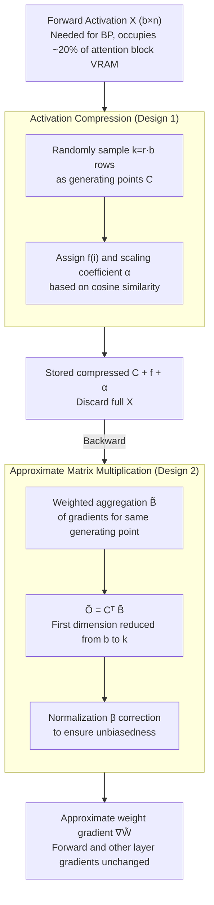

# QKV Projections Require a Fraction of Their Memory

**Conference**: ICLR 2026  
**arXiv**: [2506.02939](https://arxiv.org/abs/2506.02939)  
**Code**: None  
**Area**: Model Compression  
**Keywords**: Training memory compression, Attention mechanism, Matrix multiplication approximation, Activation compression, LLM training

## TL;DR

PAMM (Point-Approximate Matrix Multiplication) is proposed as an activation compression technique that approximates QKV projection layer activations by randomly selecting a small number of representative tokens. It achieves up to 512× compression without compromising model performance.

## Background & Motivation

In LLM training, QKV projections in attention layers consume significant memory. The input $X$ must be stored during the forward pass for use in backpropagation (to compute $\nabla W = X^\top \cdot \nabla Z$). This memory can account for approximately 20% of the total peak GPU memory of an attention block.

Limitations of existing memory optimization methods:
- **Efficient Attention** (e.g., FlashAttention): Optimizes the scaled dot-product itself but does not address linear projections.
- **Low-rank Methods** (e.g., CompAct): Compress along the hidden dimension, but redundancy is more significant in the sequence dimension.
- **Optimizer State Compression**: Does not scale with batch size and sequence length.

Key Insight: **Significant redundancy exists in the sequence dimension**. The number of tokens $b = BL$ in a training batch (e.g., 16384) is far greater than the hidden dimension $n$ (e.g., 2048). Since $\text{rank}(X) \leq n$, theoretically only $n$ basis vectors are needed to represent $X$, allowing a potential compression ratio of 8× or more.

## Method

### Overall Architecture

PAMM aims to "slim down" the activations $X$ required during backpropagation. Instead of storing the full $X \in \mathbb{R}^{b \times n}$ during the forward pass, it only retains a small number of representative tokens as generating points, along with auxiliary information indicating which generating point each token points to and its scaling factor. During the backward pass, this compressed representation is used to directly approximate the weight gradient $\nabla W = X^\top \cdot \nabla Z$, bypassing dependence on the full $X$. The process is a two-stage "compress-then-approximate" workflow: the forward pass replaces $X$ with generating points $C$, assignment table $f$, and scaling table $\alpha$; the backward pass feeds these components into the approximate matrix multiplication to calculate the gradient. This mechanism only modifies the backward path of QKV projection layers, leaving forward outputs and gradients of other layers unchanged.

### Key Designs

**1. Activation Compression: Representing the whole batch via generating points and scaling coefficients**

The input of QKV projections consists of $b = BL$ tokens, but the hidden dimension $n$ is much smaller than $b$. Thus, $\text{rank}(X) \le n$, meaning the batch of tokens essentially lies in a low-dimensional subspace. Based on this, PAMM randomly samples $k = r \cdot b$ rows from $X$ to serve as generating points $C \in \mathbb{R}^{k \times n}$ (random sampling without replacement is sufficient; clustering is unnecessary). For each token $A_i$, the most suitable generating point is found via absolute cosine similarity $f(i) = \arg\max_j |\text{csim}(A_i, C_j)|$. A scaling factor $\alpha_i = \text{csim}(A_i, C_{f(i)}) \cdot \frac{\|A_i\|_2}{\|C_{f(i)}\|_2}$ is then projected along that direction, such that $A_i$ is approximated by $\tilde{A}_i = \alpha_i \cdot C_{f(i)}$. Consequently, $X$ is replaced by the trio: $C$, $f$, and $\alpha$. The paper also introduces a neighborhood gate $\|A_i - \tilde{A}_i\|_2 \le \varepsilon \|A_i\|_2$ where poorly approximated tokens are discarded; however, experiments found that setting $\varepsilon \to \infty$ (retaining all tokens) is most stable.

**2. Approximate Matrix Multiplication: Aggregation before multiplication to avoid reconstruction**

With the compressed representation, a naive approach would reconstruct $\tilde{A}$ before calculating $\tilde{A}^\top B$, which would reclaim the memory and negate the compression. PAMM instead utilizes the associative property for aggregation: gradients of all tokens pointing to the same generating point $j$ are weighted and summed as $\tilde{B}_j = \sum_{i:f(i)=j} \alpha_i B_i$. Then, $\tilde{O} = C^\top \tilde{B}$ is computed. The first dimension of the tensors involved in the multiplication is reduced from $b$ to $k$, exploiting sequence redundancy without ever materializing the full activation. To compensate for discarded tokens, a normalization factor $\beta = \frac{b}{b-\eta}$ (where $\eta$ is the number of discarded tokens) is applied to maintain an unbiased estimate $\mathbb{E}[\tilde{O}] = O$.

**3. Theoretical Guarantee: Logarithmic generating points and error bounds**

Lemma 2 provides a sufficient condition for the sampling: $k > \frac{b}{n_{\min}} \ln(\frac{b}{\delta})$. Since $b/n_{\min}$ is approximately constant, the number of generating points only needs to grow **logarithmically** with the number of batch tokens $b$, explaining why the compression ratio $r$ can reach $1/512$ without failure. The approximation error has a closed-form upper bound $\|O - \tilde{O}\|_F^2 \le \|B\|_2^2 (\varepsilon^2 \|A_\mathcal{I}\|_F^2 + \|A_{\bar{\mathcal{I}}}\|_F^2)$, which splits error into the projection residual of retained tokens (controlled by $\varepsilon$) and the energy of discarded tokens. This theoretical bound explains why $\varepsilon\to\infty$ (no discarding) is experimentally optimal: the energy loss from discarding is usually more costly than the memory saved.

### Loss & Training

PAMM is a plug-and-play replacement for backpropagation. it introduces no additional loss terms and only replaces the gradient computation of QKV projections with the approximate multiplication described above. It is orthogonal to and can be combined with FlashAttention, gradient checkpointing, and LoRA. In experiments, a compression ratio $r$ of $1/512$ maintains accuracy. In fine-tuning scenarios, the subspace is even tighter, allowing for aggressive settings such as $k=1$ (one generating point for the whole batch).

## Key Experimental Results

### Main Results: Pre-training (LLaMA on C4)

| Model | PAMM r | Val PPL | QKV Memory (MB) | Reduction |
|------|--------|---------|-------------|---------|
| LLaMA-60M | No PAMM | 31.8 | 432 | - |
| LLaMA-60M | 1/512 | 31.6 | 0.85 | **>99%** |
| LLaMA-350M | No PAMM | 18.7 | 1,296 | - |
| LLaMA-350M | 1/512 | 18.5 | 2.53 | **>99%** |
| LLaMA-1B | No PAMM | 15.1 | 2,592 | - |
| LLaMA-1B | 1/512 | 15.0 | 5.06 | **>99%** |

### Main Results: Fine-tuning (RoBERTa-base on GLUE)

| Method | QKV Memory (MB) | GLUE Avg | Reduction |
|------|-------------|----------|---------|
| Full Fine-Tuning | 288 | 86.28 | - |
| PAMM r=1/128 | 6.75 | 86.11 | **97.7%** |
| PAMM r=1/256 | 3.37 | 86.18 | **98.8%** |

### Throughput Analysis (LLaMA-1B)

| Phase | Baseline (tok/s) | PAMM (tok/s) | Overhead |
|------|-----------|------------|----------|
| Forward | 247.6K | 235.4K | 4.92% |
| Backward | 141.9K | 138.3K | 2.53% |
| **Total** | 88.4K | 85.2K | **3.61%** |

### Key Findings

- Under 512× compression, PPL actually improves slightly (more pronounced in larger models), suggesting that redundant tokens may interfere with training.
- As model size increases, throughput loss decreases from 19.7% (60M) to 2.1% (7B), making it more practical for large models.
- PAMM performs stably across all batch sizes and sequence length configurations.
- Compared to CompAct (compression along the hidden dimension), PAMM performs significantly better at high compression ratios.

## Highlights & Insights

- Deep Insight: Sequence dimension redundancy is far greater than hidden dimension redundancy, which is the fundamental reason for high compression ratios.
- Extremely Simple and Effective: Random selection of generating points is sufficient; complex clustering is not required.
- Theoretical Rigor: Lemmas 1 and 2 provide theoretical guidance for the algorithm design.
- Complete Orthogonality: Directly stacks with FlashAttention and other techniques.
- Surprise Discovery: PPL improves slightly at high compression ratios, suggesting a potential regularization effect.

## Limitations & Future Work

- Currently only applied to QKV projections; activation compression for FFN layers has not been explored.
- The optimal setting for the neighborhood parameter $\varepsilon$ is $\infty$ (not used), which lacks full theoretical explanation.
- Additional computation (cosine similarity matrix + argmax) has a larger relative impact on smaller models.
- Not yet validated in distributed training (multi-node) scenarios.

## Related Work & Insights

- Key difference from CompAct: PAMM compresses along the sequence dimension (higher redundancy), whereas CompAct compresses along the hidden dimension.
- Relationship to Gradient Checkpointing: Complementary—gradient checkpointing reduces the number of layers stored, while PAMM reduces the amount of memory stored per layer.
- Inspiration: Training memory optimization should not only focus on optimizer states and attention mechanisms; activation memory is equally important.

## Rating

- Novelty: ⭐⭐⭐⭐⭐ Discovered a new direction in sequence dimension redundancy with a simple, efficient method.
- Experimental Thoroughness: ⭐⭐⭐⭐⭐ Comprehensive coverage of pre-training, fine-tuning, throughput, and ablation studies.
- Writing Quality: ⭐⭐⭐⭐⭐ Excellent integration of theory and experiments with clear diagrams.
- Value: ⭐⭐⭐⭐⭐ A practical memory optimization tool for LLM training.

<!-- RELATED:START -->

## Related Papers

- [\[ICLR 2026\] LightMem: Lightweight and Efficient Memory-Augmented Generation](lightmem_lightweight_and_efficient_memory-augmented_generation.md)
- [\[ICLR 2026\] Quantized Gradient Projection for Memory-Efficient Continual Learning](quantized_gradient_projection_for_memory-efficient_continual_learning.md)
- [\[ICLR 2026\] Study of Training Dynamics for Memory-Constrained Fine-Tuning (TraDy)](study_of_training_dynamics_for_memory-constrained_fine-tuning.md)
- [\[ICCV 2025\] A Good Teacher Adapts Their Knowledge for Distillation](../../ICCV2025/model_compression/a_good_teacher_adapts_their_knowledge_for_distillation.md)
- [\[ICLR 2026\] Towards Lossless Memory-efficient Training of Spiking Neural Networks via Gradient Checkpointing and Spike Compression](towards_lossless_memory-efficient_training_of_spiking_neural_networks_via_gradie.md)

<!-- RELATED:END -->
