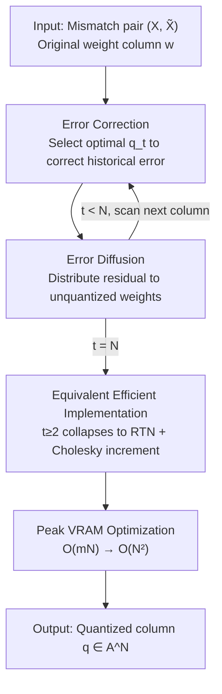

# Qronos: Correcting the Past by Shaping the Future... in Post-Training Quantization

**Conference**: ICLR 2026  
**OpenReview**: [https://openreview.net/forum?id=7axclBCYul](https://openreview.net/forum?id=7axclBCYul)  
**Code**: To be confirmed  
**Area**: Model Compression / Post-Training Quantization  
**Keywords**: Post-Training Quantization, Adaptive Rounding, Error Correction, Error Diffusion, LLM Quantization

## TL;DR
Qronos is a novel Post-Training Quantization (PTQ) rounding algorithm that executes "error correction" and "error diffusion" alternately in a column-wise and element-wise manner. It not only corrects current weight/activation quantization errors but also explicitly compensates for residual errors accumulated from previously quantized layers. The paper proves an equivalent efficient implementation that reduces the peak VRAM of Llama3-8B by 18x and accelerates single-layer computation by up to 13.8x, consistently outperforming SOTA rounding methods like OPTQ, GPFQ, and GPTAQ on Llama3/Qwen3 at 4-bit and lower bit-widths.

## Background & Motivation
**Background**: The PTQ pipeline for LLMs typically consists of two stages (Figure 1 in the paper): Stage 1 is "Transformation," which uses Hadamard rotation, scaling equivalent transformations (SmoothQuant, QuaRot), or MagR to make weights/activations more "quantization-friendly"; Stage 2 is "Rounding," which maps the (transformed) weights onto a quantization grid. Recent works have focused heavily on inventing new transformations in Stage 1, while Stage 2 often relies on simple Round-to-Nearest (RTN) or OPTQ (i.e., GPTQ). This paper focuses on Stage 2—improving the rounding algorithm itself while maintaining compatibility with various transformations.

**Limitations of Prior Work**: Layer-wise reconstruction methods represented by OPTQ aim to minimize $\min_{Q}\|XW-XQ\|_F^2$, assuming the input $X$ to the layer remains constant before and after quantization. However, in practice, once previous layers are quantized, the input to the current layer becomes $\tilde{X}$ produced by the "partially quantized model," rather than the original $X$. OPTQ only corrects weight quantization errors and **cannot handle the input mismatch $X\neq\tilde{X}$**, leading to systemic bias when activations are also quantized or when errors accumulate from preceding layers.

**Key Challenge**: The true objective should be to minimize the mismatch between the original output and the output calculated on the partially quantized model: $\min_{Q}\|XW-\tilde{X}Q\|_F^2$ (Eq. 2 in the paper). Existing rounding algorithms almost exclusively solve a simplified version (Eq. 1) that ignores this mismatch. GPFQ attempts to align $\sum w_jX_j$ and $\sum q_j\tilde{X}_j$ via "path-following," but the tails of the two paths fail to align when $\sum_{i>t}w_i(X_i-\tilde{X}_i)\neq 0$, leaving the correction incomplete.

**Goal**: Design a rounding algorithm that (1) explicitly corrects quantization errors for both weights **and** activations, (2) explicitly corrects residual errors from previously quantized layers, and (3) is mathematically interpretable and efficiently scalable.

**Key Insight**: The authors formulate this as a "disciplined" element-wise optimization framework—each step first selects a quantization value to optimally correct the current error, then "diffuses" the residual error into weights that have not yet been quantized. This alternating framework not only offers a mathematically elegant form with a closed-form solution but can also be strictly rewritten into an equivalent implementation that runs as fast as OPTQ.

**Core Idea**: Replace the local greedy approach of OPTQ with an alternating update of "error correction (correct the past) + error diffusion (shape the future)," and directly incorporate the mismatched input pair $(X,\tilde{X})$ into the objective to truly minimize $\|Xw-\tilde{X}q\|^2$.

## Method

### Overall Architecture
Qronos splits the weight matrix $W\in\mathbb{R}^{N\times N'}$ into columns, where each column $w\in\mathbb{R}^N$ is quantized into $q\in\mathcal{A}^N$ independently and in parallel ($\mathcal{A}$ is the quantization grid). For a single column, the ideal goal is $\min_q\tfrac12\|Xw-\tilde{X}q\|^2$, where $X$ is the calibration input matrix from the original model and $\tilde{X}$ is the input from the partially quantized model. This is an NP-hard integer least squares problem. Qronos solves it using an approximate **element-wise sequential scanning** algorithm: at step $t$, it first fixes other weights and selects the optimal quantization value $q_t$ to correct the current approximation error (error correction), then optimally distributes the rounding residual of this step to the unquantized weights $t+1\ldots N$ (error diffusion). Both steps have closed-form solutions.

The essence of the method lies in a three-part logical chain: ① The alternating "correction-diffusion" optimization framework defines what Qronos does; ② An equivalence theorem (Theorem 3.1 + Lemma 3.2) rewrites the expensive closed-form solutions such that "for $t\ge2$, $q_t$ collapses to RTN + Cholesky incremental updates," allowing it to run as fast as OPTQ and reducing peak VRAM for the first iteration from $O(mN)$ to $O(N^2)$; ③ A new geometric interpretation of OPTQ (Corollary 3.4) derived from this equivalence connects Qronos with existing SOTA methods.

### Key Designs

**1. Alternating Update of Error Correction + Error Diffusion: Dividing "Correcting the Past" and "Shaping the Future" into Two Optimal Steps**

This is the algorithmic skeleton of Qronos, directly addressing the pain point that "OPTQ only corrects weights and ignores input mismatch." Let $w^{(t-1)}=(q_{\le t-1},w^{(t-1)}_{\ge t})$ be the state after step $t-1$ (previous parts quantized, future parts continuous), with initial $w^{(0)}=w$. Step $t$ performs **error correction**, fixing other terms and picking $q_t$ to minimize the total output mismatch:

$$q_t=\arg\min_{p\in\mathcal{A}}\tfrac12\Big\|Xw-\sum_{j=1}^{t-1}q_j\tilde{X}_j-p\,\tilde{X}_t-\sum_{j=t+1}^{N}w^{(t-1)}_j\tilde{X}_j\Big\|^2$$

Note that the target to be approximated is $Xw$ (original output), while the previous terms use the quantized $q_j\tilde{X}_j$, so it "corrects the actual error accumulated in the past." Subsequently, **error diffusion** optimally distributes the newly generated rounding residual to all subsequent unquantized weights:

$$w^{(t)}_{\ge t+1}=\arg\min_{v\in\mathbb{R}^{N-t}}\tfrac12\Big\|Xw-\sum_{j=1}^{t}q_j\tilde{X}_j-\sum_{j=t+1}^{N}v_j\tilde{X}_j\Big\|^2$$

Both sub-problems have closed-form solutions (Eq. 5 and Eq. 6 in the paper). $q_t$ involves performing RTN on the "projection coefficient of the current residual onto the direction of $\tilde{X}_t$," and $w^{(t)}_{\ge t+1}$ uses the pseudo-inverse $\tilde{X}^\dagger_{\ge t+1}(Xw-\tilde{X}_{\le t}q_{\le t})$. Compared to GPFQ's "path-following," Qronos replaces the original $w_i$ with auxiliary weights $w^{(t)}_i$ to ensure $\sum_{i\le t}q_i\tilde{X}_i+\sum_{i>t}w^{(t)}_i\tilde{X}_i\approx Xw$, allowing the tails to align even when $X\neq\tilde{X}$. This is key to explicitly handling mismatch while simultaneously correcting weight and activation errors.

**2. Equivalent Efficient Implementation: Proving Rounding Collapses to RTN + Cholesky Increments for $t\ge2$**

Directly applying the closed-form solutions above would require calculating pseudo-inverses and scanning the entire $\tilde{X}$ at each step, which lacks scalability. Theorem 3.1 proves a counter-intuitive equivalence: starting from the second iteration, the updates in Eq. 3/4 can be equivalently rewritten as first performing RTN on the current weight—$\hat{q}_t=Q(\hat{w}^{(t-1)}_t)$—and then applying a one-step least-squares adjustment (Eq. 9/10) that "only depends on $\tilde{X}$ and compensates for the single-step rounding error $(q_t-w^{(t-1)}_t)\tilde{X}_t$." Lemma 3.2 further expresses this adjustment as an incremental update based on Cholesky decomposition: let $H=X^\top X$ and $H^{-1}=LL^\top$, then

$$w^{(t)}_{\ge t+1}=w^{(t-1)}_{\ge t+1}+\Delta^{(t)},\qquad \Delta^{(t)}=-(w^{(t-1)}_t-q_t)\frac{L_{\ge t+1,\,t}}{L_{tt}}$$

This exactly matches the form of the core mechanism in OPTQ. In other words, Qronos has the same runtime complexity as OPTQ while explicitly handling the mismatch between $X$ and $\tilde{X}$. Single-layer micro-benchmarks in Section 4.3 show that this speeds up the base version (direct closed-form calculation) by up to 13.8x.

**3. First-Iteration VRAM Optimization: Compressing Peak VRAM from $O(mN)$ to $O(N^2)$**

In the first iteration, $q_1$ and $w^{(1)}_{\ge2}$ both require $\tilde{X},X\in\mathbb{R}^{m\times N}$. The number of calibration samples $m$ is usually much larger than the channel count $N$ (e.g., Llama3.1-8B uses 128 sequences of 2048 tokens; storing the input alone in float32 requires 30+ GB). Remark 3.3 rewrites the first iteration using only square matrices $G=\tilde{X}^\top X$ and $H=\tilde{X}^\top\tilde{X}\in\mathbb{R}^{N\times N}$:

$$q_1=Q\!\Big(\frac{G_{1,\ge1}w-H_{1,\ge2}w^{(0)}_{\ge2}}{H_{11}}\Big),\qquad w^{(1)}_{\ge2}=(H_{\ge2,\ge2})^{-1}(G_{\ge2,\ge1}w-H_{\ge2,1}q_1)$$

$G$ and $H$ can be obtained by accumulating outer products across $m$ samples, eliminating the need to store $\tilde{X}$ and $X$ entirely. Consequently, peak VRAM is reduced from $O(mN)$ to $O(N^2)$, a 18x reduction for Llama3.1-8B. Compared to the SVD-based VRAM optimization for GPFQ by Colbert et al., square matrix accumulation is more scalable for large $N$.

**4. A New Geometric Interpretation of OPTQ: Revealing that Greedy Updates Correct All Historically Accumulated Errors**

As a byproduct of Theorem 3.1, Corollary 3.4 provides a new interpretation of OPTQ: when $X=\tilde{X}$, OPTQ's step-wise update is equivalent to $w^{(t)}_{\ge t+1}=\arg\min_v\tfrac12\|Xw-\sum_{j\le t}q_jX_j-\sum_{j>t}v_jX_j\|^2$. This means the error produced by the current quantized sequence $q_1,\ldots,q_t$ is optimally corrected through **orthogonal projection onto $\mathrm{col}(X_{\ge t+1})$**. In other words, while OPTQ appears locally greedy, each step actually corrects all historically accumulated weight quantization errors—one of the first results regarding the geometric properties of LLM quantization. However, it still does not provide explicit minimization of the true mismatch $\min_q\|Xw-\tilde{X}q\|^2$, leading to systemic bias when activation mismatch is non-negligible. Qronos fills this gap, and Figure 3 in Appendix D shows that Qronos consistently reduces the relative $\ell_2$ error of block outputs.

## Key Experimental Results

### Main Results
Evaluations were conducted on Llama3 (1B/3B/8B) and Qwen3 (0.6B–32B). Quantization grids were fixed, and only the Stage 2 rounding method was varied. Performance was measured by WikiText2 perplexity (↓) and the average accuracy across 5 zero-shot reasoning tasks (↑). Qronos shows the most significant advantage at low bit-widths:

| Setting | Metric | Model | RTN | OPTQ | GPTAQ | Qronos |
|------|------|------|-----|------|-------|--------|
| 2-bit Weight (HIP+MagR) | WikiText2↓ | Llama3-1B | 3e3 | 24.6 | 22.0 | **17.8** |
| 2-bit Weight (HIP+MagR) | WikiText2↓ | Llama3-8B | 3e3 | 10.4 | 9.6 | **9.3** |
| 1.58-bit Weight | WikiText2↓ | Llama3-8B | 9e4 | 43.3 | 35.3 | **18.0** |
| 1.58-bit Weight | 0-shot↑ | Llama3-8B | 32.2 | 34.9 | 34.7 | **37.8** |
| 2-bit Weight (HIP) | 0-shot↑ | Qwen3-8B | 31.8 | 41.4 | 42.5 | **44.7** |

In the extreme 1.58-bit setting, Qronos nearly halves the perplexity of Llama3-8B from GPTAQ's 35.3 to 18.0, demonstrating the value of error correction at ultra-low bit-widths.

### Weight-Activation Joint Quantization
For W4A4 (including KV cache quantized to 4-bit, where KV4 is more challenging than KV16), paired with rotation transformations like QuaRot/SmoothRot, Qronos consistently leads in the most difficult W4A4KV4 setting:

| Setting | Metric | Model | OPTQ | GPTAQ | Qronos |
|------|------|------|------|-------|--------|
| QuaRot · W4A4KV4 | WikiText2↓ | Llama3-3B | 14.3 | 12.2 | **11.6** |
| QuaRot · W4A4KV4 | 0-shot↑ | Llama3-1B | 45.8 | 46.6 | **47.8** |
| QuaRot · W4A4KV16 | 0-shot↑ | Llama3-8B | 66.7 | 68.1 | **68.9** |

### Key Findings
- **Larger gains at lower bits and quantized activations**: With BF16 inputs (W4, $X\approx\tilde{X}$), the gap between Qronos and OPTQ/GPTAQ is minimal. However, in scenarios with significant mismatch, such as 2-bit / 1.58-bit or KV cache quantized to 4-bit, Qronos's lead is amplified—directly validating that "explicitly handling $X\neq\tilde{X}$" is the source of the gain.
- **No efficiency penalty**: Thanks to the equivalent rewriting in Theorem 3.1, Qronos's runtime is in the same order of magnitude as OPTQ. Single-layer micro-benchmarks show up to a 13.8× speedup over the base version, and the matrix accumulation in Remark 3.3 reduces peak VRAM by 18× for Llama3.1-8B.
- **Orthogonal and plug-and-play**: Qronos consistently performs as the best rounding method across various Stage 1 transformations (None / SmoothQuant / MagR / HIP / QuaRot / SmoothRot), showing that its gains stack with rather than conflict with transformation techniques.

## Highlights & Insights
- **Elegant dichotomy of "Correcting the Past + Shaping the Future"**: Breaking rounding into "error correction" (selecting values to digest historical errors) and "error diffusion" (distributing residuals to future weights) is both mathematically interpretable and column-parallelizable, serving as a clean upgrade to OPTQ's greedy update.
- **Rewriting the "slow but correct" version into a "fast and correct" one**: Theorem 3.1 proves that from the second step onwards, rounding collapses to RTN and updates collapse to Cholesky increments. This pattern of "formulating a disciplined form first, then strictly proving its equality to an efficient implementation" is highly valuable—achieving speed without sacrificial approximation.
- **Byproduct feeding back into old methods**: Corollary 3.4 provides a geometric interpretation that OPTQ's greedy update is actually doing global historical error orthogonal projection. This is an early result for LLM quantization geometry and is insightful for understanding the entire family of OBQ/OPTQ/GPFQ.
- **Transferability**: The idea of explicitly modeling "input mismatch caused by previous layer quantization" can be extended to any scenario involving sequential layer/module processing where upstream decisions alter downstream input distributions, such as compression or pruning.

## Limitations & Future Work
- **Dependency on invertibility of $H=X^\top X$**: The Cholesky derivation in Lemma 3.2 assumes $H$ is invertible. In practice, damping/regularization is needed for stability, and the paper does not fully discuss numerical performance in ill-conditioned cases.
- **Still a layer-wise approximation**: The algorithm solves for sub-optimal results within each layer and proceeds sequentially, meaning it still does not guarantee global optimality (as the original problem is NP-hard); joint optimization across layers was not addressed.
- **Evaluation scope**: Verified primarily on Llama3/Qwen3 with WikiText2/zero-shot reasoning. It has not yet covered broader scenarios such as long-context, generation quality, multilingual models, or vision models.
- **Future directions**: Potential to explore replacing error diffusion with versions that consider the non-linear impacts of subsequent layers, or end-to-end joint learning with Stage 1 transformations.

## Related Work & Insights
- **vs OPTQ (GPTQ)**: OPTQ corrects weight quantization error only under the $X=\tilde{X}$ assumption. Qronos includes the mismatch pair $(X,\tilde{X})$ in the objective, correcting both weight and activation errors and explicitly compensating for previous layer residuals. Via Cholesky rewriting, both have similar runtimes; Qronos can be seen as a strict superset and geometric upgrade of OPTQ.
- **vs GPFQ**: GPFQ uses "path-following" to align $\sum w_jX_j$ and $\sum q_j\tilde{X}_j$, but the tail of the path fails to align when $\sum_{i>t}w_i(X_i-\tilde{X}_i)\neq0$. Qronos replaces unquantized weights with auxiliary ones to ensure the tails align, thus handling mismatch more thoroughly.
- **vs GPTAQ**: Both belong to the family of discrete greedy rounding and attempt to handle mismatch. However, Qronos's "correction-diffusion" framework is more disciplined and is accompanied by equivalent speed and memory optimizations, consistently outperforming others in extreme 2-bit/1.58-bit and W4A4KV4 settings.
- **vs Transformation-based methods (SmoothQuant / QuaRot / Hadamard / MagR)**: These works improve Stage 1 (making distributions easier to quantize). Qronos improves Stage 2 (the rounding algorithm), and experiments show that the two are orthogonal and their benefits can be stacked.

## Rating
- Novelty: ⭐⭐⭐⭐⭐ Explicitly incorporating mismatched inputs into rounding optimization and achieving efficiency via an equivalence theorem is both novel in idea and theory.
- Experimental Thoroughness: ⭐⭐⭐⭐ Covers two major model families, multiple bit-widths, various transformations, and weight-activation joint quantization, though the model/task scope could be broader.
- Writing Quality: ⭐⭐⭐⭐⭐ Clear mathematical framework, with theorems, lemmas, and corollaries logically progressing and providing strong geometric intuition.
- Value: ⭐⭐⭐⭐⭐ Plug-and-play, orthogonal to transformations, and provides direct practical value for ultra-low-bit LLM deployment.

<!-- RELATED:START -->

## Related Papers

- [\[ICLR 2026\] Post-Training Quantization for Video Matting](post-training_quantization_for_video_matting.md)
- [\[ICLR 2026\] Training Dynamics Impact Post-Training Quantization Robustness](training_dynamics_impact_post-training_quantization_robustness.md)
- [\[ICLR 2026\] SliderQuant: Accurate Post-Training Quantization for LLMs](sliderquant_accurate_post-training_quantization_for_llms.md)
- [\[ICLR 2026\] Inlier-Centric Post-Training Quantization for Object Detection Models](inlier-centric_post-training_quantization_for_object_detection_models.md)
- [\[ICLR 2026\] PTQ4ARVG: Post-Training Quantization for AutoRegressive Visual Generation Models](ptq4arvg_post-training_quantization_for_autoregressive_visual_generation_models.md)

<!-- RELATED:END -->
