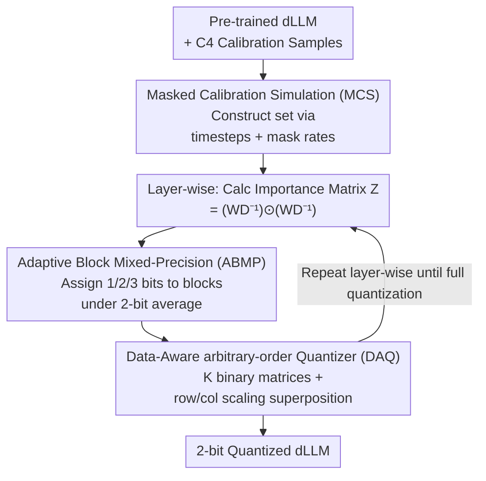

# Quant-dLLM: Post-Training Extreme Low-Bit Quantization for Diffusion Large Language Models

**Conference**: ICLR 2026  
**OpenReview**: [https://openreview.net/forum?id=HD7tuVakmR](https://openreview.net/forum?id=HD7tuVakmR)  
**Code**: https://github.com/ZTA2785/Quant-dLLM (to be open-sourced)  
**Area**: Model Compression / Quantization  
**Keywords**: Diffusion Language Models, Post-Training Quantization, 2-bit, Multi-binarization, Mixed-precision

## TL;DR
This paper proposes Quant-dLLM, a 2-bit weight-only post-training quantization (PTQ) framework specifically designed for Diffusion Large Language Models (dLLMs). It utilizes Masked Calibration Simulation (MCS) to align calibration data with the timestep-mask distribution of diffusion denoising, a Data-Aware arbitrary-order Quantizer (DAQ) to represent weights as an aggregation of multiple binary matrices, and Adaptive Block Mixed-Precision (ABMP) to distribute bits by importance under a strict average 2-bit budget. This improves average accuracy from the Prev. SOTA of 40.9% to 51.3% at 2-bit.

## Background & Motivation
**Background**: Diffusion Large Language Models (dLLMs, e.g., LLaDA, Dream) have emerged as a promising path alongside Autoregressive (AR) LLMs due to their parallel generation via bidirectional contexts and masked denoising. However, like AR LLMs, dLLMs are scaling up and are constrained by VRAM during deployment, making training-free weight compression (especially weight-only quantization) a critical requirement.

**Limitations of Prior Work**: While PTQ is mature for AR LLMs—achieving nearly lossless performance at 4-bit and starting to drop significantly only at 3-bit for math/code tasks—prior research (Lin et al., 2025) found that applying classic PTQ directly to dLLMs leads to a **precipitous performance collapse at 2-bit**. Forcing AR-centric PTQ onto dLLMs makes 2-bit versions nearly unusable.

**Key Challenge**: This paper identifies two roots of error in 2-bit quantization. First, **distribution mismatch**: standard PTQ assumes activations are "fully visible" autoregressive signals, whereas dLLM activations are determined by timestep-dependent mask schedules. The distribution seen during calibration fails to match the distribution during inference (where some tokens are $[MASK]$), leading to inaccurate quantization statistics. Second, **error accumulation**: quantization errors amplify across multiple denoising steps, becoming increasingly sensitive toward the later stages of denoising (closer to clean text).

**Goal**: To minimize these two error sources under a strict average 2-bit weight budget: (i) align calibration with the mask-timestep process of diffusion; (ii) precisely allocate precious bits to the most critical weights when 2-bit representational capacity is extremely limited.

**Key Insight**: Inspired by DB-LLM, the authors avoid mapping weights to fixed 2-bit quantization grids. Instead, they encode each weight matrix as a **superposition of multiple binary matrices with row-column scaling**. Under the same 2-bit budget, this multi-binary parameterization achieves lower reconstruction error for dLLMs, provides more stable fitting under masked activations, and naturally exposes structured sparsity to save VRAM.

**Core Idea**: Use a "diffusion-aligned calibration + data-aware multi-binary quantization + importance-based bit reallocation" toolkit to replace fixed-grid PTQ, specifically overcoming the hurdles of 2-bit dLLM quantization.

## Method

### Overall Architecture
Quant-dLLM is a training-free, weight-only, layer-wise 2-bit PTQ pipeline requiring only a pre-trained dLLM and a small batch of calibration data. Three modules work in synergy: first, **MCS** processes standard calibration data into a "masked, timestep-stratified" simulated calibration set to align second-order statistics with real denoising inference. Then, processing proceeds **layer-wise**: for each layer, an element-wise importance matrix $Z$ is calculated from the simulated data; **ABMP** then decides the order (1/2/3 bit) for each weight block under a strict 2-bit average budget; finally, **DAQ** fits the weights into a multi-binary superposition based on the order $K$ assigned by ABMP. No backpropagation is involved; the model is quantized once all layers are processed.

### Key Designs

**1. Masked Calibration Simulation (MCS): Aligning Calibration with Inference Mask Distribution**

To address the distribution mismatch where calibration uses fully visible sequences but inference uses partially masked ones, MCS simulates the native denoising visibility schedule of dLLMs. Given a visible sequence $x \in V^L$, a deterministic prefix $P = \{1,\dots,\lfloor \gamma L\rfloor\}$ is fixed (default $\gamma=0.25$). For each timestep $t$, visibility $\alpha(t)$ is calculated via the schedule, and a binary mask $r\in\{0,1\}^L$ is constructed: prefix positions are always visible ($r_i=1$), while others are sampled independently from $\mathrm{Bernoulli}(\alpha(t))$. Visible tokens $\tilde{x}_i(t)=x_i$ are retained; otherwise, they are replaced by $[MASK]$. These are uniform across $T$ timesteps to generate activation statistics close to real denoising. The second-order moment $S_{\text{MCS}}=\mathbb{E}_{t\sim\pi}[\sum_b \tilde{X}_b(t)\tilde{X}_b(t)^\top]$ is used in DAQ to distill element-wise importance.

**2. Data-Aware arbitrary-order Quantizer (DAQ): Maximizing 2-bit Expressivity via Superposition**

Fixed 2-bit grids lack expressivity. DAQ approximates weights as an aggregation of $K$ binary matrices: $\hat{W}=\sum_{k=1}^{K}\big(\alpha_r^{(k)}\alpha_c^{(k)\top}\big)\odot B_k,\ B_k\in\{-1,+1\}^{n\times m}$, where the order $K$ corresponds to the bit-width.

- **Data-Aware Objective Reconstruction (DOR)**: Instead of minimizing weight reconstruction error, DAQ minimizes layer output error $L_2=\|WX-\hat{W}X\|_F^2$. Using $S_{\text{MCS}}$, this is rewritten as $L_2=\mathrm{Tr}\big((W-\hat{W})S_{\text{MCS}}(W-\hat{W})^\top\big)$. Recognizing that errors concentrate on few critical weights, an importance matrix $Z=(WD^{-1})\odot(WD^{-1})$ is used. High-importance elements $\Pi=\mathbb{I}(|\tilde{Z}|>3)$ form a mask $\Lambda=\mathbf{1}+(\lambda-1)\Pi$. The optimization targets the weighted Frobenius proxy $\hat{L}_\Lambda=\|\Lambda\odot(W-\hat{W})\|_F^2$.
- **Row-column Successive Rescaling (RSR)**: For a fixed binary matrix $B$, row scaling $\alpha_r$ and column scaling $\alpha_c$ are solved iteratively via closed-form solutions until convergence. $B$ is then solved via element-wise error minimization. Any order $K$ is achieved through greedy residual fitting.

**3. Adaptive Block Mixed-Precision (ABMP): Strategic Bit Reallocation**

DAQ allows flexible orders, but uniform bit allocation is inefficient. ABMP performs block-level reallocation under a **strict average 2-bit** constraint: $\frac{1}{|G|}\sum_{g\in G}b_g=2,\ b_g\in\{1,2,3\}$. It aggregates importance scores $s_g=\sum_{(i,j)\in g}Z_{ij}$ for each block. The top-$k$ most important blocks are upgraded to 3-bit, and bottom-$k$ blocks are downgraded to 1-bit, keeping the average at 2-bit. This concentrates precision on critical regions sensitive to late-stage denoising.

### Loss & Training
The process is training-free and gradient-free. Optimization targets the weighted Frobenius proxy $\hat{L}_\Lambda=\|\Lambda\odot(W-\hat{W})\|_F^2$ using RSR's iterative closed-form updates. Calibration utilizes 128 samples from C4 with a length of 4096. Group and block sizes are set to 128. MCS uses $\gamma=0.25$. Quantization is performed on a single A800-80GB GPU.

## Key Experimental Results

### Main Results
Evaluation across five dLLMs (LLaDA and Dream series) on 7 general knowledge tasks for 2-bit weight-only quantization.

| Model | Method | Avg. of 7 Tasks | Relative to FP |
|------|------|-----------|---------|
| LLaDA-8B-Base | FP16 | 61.46 | 100% |
| LLaDA-8B-Base | GPTQ | 35.34 | — |
| LLaDA-8B-Base | Slim-LLM | 42.39 | — |
| LLaDA-8B-Base | **Ours** | **54.06** | 87.7% |
| LLaDA-8B-Instruct | Slim-LLM | 49.41 | — |
| LLaDA-8B-Instruct | **Ours** | **55.53** | — |
| Dream-7B-Base | Slim-LLM | 31.09 | — |
| Dream-7B-Base | **Ours** | **44.75** | — |
| Dream-7B-Instruct | Slim-LLM | 32.86 | — |
| Dream-7B-Instruct | **Ours** | **47.99** | — |

Averaged across models, Quant-dLLM improves the score from 40.9 (Slim-LLM) to **51.3**. In math and code tasks, the gap is larger: ours exceeds 30% in math/science while baselines stay below 12%.

### Ablation Study
Performed on LLaDA-8B-Base and Dream-7B-Base under strict 2-bit average budget.

| Configuration | LLaDA MMLU | Dream MMLU | Description |
|------|-----------|-----------|------|
| Full Model | 56.87 | 40.22 | MCS + DAQ + ABMP |
| w/o MCS | 52.10 | 37.81 | Standard calibration |
| DAQ: baseline | 39.26 | 27.84 | Naive quantizer |
| DAQ: RSR w/o DOR | 48.32 | 34.73 | Iterative scaling only |
| DAQ: RSR w/ DOR | 56.87 | 40.22 | With data-aware objective |
| ABMP 0% (Off) | 54.32 | 32.75 | Uniform 2-bit |
| ABMP 5% | 56.87 | 34.50 | Optimal for LLaDA |
| ABMP 10% | 55.87 | 40.22 | Optimal for Dream |

### Key Findings
- **DAQ is the primary driver**: Improvements from baseline (39.26%) to RSR (48.32%) to RSR+DOR (56.87%) show both iterative scaling and data-aware objectives are essential.
- **ABMP Peak**: Performance peaks at specific reallocation ratios (5-10%); exceeding this leads to diminishing returns, suggesting only a small subset of weights are truly "high-value."
- **Calibration Sweet Spot**: 128 samples proved optimal; more samples (256) slightly decreased performance, showing the method is friendly to resource-constrained settings.

## Highlights & Insights
- **Aligning Calibration to Inference Reality**: MCS captures the core difference of dLLMs—activations are shaped by mask schedules—proving metadata-aware calibration is vital for non-AR models.
- **Structural expressivity**: Decomposing 2-bit into multi-binary matrices + row-column scaling bypasses rigid grids while maintaining hardware-friendly binary operations.
- **Dual-use Importance**: The matrix $Z$ provides a unified mechanism for both element-weighted optimization (DOR) and block-level bit allocation (ABMP).
- **Symmetric Reallocation**: Upgrading/downgrading an equal number of blocks ensures the VRAM budget is strictly maintained while specifically reinforcing stages sensitive to denoising.

## Limitations & Future Work
- **Weight-only Focus**: Activations remain in full precision; low-bit activation quantization for dLLMs remains an open problem.
- **Model Scale**: Evaluation is limited to 7B–8B scales; transferability to larger scales or different architectures is yet to be fully verified.
- **Hyperparameter Tuning**: Optimal ABMP ratios vary by model (5% vs 10%), suggesting a need for an automated selection mechanism.

## Related Work & Insights
- **vs. AR PTQ (GPTQ / Slim-LLM)**: These assume fully visible tokens. Quant-dLLM outperforms them by ~10 points at 2-bit by accounting for mask visibility.
- **vs. Binarization Methods (DB-LLM / BiLLM)**: While using multi-binary ideas, ours introduces data-aware objectives weighted by diffusion-simulated statistics and mixed-precision block allocation.
- **vs. dLLM Acceleration**: Existing works focus on reducing denoising steps; this work is orthogonal, focusing on memory footprint.

## Rating
- Novelty: ⭐⭐⭐⭐⭐ First 2-bit PTQ for dLLMs with proper mask alignment.
- Experimental Thoroughness: ⭐⭐⭐⭐ Complete across 5 models, though restricted to 8B scale.
- Writing Quality: ⭐⭐⭐⭐ Clear modular division and algorithmic detail.
- Value: ⭐⭐⭐⭐⭐ Significant for deploying dLLMs in VRAM-constrained environments.

<!-- RELATED:START -->

## Related Papers

- [\[ICLR 2026\] Gradient-Aligned Calibration for Post-Training Quantization of Diffusion Models](gradient-aligned_calibration_for_post-training_quantization_of_diffusion_models.md)
- [\[ICLR 2026\] DVD-Quant: Data-free Video Diffusion Transformers Quantization](dvd-quant_data-free_video_diffusion_transformers_quantization.md)
- [\[ICLR 2026\] PTQ4ARVG: Post-Training Quantization for AutoRegressive Visual Generation Models](ptq4arvg_post-training_quantization_for_autoregressive_visual_generation_models.md)
- [\[ICLR 2026\] Inlier-Centric Post-Training Quantization for Object Detection Models](inlier-centric_post-training_quantization_for_object_detection_models.md)
- [\[ICLR 2026\] Post-Training Quantization for Video Matting](post-training_quantization_for_video_matting.md)

<!-- RELATED:END -->
