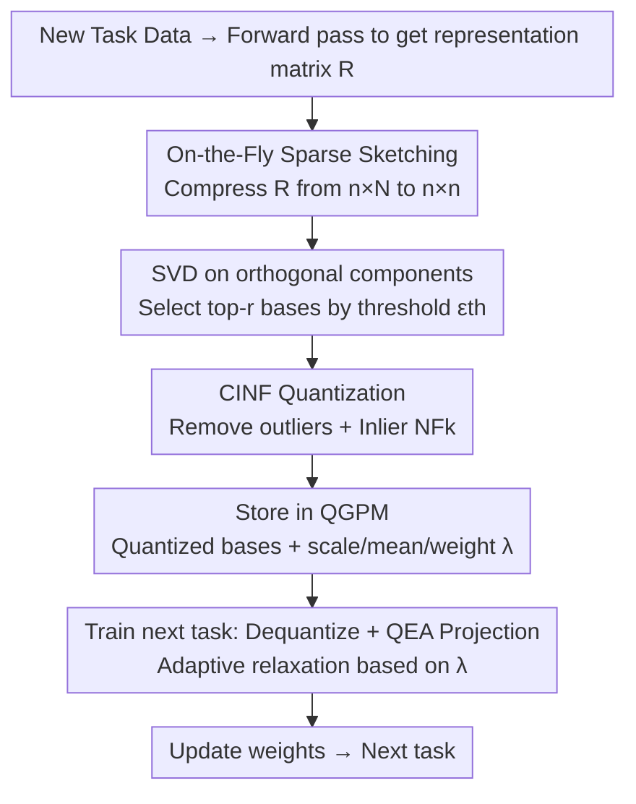

# Quantized Gradient Projection for Memory-Efficient Continual Learning

**Conference**: ICLR 2026  
**OpenReview**: [https://openreview.net/forum?id=xJtxpJ6QdD](https://openreview.net/forum?id=xJtxpJ6QdD)  
**Code**: The paper claims to be open-sourced ("Our code is available here", link subject to the original text)  
**Area**: Model Compression / Continual Learning  
**Keywords**: Continual Learning, Gradient Projection, Quantization, Memory-Efficient, NormalFloat

## TL;DR
Ours proposes QGPM, which compresses the basis vectors in "Gradient Projection Memory" (GPM) used for anti-forgetting in continual learning via quantization. By utilizing a trio of designs—Outlier-robust Quantization (CINF), Error-Aware Gradient Projection (QEA), and Sparse Sketching Acceleration—the memory overhead is reduced to 1/4–1/6 of the original while maintaining nearly full precision (8-bit drops <0.5% ACC compared to full-precision GPM).

## Background & Motivation

**Background**: Continual learning aims to enable models to learn new tasks from evolving data distributions without forgetting old ones. Four mainstream approaches exist: regularization, parameter expansion, rehearsal, and gradient projection. As a representative of the latter, GPM (Gradient Projection Memory) maintains a "memory structure" storing core basis vectors that span the gradient subspaces of historical tasks. When learning a new task, current gradients are projected onto the orthogonal complement of these basis vectors to avoid interfering with old knowledge. It is stable against forgetting, does not store raw data, and inherently protects privacy, making it suitable for sensitive scenarios like healthcare.

**Limitations of Prior Work**: GPM stores basis vectors at full precision, causing memory consumption to grow with the number of tasks. This scale is proportional to the model's embedding dimension—for instance, a fully occupied GPM for ViT-B/16 requires 515MB, and ViT-S requires 66MB. As emphasized by Rebuffi et al., a viable incremental learner must keep memory and computational overhead bounded or slowly growing. Thus, "memory efficiency" directly determines whether methods like GPM can be effectively deployed.

**Key Challenge**: An intuitive memory-saving approach is quantizing the stored basis vectors. However, the subspace serves as a "reference frame" for orthogonal updates and is extremely sensitive to distortion introduced by quantization. Theorem 3.2 in the paper proves that the deviation of projected gradients calculated using a quantized subspace grows linearly with the number of basis vectors $m$ and quadratically with the quantization noise $\sigma$. Applying standard linear quantization faces two specific issues: (1) individual basis vectors often exhibit heavy-tailed distributions, leading to large quantization errors; (2) subspace distortion causes projected gradients to drift from their intended orthogonal directions, a phenomenon termed "gradient drift," which accumulated over multiple tasks destroys old knowledge.

**Goal**: To significantly compress GPM's memory overhead while preserving its anti-forgetting and privacy advantages, addressing heavy-tailed errors and gradient drift caused by quantization.

**Core Idea**: Utilize a trio of "distribution-aware quantization + error-aware projection + sparse sketching acceleration" to safely quantize and compress the GPM basis subspace. Specifically, outliers are excluded during quantization, orthogonal constraints are adaptively relaxed during projection based on quantization fidelity, and SVD is accelerated using sparse sketching during construction.

## Method

### Overall Architecture
QGPM maintains the anti-forgetting framework of GPM (projection onto the orthogonal complement of historical subspaces) but introduces quantization-friendly modifications to "how basis vectors are stored, how projection is calculated, and how the subspace is constructed." The workflow for a new task is: obtain the representation matrix $R^l_\tau$ via a forward pass → compress the massive $R$ from $n\times N$ to $n\times n$ using **On-the-Fly Sparse Sketching** → perform SVD on the "newly added orthogonal components" and select top-$r$ left singular vectors as new bases based on a variance threshold $\epsilon_{th}$ → compress these bases using **CINF Quantization** (while recording outliers, scales, means, and orthogonal weights $\lambda$) → append to the quantized memory $M^l_{Q,\tau}$. When training subsequent tasks, the quantized bases are dequantized, and **QEA Gradient Projection** updates weights by relaxing orthogonal constraints according to each basis's $\lambda$.

### Key Designs

**1. On-the-Fly Sparse Sketching: Removing the SVD Memory and Compute Bottleneck**

GPM updates bases after a task ends by flattening all local patches of feature maps into a representation matrix $R^l_\tau=[r_1,\dots,r_N]$. The issue is that $N$ can be massive, especially in convolutional and Transformer blocks, making SVD slow and memory-intensive. Ours uses a sparse sketching matrix $S\in\mathbb{R}^{r\times N}$ (one non-zero entry per column, position determined by hash $h:[N]\to[r]$, sign by $\sigma:[N]\to\{-1,1\}$) to construct a low-dimensional approximation of $R$ in a streaming fashion. Theorem 3.3 guarantees that for $r=O(k^2/\epsilon^2\delta)$, $S$ is a $(1\pm\epsilon)$-$\ell_2$ subspace embedding with high probability, meaning $(1-\epsilon)\|Ax\|_2\le\|SAx\|_2\le(1+\epsilon)\|Ax\|_2$, keeping geometric structures nearly identical. Setting $r=n$ reduces the matrix from $\mathbb{R}^{n\times N}$ to $\mathbb{R}^{n\times n}$, slashing peak intermediate memory and SVD computation by a factor of $N/n$. For ViT-S, the representation matrix is compressed from 1.62GB to 66MB. This addresses "training-time" overhead, complementing the other storage-focused designs.

**2. CINF Quantization: Accurate Quantization via Centering and Inlier Normalization**

Naïve NormalFloat (NF$k$, information-theoretically optimal for normal data as used in QLoRA) has a flaw: it uses the global maximum absolute value $M=\max_i|a_i|$ for normalization. Outliers significantly inflate $M$, pushing most values toward 0, resulting in a highly sub-Gaussian distribution and low codebook utilization—most values crowd into buckets near 0 while extreme buckets near $\pm1$ remain empty. CINF (Centered Inlier Normal Float) first subtracts the mean $\mu$ for centering, then calculates the $\delta$ and $1-\delta$ quantiles $q_\delta, q_{1-\delta}$. The few outliers outside this range are **stored at full precision without loss**, while the remaining inliers are quantized with NF$k$, using a scale $s=\max(|q_\delta|,|q_{1-\delta}|)$ instead of the global $M$. Using expected normal order statistics (Theorem 3.1), the authors show $\mathbb{E}[M]\approx\Phi^{-1}(\tfrac{B-\alpha}{B-2\alpha+1})$ grows with $B$, whereas the inlier scale after removing 1% outliers, $\mathbb{E}[s]\approx\Phi^{-1}(\tfrac{0.99B-\alpha}{B-2\alpha+1})$, is bounded by $\Phi^{-1}(0.99)=2.32$. This leads to a more uniform distribution and higher codebook utilization, thus $e_{\text{CINF}}\le e_{\text{NF}k}$. Quantization is applied column-wise to the top-$r$ singular vectors, outputting $(u_q, s, \mu, \lambda)$ per column.

**3. QEA Gradient Projection: Adapting Orthogonal Constraints to Counters Gradient Drift**

Even with CINF, multi-task accumulation of quantization errors causes subspace shifts and gradient drift. QEA (Quantization Error-Aware) suggests that instead of enforcing 100% orthogonality, one should **allow a controlled parallel gradient component**, with the relaxation magnitude adapted to each basis's fidelity. Specifically, each basis $\hat U^l_\tau[:,i]$ is dequantized to $\tilde U^l_\tau[:,i]$ immediately after quantization. Error is defined via cosine similarity $e_i=1-\text{sim}_{\cos}(\tilde U^l_\tau[:,i],\hat U^l_\tau[:,i])$. A scaling hyperparameter $\alpha$ then defines an orthogonal weight $\lambda_i=1-\alpha\cdot e_i$. During projection, the diagonal weight matrix $\Lambda$ is inserted into the operator:

$$\nabla_w\hat L_\tau=\nabla_w L_\tau-M^l_{\tau-1}\,\Lambda^l_{\tau-1}\,(M^l_{\tau-1})^\top\nabla_w L_\tau .$$

When a basis has high error $e_i$, $\lambda_i$ decreases, weakening the projection and allowing more gradient to "leak" in that direction (increasing plasticity), which compensates for the distortion-induced bias. Bases with low error remain strictly orthogonal. CINF reduces the error, while QEA offsets the residual error at the projection level, providing significant gains in aggressive low-bit settings (e.g., 4-bit).

### Loss & Training
The training follows GPM's two-stage approach: within a task, weights are updated via SGD using projected gradients $\hat g=g-P_{\tau-1}g$ (constructed using dequantized bases and QEA weights $\Lambda$). At the end of a task, a batch of samples is used for a forward pass to extract orthogonal components, perform sparse sketching + SVD to obtain new bases, and append them to QGPM after CINF quantization. A multi-head setup is used. Key hyperparameters include the variance threshold $\epsilon_{th}$, outlier ratio $p$, QEA scaling factor $\alpha$, and the number of quantization bits.

## Key Experimental Results

### Main Results
Three standard CL benchmarks: 10-split CIFAR-100 (AlexNet), 5-Datasets (ResNet-18), and 10/20-split miniImageNet (pre-trained ViT-S). Metrics are Average Accuracy (ACC) and Backward Transfer (BWT). Baselines are aligned to QGPM's memory budget by adjusting buffer sizes.

| Method (CIFAR-100) | Memory | ACC↑ | BWT↑ |
|------|------|------|------|
| GPM-FP (Full Precision) | 3.13 MB | 71.11 | -0.98 |
| GPM-FP-MC (Equal Memory) | 0.81 MB | 64.58 | -12.88 |
| DER++-MC | 0.81 MB | 60.63 | -14.82 |
| FDR-MC | 0.81 MB | 63.07 | -13.74 |
| **8QGPM (Ours)** | **0.81 MB** | **70.70** | **-0.81** |
| **4QGPM (Ours)** | **0.48 MB** | **69.74** | **-2.62** |

Across all four benchmarks, 8QGPM saves an average of 3.83× memory with <0.5% ACC/BWT drop compared to GPM-FP. 4QGPM extends savings to 6.44× with <1% drop. At equal memory, rehearsal-based baselines (AGEM/ER/FDR/DER++) suffer severe forgetting due to small buffer sizes. Memory compression approaches the theoretical limit: ViT-S 66.3MB → 17.8MB (8-bit) / 10.2MB (4-bit), with slight deviations caused by outlier storage and metadata.

### Ablation Study
Analyzed on 10-split CIFAR-100 (variables isolated by setting $\alpha=0, p=0$ unless otherwise specified).

| Ablation Dimension | Config | ACC | BWT | Note |
|------|------|------|------|------|
| Bits | 4-bit | 25.03 | -31.27 | $e_{avg}=0.544$; collapse below 5-bit |
| Bits | 6-bit | 64.22 | -0.32 | Nearing full precision |
| Bits | 8-bit | 65.01 | 0.61 | ≈FP (65.02) |
| Outlier Ratio | $p=0$ | 41.23 | -24.40 | $e_{max}=1.205$; drift from single bad basis |
| Outlier Ratio | $p=2\%$ | 55.36 | -11.07 | Removing outliers significantly reduces $e_{max}$ |
| QEA ($p=1\%$) | $\alpha=0$ | 44.20 | -20.69 | No orthogonal relaxation |
| QEA | $\alpha=80$ | **67.26** | -2.91 | Optimal |
| QEA | $\alpha=200$ | 65.17 | -7.28 | Excessive relaxation; high interference |

### Key Findings
- **The "maximum" quantization error is more lethal than the "average"**: Even if $e_{avg}$ is low, a single poorly quantized basis (high $e_{max}$) can trigger gradient drift and instability. This justifies CINF's use of full-precision storage for outliers to suppress $e_{max}$.
- **QEA is a savior for low-bit settings, but $\alpha$ must match error intensity**: As $\alpha$ increases from 0, ACC initially rises (parallel components compensate for distortion) but drops after a threshold due to inter-task interference; more aggressive quantization (4QGPM) requires larger $\alpha$.
- **Sparse sketching shines with large models**: On AlexNet/ResNet-18, GPM projection is already cheap; on ViT-S, SVD on large matrices is the main bottleneck. Sketching accelerates SVD and overall training, while quantization overhead remains negligible.
- **Robust Memory-Accuracy Trade-off**: On ImageNet-R, performance remains stable as threshold $\epsilon$ decreases (fewer bases); 4QGPM with moderate $\epsilon$ often outperforms 8QGPM or GPM-FP with aggressive small $\epsilon$. On ViT-B/16, GPM-FP is surpassed by ER at 92.59MB, while QGPM remains superior even compressed to 14.4MB.

## Highlights & Insights
- **Applying the "Quantization" hammer to the CL gradient subspace**: To the authors' knowledge, this is the first work to quantize GPM basis subspaces. The approach is simple yet effective and preserves GPM's privacy advantages.
- **CINF's "Full-precision Outliers + Inlier Quantization" is a transferable trick**: This could be used for any low-bit quantization of heavy-tailed vectors—determining scale via quantiles and storing outliers separately boosts codebook utilization.
- **QEA transforms "Orthogonal Constraints" from hard to soft, guided by quantization error**: This paradigm—using an observable fidelity signal (cosine similarity) to adaptively adjust constraint strength—is transferable to other constrained optimizations affected by approximation or compression.

## Limitations & Future Work
- The method is built on the GPM framework and is only applicable to "gradient projection" type CL; it does not directly apply to regularization, rehearsal, or expansion methods.
- Theoretical analysis of error accumulation (Theorem 3.2) assumes independent Gaussian noise, which real quantization errors may not strictly follow. Key hyperparameters ($\alpha, p, \epsilon_{th}$) require manual tuning.
- Outliers must be stored at full precision; in extremely heavy-tailed distributions, if the outlier ratio is forced higher, the compression ratio will be eroded. Verification was primarily on vision benchmarks; universality across modalities/languages remains to be explored.
- Future work: Making the per-basis $\lambda$ in QEA dynamically update during training or hybridizing with rehearsal methods under the same memory budget.

## Related Work & Insights
- **vs GPM (Saha et al., 2021)**: GPM stores bases at full precision with strict orthogonal projection. Ours quantizes bases and relaxes orthogonality, targeting 1/4–1/6 memory reduction with comparable anti-forgetting.
- **vs Rehearsal (ER / DER++ / FDR / AGEM)**: These store raw samples or logits, raising privacy concerns and suffering from forgetting when buffers are small. QGPM stores no data and relies on compressed subspaces for stability under tight memory.
- **vs Distillation/Adapter Memory-Efficient methods (Ermis et al. 2022, etc.)**: These often require a full backbone or auxiliary networks, leading to underestimated memory overhead. QGPM compresses existing gradient memory without auxiliary networks.
- **vs QLoRA’s NF$k$ (Dettmers et al., 2023)**: Ours reuses the NF$k$ codebook idea but introduces CINF to handle the heavy-tailed distributions of CL bases and the QEA mechanism to handle quantization-induced gradient drift.

## Rating
- Novelty: ⭐⭐⭐⭐ First application of quantization to GPM subspaces; CINF/QEA are solid designs.
- Experimental Thoroughness: ⭐⭐⭐⭐ Four benchmarks + multiple model sizes + ablation across bits/outliers/$\alpha$/$\epsilon$.
- Writing Quality: ⭐⭐⭐⭐ Clear motivation-challenge-countermeasure chain; heavy but necessary notation.
- Value: ⭐⭐⭐⭐ Privacy-friendly and memory-efficient CL; highly practical for sensitive domains like healthcare.

<!-- RELATED:START -->

## Related Papers

- [\[ICLR 2026\] Towards Lossless Memory-efficient Training of Spiking Neural Networks via Gradient Checkpointing and Spike Compression](towards_lossless_memory-efficient_training_of_spiking_neural_networks_via_gradie.md)
- [\[ICLR 2026\] IDER: IDempotent Experience Replay for Reliable Continual Learning](ider_idempotent_experience_replay_for_reliable_continual_learning.md)
- [\[ICLR 2026\] Sculpting Subspaces: Constrained Full Fine-Tuning in LLMs for Continual Learning](sculpting_subspaces_constrained_full_fine-tuning_in_llms_for_continual_learning.md)
- [\[ICML 2025\] TreeLoRA: Efficient Continual Learning via Layer-Wise LoRAs Guided by a Hierarchical Gradient-Similarity Tree](../../ICML2025/model_compression/treelora_efficient_continual_learning_via_layer-wise_loras_guided_by_a_hierarchi.md)
- [\[ICLR 2026\] FlyPrompt: Brain-Inspired Random-Expanded Routing with Temporal-Ensemble Experts for General Continual Learning](flyprompt_brain-inspired_random-expanded_routing.md)

<!-- RELATED:END -->
