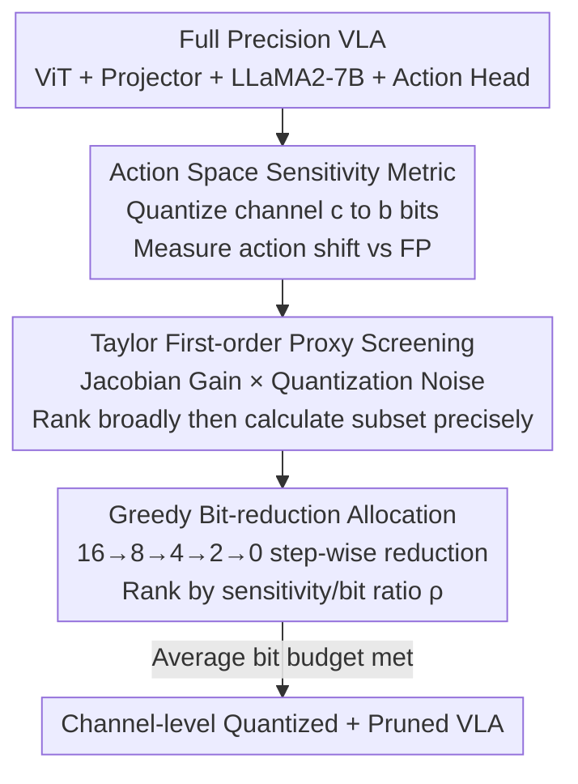

# QVLA: Not All Channels Are Equal in Vision-Language-Action Model's Quantization

**Conference**: ICLR 2026  
**OpenReview**: [https://openreview.net/forum?id=TpL2nXanru](https://openreview.net/forum?id=TpL2nXanru)  
**Code**: https://github.com/AutoLab-SAI-SJTU/QVLA  
**Area**: Model Compression / VLA / Robotics  
**Keywords**: VLA Quantization, Channel-level Mixed Precision, Action Space Sensitivity, Unified Quantization + Pruning, Greedy Bit-reduction

## TL;DR
QVLA identifies that directly applying "uniform bit-width quantization" from LLMs to VLA models causes collapse due to action error accumulation. It proposes a fine-grained quantization framework governed by **action space sensitivity**, assigning $\{0,2,4,8,16\}$ bits (where 0 indicates pruning) to individual weight channels. On LIBERO, it allows OpenVLA-OFT to maintain a 98.9% success rate while using only 29.2% of VRAM and achieving a 1.49× speedup.

## Background & Motivation
**Background**: Vision-Language-Action (VLA) models directly map image observations and language instructions to robot actions. While they possess strong generalization, 7B models require over 14 GB of VRAM in half-precision. Inference on robot platforms like Jetson AGX Orin takes several hundred milliseconds per step, falling short of real-time control. Low-bit quantization is a mature technique in LLM compression, but the authors found that **systematic research on VLA quantization is non-existent**.

**Limitations of Prior Work**: Existing LLM/MLLM quantization methods (e.g., SmoothQuant, AWQ, OmniQuant) optimize for "text perplexity" or "visual feature fidelity," essentially protecting a passive internal representation. They generally assume **uniform bit-widths**—either globally or at most layer-wise (like HAWQ). In contrast, VLA outputs are not text or labels but continuous action values that directly drive the physical world.

**Key Challenge**: In closed-loop control, a minor action deviation that might be "unnoticeable" on standard benchmarks is amplified by physical dynamics and contact forces. In long-horizon tasks, these errors accumulate during the auto-regressive process, leading to catastrophic failures such as unstable grasping or trajectory deviation. The orientation of LLM quantization—"prioritize data fidelity over action consequences"—is fundamentally mismatched with VLA requirements. Furthermore, diagnostic analysis reveals two levels of sensitivity heterogeneity: **between modules** (projectors and action heads are far more sensitive than vision encoders) and **within-layer channels** (different channels in the same layer contribute drastically differently to action output). Uniform bit-widths and module-level mixed precision are too coarse to address this.

**Goal**: Design a quantization method specifically matched to VLA needs—anchoring the quantization objective in action space rather than internal features, providing fine-grained channel-level bit allocation, and naturally incorporating "channels that should be pruned" into the same framework.

**Core Idea**: Use "how much the final action output deviates after quantizing a specific channel to a certain bit-width" as the sole measure of importance. This drives a global greedy bit-reduction algorithm that assigns $\{0,2,4,8,16\}$ bits to each channel, where 0 bits is naturally equivalent to pruning—unifying quantization and pruning into a single mechanism.

## Method

### Overall Architecture
QVLA targets four parameter subsets of the VLA: vision encoder $\theta_{vis}$, projector $\theta_{proj}$, LLM backbone $\theta_{llm}$, and action decoder $\theta_{act}$. It treats all operators as linear mappings $Y = XW + b$ (convolutions are handled as equivalent linear operators). Weights are quantized as integers by **output channel** (each row of the weight matrix for linear layers), while activations use a uniform bit-width (e.g., 8-bit) to ensure branchless execution and stable hardware latency. The pipeline consists of two steps: **Action Space Sensitivity Analysis**—quantizing each channel to each candidate bit-width individually and measuring its impact on the final action to generate a sensitivity table; and **Optimal Bit Allocation**—using a greedy bit-reduction algorithm starting from full precision to downgrade the least sensitive channels step-by-step to as low as 0 bits (pruning) until the average bit-width budget is met. Performance is evaluated directly in the action space (Action-MSE under teacher-forcing + cumulative deviation and success rate in short-range rollouts).

### Key Designs

**1. Action Space Sensitivity Metric: Swapping "Feature Fidelity" for "Action Fidelity"**

This is the core differentiator between QVLA and LLM quantization methods. Conventional methods minimize divergence in internal features or output distributions (e.g., KL divergence). QVLA asks: how much does the action output shift when only channel $c$ of layer $l$ is quantized to $b$ bits? Single-step sensitivity is defined as the expected squared L2 norm between quantized and reference actions:

$$s^{(b)}_{l,c} = \mathbb{E}_{x\sim D}\left[\big\|\tilde{A}^{(b)}_{l,c}(V,l) - A^*(V,l)\big\|_2^2\right]$$

To capture error accumulation in long-horizon auto-regressive tasks, a cumulative sensitivity is added, summing shifts throughout an episode:

$$S^{(b)}_{l,c} = \mathbb{E}\left[\sum_{t=1}^{T}\big\|\tilde{A}^{(b)}_{l,c}(V_t,l) - A^*(V_t,l)\big\|_2\right]$$

Crucially, these scores are **naturally comparable** across all modules/layers/channels, serving as a unified signal for global ranking. Empirical tests show that the ranking of channel sensitivity given by single-step $s^{(b)}_{l,c}$ and cumulative $S^{(b)}_{l,c}$ is highly consistent—allowing the use of the cheaper single-step metric for allocation, while using the comprehensive cumulative metric to verify long-horizon performance. Because the metric is anchored in actions, QVLA automatically allocates higher bit-widths to fragile interfaces like the projector and action head.

**2. Taylor First-order Proxy: Making "Scanning Every Channel and Bit-width" Feasible**

Running full forward passes for every channel and every candidate bit-width to measure $s^{(b)}_{l,c}$ is computationally prohibitive. QVLA uses a two-stage strategy: first, a first-order Taylor expansion models the local linear relationship between "channel output perturbation $\Delta X_{l,c}$" and "action shift $\Delta A$," where $\Delta A \approx J_{A,X_{l,c}}\Delta X_{l,c}$. Taking the norm gives:

$$\|\Delta A\| \approx \|J_{A,X_{l,c}}\|\cdot\|\Delta X_{l,c}\|$$

Here, the Jacobian norm $\|J_{A,X_{l,c}}\|$ is the local sensitivity gain (how much perturbation is amplified), and the perturbation itself is approximated by quantization error $\Delta X_{l,c}\approx (Q(W_l)-W_l)X_l$. Multiplying these yields a fast importance score for global coarse ranking. Then, full forward passes are only run for the top-ranked (most important) channels to precisely calibrate their true sensitivity. This concentrates compute on protecting sensitive interfaces.

**3. Unified Quantization + Pruning via Greedy Bit-reduction: Treating 0-bit as "Pruning"**

With the sensitivity of each candidate bit-width determined, bit allocation is framed as a budget-constrained optimization problem—assigning $b_{l,c}\in\{0,2,4,8,16\}$ to each channel to minimize total action error under the average bit constraint $\bar{B}$. This NP-hard problem is solved using a **greedy bit-reduction algorithm**: all channels start at 16-bit, followed by stage-wise reductions (16→8, 8→4, 4→2, 2→0). When reducing from $b_{hi}$ to $b_{lo}$, the cost-performance ratio is measured by:

$$\rho_{l,c} = \frac{s^{(b_{lo})}_{l,c} - s^{(b_{hi})}_{l,c}}{b_{hi}-b_{lo}}$$

This represents "error increase per bit saved." Channels are sorted by $\rho_{l,c}$ in ascending order, prioritizing reductions for the least sensitive channels until the budget is met. The complexity is $O(C\log C)$. To prevent over-pruning, the final 2→0 stage uses dual thresholds and L0-style constraints for regularization.

### Loss & Training
QVLA follows the **Post-Training Quantization (PTQ)** route and requires no retraining. It uses a calibration set sampled from LIBERO training demonstrations mixed with a small subset of instruction-only data to measure sensitivity, followed by offline allocation via the greedy algorithm. The sensitivity rankings are cross-validated using short-range environment rollouts. In practice, the projector and action head are kept in full BF16 precision to stabilize control, while channel-level quantization is applied to the vision backbone and language module.

## Key Experimental Results

### Main Results
On the LIBERO benchmark (Spatial / Object / Goal / Long tasks), comparing against SmoothQuant and OmniQuant (Weight-Activation quantization) with OpenVLA and OpenVLA-OFT.

| Model | Setting | Method | Avg. Success ↑ | Δ | VRAM (GB) ↓ | Speedup ↑ |
|------|------|------|------|------|------|------|
| OpenVLA | FP | – | 76.5% | – | 15.2 | 1× |
| OpenVLA | W4A4 | SmoothQuant | 63.2% | -13.3% | 4.7 | 1.52× |
| OpenVLA | W4A4 | OmniQuant | 73.3% | -3.2% | 5.4 | 1.43× |
| OpenVLA | W4A4 | **QVLA** | **76.0%** | **-0.5%** | **4.3** | 1.47× |
| OpenVLA-OFT | FP | – | 97.1% | – | 15.4 | 1× |
| OpenVLA-OFT | W4A4 | SmoothQuant | 73.4% | -23.7% | 4.9 | 1.53× |
| OpenVLA-OFT | W4A4 | OmniQuant | 93.9% | -3.2% | 5.7 | 1.37× |
| OpenVLA-OFT | W4A4 | **QVLA** | **96.0%** | **-1.1%** | **4.5** | 1.49× |

In aggressive W4A4 settings, QVLA only loses 1.1% on OpenVLA-OFT, while SmoothQuant collapses with a 23.7% drop. In weight-only quantization (W4A16), QVLA achieves zero loss compared to the baseline.

### Ablation Study
**Layer-wise vs. Channel-wise Quantization** (OpenVLA baseline, FP=76.5%):

| Precision | Granularity | Avg. Success |
|------|---------|-----------|
| INT4 | Layer-wise | 74.8% |
| INT4 | Channel-wise | 76.5% |
| INT8 | Layer-wise | 74.9% |
| INT8 | Channel-wise | 76.8% |

**Impact of Pruning (0-bit) and Uniform Bit-width** (INT8 budget):

| Config | Candidate Bits | Avg. Success | VRAM (GB) |
|------|---------|-----------|---------|
| ② Channel-wise, no pruning | {2,4,8,16} | 76.7% | 7.5 |
| ④ Channel-wise + Pruning (Ours) | {0,2,4,8,16} | **76.8%** | **7.0** |
| ③ Uniform 8-bit | {8} | 74.6% | 7.6 |
| ⑤ Uniform + Pruning | {0,8} | 74.7% | 7.1 |

### Key Findings
- **Channel-level is critical**: In both INT4/INT8, channel-level quantization matches or exceeds the FP baseline (76.5%→76.8%), whereas layer-wise quantization drops performance. The intra-layer heterogeneity of sensitivity makes "one-size-fits-all" layers ineffective.
- **Pruning provides net gains**: Expanding candidate bits from {2,4,8,16} to {0,2,4,8,16} reduces VRAM from 7.5 GB to 7.0 GB while slightly increasing the success rate.
- **Suppression of long-horizon errors**: Cumulative MSE grows significantly faster at 4-bit than 8-bit. QVLA's 8-bit method remains consistently lower than the uniform 8-bit baseline, with the gap widening over time.
- **Real-world Transfer**: On a dual-arm IMETA-Y1 system using π0 as the baseline, QVLA at W8A16 maintains the average success rate (63.3%) across tasks like pen retrieval and towel folding while gaining a 1.28× speedup.

## Highlights & Insights
- **Shifting Metrics from "Features" to "Actions"**: This addresses a blind spot in LLM quantization. LLMs optimize for passive data fidelity, whereas VLAs care about active action consequences. This conceptual shift is applicable to any closed-loop control system (e.g., autonomous driving).
- **Unity of 0-bit and Pruning**: Integrating pruning into the bit-width candidate set $\{0,2,4,8,16\}$ allows a single algorithm to perform both quantization and structured pruning simultaneously.
- **Single-step Proxy for Long-horizon Metrics**: The discovery that single-step sensitivity ranking aligns with cumulative ranking allows for efficient allocation using the cheaper metric while ensuring long-horizon stability.
- **Taylor Proxy + Two-stage Screening**: This engineering choice makes fine-grained sensitivity analysis feasible by concentrating computational resources on protecting the most sensitive interfaces.

## Limitations & Future Work
- The core proxy (Taylor first-order approximation) relies on intuition presented in the main text while theoretical derivations are in the appendix; its accuracy under large perturbations (e.g., 2-bit or 0-bit) is not fully explored.
- Evaluation is primarily in LIBERO simulation with limited real-world tasks (3 tasks, dozens of trajectories); real-world stability for W4A4 remains unverified.
- Retaining BF16 for the projector and action head is a pragmatic choice for stability but limits overall compression. Compressing these sensitive modules without sacrificing control remains an open problem.
- Greedy bit-reduction is an approximation for an NP-hard problem, and the final 2→0 stage relies on heuristic regularization. Sensitivity analysis of these heuristics across different budgets is not provided.

## Related Work & Insights
- **vs SmoothQuant / OmniQuant**: These follow outlier management paradigms designed for LLM perplexity. QVLA demonstrates these fail at VLA cross-modal interfaces and long-horizon tasks, whereas action-centric channel-level quantization keeps losses near 1%.
- **vs AWQ**: AWQ protects salient weights for weight-only quantization but assumes uniform bit-widths. QVLA outperforms AWQ in the W4A16 setting.
- **vs HAWQ / Mixed Precision**: HAWQ uses Hessian for layer-wise mixed precision. QVLA increases granularity to the channel level and shifts the metric to action space sensitivity.
- **vs TinyVLA**: TinyVLA focuses on architectural compression (smaller designs), whereas QVLA applies PTQ to existing large VLAs. These are orthogonal and can be combined.

## Rating
- Novelty: ⭐⭐⭐⭐⭐ First systematic study of VLA quantization; action space sensitivity perspective; unified quantization and pruning.
- Experimental Thoroughness: ⭐⭐⭐⭐ Extensive LIBERO tests across multiple baselines and settings; real-world validation included, though smaller in scale than simulation.
- Writing Quality: ⭐⭐⭐⭐ Clear motivation and comprehensive figures; major theoretical components moved to the appendix.
- Value: ⭐⭐⭐⭐⭐ Directly addresses deployment bottlenecks for large VLA models on resource-constrained robotics platforms.

<!-- RELATED:START -->

## Related Papers

- [\[ACL 2026\] Not All Directions Matter: Towards Structured and Task-Aware Low-Rank Model Adaptation](../../ACL2026/model_compression/not_all_directions_matter_towards_structured_and_task-aware_low-rank_model_adapt.md)
- [\[ICLR 2026\] No Outlier Channels but with Outlier Blocks](no_outlier_channels_but_with_outlier_blocks.md)
- [\[ICLR 2026\] To Compress or Not? Pushing the Frontier of Lossless GenAI Model Weights Compression with Exponent Concentration](to_compress_or_not_pushing_the_frontier_of_lossless_genai_model_weights_compress.md)
- [\[ICLR 2026\] ACPBench Hard: Unrestrained Reasoning about Action, Change, and Planning](acpbench_hard_unrestrained_reasoning_about_action_change_and_planning.md)
- [\[ICML 2026\] LLMs as Noisy Channels: A Shannon Perspective on Model Capacity and Scaling Laws](../../ICML2026/model_compression/llms_as_noisy_channels_a_shannon_perspective_on_model_capacity_and_scaling_laws.md)

<!-- RELATED:END -->
