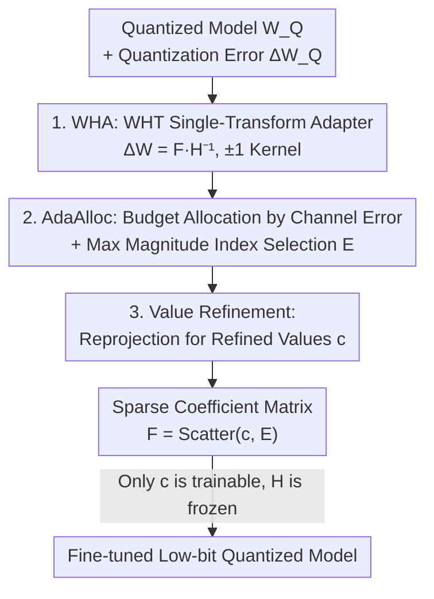

# QWHA: Quantization-Aware Walsh-Hadamard Adaptation for Parameter-Efficient Fine-Tuning on Large Language Models

**Conference**: ICLR 2026  
**OpenReview**: [https://openreview.net/forum?id=QMN4ERDdp4](https://openreview.net/forum?id=QMN4ERDdp4)  
**Code**: https://github.com/vantaa89/qwha  
**Area**: Model Compression / LLM Efficiency  
**Keywords**: Quantization-Aware PEFT, Walsh-Hadamard Transform, Sparse Adapter, Quantization Error Compensation, Parameter Initialization

## TL;DR
QWHA utilizes the Walsh-Hadamard Transform (WHT) as the transform kernel for adapters, combined with a quantization-aware initialization scheme featuring "per-channel budget allocation + maximum magnitude selection + numerical refinement." This allows Fourier-like sparse adapters to be effectively applied to low-bit quantization scenarios for the first time, achieving stable accuracy superior to LoRA-based and other FT adapters at 2~4 bits, with training speeds several times faster than existing FT adapters.

## Background & Motivation
**Background**: To deploy large models at low cost, the industry combines "quantization" (reducing weight bits to lower inference costs) with "Parameter-Efficient Fine-Tuning (PEFT)" (training few parameters to lower training costs), forming **Quantization-Aware PEFT (QA-PEFT)**. Previously, this line of research relied almost entirely on LoRA: injecting a low-rank matrix pair $\Delta W = BA$ alongside quantized weights $W_Q$ to compensate for quantization errors and complete fine-tuning.

**Limitations of Prior Work**: The expressivity of LoRA is strictly constrained by its inner rank $r$, leading to a low rank ceiling (empirical results show LoRA's normalized rank is less than 6.3% of $r_{\max}$). Recently popularized **Fourier-like (FT) adapters** in standard PEFT (FourierFT using DFT, LoCA using DCT, SSH using DHT) offer much stronger expressivity—they train a set of sparse coefficients in the transform domain to represent weight updates, potentially reaching full rank. however, the authors observed a counter-intuitive phenomenon: directly applying these FT adapters to quantized models often yields results **inferior** to LoRA methods specifically designed for QA-PEFT.

**Key Challenge**: There are two root causes for the failure of FT adapters in QA-PEFT. First, LoRA-based methods succeed due to "quantization-aware initialization," which reconstructs the error between full-precision and low-precision weights into the adapter using SVD; however, FT adapters are sparse, and "finding the optimal sparse parameter positions and values to approximate a given error matrix" is an NP-hard Sparse Approximation Problem (SAP), making LoRA's initialization inapplicable. Second, FT adapters require transformations in both row and column directions ($F = H'\Delta W H$), incurring heavy computational overhead, and the recursive implementations of transform kernels (DFT/DCT/DHT) are often slower than direct matrix multiplication due to complex calculations.

**Goal**: The problem is decomposed into two parts: (1) selecting a transform kernel that captures the quantization error structure with minimal sparse parameters; (2) designing a solvable quantization-aware initialization to determine "where to place (position $E$)" and "what values to take (coefficient $c$)" for sparse parameters.

**Key Insight**: The authors observed that quantization errors are **heavy-tailed**—most weights fall within the clamp interval with errors limited to $[-s/2, s/2)$, but a few outliers are truncated at boundaries, producing large errors that dominate accuracy loss. To capture such "abrupt" structures with few parameters, the smooth transition characteristics of sine bases (DCT/DHT) are unsuitable. In contrast, the basis functions of WHT are **square waves** composed of $\pm 1$, containing sharp transitions that naturally align with the abrupt changes of outliers.

**Core Idea**: A sparse adapter (WHA) is constructed using the Walsh-Hadamard Transform with only $\pm 1$ as the kernel and performing only a **single transformation**. This is paired with a quantization-aware initialization involving "AdaAlloc for position selection + Refinement for value optimization," minimizing quantization errors while achieving high speeds due to the $\pm 1$ kernel requiring only additions/subtractions and the single transformation halving computational costs.

## Method

### Overall Architecture
QWHA addresses how to initialize and train a sparse adapter on quantized models that is both expressive and capable of compensating for quantization errors. It defines the weight update as $\Delta W = F H^{-1}$, where $H$ is a predefined, frozen WHT matrix, and $F = \mathrm{Scatter}(c, E)$ is a sparse coefficient matrix with $p$ non-zero elements—$E \in \mathbb{N}^{p\times 2}$ records non-zero positions and $c \in \mathbb{R}^p$ records values. **Only $c$ is trainable during fine-tuning.** The pipeline is as follows: given the quantization error $\Delta W_Q = W_0 - W_Q$, WHA defines the algebraic form; AdaAlloc determines the budget for each output channel and selects the most critical positions $E$ within channels; finally, Value Refinement calculates values $c$ to minimize layer output error. The adapter is then integrated into the quantized model for fine-tuning $c$.

### Key Designs

**1. WHA: Full-Rank Sparse Adapter via Walsh-Hadamard Single Transformation**

This design targets the dual issues of LoRA's low rank and the high cost/ineffectiveness of other FT adapters. QWHA defines the weight update as $\Delta W = F H^{-1}$, performing transformation only on the input dimension, unlike traditional FT adapters that transform both sides ($\Delta W = H'^{-1} F H^{-1}$). The authors argue that since quantization errors are defined per output channel, the channels are independent, and a second transformation does not increase the adapter's rank (expressivity). In terms of expressivity, since $H$ is orthogonal and full-rank, the adapter's rank depends on $F$; $F$ reaches full rank $r_{\max} = \min(d_{in}, d_{out})$ with high probability if each row/column has more than two non-zero parameters—a condition ensured by the initialization. WHA achieves near full rank, while LoRA stays below 6.3%.

WHT is chosen over DCT/DHT because quantization error is dominated by outliers. WHT's square wave bases have sharp transitions suitable for this structure, concentrating energy into fewer coefficients. This is quantified via "cumulative energy" curves: fitting the $\ell_2$ norms of coefficients after transformation to a Pareto distribution, using the Pareto hill index $\eta$ to characterize steepness. WHT has the smallest $\eta$, meaning it reconstructs the most error energy with the same number of parameters. Additionally, the $\pm 1$ kernel allows transformation via recursive addition/subtraction, bypassing matrix multiplication and accelerating training.

**2. AdaAlloc: Adaptive Budget Allocation by Channel Error followed by Magnitude Selection**

This design addresses the NP-hard problem of selecting positions $E$. A naive approach selects the $p$ largest coefficients globally from the dense solution $\Delta W_Q H$, but large coefficients often cluster in a few outlier-heavy channels, causing parameter concentration and rank degradation in $F$. Conversely, LoCA and SSH use random selection to preserve rank but fail to reduce layer output error—a "rank vs. error" dilemma.

AdaAlloc balances both by allocating budget per channel before selecting large values. Specifically, the budget for the $i$-th output channel is proportional to its activation error magnitude:

$$p_i \leftarrow \left\lfloor p \cdot \frac{\lVert(\Delta W_Q X)_{i,:}\rVert_F^{\,t}}{\sum_{j=1}^{d_{out}}\lVert(\Delta W_Q X)_{j,:}\rVert_F^{\,t}} \right\rfloor$$

where $t$ is a temperature hyperparameter controlling allocation steepness (default $t=1$). If rounding leaves some budget, it is distributed to channels with the lowest allocation to ensure $\sum_i p_i = p$. Since **each channel receives a budget proportional to its error**, $F$ maintains full rank while tilting parameters toward important channels. Magnitudes are then used within budgets to select positions. AdaAlloc is the only strategy achieving both near-full rank and low output error.

**3. Value Refinement: Least Squares Reprojection for Selected Positions**

Once positions are fixed, values must be determined. The goal is to minimize layer output error. Following the reduction by Frantar et al., the sub-problem for the $i$-th channel is $\min_x \lVert v - xB\rVert_2^2$, where $v = (\Delta W_Q)_{i,:}R$, $B = H^{-1}R$, and $R = U\Sigma^{1/2}$ is derived from the SVD of the Hessian $XX^\top = U\Sigma U^\top$, with $x$ constrained to $p_i$ non-zero elements.

Directly taking values from the dense solution $x_0 = vB^{-1} = (\Delta W_Q H)_{i,:}$ is sub-optimal as it ignores the interaction between selected and discarded basis vectors. Refinement re-projects $v$ onto the basis vectors $B' \in \mathbb{R}^{p_i \times d_{in}}$ corresponding to the selected indices using a closed-form least squares solution:

$$x^* = vB'^\top(B'B'^\top)^{-1}$$

This allows selected basis vectors to "compensate" for missing vectors. This step is applicable to any selection strategy and significantly reduces output error; omitting it leads to a noticeable error increase.

### Loss & Training
The initialization goal is to minimize the layer output error $\lVert \Delta W_Q X - F H^{-1} X\rVert_F^2$, which reduces to $\lVert \Delta W_Q R - F H^{-1} R\rVert_F^2$ using the Hessian. This is solved per channel via AdaAlloc (selection) and Refinement (valuation). During fine-tuning, the adapter is integrated into the quantized model, and **only the sparse coefficients $c$ are trained**, while $H$ and $W_Q$ remain frozen. Budget $P$ is set to $r=64$ equivalent, quantization group size is 64, and scaling factor $\alpha \simeq 1$. Calibration uses WikiText-2.

## Key Experimental Results

### Main Results
Evaluated on LLaMA-3.1-8B / LLaMA-3.2-3B / Mistral-7B-v0.3 using Alpaca (Instruction) and GSM8k (Math) for training. Metrics include CSQA (7 benchmarks) and GSM8k. Key results for LLaMA-3.2-3B (%):

| Bit | Method | Adapter | QA-Init | CSQA | GSM8k |
|-----|--------|---------|---------|------|-------|
| 4 | CLoQ | LoRA | ✓ | 65.48 | 39.27 |
| 4 | LoCA | DCA | ✗ | 65.59 | 40.33 |
| 4 | SSH | DHA | ✗ | 65.83 | 39.80 |
| 4 | **QWHA** | WHA | ✓ | **66.11** | **41.47** |
| 3 | CLoQ | LoRA | ✓ | 64.35 | 39.20 |
| 3 | **QWHA** | WHA | ✓ | **64.80** | **39.58** |
| 2 | CLoQ | LoRA | ✓ | 54.89 | 26.53 |
| 2 | SSH | DHA | ✗ | 54.01 | 25.77 |
| 2 | **QWHA** | WHA | ✓ | **57.03** | **29.11** |

The advantage is more pronounced at lower bits: at 2-bit, QWHA outperforms the strongest baseline by ~2-3%. Notably, sparse/FT adapters without QA-initialization (SHiRA, LoCA, SSH) underperform the LoRA-based CLoQ at sub-4-bit, confirming that "QA-initialization is indispensable at low bits."

### Ablation Study
Table 4 (LLaMA-3.2-3B) ablates components:

| Adapter | Selection | Refine | 4b CSQA | 2b CSQA | 2b GSM8k |
|---------|-----------|--------|---------|---------|----------|
| WHA | Random | ✓ | 65.91 | 54.48 | 24.48 |
| WHA | Magnitude | ✓ | 66.07 | 56.49 | 28.12 |
| WHA | SSH | ✓ | 65.96 | 54.20 | 27.14 |
| WHA | **AdaAlloc** | ✓ | **66.11** | **57.03** | **29.11** |
| DCA | AdaAlloc | ✓ | 65.54 | 55.95 | 27.29 |
| DHA | AdaAlloc | ✓ | 65.92 | 56.05 | 27.52 |
| Sparse | AdaAlloc | ✓ | 65.60 | 55.97 | 26.54 |

Horizontally, WHA outperforms DCA/DHA/Sparse given the same selection strategy. Vertically, AdaAlloc outperforms Random/Magnitude/SSH/LoCA. The combination (WHA+AdaAlloc) is the global optimum. Figure 5 shows that removing Refinement increases error significantly.

### Key Findings
- **Lower Bit, Higher Gain**: Gains are small at 4-bit but widen to 2-3% at 2-bit, showing QWHA's value in extreme compression where fine-tuning alone cannot recover accuracy.
- **WHT and AdaAlloc Synergy**: WHT captures outlier error structures (minimal $\eta$), while AdaAlloc ensures full rank and low error.
- **Faster Training**: At batch=1, QWHA takes 18.2h vs. SSH/LoCA's 63.3/92.3h. At batch=16, QWHA (3.9h) is close to LoRA-based CLoQ (3.6h) and much faster than SSH (8.3h) or LoCA (9.8h). This results from halving transformations and using $\pm 1$ kernels.
- **Expressivity Advantage**: QWHA at $P(r>32)$ exceeds CLoQ's peak performance, indicating that WHA's structural expressivity advantage cannot be matched by simply increasing LoRA parameters.

## Highlights & Insights
- **"Error Structure Dictates Basis Choice"**: Aligning heavy-tailed quantization errors with the sharp transitions of WHT square wave bases is an elegant physical intuition, quantified by the Pareto hill index $\eta$.
- **Insight into Single Transformation**: While traditional FT adapters default to double transformations, performing it once is sufficient for output-channel-independent errors, significantly reducing costs without sacrificing accuracy.
- **Decomposition of NP-hard Problem**: Decoupling budget allocation (AdaAlloc) and valuation (Refinement) makes sparse approximation engineering-viable.
- **Engineering Dividends of $\pm 1$**: Combining a theoretically superior transform with a hardware-efficient implementation avoids the common pitfall of "accurate but slow" methods.

## Limitations & Future Work
- Validation is limited to 7B-scale models (LLaMA/Mistral) and specific tasks (CSQA/GSM8k), with no 70B+ scale or coding/long-context tasks.
- Not yet integrated with orthogonal QA-PEFT improvements like RA-LoRA (layer-wise calibration/allocation).
- Hyperparameter sensitivity (temperature $t$, scaling $\alpha$) and robustness across various quantization schemes (only GPTQ+MagR tested) require more expansion in the main text.
- Since WHT's advantage relies on heavy-tailed error distributions, its edge over DCT/DHT might diminish for layers with flat error distributions.

## Related Work & Insights
- **vs. CLoQ / RA-LoRA (LoRA-based)**: These also minimize layer output error via initialization but use low-rank approximations; QWHA uses full-rank sparse FT adapters for a higher ceiling.
- **vs. FourierFT / LoCA / SSH (FT Adapters)**: These use sine bases, double transformations, and random selection without QA-initialization, making them less effective in low-bit scenarios.
- **vs. SHiRA (Non-FT Sparse)**: SHiRA uses direct weight subset updates with random selection; QWHA applies sparsity in the transform domain with quantization-aware initialization for superior performance.

## Rating
- Novelty: ⭐⭐⭐⭐⭐ First introduction of FT adapters to QA-PEFT with strong physical motivation for WHT and initialization design.
- Experimental Thoroughness: ⭐⭐⭐⭐ Coverage across 2/3/4-bit and multiple benchmarks/models is solid, though larger models are missing.
- Writing Quality: ⭐⭐⭐⭐⭐ Logical derivation supported by quantitative metrics like $\eta$ and rank.
- Value: ⭐⭐⭐⭐⭐ High practical value by simultaneously improving accuracy and training speed for low-bit deployment.

<!-- RELATED:START -->

## Related Papers

- [\[ACL 2025\] L4Q: Parameter Efficient Quantization-Aware Fine-Tuning on Large Language Models](../../ACL2025/model_compression/l4q_parameter_efficient_quantization_aware_finetuning.md)
- [\[ICLR 2026\] PiCa: Parameter-Efficient Fine-Tuning with Column Space Projection](pica_parameter-efficient_fine-tuning_with_column_space_projection.md)
- [\[ICLR 2026\] Memba: Membrane-driven Parameter-Efficient Fine-Tuning for Mamba](memba_membrane-driven_parameter-efficient_fine-tuning_for_mamba.md)
- [\[ICLR 2026\] Efficient Orthogonal Fine-Tuning with Principal Subspace Adaptation](efficient_orthogonal_fine-tuning_with_principal_subspace_adaptation.md)
- [\[ICLR 2026\] Gradient Intrinsic Dimensionality Alignment：Narrowing The Gap Between Low-Rank Adaptation and Full Fine-Tuning](gradient_intrinsic_dimensionalityalignmentnarrowing_the_gap_between_low-rank_ad.md)

<!-- RELATED:END -->
