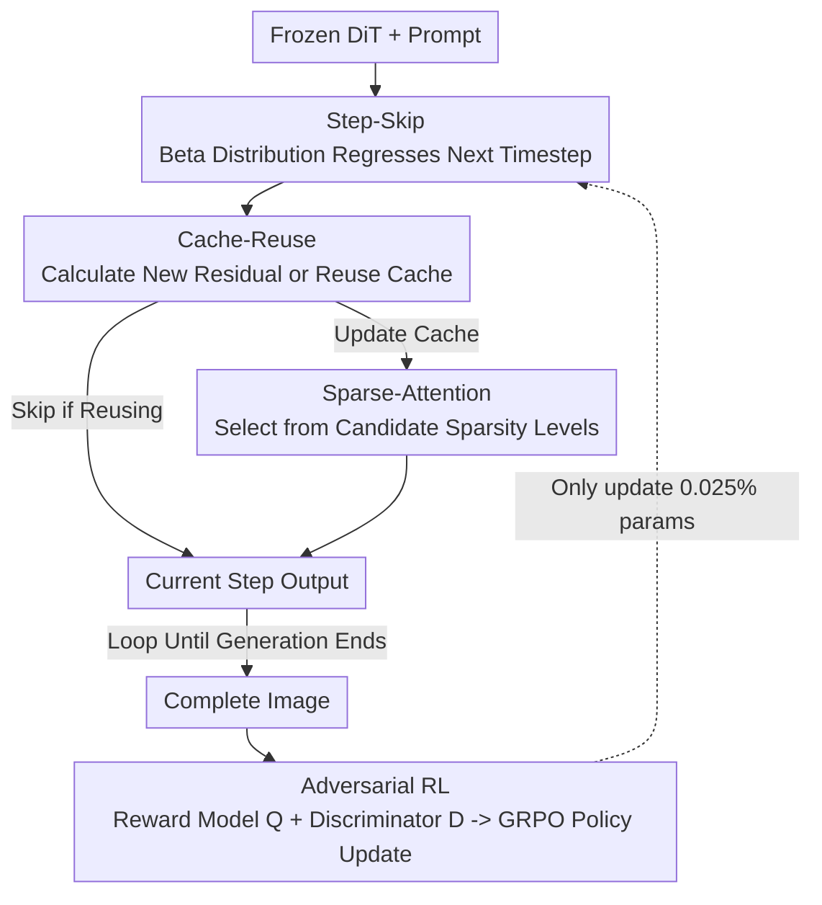

# RAPID$^3$: Tri-Level Reinforced Acceleration Policies for Diffusion Transformer

**Conference**: ICLR 2026  
**OpenReview**: [https://openreview.net/forum?id=sQ0g6EkpF7](https://openreview.net/forum?id=sQ0g6EkpF7)  
**Code**: https://github.com/NUS-HPC-AI-Lab/RAPID3  
**Area**: Model Compression / Diffusion Model Acceleration  
**Keywords**: Diffusion Transformer, Inference Acceleration, Reinforcement Learning, GRPO, Adversarial Reward

## TL;DR
Three lightweight policy heads (Step-Skip / Cache-Reuse / Sparse-Attention) are attached to a frozen Diffusion Transformer. These heads are trained online via GRPO to decide acceleration strategies per-timestep and per-image. An adversarial discriminator is employed to prevent reward hacking, achieving approximately 3× speedup on SD3 and FLUX with almost no loss in image quality.

## Background & Motivation
**Background**: Diffusion Transformers (DiT, e.g., SD3, FLUX) have become the backbone for high-fidelity visual generation. However, the sampling process requires many steps, each involving heavy re-computation on large latents, leading to slow inference speeds that hinder deployment. To accelerate this, the community has proposed two types of methods: training-free accelerators—which reduce steps, reuse intermediate features (feature caching), or use sparse attention; and dynamic neural networks—which train routers to adaptively adjust width, depth, or resolution based on input.

**Limitations of Prior Work**: Training-free methods apply the **same fixed or hand-crafted heuristic strategy to all images and all timesteps**. However, the number of steps and caching intervals required for a complex image with many details differ significantly from those of a simple image. Uniform strategies are either too conservative to avoid artifacts (wasting acceleration potential) or too aggressive, leading to quality degradation. Dynamic network methods achieve per-image adaptability but require **fine-tuning the generator itself** on large-scale text-to-image datasets, incurring prohibitive training costs (e.g., DyFLUX requires 38,000 GPU hours and 3 million image-text pairs), which is impractical for many large or closed-source models.

**Key Challenge**: There is an acute trade-off between adaptability (per-image) and low cost (preserving the generator and using less data). Adaptability typically requires training large models, while cost efficiency often limits methods to rigid, uniform rules.

**Key Insight**: The sampling process of DiT is reframed as a **Markov Decision Process (MDP)**. The forward process is a sequence of denoising steps where the "current latent + timestep index + prompt embedding" serves as the state. The "next timestep value" is treated as a continuous action, while "whether to reuse cache" and "whether to use sparse attention" are treated as discrete actions. A crucial observation is that once generator weights are frozen, the outcome of any action is **deterministic and predictable** (eliminating the need to learn environmental dynamics). Episodes are short, and the final complete image provides a quantifiable posterior score. This fits perfectly within the comfort zone of modern policy optimization methods like GRPO: the action space is small yet expressive, the environment is stable and deterministic, sea-level rollouts can be performed using the frozen DiT as a cheap simulator, and the reward is a scalar directly reflecting the target objective.

**Core Idea**: Without modifying a single weight of the generator, the authors train three lightweight policy heads—accounting for only 0.025% of the total parameters. Reinforcement learning allows these heads to select acceleration strategies per-image and per-step, simultaneously achieving the adaptability of dynamic networks and the low cost of training-free methods.

## Method

### Overall Architecture
RAPID$^3$ treats a **frozen DiT** as the environment and attaches three hierarchical policy heads externally: Step-Skip (external, deciding the next timestep), Cache-Reuse (internal, deciding whether to compute or reuse residual cache), and Sparse-Attention (further internal, deciding the level of attention sparsity). During generation, at each timestep, the three policy heads observe the current denoising state and independently issue actions, dynamically compressing the computation for that step. Once a complete image is generated, an image reward model combined with an adversarial discriminator provides a joint score to calculate the reward. Policy head parameters are then updated via GRPO while the generator remains frozen. The three heads are stacked from "outer to inner": first deciding the step size, then whether to skip computation, and if not, how sparse the attention should be.

### Key Designs

**1. Tri-Level Acceleration Action Space: Hierarchical Computation Compression**

To address the inefficiency of "uniform heuristics," the authors decompose acceleration into three orthogonal hierarchical levels, allowing the policy to find the optimal combination for each image within a larger solution space. **Level-1 Step-Skip**: Defines policy $P_{step}$, which regresses a pair of $(\alpha, \beta)$ parameters to define a Beta distribution from the current DiT output. An action $a^{step}_t \sim \mathrm{Beta}(\alpha, \beta)$ is sampled, and the next timestep is set as $t_{next} = \lfloor t \cdot a^{step}_t \rfloor$. Complex images naturally take more steps, while simple ones take fewer. **Level-2 Cache-Reuse**: Residuals of adjacent diffusion steps exhibit temporal coherence. The residual is cached as $\Delta_{t_{cache}} = G(X_{t_{cache}}, t_{cache}) - X_{t_{cache}}$. Policy $P_{cache}$ observes the difference between the current latent and the cached latent $X_t - X_{t_{cache}}$ and outputs a binary action: $O_t = G(X_t, t)$ (update cache) or $O_t \approx X_t + \Delta_{t_{cache}}$ (reuse). **Level-3 Sparse-Attention**: Self-attention $O(n^2)$ is the bottleneck for high-resolution generation. $P_{sparse}$ selects a level from a set of predefined sparsity hyperparameters $\{\theta_1, \dots, \theta_{N_{sparse}}\}$ (default $N_{sparse}=3$), plus a "no sparsity" option, replacing the attention layer $F^l_{SA}$ with $F^l_{SA_{sparse}}(x^l_t, c^l_t; \theta^l_t)$. Note the dependency: if $P_{cache}$ decides to reuse the cache, attention is not calculated, and $P_{sparse}$ is bypassed. Compared to methods like SpargeAttn that search for a single fixed $\theta$, per-timestep selection aligns better with the evolving attention patterns during denoising.

**2. Lightweight Policy Head Design: 3M Parameters, Unified Structure**

The three policy heads share a lightweight structure: a convolutional layer for feature projection, an AdaLN layer to inject condition embedding $c_t$, and pooling followed by linear heads to predict actions. $P_{step}$ regresses $[\alpha, \beta]$ for the Beta distribution; $P_{cache}$ outputs $p^{cache}_t \in \mathbb{R}^2$ for Categorical sampling; $P_{sparse}$ outputs $p^{sparse}_t \in \mathbb{R}^{1+N_{sparse}}$ for Categorical sampling. Totaling approximately 3M parameters—only 0.025% of the generator—this design enables "parameter efficiency + data efficiency." The authors also found that overly aggressive sparsity candidates significantly degrade quality, so the candidate levels are conservative and incrementally increased.

**3. Adversarial Reinforcement Learning + Equivalent Step Reward: Preventing Reward Hacking**

If the reward relies solely on an off-the-shelf image reward model $Q$ (e.g., ImageReward), policy heads may exploit $Q$—optimizing the score while the actual image quality collapses (reward hacking). The authors introduce a discriminator $D$: a batch of images from the original DiT (unaccelerated) serves as positive samples $I_{origin}$, while images generated using the current policy heads serve as negative samples $I_{accele}$. $D$ is trained with cross-entropy to distinguish whether acceleration was applied. During RL, newly sampled accelerated images continuously update the negative sample set. The score $d_i$ from $D$ represents "how much this accelerated image resembles the original model distribution," complementing the quality score $q_i$ from $Q$. On the cost side, **Equivalent Steps** are defined as $K = \sum_{k=1}^{K_{step}}(1-C^{cache}_k)(1-C^{sparse}_k)$, translating saved computation from caching and sparse attention back into equivalent steps ($C$ is the normalized cost reduction in $[0,1]$). The final reward is $r_i = \frac{1}{K}\sum_{k=1}^{K}\lambda^{K-k}(q_i + \omega d_i)$, where $\lambda \in (0,1)$ is a decay factor penalizing high cost and $\omega$ is the discriminator weight. The advantage $A_i$ is calculated via GRPO group normalization $A_i = \frac{r_i - \mathrm{mean}(\{r\})}{\mathrm{std}(\{r\})}$, and the objective is $J = \frac{1}{G}\sum_i \min(\phi_i A_i, \mathrm{clip}(\phi_i, 1-\varepsilon, 1+\varepsilon)A_i)$, where $\phi_i = \frac{\pi_\theta(I_i|c)}{\pi_{\theta_{old}}(I_i|c)}$. Since policy heads are initialized randomly without a reference model, the KL term is omitted. The discriminator and policy heads undergo alternating adversarial optimization.

### Loss & Training
Policy heads are trained online using GRPO (generator remains frozen). Multiple images $\{I_i\}_{i=1}^G$ are sampled for the same prompt to calculate within-group advantages. The reward is a combination of ImageReward ($Q$) + CLIP discriminator ($D$, trained with a parameter-efficient adapter) as $q_i + \omega d_i$, discounted by equivalent steps $K$ and decay factor $\lambda$. $\lambda$ serves as the "knob" for the speedup ratio: $\lambda=0.97$ yields ~2.92× speedup, while $\lambda=0.90$ provides higher acceleration. Training utilizes only 20K text-only prompts (from COCO2017 and a public prompt set), requiring no image-text pairs.

## Key Experimental Results

### Main Results
Comparison with common acceleration methods on SD3 (COCO/HPS/GenEval, latency measured on H20 GPU):

| Method | Latency (s) ↓ | Speedup ↑ | COCO CLIP ↑ | COCO Aesthetic ↑ | HPS Score ↑ | GenEval Overall ↑ |
|------|-----------|--------|-------------|------------------|-------------|-------------------|
| SD3 28-steps (Baseline) | 5.77 | 1.00× | 32.05 | 5.31 | 28.83 | 69.01 |
| SD3 9-steps | 1.98 | 2.91× | 31.88 | 5.21 | 27.67 | 61.67 |
| w/ TeaCache δ=0.15 | 2.20 | 2.62× | 32.02 | 5.25 | 27.87 | 62.81 |
| w/ ∆-DiT N=4 | 3.76 | 1.53× | 31.91 | 5.12 | 27.67 | 58.67 |
| w/ SpargeAttn | 5.08 | 1.13× | 31.39 | 5.02 | 27.16 | 45.01 |
| w/ TPDM (Skip-only RL) | 2.32 | 2.48× | 31.98 | 5.25 | 27.75 | 60.70 |
| **w/ RAPID3 (Ours)** | **1.97** | **2.92×** | **32.09** | 5.26 | **28.07** | **63.48** |

RAPID$^3$ achieves the best balance across all metrics at the highest speedup ratio, outperforming TPDM (which only uses RL for step skipping), validating that the tri-level design is superior to single-strategy policies.

Comparison with the dynamic network DyFLUX (on FLUX):

| Method | Training GPU Hr ↓ | Training Data ↓ | Latency (s) ↓ | Aesthetic ↑ |
|------|-----------------|-----------|-----------|-------------|
| FLUX | - | - | 22.15 | 5.64 |
| DyFLUX | 38,000 | 3M image-text | 13.93 | 5.29 |
| **RAPID3 (Ours)** | **400** | **20K text-only** | **8.30** | **5.63** |

Using only ≈1% of the GPU hours and ≪0.7% of the data, RAPID$^3$ is both faster (40% lower latency) and better (image quality nearly reaching baseline FLUX) than DyFLUX.

### Ablation Study

| Configuration | COCO CLIP ↑ | COCO Aesthetic ↑ | HPS Score ↑ | Description |
|------|-------------|------------------|-------------|------|
| Step only | 31.98 | 5.25 | 27.75 | Single level |
| Step + Cache | 32.04 | 5.25 | 27.86 | With cache reuse |
| Step + Sparse | 31.96 | 5.13 | 27.80 | With sparse attention |
| Step + Cache + Sparse (Default) | 32.09 | 5.26 | 28.07 | Full tri-level is best |

Ablation of reward sources (IR denotes ImageReward scores during training):

| Configuration | IR | COCO CLIP ↑ | COCO Aesthetic ↑ | HPS Score ↑ |
|------|-----|-------------|------------------|-------------|
| only Q | 0.9605 | 32.04 | 5.18 | 27.72 |
| only D | 0.9538 | 31.91 | 5.24 | 27.96 |
| Q + D (Default ω=1.0) | 0.9574 | 32.09 | 5.26 | 28.07 |

### Key Findings
- The tri-level overlay shows monotonic increases in CLIP / Aesthetic / HPS scores—a larger action space allows the policy to find optimal combinations for each image.
- "only Q" yields the highest ImageReward score (0.9605) but other metrics drop significantly, providing clear evidence of reward hacking; the policy focuses on gaming $Q$ at the expense of actual quality. Adding the discriminator $D$ stabilizes all metrics.
- Visualizations show the policy learns to allocate budget based on complexity: simple single-object images use fewer equivalent steps (e.g., 9.77 steps), while complex multi-object scenes use more (e.g., 17.20 steps), achieving true per-image adaptability.

## Highlights & Insights
- **Reframing inference as an MDP is the most elegant move**: Once the generator is frozen, the environment is deterministic, episodes are short, and rewards are quantifiable. The authors identified this as the comfort zone for GRPO, allowing for stable policy training without learning environmental dynamics.
- **Orthogonal Action Spaces are Reusable**: Step-skip (outer) / Cache (middle) / Sparse Attention (inner) are non-conflicting but interdependent. This "hierarchical action" approach based on the computation graph can be migrated to any inference system with multiple acceleration knobs.
- **Using a Discriminator as an Auxiliary Reward**: When a single reward model is prone to exploitation, adding an adversarial signal ("does it look like the original distribution") is more effective than simply tuning reward weights.
- Achieving dynamic-network-level adaptability with 0.025% parameters, 1% compute, and text-only prompts makes this extremely friendly for closed-source or ultra-large generators.

## Limitations & Future Work
- The authors acknowledge that training is still required to learn the policies; incorporating prior knowledge for training-free policy selection could further reduce costs.
- Currently only validated on image DiTs (SD3/FLUX). Extending this to video generation or editing models remains to be explored—videos have higher temporal redundancy, which might require a redesign of the action space.
- Sparse attention candidate levels require manual presetting and cannot be too aggressive. The design of the candidate set still contains heuristics.
- The speedup ratio is controlled by a single knob $\lambda$; while quality loss is negligible at ~3× speedup, the trade-off curve for more extreme acceleration suggests an upper limit.

## Related Work & Insights
- **vs Training-free Accelerators (TeaCache / ∆-DiT / SpargeAttn)**: These use uniform or manual adaptive rules. RAPID$^3$ learns per-image/per-step policies via RL. While keeping the generator frozen, its adaptability leads to a better quality-speed balance.
- **vs Dynamic Networks (DyDiT / DyFLUX)**: Both pursue per-image adaptability, but dynamic networks require full fine-tuning with 3M image-text pairs and tens of thousands of GPU hours. RAPID$^3$ achieves this with 3M policy parameters and 20K text-only prompts, saving two orders of magnitude in cost.
- **vs TPDM**: Both use RL for diffusion acceleration, but TPDM only learns noise scheduling (step skipping), ignoring redundancies within steps. RAPID$^3$'s tri-level approach addresses both inter-step and intra-step redundancies, outperforming TPDM across all metrics.
- **vs Few-step Distillation**: Distillation requires training ~100M extra parameters or modifying the generator. This work remains orthogonal, focusing on "external policy + RL" without distillation.

## Rating
- Novelty: ⭐⭐⭐⭐⭐ Reframing DiT inference as an MDP with tri-level orthogonal actions and adversarial rewards is highly novel and well-motivated.
- Experimental Thoroughness: ⭐⭐⭐⭐ Extensive testing on SD3/FLUX across multiple benchmarks with comparisons to training-free, dynamic, and RL baselines. Lacks validation on video/editing scenes.
- Writing Quality: ⭐⭐⭐⭐ MDP perspective is clear; Figure 2 details are dense but logical.
- Value: ⭐⭐⭐⭐⭐ High value for deploying large/closed-source generators, providing ~3× lossless speedup with minimal overhead.

<!-- RELATED:START -->

## Related Papers

- [\[ICLR 2026\] Plug-and-Play Fidelity Optimization for Diffusion Transformer Acceleration via Cumulative Error Minimization](plug-and-play_fidelity_optimization_for_diffusion_transformer_acceleration_via_c.md)
- [\[ICLR 2026\] Vulcan: 为边缘智能裁剪紧凑的类特定视觉 Transformer](vulcan_crafting_compact_class-specific_vision_transformers_for_edge_intelligence.md)
- [\[ICLR 2026\] ScalingCache: Extreme Acceleration of DiTs through Difference Scaling and Dynamic Interval Caching](scalingcache_extreme_acceleration_of_dits_through_difference_scaling_and_dynamic.md)
- [\[ICLR 2026\] TP-Spikformer: Token Pruned Spiking Transformer](tp-spikformer_token_pruned_spiking_transformer.md)
- [\[ICLR 2026\] Otters: An Energy-Efficient Spiking Transformer via Optical Time-to-First-Spike Encoding](otters_an_energy-efficient_spiking_transformer_via_optical_time-to-first-spike_e.md)

<!-- RELATED:END -->
