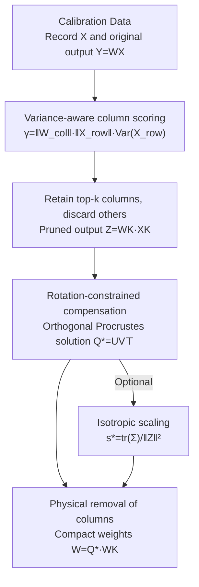

# RCPU: Rotation-Constrained Error Compensation for Structured Pruning of Large Language Models

**Conference**: ICLR 2026  
**OpenReview**: [https://openreview.net/forum?id=t6xiPRvynD](https://openreview.net/forum?id=t6xiPRvynD)  
**Code**: https://github.com/harutaro/rcpu  
**Area**: Model Compression  
**Keywords**: Structured Pruning, Error Compensation, Orthogonal Procrustes, Rotation Constraint, Geometry Preservation

## TL;DR
RCPU applies a "rotation-constrained" closed-form parameter update (Orthogonal Procrustes problem) after structured column pruning to realign the pruned subspace with the original output. This compensates for errors without destroying the geometric structure of pre-trained representations using only a small amount of calibration data. Combined with a column importance score that considers input variance, RCPU consistently outperforms baselines such as WANDA-sp and FLAP in perplexity and downstream task accuracy on Llama-7B and Llama-2-13B.

## Background & Motivation
**Background**: Large Language Models (LLMs) incur significant computational and memory overhead during inference. Structured pruning is a common compression method that removes parameters at the granularity of entire rows/columns (or even transformer blocks) of weight matrices, directly reducing parameter counts and inference costs. `WANDA-sp` is a common baseline in structured pruning, performing column pruning with a simple "weight magnitude × activation scale" heuristic score, requiring only small batches of calibration data and no downstream fine-tuning.

**Limitations of Prior Work**: Removing columns inevitably leads to output mismatch (where pruned outputs do not match original outputs). The method of compensating for this mismatch determines final performance. Existing compensation strategies have limitations: `FLAP` uses a bias term to compensate for the "mean component" of the error, but input-dependent directional mismatch cannot be resolved by a constant bias. Conversely, using direct Least Squares (LS) fitting (even with Ridge regularization) to minimize output error tends to overfit the calibration set when data is scarce, destructively overwriting pre-trained weights.

**Key Challenge**: Stronger compensation capabilities (linear updates with higher degrees of freedom) are more prone to overfitting on small calibration sets and introduce arbitrary scaling and shear, distorting angles and norms in the output space and harming generalization. There is a trade-off between "fitting error" and "preserving pre-trained geometry." Least Squares fitting specifically tends to destroy angles and lengths.

**Goal**: Compensate for pruning errors without retraining and using only a small calibration set, while preserving the norm and inner product structure (geometry) of the output representations.

**Key Insight**: The authors observe that while pruning removes the $W_D X_D$ term, the remaining subspace usually retains most of the useful signals; however, its "orientation" relative to the original output is shifted. Therefore, realigning this orientation is sufficient, and rotation (orthogonal transformation) naturally preserves angles and norms.

**Core Idea**: The compensation update is restricted to a rotation matrix, solved as an Orthogonal Procrustes problem to realign the preserved subspace with the original output. Combined with a scoring mechanism considering input variance, columns contributing significantly to the principal output direction are prioritized, making rotation compensation more effective.

## Method

### Overall Architecture
RCPU is a layerwise "post-pruning compensation" process applied to the linear sub-layers of transformer blocks (e.g., `o_proj` in attention, `down_proj` in MLP). For each sub-layer $W \in \mathbb{R}^{d_{out}\times d_{in}}$, input activations $X$ and original outputs $Y=WX$ are recorded using small-batch calibration data. Subsequently, input columns are scored using a variance-aware metric; the top-$k$ columns are retained while others are discarded, yielding the pruned output $Z = W_K X_K$. A rotation matrix $Q^\star$ is then computed to realign $Z$ with $Y$ via the Orthogonal Procrustes problem, and the retained weights are updated as $\widetilde{W}_K = Q^\star W_K$ (with an optional global scaling factor). Finally, the discarded columns are physically removed to obtain compact weights. The entire process is greedy and layerwise, with closed-form solutions for each sub-problem and no hyperparameters to tune.

### Key Designs

**1. Variance-aware column scoring: Prioritizing columns contributing to the principal direction**

The effectiveness of rotation compensation strongly depends on which columns are retained. If columns contributing most to the principal output direction are removed, the error becomes difficult to recover. The authors observe that input dimensions with higher fluctuations (variance) across calibration tokens are more likely to align with the principal output direction. Thus, each input column $j$ is scored as:

$$\gamma_j = \lVert W_{[:,j]} \rVert \, \lVert X_{[j,:]} \rVert \, \mathrm{Var}(X_{[j,:]}).$$

This naturally extends the WANDA-sp score (which uses only "weight norm × input norm") by including the variance factor $\mathrm{Var}(X_{[j,:]})$. Intuitively, while the original score favors high-magnitude columns, the variance factor favors columns that are both high-magnitude and active across different inputs. Given a pruning rate $\rho$, $\lceil d_{in}\rho \rceil$ low-score columns are removed. This scoring facilitates both pruning and subsequent rotation compensation by preserving directionally relevant columns.

**2. Rotation-constrained compensation: Realigning the pruned subspace via Orthogonal Procrustes**

This is the core of the paper. After column removal, the preserved subspace $Z=W_K X_K$ still carries most of the signal, but its orientation is shifted relative to $Y$. The authors model "alignment" as an Orthogonal Procrustes problem: finding a rotation matrix $Q$ (where $Q^\top Q=I$) on calibration data such that:

$$Q^\star = \arg\min_{Q^\top Q = I} \lVert Y - QZ \rVert_F^2.$$

This has a classic closed-form solution: let $M = YZ^\top$ and compute its SVD $M=U\Sigma V^\top$; then $Q^\star = UV^\top$. The retained weights are updated to $\widetilde{W}_K = Q^\star W_K$, explicitly rotating the new output $\widetilde{W}_K X_K = Q^\star Z$ to fit $Y$. Compared to unconstrained Least Squares, which introduces arbitrary scaling/shear and distorts geometry, restricting the update to a rotation preserves angles and relative norms. Its statistical stability is also superior: using the effective degrees of freedom formula, LS+Ridge has degrees of freedom between $1.395\times10^9$ and $1.578\times10^9$, whereas the orthogonal matrix $Q$ has only $\frac{d_{out}(d_{out}-1)}{2}=5.36\times10^8$. Lower degrees of freedom imply less overfitting and better preservation of pre-trained knowledge. Additionally, RCPU eliminates hyperparameters like $\lambda$, avoiding the cost of grid searches involving large matrix inversions.

**3. Isotropic scaling variant: Aligning overall scale while preserving angles**

Pure rotation preserves angles and norm ratios but does not adjust the overall magnitude. The authors provide a variant including a single isotropic scaling factor $s>0$:

$$(Q^\star, s^\star) = \arg\min_{Q^\top Q=I,\, s>0} \lVert Y - s\,QZ \rVert_F^2,$$

which also has a closed-form solution: $Q^\star=UV^\top$ and $s^\star = \mathrm{tr}(\Sigma)/\lVert Z \rVert_F^2$. Updating to $\widetilde{W}_K = s^\star Q^\star W_K$ preserves angular structure and norm ratios (maintaining the ranking of vector lengths) while bringing the overall magnitude closer to the original model. The authors noted that improvement is marginal—results for Rot. and Rot.+Scale are similar because rotation already aligns the subspace with the principal direction, preserving the overall norm. However, with more calibration samples (512), the scaling variant is slightly more stable in recovering the original norm.

### Loss & Training
RCPU involves no gradient-based training; all solutions are layerwise and closed-form. The complexity for each sub-layer is: $O(d_{in}(d_{out}+N))$ for scoring, $O(d_{out}kN)$ for constructing $Z$, and $O(d_{out}^2 N)$ for $M=YZ^\top$. The dominant term is the SVD of $M\in\mathbb{R}^{d_{out}\times d_{out}}$, approximately $O(d_{out}^3)$—similar in complexity to non-structured methods like SparseGPT. Pruning occurs on input channels for `o_proj` and `down_proj`, with corresponding removals in other projection matrices. Attention is pruned at the head level, but parameter updates are only applied to `o_proj` and `down_proj`. WikiText-2 is used for calibration, with perplexity stabilizing after approximately $N_{calib}=64$; experiments primarily use 128 and 512.

## Key Experimental Results

### Main Results
Evaluated on Llama-7B / Llama-2-13B, WikiText-2 perplexity (PPL, lower is better) compared to WANDA-sp and FLAP:

| Model | Pruning Rate | WANDA-sp | FLAP | RCPU (Rot.) | RCPU (Rot.+Scale) |
|------|--------|----------|------|-------------|-------------------|
| Llama-7B ($N{=}128$) | 20% | 16.70 | 15.36 | 14.40 | 14.55 |
| Llama-7B ($N{=}128$) | 30% | 24.13 | 18.59 | 18.35 | 18.21 |
| Llama-2-13B ($N{=}512$) | 20% | 14.62 | 14.14 | 12.75 | 12.72 |
| Llama-2-13B ($N{=}512$) | 30% | 63.35 | 16.71 | 16.99 | 15.96 |

Average accuracy on zero-shot tasks (Llama-7B, $N_{calib}=128$, mean of 7 benchmarks, higher is better):

| Method | 10% | 20% | 30% |
|------|-----|-----|-----|
| Original | 66.00 | — | — |
| FLAP | 63.80 | 61.32 | 56.20 |
| WANDA-sp | 63.71 | 60.78 | 54.00 |
| RCPU (Rot.) | **64.01** | 61.57 | 55.50 |
| RCPU (Rot.+Scale) | 63.86 | 61.49 | 56.34 |

RCPU achieves higher average accuracy than FLAP across all pruning rates, indicating that geometry-preserving compensation is more effective than mean-bias compensation.

### Ablation Study
Impact of compensation on target sub-layers (Llama-7B, $N_{calib}=128$, PPL↓):

| Pruning Rate | No Comp. | o_proj only | down_proj only | Both |
|--------|--------|-------------|----------------|----------|
| 10% | 13.96 | 13.61 | 13.62 | **13.55** |
| 20% | 16.85 | 15.47 | 15.76 | **14.40** |
| 30% | 21.94 | 18.91 | 20.22 | **18.35** |

Cross-comparison of scoring and compensation methods (Figure 3): With $N_{calib}=128$ (small set), rotation compensation yields the best PPL, while LS with Ridge regularization even degrades PPL due to overfitting. When $N_{calib}=512$, LS+Ridge effectively reduces PPL and contributes more significantly to PPL reduction—however, the authors emphasize that this does not necessarily translate to better downstream accuracy, where RCPU often remains superior.

### Key Findings
- **Compensating more targets is better**: Compensating both `o_proj` and `down_proj` is significantly better than compensating only one, with the gap widening at higher pruning rates (18.35 vs 18.91/20.22 at 30%).
- **Calibration size determines the choice between Rotation and LS**: LS overfits and performs worse on small calibration sets, while rotation is stable due to lower degrees of freedom. On larger sets, LS is more aggressive in reducing PPL but may lose to RCPU on downstream tasks—validating the value of "preserving pre-trained geometry" for generalization.
- **Scaling variant offers marginal gains**: There is nearly no difference in PPL between Rot. and Rot.+Scale because rotation already preserves the overall norm. Scaling shows a slight advantage only at high pruning rates with 512 samples.
- **Hyperparameter-free and efficient**: Unlike LS, which requires grid searching for $\lambda$, RCPU has no hyperparameters, avoiding extra computational overhead.

## Highlights & Insights
- **Quantifying intuition with "Degrees of Freedom"**: The authors go beyond qualitative claims by using the Ridge effective degrees of freedom formula to show that LS+Ridge (~1.4–1.6$\times10^9$) is much higher than rotation ($5.36\times10^8$), providing a numerical basis for the argument that "constrained updates → less overfitting → better knowledge preservation."
- **Pruning error compensation as a geometric alignment problem**: By moving away from "re-fitting weights" and modeling compensation as Orthogonal Procrustes alignment, the paper provides a clean, closed-form perspective suitable for other compression scenarios like quantization or low-rank approximation.
- **Synergistic design of scoring and compensation**: Variance-aware scoring is specifically designed to ensure the rotation has principal directions to align with. This coupled approach is more targeted than optimizing components in isolation.
- **Plug-and-play with zero extra architecture**: Compensation can be directly appended after WANDA-sp style column pruning without modifying the model architecture or retraining, making it very lightweight for engineering.

## Limitations & Future Work
- **Greedy layerwise approach**: Solutions are closed-form for each sub-problem, but the entire network is constructed greedily without cross-layer joint optimization, potentially missing a global optimum.
- **Marginal gains from scaling**: The inclusion of isotropic scaling barely changes results in most settings, serving more as a theoretical completion.
- **Inconsistent advantages at high pruning rates**: In certain 30% settings, RCPU's lead over FLAP is narrow (or PPL is similar), suggesting that the benefits of geometric preservation diminish as pruning becomes more aggressive.
- **Scope limited to linear sub-layers**: The method focuses on column pruning for linear layers; its effectiveness for more aggressive block pruning or joint quantization scenarios is not explored.

## Related Work & Insights
- **vs WANDA-sp**: Both are fine-tuning-free structured column pruning. WANDA-sp uses "weight norm × input norm" scoring without compensation; RCPU adds a variance factor to scoring and applies rotation-constrained compensation, resulting in better PPL and accuracy.
- **vs FLAP**: Both perform post-pruning compensation. FLAP uses a bias term to compensate for the mean error but cannot handle input-dependent directional mismatch; RCPU uses rotation to align directions, achieving higher average accuracy across all pruning rates.
- **vs LS / Ridge fitting**: Unconstrained (or Ridge-only) Least Squares has high degrees of freedom, overfits small calibration sets, and distorts geometry via scaling/shear. RCPU restricts updates to rotation, significantly reducing degrees of freedom and requiring no hyperparameters while preserving angles and norms.
- **vs SliceGPT**: Both are structured compression methods, but SliceGPT's accuracy significantly trails on Llama-2-13B (e.g., 64.90 vs RCPU's 67.95 at 10%), demonstrating RCPU's stability in geometric preservation.

## Rating
- Novelty: ⭐⭐⭐⭐ Modeling pruning error compensation as Orthogonal Procrustes alignment with synergistic variance-aware scoring is a clean perspective backed by theory.
- Experimental Thoroughness: ⭐⭐⭐⭐ Covers two models, three pruning rates, PPL + 7 benchmarks, and multiple ablations, though model sizes are relatively small (≤13B) and do not include very large models.
- Writing Quality: ⭐⭐⭐⭐ Clear progression from motivation to constraints, closed-form solutions, and degrees of freedom analysis.
- Value: ⭐⭐⭐⭐ Plug-and-play, hyperparameter-free, and fine-tuning-free, making it highly practical for structured pruning in edge/embedded deployment.

<!-- RELATED:START -->

## Related Papers

- [\[AAAI 2026\] First-Order Error Matters: Accurate Compensation for Quantized Large Language Models](../../AAAI2026/model_compression/first-order_error_matters_accurate_compensation_for_quantized_large_language_mod.md)
- [\[ACL 2026\] GRASPrune: Global Gating for Budgeted Structured Pruning of Large Language Models](../../ACL2026/model_compression/grasprune_global_gating_for_budgeted_structured_pruning_of_large_language_models.md)
- [\[ICML 2025\] SlimLLM: Accurate Structured Pruning for Large Language Models](../../ICML2025/model_compression/slimllm_accurate_structured_pruning_for_large_language_models.md)
- [\[ICLR 2026\] LSA: Layer-wise Sparsity Allocation for Large Language Model Pruning Based on Minimal Linear Reconstruction Error](lsa_layer-wise_sparsity_allocation_for_large_language_model_pruning_based_on_min.md)
- [\[ICML 2025\] Olica: Efficient Structured Pruning of Large Language Models without Retraining](../../ICML2025/model_compression/olica_efficient_structured_pruning_of_large_language_models_without_retraining.md)

<!-- RELATED:END -->
