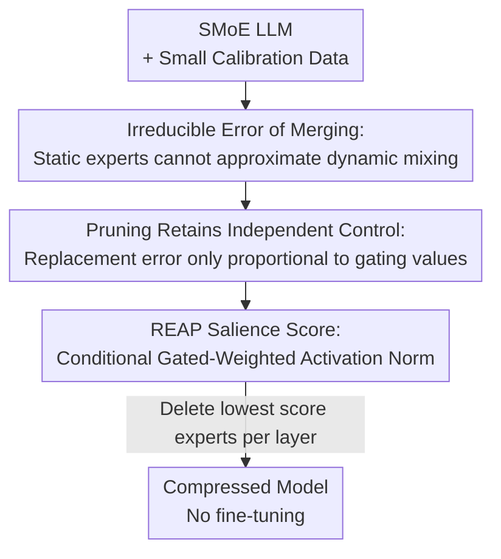

# REAP the Experts: Why Pruning Prevails for One-Shot MoE Compression

**Conference**: ICLR 2026  
**OpenReview**: [https://openreview.net/forum?id=ukGxWd2aDG](https://openreview.net/forum?id=ukGxWd2aDG)  
**Code**: https://github.com/CerebrasResearch/reap  
**Area**: Model Compression  
**Keywords**: MoE Compression, Expert Pruning, Expert Merging, Router, One-shot Compression

## TL;DR
This paper theoretically proves that "expert merging" introduces irreducible errors due to the loss of the router's independent, input-dependent modulation capability over experts. Consequently, it proposes REAP—a one-shot pruning criterion that simultaneously considers router gating values and expert activation norms. REAP significantly outperforms merging and other pruning methods across various SMoEs ranging from 20B to 1T, particularly in generative tasks and at a 50% compression rate, achieving near-lossless performance on Qwen3-Coder-480B and Kimi-K2 for code generation.

## Background & Motivation

**Background**: Sparsely Activated Mixture-of-Experts (SMoE) has become a mainstream architecture for large models, offering low latency and efficient pre-training at the cost of many experts. however, the massive parameter count leads to heavy VRAM overhead, and unbalanced expert utilization during inference hinders hardware efficiency. Consequently, "expert compression" has become a popular research direction, primarily through two routes: **Pruning** (removing redundant experts entirely) and **Merging** (fusing several experts into one).

**Limitations of Prior Work**: Recent works (e.g., M-SMoE, HC-SMoE) concluded that merging surpasses pruning based on **discriminative** benchmarks like Perplexity and Multiple-Choice (MC) questions, as merging retains a lossy representation of unimportant experts. However, these evaluations rely on single forward passes without actual token generation, which are not representative of real-world **generative** scenarios such as code generation, mathematical reasoning, and creative writing. In other words, the conclusion that "merging is better" might only hold under discriminative evaluations.

**Key Challenge**: Merging replaces two experts with one **static** expert, whereas the router originally mixed these two experts **dynamically** based on the input. When the routing strategy varies with input (high strategy variance) and the two experts serve different functions, static merging can never approximate the dynamic target—this constitutes a mathematically irreducible error. High-granularity SMoEs (many experts per layer, small gate values, highly variable routing strategies) are particularly susceptible to this error.

**Goal**: (1) Theoretically characterize the sources of reconstruction error for merging and pruning respectively; (2) Design a salience criterion that minimizes the upper bound of pruning error; (3) Validate whether pruning is indeed superior using generative benchmarks on real large models from 20B to 1T.

**Key Insight**: By expressing the SMoE layer output as a coupling of router gating and expert functions, and deriving the error for "compressing two experts into one," it is found that the merging error is proportional to the router strategy variance $\mathrm{Var}[r(x)]$, while the pruning error only occurs when the deleted expert falls into the top-k and is independent of strategy variance.

**Core Idea**: Since the upper bound for the replacement error in pruning is $g_j(x)(\|f_j(x)\|+\|f_i(x)\|)$, one should directly prune experts with the smallest "gated weighted activation norm"—those that contribute minimally even when selected by the router, thereby minimizing the error bound.

## Method

### Overall Architecture

The paper proceeds in two steps: first, it provides an error analysis explaining "why merging is destined to be lossy and why pruning preserves topology," and then it introduces a practical pruning salience score called REAP.

On the theoretical side, it considers the most basic case—compressing two experts $(f_i, f_j)$ in a layer into one, comparing the mean squared reconstruction error $E=\|h(x)-\hat h(x)\|_2^2$. The original layer output is $h(x)=\sum_{k\in T(x)} g_k(x) f_k(x)$, where $T(x)$ is the set of experts selected by top-k routing, and gates are normalized as $\sum_{k\in T(x)} g_k(x)=1$. Merging replaces $(f_i, f_j)$ with $\tilde f$ and applies a summed gate $g_i+g_j$; pruning removes $f_j$ and re-normalizes the gates over the remaining $K-1$ experts. The error structures of the two are fundamentally different (see Key Designs 1 & 2).

On the practical side, the REAP salience score is proposed to independently score each layer and remove experts with the lowest scores to obtain a smaller model. The entire process is **one-shot**, requiring no fine-tuning after compression, and only needs a small amount of calibration data to collect routing logits and expert activations.

### Key Designs

**1. Irreducible Error of Merging: Static Experts Cannot Replace Dynamic Mixing Targets**

This step explains "why merging is inherently disadvantaged in high-granularity SMoEs." Defining the router's input-dependent mixing ratio as $r(x):=\frac{g_i(x)}{g_i(x)+g_j(x)}$, the contribution of the original pair of experts can be rewritten as $\big(g_i+g_j\big)\big[r(x)f_i(x)+(1-r(x))f_j(x)\big]$, where the bracketed term is the **ideal, input-varying target expert**. Merging approximates this with a constant convex combination $\tilde f(x)=\alpha f_i(x)+(1-\alpha)f_j(x)$ (fixed $\alpha$) and applies the summed gate. When $\alpha$ takes the optimal value $\alpha^\star=E[r(x)]$, the error is minimized but remains non-zero:

$$E_{\text{merge}}\approx E_x\big[(g_i+g_j)^2\big]\cdot \mathrm{Var}[r(x)]\cdot G_{ij}$$

where $G_{ij}=E_x[\|f_i-f_j\|_2^2]$ represents the functional gap between the two experts. This indicates that as long as the routing strategy is not constant ($\mathrm{Var}[r]>0$) and the two experts serve different functions ($\|\Delta_{ij}\|>0$), any merging with a fixed $\alpha$ will introduce a positive, irreducible error, which is **proportional to the router strategy variance**. This explains why high-granularity SMoEs (many experts, small gates, highly variable routing) suffer the most from merging—the "functional subspace collapse" visualized via PCA in the experiments is its geometric manifestation.

**2. Pruning Retains Independent Control: Error Only Linked to Deleted Expert's Gating Value**

Pruning removes an expert function but **does not bind** the gating of the remaining experts—the router can still modulate each surviving expert independently according to the input. After deleting expert $j$ that falls into the top-k, the router promotes a previously inactive expert $i$, and the error consists of two parts: the replacement error $g_j(x)f_j(x)-g'_i(x)f_i(x)$ and the re-normalization error. Since re-normalization only scales the magnitude of the surviving experts' output without changing their direction, the replacement error is the primary term, with a magnitude upper bound of:

$$\|g_j(x)f_j(x)-g'_i(x)f_i(x)\|\le g_j(x)\big(\|f_j(x)\|+\|f_i(x)\|\big)$$

The key point is: this upper bound is **only proportional to the gating value $g_j$ of the deleted expert and is insensitive to strategy variance**. Contrasting this with $E_{\text{merge}}\propto\mathrm{Var}[r]$ in Design 1, pruning is naturally superior in high strategy variance scenarios—it only incurs error when the deleted expert happens to be selected, and in high-granularity SMoEs, the gate value for each expert is inherently small, leading to limited perturbation. Geometrically, pruning is a "coordinate subspace" operation where surviving experts remain on the original manifold, preserving topology; merging distorts the manifold topology by introducing new functional directions (verified in the paper using 1-Wasserstein distance to quantify higher transport costs for merging).

**3. REAP Salience Score: Conditional Gated-Weighted Activation Norm**

Given the error upper bound $g_j\|f_j\|$, the pruning criterion should directly minimize it. Naïve frequency pruning only looks at the activation frequency of experts, ignoring the router-expert synergy $g_j$ and the expert's functional magnitude $\|f_j\|$, effectively assuming all activated experts contribute equally, which fails to minimize the error bound. REAP defines a salience score for each expert:

$$S_j=\frac{1}{|X_j|}\sum_{x\in X_j} g_j(x)\cdot\|f_j(x)\|_2$$

where $X_j=\{x\mid j\in T(x)\}$ is the set of tokens for which expert $j$ is activated. **The core ingenuity lies in "conditional averaging"**: averaging over $X_j$ rather than all tokens decouples the expert's functional influence from its activation frequency. If global averaging were used, the score would be dominated by activation frequency, potentially leading to the erroneous removal of "specialist" experts that are rarely activated but contribute heavily when selected. REAP deletes experts with the lowest $S_j$—those that provide minimal contribution even when specifically called upon by the router—thereby minimizing the replacement error bound on a per-token basis. This conditional calculation distinguishes it from methods like EASY-EP, which sum gated output norms.

### Loss & Training
REAP is a one-shot, training-free post-training compression method with no training loss. The process involves: using 1,024 samples (for models $\le$ 110B, packed to 2,048 length) or 12,228 samples (for models $\ge$ 110B, up to 16,384 length without truncation) for calibration to collect routing logits and expert activations for $S_j$ calculation; then, low-score experts (e.g., 25% or 50%) are pruned layer by layer. Pruning can be applied directly to quantized models without re-tuning block scaling or re-quantization—an advantage not shared by merging (which requires re-quantization for block formats with shared scaling factors).

## Key Experimental Results

### Main Results

Comparisons across 6 SMoEs (21B–1T) cover code generation, math reasoning, creative writing, Multiple-Choice (MC), and tool use. Representative results for Qwen3-30B on Code Avg and Math Avg are shown below (baselines are 0.558 / 0.872, respectively):

| Model / Rate | Method | Code Avg | Math Avg | MC Avg |
|--------------|------|----------|----------|--------|
| Qwen3-30B 50% | M-SMoE (Merging) | 0.397 | 0.831 | 0.451 |
| Qwen3-30B 50% | HC-SMoE (Merging) | 0.364 | 0.728 | 0.542 |
| Qwen3-30B 50% | Frequency (Pruning) | 0.452 | 0.865 | 0.483 |
| Qwen3-30B 50% | EAN (Pruning) | 0.530 | 0.864 | 0.493 |
| Qwen3-30B 50% | **REAP (Ours)** | **0.541** | 0.857 | 0.503 |

It is evident that at 50% compression, merging collapses most severely on generative tasks (Coding) (HC-SMoE even drops to 0.008 on GSM8K), whereas REAP maintains a Code Avg of 0.541, significantly higher than other pruning methods.

### Ablation Study

The table below for GLM-4.5-Air at 50% compression highlights the inconsistency of merging methods across architectures (M-SMoE is the best merging method for Qwen3-30B but the worst for GLM-4.5-Air):

| Config (GLM-4.5-Air 50%) | Code Avg | Math Avg | Notes |
|------------------------|----------|----------|------|
| M-SMoE (Merging) | 0.284 | 0.465 | Worst across architectures, collapsed |
| HC-SMoE (Merging) | 0.419 | 0.700 | Better amongst merging but still lags |
| EAN (Pruning) | 0.487 | 0.809 | Strong pruning baseline |
| **REAP (Ours)** | **0.515** | **0.857** | Comprehensive lead in generative tasks |

At large scale, applying 50% pruning to Qwen3-Coder-480B and Kimi-K2 (W4A16 quantization), REAP drops only about 1.2% (near lossless) on non-agent coding tasks, while frequency pruning drops to nearly zero (Code Avg 0.010 / 0.056), underscoring the criticality of salience criteria for large models.

### Key Findings
- **Discriminative vs. Generative Discrepancy**: On MC, merging (HC-SMoE) and pruning performance gaps are small (average drops of 4%/13% at 25%/50%). However, on generative tasks, pruning (REAP) drops only 1.9%/6.9% on 25%/50% coding, while merging drops >5%/>20%. This directly overturns the previous conclusion that "merging is better"—it only holds under discriminative evaluation.
- **Higher Compression Rate, Larger Gap**: Performance is similar at 25%, but at 50%, merging collapses while REAP and pruning advantages manifest.
- **Frequency Pruning Fails Catastrophically on Large Models**: For Qwen3-Coder-480B at 50% compression, frequency pruning almost entirely collapses, indicating the necessity of salience criteria that consider expert activation.
- **Consistency between Theory and Visualization**: Early layers have low routing strategy variance and mild merging collapse; later layers have highly specialized experts and high strategy variance, where merging causes severe functional subspace collapse (dispersion at later layers can shrink by up to 100$\times$), consistent with the prediction $E_{\text{merge}}\propto\mathrm{Var}[r]$.

## Highlights & Insights
- **Evaluation Methodology as a Core Contribution**: The most critical contribution is pointing out that the community's "merging is better" conclusion from discriminative benchmarks (MC, PPL) is misleading; conclusions reverse on real generative benchmarks. This serves as a reminder that compression research must use evaluations close to real-world use cases.
- **Error Bounds Directly Informing Criteria**: REAP is not a heuristic; it is a salience score derived from the replacement error upper bound $g_j\|f_j\|$, ensuring a tight fit between theory and method.
- **Conditional Averaging Decouples Frequency and Function**: By calculating conditional averages over "tokens where the expert is activated" rather than global averages, it avoids mistakenly removing low-frequency but high-contribution specialists—a trick transferable to any pruning/selection problem where importance is confounded by frequency.
- **Pruning Naturally Supports Quantization**: Pruning does not require re-quantization and is directly applicable to models like W4A16 with shared block scaling, making it more engineering-friendly than merging.

## Limitations & Future Work
- Theoretical derivations are based on simplified assumptions like "experts as linear functions of input" and "weak correlation between routing scale, strategy variance, and expert gap." Since real experts are highly non-linear, quantitative conclusions should be viewed with caution (the authors noted this as an approximation model for frequency-weighted weight averaging).
- On low-granularity SMoEs (e.g., Mixtral, Llama-4-Scout), subspace collapse from merging is less obvious, and M-SMoE even performs better on some low-granularity coding tasks—REAP's advantage is primarily in high-granularity architectures and high compression rates.
- The process is entirely one-shot and fine-tuning-free; whether the gap between pruning and merging holds or narrows if fine-tuning is allowed was not fully explored.
- In horizontal comparisons, task difficulty/metrics are not directly comparable (e.g., the magnitude of drops in MC vs. generative tasks); results must be contextualized by specific benchmarks.

## Related Work & Insights
- **vs. HC-SMoE / M-SMoE (Merging)**: These use hierarchical clustering or frequency-weighted parameter averaging to fuse experts; they perform well on MC. This paper proves such merging with summed gating introduces irreducible error proportional to routing strategy variance, leading to systematic disadvantages on generative tasks and high-granularity models.
- **vs. EAN (Expert Activation Norm Pruning)**: EAN was previously the strongest pruning criterion but only considers activation norm $\|f_j\|$. REAP additionally multiplies by gating value $g_j$ and uses conditional averaging on activated tokens, more closely fitting the replacement error bound and consistently leading at 50% compression.
- **vs. Frequency Pruning**: Frequency methods assume all activated experts contribute equally, ignoring $g_j$ and $\|f_j\|$, which leads to catastrophic failure at high compression rates in large models. REAP corrects this with gated-weighted activation norms.
- **vs. EASY-EP**: Also uses gated weighted expert output norms, but REAP strictly calculates conditional averages on activated tokens to achieve frequency-independent assessment.

## Rating
- Novelty: ⭐⭐⭐⭐⭐ Theoretically reveals the irreducible error of merging and designs a criterion based on it, overturning the "merging > pruning" consensus.
- Experimental Thoroughness: ⭐⭐⭐⭐⭐ Rare scale, covering six real LLMs from 20B to 1T and five categories of generative/discriminative benchmarks.
- Writing Quality: ⭐⭐⭐⭐ Clear theoretical derivations and step-by-step motivation; formulas are slightly dense and require careful reading.
- Value: ⭐⭐⭐⭐⭐ Achieves near-lossless 50% compression on Qwen3-Coder-480B and Kimi-K2; open-source models and code provide high utility.

<!-- RELATED:START -->

## Related Papers

- [\[ICLR 2026\] OBS-Diff: Accurate Pruning For Diffusion Models in One-Shot](obs-diff_accurate_pruning_for_diffusion_models_in_one-shot.md)
- [\[ICLR 2026\] MoNE: Replacing Redundant Experts with Lightweight Novices for Structured Pruning of MoE](mone_replacing_redundant_experts_with_lightweight_novices_for_structured_pruning.md)
- [\[ICLR 2026\] MoBE: Mixture-of-Basis-Experts for Compressing MoE-based LLMs](mobe_mixture-of-basis-experts_for_compressing_moe-based_llms.md)
- [\[ICML 2026\] RQ-MoE: Residual Quantization via Mixture of Experts for Efficient Input-Dependent Vector Compression](../../ICML2026/model_compression/rq-moe_residual_quantization_via_mixture_of_experts_for_efficient_input-dependen.md)
- [\[ICLR 2026\] Unveiling Super Experts in Mixture-of-Experts Large Language Models](unveiling_super_experts_in_mixture-of-experts_large_language_models.md)

<!-- RELATED:END -->
