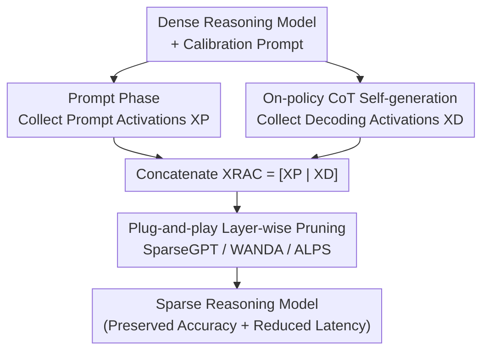

# Reasoning Models Can be Accurately Pruned Via Chain-of-Thought Reconstruction

**Conference**: ICLR 2026  
**OpenReview**: [https://openreview.net/forum?id=tyGfwG6xTh](https://openreview.net/forum?id=tyGfwG6xTh)  
**Code**: https://github.com/RyanLucas3/Reasoning-Aware-Compression  
**Area**: Model Compression  
**Keywords**: Model Pruning, Reasoning Models, Chain-of-Thought, Calibration Data, One-shot Pruning

## TL;DR
The authors observe that applying standard LLM pruning methods (e.g., SparseGPT) directly to long Chain-of-Thought (CoT) reasoning models like DeepSeek-R1 leads to significant performance degradation and even slower inference. The root cause is that these methods only use "input prompts" for calibration, whereas reasoning is a "decode-dominated" task. They propose RAC (Reasoning-Aware Compression), which enables the model to self-generate CoTs during calibration and incorporates these on-policy activations into the reconstruction objective. As a plug-and-play patch, RAC allows SparseGPT to maintain approximately 95% of dense model accuracy at 50% sparsity.

## Background & Motivation
**Background**: Reasoning models such as DeepSeek-R1 and Qwen3 improve accuracy in mathematical, coding, and logical tasks by generating long Chain-of-Thought (CoT) sequences. However, the cost is the production of a massive number of tokens per query, leading to high deployment costs. To reduce expenses, a natural approach is to use one-shot pruning (compressing without retraining)—especially since the full training/distillation pipelines of these open-source models are often private, making retraining infeasible and expensive. One-shot pruning can be completed on a single H100.

**Limitations of Prior Work**: Empirical tests show that applying SparseGPT with standard C4 calibration to DeepSeek-R1-Distill-Qwen-7B results in a continuous drop in MATH-500 accuracy as sparsity increases from 30% to 70%, while total evaluation time surges. The reason is counter-intuitive: the pruned model does not answer faster but becomes "more wordy," generating longer, more divergent CoTs with more errors. Compression was intended to "preserve accuracy and reduce latency," but it fails at both.

**Key Challenge**: Standard layer-wise pruning aims to minimize the reconstruction error of weights relative to **calibration activations**: $\min_{\widehat{W}_\ell}\lVert W_\ell X_\ell - \widehat{W}_\ell X_\ell\rVert_2^2$, where the calibration matrix $X_\ell$ is usually generated only from input prompt tokens. This assumes a typical LLM workload of "long context, short response" ($|x|\gg|y|$), where activations primarily stem from prompts. Reasoning models are the opposite: the CoT plus the answer is much longer than the prompt ($|c|+|y|\gg|x|$), meaning the decoding phase is the primary battlefield for the token budget. Calibrating only on prompts optimizes for an activation distribution that is **misaligned** with the actual distribution encountered during reasoning.

**Goal**: Align the pruning objective with the actual activation distribution encountered during decoding without retraining, thereby mitigating accuracy loss and runtime overhead at high sparsity.

**Key Insight**: Since the issue is "calibration distribution $\neq$ decoding distribution," the solution is not to modify the pruning algorithm itself but to modify the calibration data by including activations generated by the model's own CoT.

**Core Idea**: During pruning calibration, allow the model to self-generate CoTs on-policy. Concatenate these decoding activations with prompt activations to serve as calibration data, while reusing existing pruning algorithms (SparseGPT/WANDA/ALPS) unchanged.

## Method

### Overall Architecture
The core insight of RAC is that the activations used to measure reconstruction error during pruning should align with the activations actually calculated during model inference. While prompt activations represent the distribution for standard LLMs due to "long input, short output," reasoning models generate thousands of CoT tokens, making those activations dominant. RAC splits the pruning workflow into two phases: first, collecting a hybrid activation of "prompts + self-generated CoTs," and then feeding this calibration matrix into existing layer-wise pruning algorithms.

Specifically, given a set of calibration problems (math/code prompts), the **Prompt Phase** is performed for each problem: the prompt is forward-passed normally, and prompt token activations $X^P_\ell$ are collected layer by layer. This is followed by the **Decode Phase**: the dense model autoregressively generates an on-policy CoT (up to $T_{\max}=8192$ tokens). For each generated token, its activation is appended to the decoding activation matrix $X^D_\ell$. The two are concatenated to form $X^{\mathrm{RAC}}_\ell=[\,X^P_\ell \;\; X^D_\ell\,]$. Finally, the pruning algorithm (e.g., SparseGPT) is called layer by layer to perform reconstruction using these activations. This process only requires forward passes and can run on a single GPU.

### Key Designs

**1. Diagnosing Performance Drop as Distribution Misalignment: Reasoning is a Decode-Dominated Task**

This is the foundation of the paper. Standard layer-wise pruning stacks calibration activations into a matrix $X_\ell=[x^{(\ell-1)}_0,\dots,x^{(\ell-1)}_{N-1}]$, where each column represents a hidden state of a **prompt token**. This assumes $|x|\gg|y|$, optimizing for the "prompt distribution." However, the full sequence generated by a reasoning model is $z=(x_{0:T_{in}-1},\,c_{T_{in}:T},\,y_{T+1:T+L})$. Partitioning indices into prompt set $P$ and decoding set $D$, reasoning tasks satisfy $|D|\gg|P|$. Each decoding token's activation depends on both the input and the **previously generated tokens**, which are absent in prompt-only calibration. Thus, the pruning objective mismatches the actual inference distribution, leading to CoT degradation and repetition at high sparsity. Identifying the cause as "calibration data covering the wrong distribution" rather than "weak pruning algorithms" is the prerequisite for all subsequent designs.

**2. On-policy CoT Self-generation Calibration: Filling Decoding Activations with Model-Specific CoTs**

RAC incorporates on-policy CoT generation by the dense model during the calibration phase. For each prompt, at each decoding step $t \in D_m$, the model calculates the next token distribution $\pi_\theta(\cdot\mid z^{(m)}_{0:t})=\mathrm{softmax}(W_{out}x^{(L,m)}_t)$ and samples $z^{(m)}_{t+1}$. This is fed back as the next input to obtain the new hidden state $x^{(\ell,m)}_{t+1}=f_\ell(\{x^{(\ell-1,m)}_\tau\}_{\tau\le t+1})$, and $x^{(\ell-1,m)}_{t+1}$ is appended to $X^D_\ell$. The "on-policy" nature is crucial—it uses the model's own generation trajectory rather than external text, accurately simulating the distribution shift during inference. This distinguishes RAC from self-calibration (unconditional generation from a BOS token) and PPC-GPT (using synthetic CoTs for distillation while still calculating pruning scores on C4).

**3. Seamless Integration into Layer-wise Pruning: Changing Data, Not Algorithms**

RAC does not invent a new pruning algorithm; it feeds hybrid activations into existing layer-wise reconstruction objectives. By concatenating prompt and decoding activations into $X^{\mathrm{RAC}}_\ell=[X^P_\ell \;\; X^D_\ell]\in\mathbb{R}^{d_\ell\times(N_P+N_D)}$, the layer-wise calibration loss becomes:

$$\lVert(W_\ell-\widehat{W}_\ell)X^{\mathrm{RAC}}_\ell\rVert_F^2=\sum_{m=1}^{M}\sum_{t\in P_m\cup D_m}\lVert(W_\ell-\widehat{W}_\ell)x^{(\ell-1,m)}_t\rVert_2^2.$$

The only change from "prompt-only" calibration is the inclusion of $t\in D_m$ in the summation. Because the objective form is unchanged, the PRUNE step can utilize SparseGPT, WANDA, ALPS, or any layer-wise pruner (where `PRUNE(W_ℓ, X^RAC_ℓ, S)` acts as a black box). This ensures compatibility with unstructured, structured, or N:M semi-structured sparsity.

### Loss & Training
RAC requires no additional training or backpropagation; it is entirely forward-pass based. Phase I performs the prompt phase (collecting $X^P_\ell$) and the decode phase (on-policy generation, collecting $X^D_\ell$) for each task. Phase II uses the hybrid $X^{\mathrm{RAC}}_\ell$ to run pruners like SparseGPT to obtain sparse weights $\widehat{W}_\ell$. Experiments involve two families of open-source reasoning models (DeepSeek-R1 distilled Qwen 1.5B/7B/14B/32B and Llama 8B/70B, plus Qwen3 1.7B/8B/14B). SparseGPT is used for one-shot pruning at 20%-50% unstructured sparsity, typically with 1M calibration tokens and a CoT limit of $T_{\max}=8192$. Evaluations use a 32k output budget in a zero-shot setting.

## Key Experimental Results

### Main Results
Three calibration methods are compared: C4 (general web text), Prompt-Only (problem text without answers/CoT), and RAC (problem text + on-policy CoT). Metrics include acc@1:1 on MATH-500 and pass@1:16 on LiveCodeBench.

| Model / Sparsity | Metric | C4 | Prompt-Only | RAC | Dense |
|--------------|------|-----|------------|-----|------|
| DeepSeek-R1-1.5B @50% | MATH-500 acc | 0.356 | 0.496 | **0.664** | 0.832 |
| DeepSeek-R1-7B @50% | MATH-500 acc | 0.744 | 0.812 | **0.900** | 0.936 |
| DeepSeek-R1-7B @50% | Eval Time (min) | 135.0 | 115.6 | **35.3** | 23.3 |
| Qwen3-8B @50% | MATH-500 acc | 0.564 | 0.470 | **0.862** | 0.962 |
| Qwen3-8B @50% | Eval Time (min) | 258.8 | 274.5 | **17.1** | 41.3 |
| Qwen3-1.7B @40% | AIME-25 acc | 0.000 | 0.133 | **0.267** | 0.333 |
| DeepSeek-R1-7B @50% | LiveCodeBench pass@1:16 | 0.099 | 0.228 | **0.283** | — |

RAC consistently outperforms C4 and generally beats Prompt-Only at high sparsity. It effectively suppresses the "runtime explosion" (where accuracy collapse leads to divergent CoTs and ballooning evaluation time). At 50% sparsity, RAC for the 7B model maintains 0.900 accuracy while slashing evaluation time from 135 min to 35.3 min.

### Ablation Study

| Configuration | Key Findings |
|------|---------|
| Hard Tasks (AIME-25 @40-50%) | C4 often collapses to 0.000 accuracy, Prompt-Only partially mitigates it, while RAC preserves most dense accuracy. |
| Per-token Reconstruction Error Heatmap | Error in the prompt segment is slightly lower for Prompt-Only, but RAC significantly reduces error in the decoding segment. |
| Sparsity Gradient (20%→50%) | Gains are marginal at 20-30% sparsity; RAC's advantages scale with higher compression ratios. |
| Model Scale | Larger models (14B/70B) are more robust to pruning, but RAC still provides significant gains in accuracy and runtime. |

### Key Findings
- The per-token reconstruction error heatmap provides strong mechanistic evidence: RAC's gains are concentrated precisely in the long-CoT decoding region.
- RAC reverses the "pruning leads to slowness" paradox by fixing CoT divergence.
- Benefits scale with sparsity and decrease with model size, indicating that RAC specifically addresses distribution misalignment under aggressive compression.

## Highlights & Insights
- **Linking Diagnosis to Solution**: The paper uses the "more pruning, more wordiness" anomaly to identify the pathology and uses per-token error heatmaps to prove the solution acts directly on that pathology.
- **Minimalist and Plug-and-Play**: RAC requires no model modification, no training, and no extra hyperparameters. Replacing prompt data with "prompt + on-policy CoT" allows it to be integrated into existing pipelines at zero cost.
- **Critical Role of On-Policy**: Using the pruned model's own trajectory rather than external text ensures precise alignment with the inference distribution, which is why it outperforms self-calibration or PPC-GPT.
- **Teachable Principle**: The principle "calibration data must match actual inference distribution" can be extended to quantization and other post-training compression scenarios.

## Limitations & Future Work
- The calibration phase incurs the overhead of running dense model on-policy generation (up to 8192 tokens/problem), though it remains a one-shot, single-GPU process.
- Benefits are concentrated at high sparsity (40-50%); for mild pruning, Prompt-Only remains competitive.
- The focus is on unstructured sparsity with SparseGPT; structured/N:M and quantization (FP8) results are primarily in the appendix.
- On-policy quality is limited by the dense model: if the dense model's CoT is unstable in a domain, the calibration may inherit those biases.

## Related Work & Insights
- **vs. Zhang et al. 2025b**: They benchmarked reasoning model compression and observed the accuracy collapse but stopped at the phenomenon. RAC provides a solution by modifying the calibration distribution.
- **vs. PPC-GPT**: PPC-GPT distills after pruning; RAC injects CoT activations directly into the pruning stage, bypassing separate distillation.
- **vs. Self-calibration (Williams et al. 2025)**: Self-calibration uses unconditional generation from a BOS token; RAC uses task-specific, on-policy CoT generation conditioned on prompts.
- **vs. SparseGPT / WANDA / ALPS**: RAC acts as an orthogonal enhancement by providing a better calibration distribution to these underlying pruners.

## Rating
- Novelty: ⭐⭐⭐⭐ Simple solution, but the "decode-dominated" perspective is precise and systematically validated.
- Experimental Thoroughness: ⭐⭐⭐⭐ Covers various architectures, scales, and benchmarks with mechanistic evidence.
- Writing Quality: ⭐⭐⭐⭐⭐ Clear phenomenon-mechanism-verification loop.
- Value: ⭐⭐⭐⭐⭐ Drop-in fix for immediate practical application in reasoning model compression.

<!-- RELATED:START -->

## Related Papers

- [\[ACL 2026\] LightReasoner: Can Small Language Models Teach Large Language Models Reasoning?](../../ACL2026/model_compression/lightreasoner_can_small_language_models_teach_large_language_models_reasoning.md)
- [\[ICLR 2026\] BeyondBench: Contamination-Resistant Evaluation of Reasoning in Language Models](beyondbench_contamination-resistant_evaluation_of_reasoning_in_language_models.md)
- [\[ICLR 2026\] TP-Spikformer: Token Pruned Spiking Transformer](tp-spikformer_token_pruned_spiking_transformer.md)
- [\[ICLR 2026\] Landscape of Thoughts: Visualizing the Reasoning Process of Large Language Models](landscape_of_thoughts_visualizing_the_reasoning_process_of_large_language_models.md)
- [\[NeurIPS 2025\] A*-Thought: Efficient Reasoning via Bidirectional Compression for Low-Resource Settings](../../NeurIPS2025/model_compression/a-thought_efficient_reasoning_via_bidirectional_compression_for_low-resource_set.md)

<!-- RELATED:END -->
