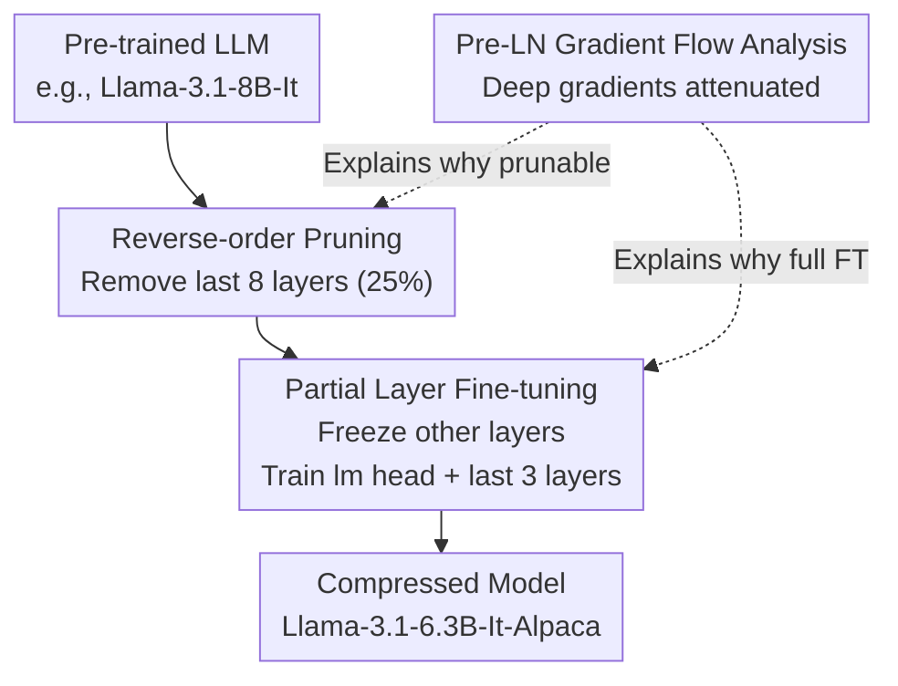

# Reassessing Layer Pruning in LLMs: New Insights and Methods

**Conference**: ICLR 2026  
**OpenReview**: [https://openreview.net/forum?id=04Tfwy3LLC](https://openreview.net/forum?id=04Tfwy3LLC)  
**Code**: https://github.com/yaolu-zjut/Navigation_LLM_layer_pruning  
**Area**: Model Compression  
**Keywords**: Layer Pruning, LLM Compression, Reverse-order Pruning, Partial Layer Fine-tuning, Pre-LN Gradient Flow

## TL;DR
This paper invests thousands of GPU hours to systematically reassess "layer selection metrics" and "post-pruning fine-tuning methods" for LLM layer pruning. It reaches two counter-intuitive conclusions: the simplest "reverse-order pruning of the last few layers" outperforms various complex metrics, and "partial layer fine-tuning of only the lm head + last 3 layers" exceeds the standard LoRA. The authors provide a theoretical explanation using Pre-LN gradient flow, ultimately outperforming existing SOTA pruning methods by 2.36%–19.45% on Llama-3.1-8B, Llama-3-8B, and Llama-3-70B.

## Background & Motivation

**Background**: High inference costs of LLMs make deployment in resource-constrained scenarios difficult, leading to various compression techniques: parameter pruning, quantization, knowledge distillation, and low-rank decomposition. Among these, **layer pruning** attracts significant attention as it reduces model depth, simultaneously lowering computational requirements and VRAM usage. Since models like Llama have identical input/output dimensions for each transformer block, the structure remains coherent after removing entire layers, making implementation straightforward.

**Limitations of Prior Work**: Although layer pruning is inherently simple, community research has become increasingly "complex." One group focuses on **layer selection metrics**—ranging from Magnitude, Taylor, and PPL to ShortGPT's Block Influence (BI) and MKA's manifold information bottleneck, with metrics becoming increasingly sophisticated. Another group defaults to **post-pruning fine-tuning using the LoRA family** to recover performance. However, few have questioned whether these sophisticated metrics are actually better than "randomly cutting the last few layers," or if LoRA is truly the optimal solution for post-pruning recovery.

**Key Challenge**: Layer pruning has two orthogonal design degrees of freedom: **which layers to prune** (layer selection) and **how to recover performance** (fine-tuning). The community is increasing complexity in both dimensions but lacks a fair, large-scale, controlled horizontal evaluation to verify if this complexity yields actual gains.

**Goal**: The authors step back to answer two core questions:
- Q1 (Layer Selection): Is a complex metric truly necessary to identify redundant layers?
- Q2 (Fine-tuning): Is the LoRA family the best choice for post-pruning fine-tuning?

**Key Insight**: Leveraging benchmarks for verification. The authors conduct controlled experiments across 7 layer selection metrics, 3 open-source LLMs, 6 fine-tuning methods, and 8 common-sense reasoning datasets, spanning thousands of GPU hours. They then provide a principled explanation for the empirical findings using gradient flow theory.

**Core Idea**: The best practice for layer pruning is surprisingly simple: **prune the last few layers in reverse order + fine-tune only the lm head and the remaining last three layers**. This is simple, fast, and stronger than existing SOTAs. The mechanism is explained by Pre-LN Transformer gradient flow: gradients in deeper layers are continuously attenuated, making them both "unimportant" (prunable) and "difficult to recover via LoRA" (requiring full fine-tuning).

## Method

### Overall Architecture

The "method" in this paper is not a new module but a **best-practice pipeline** supported by both experiments and theory: take a pre-trained LLM, first use a **reverse-order metric** to remove the last 8 layers (25% pruning rate), then use **partial layer fine-tuning** (freeze all other layers, train only the lm head + last three layers) on Alpaca-cleaned to recover performance. These choices are explained by a **gradient flow analysis framework**: the Pre-LN architecture causes deep-layer gradients to be repeatedly scaled down, making deep layers contribute less (prunable), while the remaining final layer experiences the most severe distribution shift and must be fully adjusted (favoring full fine-tuning over distributed LoRA).

### Key Designs

**1. Reverse-order Pruning: Simple metrics outperform complex ones**

Addressing Q1, the authors evaluated 7 metrics: Random, Reverse-order, Magnitude-$l_1$, Magnitude-$l_2$, Taylor, PPL, and BI. BI (proposed by ShortGPT) measures "influence" using cosine similarity of inputs: $\mathrm{BI}_i = 1 - \mathbb{E}_{x,t}\frac{x_{i,t}^\top x_{i+1,t}}{\lVert x_{i,t}\rVert\, \lVert x_{i+1,t}\rVert}$, where low BI layers are redundant. Taylor estimates the impact of layer removal on loss using a first-order approximation: $I^n_{\text{Taylor}} = \sum_k \lvert \frac{\partial L(D)}{\partial W^n_k} W^n_k\rvert$. Reverse-order is extremely simple: it assumes layer importance is inversely proportional to depth, assigning lower scores to deeper layers for priority removal without needing any forward/backward passes.

The results are surprising: at a 25% pruning rate, Reverse-order consistently leads on Vicuna-7B, Qwen1.5-7B, and Llama-3.1-8B-It, averaging 6.04% higher than the runner-up PPL. The conclusion holds at 50% pruning. Complex metrics like BI and Magnitude often fail (e.g., Magnitude's accuracy drops to ~0.30, near random). **Insight #1**: Reverse-order is a simple, robust metric that stays stable across models and pruning rates.

**2. Partial Layer Fine-tuning: Full fine-tuning of last layers beats LoRA**

Addressing Q2, the authors compared three recovery categories: LoRA ($W_0 x + BAx$), QLoRA (LoRA + quantization), and **partial layer fine-tuning** (freeze most layers, fully train a few layers near the output). Partial fine-tuning includes: lm head only, and lm head + last 1/2/3 layers. All were tested on models with 8 layers removed via Reverse-order.

The results are counter-intuitive (**Insight #2**): QLoRA is slightly worse than LoRA, while partial layer fine-tuning significantly outperforms LoRA, with "lm head + last three layers" being the best. For Llama-3.1-8B-It, LoRA achieved 0.5268 accuracy, while lm head + last 3 layers reached 0.5807, over 5 percentage points higher. In terms of cost, although partial fine-tuning has more trainable parameters (1.18B vs 15.73M for LoRA), the VRAM usage is comparable, and training time is shorter (7931s vs 10440s for LoRA). QLoRA is the slowest and least effective.

**3. Pre-LN Gradient Flow Analysis: Why these practices work**

The authors provide a principled explanation based on gradient propagation in Pre-LN (Pre-Layer Normalization) architectures. The update is $x_{l+1} = x_l + F(\mathrm{LN}(x_l); \theta_l)$, so $\frac{\partial x_{l+1}}{\partial x_l} = I + A^{\text{Pre-LN}}_l \cdot B^{\text{Pre-LN}}_l$, where $B$ is the Jacobian of the normalization layer. The authors prove that the Jacobian spectral norms for LayerNorm and RMSNorm are $\lVert B_{\text{RMS}}(x)\rVert_2 = \frac{1}{\lVert x\rVert_{\text{RMS}} + \epsilon}$ and $\lVert B_{\text{LN}}(x)\rVert_2 = \frac{1}{\sqrt{\sigma^2 + \epsilon}}$, respectively. Under late-training conditions where $\sigma^2 > 1$, it follows that $\lVert B_{\text{RMS}}(x)\rVert_2 \le \lVert B_{\text{LN}}(x)\rVert_2 < 1$.

Substituting this into the chain rule $\frac{\partial L}{\partial \theta_l} = \frac{\partial L}{\partial x_L}\left(\prod_{k=l+1}^{L-1}(I + A^{\text{Pre-LN}}_k B^{\text{Pre-LN}}_k)\right)\frac{\partial x_{l+1}}{\partial \theta_l}$: while the residual $I$ prevents vanishing gradients in shallow layers, the fact that $\lVert B^{\text{Pre-LN}}_k\rVert < 1$ means that as $l$ approaches $L$, the product term nears the identity matrix, and deep layer gradient contributions decrease. This explains **why deep layers are redundant**. Similarly, after pruning, the final remaining layer bears the brunt of the distribution shift; **fully fine-tuning these last layers** precisely adjusts the output distribution alignment more effectively than the distributed, lower-impact LoRA.

### Loss & Training
Fine-tuning uses the Alpaca-cleaned dataset. AdamW is used for LoRA and partial fine-tuning, while paged adamw 8bit is used for QLoRA. LoRA rank $d=8$, batch size 64, learning rate $1\times10^{-5}$, with 100 warmup steps. Released models Llama-3.1-6.3B-It-Alpaca / Llama-3-6.3B-Alpaca are pruned via Reverse-order (8 layers) + lm head + last three layers fine-tuning.

## Key Experimental Results

Experiments cover 7 metrics × 3 LLMs × 6 fine-tuning methods × 8 common-sense datasets (PIQA, HellaSwag, OpenbookQA, ARC-e, ARC-c, MMLU, CMMLU, WinoGrande) using lm-evaluation-harness for zero-shot evaluation.

### Main Results: Comparison with SOTA Pruning Methods (25% Pruning Rate)

| Model | Method | Avg Acc↑ | Gain vs Ours |
|------|------|----------|----------|
| Llama-3.1-8B-It | Original (Unpruned) | 0.6295 | Upper Bound |
| Llama-3.1-8B-It | ShortGPT (BI) | 0.4080 | -17.27% |
| Llama-3.1-8B-It | GRASP (Prev. SOTA) | 0.5245 | -5.62% |
| Llama-3.1-8B-It | **Ours (6.3B-It-Alpaca)** | **0.5807** | — |
| Llama-3-8B | ShortGPT (BI) | 0.3688 | -19.45% |
| Llama-3-8B | FINERCUT (Prev. SOTA) | 0.5397 | -2.36% |
| Llama-3-8B | **Ours (6.3B-Alpaca)** | **0.5633** | — |

Ours outperforms all baselines on both models: on Llama-3.1-8B-It, it is 5.62% higher than GRASP and 17.27% higher than ShortGPT. Conclusions hold at the 70B scale, verifying scalability.

### Ablation Study: Fine-tuning Methods (Llama-3.1-8B-It, 8-layer Reverse Pruning)

| Fine-tuning Method | Avg Acc↑ | Trainable Params | Training Time (2 epochs) | Note |
|----------|----------|-----------|-------------------|------|
| LoRA | 0.5268 | 15.73M | 10440s | Community Standard |
| QLoRA | 0.5171 | 15.73M | 17249s | Efficient VRAM but slowest/worst |
| Partial: lm head only | 0.5599 | 525M | 6953s | Better than LoRA |
| Partial: + Last 1 layer | 0.5732 | 743M | 7297s | — |
| Partial: + Last 2 layers | 0.5766 | 962M | 7617s | — |
| **Partial: + Last 3 layers** | **0.5807** | 1180M | 7931s | Optimal |

### Key Findings
- **Complex layer selection metrics are often inferior to Reverse-order**: BI, Magnitude, and Taylor performed near random (~0.30) on several models, while Reverse-order was stable, averaging 6.04% higher than PPL.
- **Partial layer fine-tuning is superior to LoRA**: Even tuning just the lm head outperforms LoRA and is faster. Performance increases monotonically from 0 to 3 layers. Despite having ~100x more trainable parameters, it is faster and uses similar VRAM since it avoids injecting low-rank paths into every layer.
- **QLoRA has the lowest cost-performance ratio**: It saves VRAM at the cost of the longest training time and worst accuracy; not recommended for pruning.
- **Valid without fine-tuning**: Even without fine-tuning, Reverse-order pruning outperforms inference-only methods like SLEB.

## Highlights & Insights
- **"Benchmarking" vs. "Adding Metrics"**: The primary contribution is identifying that complexity does not yield returns in layer selection and fine-tuning dimensions through thousands of GPU hours.
- **Empirical + Theoretical Loop**: Observations are paired with principled explanations using Pre-LN gradient flow spectral norm analysis. The finding that $\lVert B^{\text{Pre-LN}}\rVert < 1$ unifies why deep layers are prunable and why last layers need full fine-tuning.
- **Directly Applicable Engineering Defaults**: For any Pre-LN LLM, pruning via Reverse-order and tuning the lm head + last three layers provides a fast, strong, and ready-to-use default configuration.

## Limitations & Future Work
- **Architectural Dependency**: The theory is tied to Pre-LN + LayerNorm/RMSNorm; its validity on Post-LN or other structures is not verified.
- **Theoretical Assumptions**: Gradient norm analysis relies on $x$ being approximately normal and $\sigma^2 > 1$ in late training phases.
- **Task Scope**: Evaluation is restricted to 8 zero-shot common-sense tasks; impact on generation quality and long-context capabilities requires further discussion.
- **Parameter Count in Partial Fine-tuning**: While VRAM and time are efficient, 1.18B trainable parameters might be less flexible than low-rank methods in extreme compute-constrained scenarios.

## Related Work & Insights
- **vs ShortGPT (BI)**: ShortGPT uses BI to select redundant layers; this paper shows BI can fail (0.4080 on Llama-3.1-8B-It), while Reverse-order is 17.27% higher.
- **vs Shortened LLaMA (PPL/Taylor)**: Uses Magnitude/Taylor/PPL + LoRA; this paper proves PPL is suboptimal and LoRA is not the best tuning method for pruning.
- **vs LoRA Paradigm**: While LoRA is a standard for parameter efficiency, this paper shows that for layer pruning, concentrated full fine-tuning of the end layers is better for realigning the output distribution.
- **vs FINERCUT / GRASP**: These methods use sophisticated designs; this simpler combination of Reverse-order + Partial Fine-tuning outperforms them by 2.36%–5.62%.

## Rating
- Novelty: ⭐⭐⭐⭐ Provides counter-intuitive, validated insights with theoretical backing.
- Experimental Thoroughness: ⭐⭐⭐⭐⭐ 7 metrics × 3 models × 6 tuning × 8 datasets, including 70B scale.
- Writing Quality: ⭐⭐⭐⭐ Problem-driven with a clear empirical-theoretical loop.
- Value: ⭐⭐⭐⭐⭐ High practical value for deployment by providing SOTA defaults.

<!-- RELATED:START -->

## Related Papers

- [\[ICLR 2026\] GradPruner: Gradient-guided Layer Pruning Enabling Efficient Fine-Tuning and Inference for LLMs](gradpruner_gradient-guided_layer_pruning_enabling_efficient_fine-tuning_and_infe.md)
- [\[ICLR 2026\] Dr.LLM: Dynamic Layer Routing in LLMs](drllm_dynamic_layer_routing_in_llms.md)
- [\[ICLR 2026\] Token Distillation: Attention-Aware Input Embeddings for New Tokens](token_distillation_attention-aware_input_embeddings_for_new_tokens.md)
- [\[ACL 2026\] Adaptive Layer Selection for Layer-Wise Token Pruning in LLM Inference](../../ACL2026/model_compression/adaptive_layer_selection_for_layer-wise_token_pruning_in_llm_inference.md)
- [\[ICLR 2026\] LSA: Layer-wise Sparsity Allocation for Large Language Model Pruning Based on Minimal Linear Reconstruction Error](lsa_layer-wise_sparsity_allocation_for_large_language_model_pruning_based_on_min.md)

<!-- RELATED:END -->
