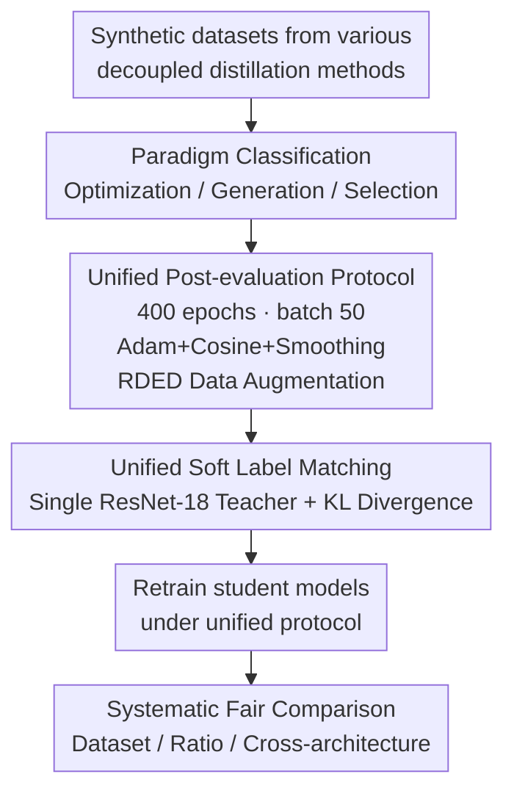

# Rectified Decoupled Dataset Distillation: A Closer Look for Fair and Comprehensive Evaluation

**Conference**: ICLR 2026  
**arXiv**: [2509.19743](https://arxiv.org/abs/2509.19743)  
**Code**: [GitHub](https://github.com/ndhg1213/RD3)  
**Area**: Model Compression/Dataset Distillation  
**Keywords**: Dataset Distillation, Decoupled Distillation, Fair Evaluation, Post-evaluation Protocol, Synthetic Data  

## TL;DR

Ours proposes RD3 (Rectified Decoupled Dataset Distillation), systematically revealing that performance gaps in existing decoupled dataset distillation methods stem primarily from inconsistent post-evaluation settings rather than distillation quality. It establishes a unified fair evaluation framework, correcting the reported 27.3% performance gap to 6.7%.

## Background & Motivation

Dataset distillation aims to generate compact synthetic datasets that allow models trained on them to achieve performance close to those trained on full datasets. Recently, decoupled distillation methods (e.g., SRe2L) have significantly expanded to large-scale datasets like ImageNet-1K by separating teacher pre-training from synthetic data generation.

**Core Problem**: Existing decoupled distillation methods suffer from severe evaluation inconsistencies:
- CDA uses a smaller batch size, while RDED employs smooth learning rates and stronger data augmentation.
- G-VBSM and EDC utilize multi-teacher ensemble soft labels.
- Most of the reported 27.3% performance gap is attributed to evaluation differences rather than distillation quality.

The authors conduct the first systematic investigation into this, revealing the "spurious performance gain" issue.

## Method

### Overall Architecture

RD3 is not a new distillation algorithm but a set of evaluation protocols designed to place all decoupled distillation methods on a level playing field. The core issue addressed is the incomparability of reported ImageNet-1K accuracies due to varying internal post-evaluation recipes. The RD3 workflow consists of three steps: categorizing methods into three paradigms based on data generation, retraining and evaluating all synthetic datasets using a strictly locked post-evaluation configuration (epochs, batch size, learning rate, augmentation), and unifying the soft label source to a single teacher. This decouples "distillation quality" from "evaluation setting variance" to reveal the true learnability of synthetic data.

### Key Designs

**1. Paradigm Classification: Clarifying the Basis of Comparison**

Decoupled methods vary fundamentally in generation mechanisms despite all reporting ImageNet-1K accuracy. RD3 categorizes them into three paradigms: optimization-based (e.g., SRe2L, CDA, G-VBSM, DWA, EDC), which performs pixel-level optimization using pre-trained classifiers; generation-based (e.g., Minimax, D4M), which fine-tunes generative models or optimizes vision-language embeddings; and selection-based (e.g., RDED), which crops category-relevant regions from real images. This classification explains why the unified configuration yields varying improvements—optimization-based methods are highly sensitive to initialization and soft labels.

**2. Unified Post-evaluation Settings: Isolating "Benchmark Tricks" from Quality**

This is the core of RD3 and the source of most of the 27.3% gap. The authors found that methods used disparate recipes: CDA used smaller batches, RDED used smooth learning rates with heavy augmentation, and others used multi-teacher labels. RD3 locks these parameters: 400 epochs (eliminating convergence bias), batch size 50 (which alone provides a ~10% gain over SRe2L's 1024 or CDA's 128 as small batches provide finer gradients on limited data), Adam optimizer with 0.001 initial LR and cosine annealing, and a smoothing factor $\zeta=1$ (ResNet-18) or $\zeta=2$ (others). Augmentation is standardized to RDED's CutMix + RRC + Flip.

**3. Unified Soft Label Matching: Removing Gains from Multi-teacher Supervision**

Soft labels are standard for large-scale distillation, but the teacher's identity significantly impacts results. Multi-teacher ensembles inject extra supervision, acting as a "score-boosting channel." RD3 mandates all methods use a single pre-trained ResNet-18 with KL divergence for epoch-wise soft labels. The update at step $t$ is standardized as:

$$\theta_{\mathcal{S}}^{t+1} = \arg\min_{\theta \in \Theta} L_{KL}\big(f_{\theta_\mathcal{T}}(\mathcal{A}(\mathcal{S})),\, f_{\theta_\mathcal{S}^t}(\mathcal{A}(\mathcal{S}))\big),$$

where $\mathcal{A}$ is the unified augmentation, $f_{\theta_\mathcal{T}}$ is the fixed teacher, and $\mathcal{S}$ is the synthetic set. This removes artificial gaps created by teacher selection.

## Key Experimental Results

### Main Results: Comparison on ImageNet-1K before and after rectification (IPC=10, ResNet-18)

| Method | Before | After | Change |
|------|--------|--------|------|
| SRe2L | 21.3 | 40.2 | +18.9↑ |
| CDA | 33.5 | 41.2 | +7.7↑ |
| G-VBSM | 31.4 | 41.5 | +10.1↑ |
| DWA | 37.9 | 42.5 | +4.6↑ |
| EDC | 48.6 | 46.9 | -1.5↓ |
| Minimax | 44.3 | 45.9 | +1.6↑ |
| D4M | 27.9 | 45.4 | +17.5↑ |
| RDED | 42.0 | 46.3 | +4.3↑ |

**Key Findings**: After rectification, the performance gap between methods shrinks from 27.3% to 6.7%, proving that most reported gains stem from evaluation settings rather than distillation quality.

### Main Results: Cross-dataset Comparison (Rectified, IPC=50)

| Dataset | SRe2L | CDA | DWA | EDC | Minimax | D4M | RDED |
|--------|-------|-----|-----|-----|---------|-----|------|
| CIFAR-10 | 53.9 | 54.5 | 59.9 | **64.8** | — | 61.9 | 63.3 |
| CIFAR-100 | 54.4 | 56.2 | 62.1 | **65.2** | — | 64.3 | 64.1 |
| TinyImageNet | 52.5 | 53.0 | 54.2 | 57.1 | 54.4 | 53.8 | **58.7** |
| ImageNet-1K | 55.2 | 56.7 | 57.7 | **60.1** | 60.4 | 60.2 | 58.9 |

Under the unified protocol, EDC (Optimization-based) generally performs best, but the performance variance across all methods is significantly reduced.

## Highlights & Insights

1.  **Identifies Critical Domain Issue**: Systematically proves that "evaluation inconsistency" is the primary confounding factor in decoupled distillation.
2.  **Practical Calibration Contribution**: Unified batch size (50), smooth LR, and RDED augmentation can eliminate the majority of performance variance.
3.  **Methodological Significance**: Provides a fair, reproducible benchmark for future research to prevent "benchmark hacking" via evaluation tuning.
4.  **Discovery of Simple Tricks**: Finds that initializing optimization-based methods with real data significantly boosts performance.

## Limitations & Future Work

- Focuses primarily on the post-evaluation phase without deeply analyzing the inherent quality differences of the synthetic data itself.
- Unified settings might mask specific advantages of certain methods in niche scenarios.
- Lacks systematic comparison regarding other dimensions like computation time.
- Generation-based methods (Minimax) are not applicable to small datasets like CIFAR-10/100.

## Related Work & Insights

- **Bi-level Distillation**: DC, DM, MTT — Effective on small scales but not scalable.
- **Decoupled Distillation**: SRe2L as the pioneer, with CDA, EDC, etc., as subsequent optimizations.
- **Soft Label Matching**: Epoch-wise soft labels have become the standard for large-scale distillation.
- **Dataset Distillation Surveys**: Focus on methodological progress but lack unified evaluation.

## Rating

| Dimension | Score | Description |
|------|------|------|
| Novelty | ⭐⭐⭐⭐ | Reveals a crucial and overlooked issue of evaluation consistency. |
| Value | ⭐⭐⭐⭐⭐ | Provides fair evaluation standards for the community, directly promoting standardization. |
| Experimental Thoroughness | ⭐⭐⭐⭐⭐ | Covers 6 datasets, 8 methods, and IPC 1-100 comprehensively. |
| Writing Quality | ⭐⭐⭐⭐ | Clear arguments with persuasive visualizations. |

<!-- RELATED:START -->

## Related Papers

- [\[AAAI 2026\] A Closer Look at Knowledge Distillation in Spiking Neural Network Training](../../AAAI2026/model_compression/a_closer_look_at_knowledge_distillation_in_spiking_neural_ne.md)
- [\[ICLR 2026\] Dataset Distillation as Pushforward Optimal Quantization](dataset_distillation_as_pushforward_optimal_quantization.md)
- [\[ICLR 2026\] Understanding Dataset Distillation via Spectral Filtering](understanding_dataset_distillation_via_spectral_filtering.md)
- [\[ICLR 2026\] Grounding and Enhancing Informativeness and Utility in Dataset Distillation](grounding_and_enhancing_informativeness_and_utility_in_dataset_distillation.md)
- [\[AAAI 2026\] TGDD: Trajectory Guided Dataset Distillation with Balanced Distribution](../../AAAI2026/model_compression/tgdd_trajectory_guided_dataset_distillation_with_balanced_distribution.md)

<!-- RELATED:END -->
