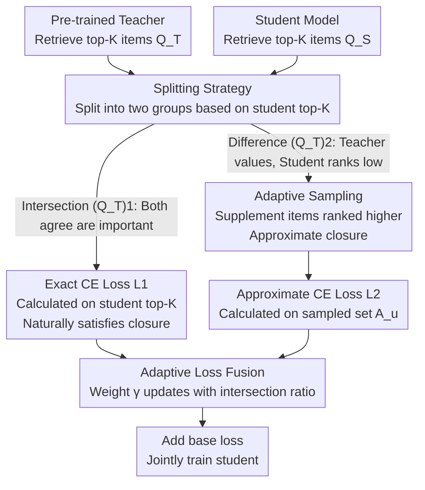

# Rejuvenating Cross-Entropy Loss in Knowledge Distillation for Recommender Systems

**Conference**: ICLR 2026  
**arXiv**: [2509.20989](https://arxiv.org/abs/2509.20989)  
**Code**: [GitHub](https://github.com/BDML-lab/RCE-KD)  
**Area**: Recommender Systems / Knowledge Distillation / Model Compression  
**Keywords**: knowledge distillation, cross-entropy, NDCG, recommender system, ranking, partial NDCG

## TL;DR
Theory proves that maximizing the NDCG lower bound via CE loss in RecSys KD requires the "Closure Assumption" (the subset must contain the student's top items). However, the actual goal is to distill the ranking of the teacher's top items—this conflict causes vanilla CE to perform poorly. Accordingly, RCE-KD is proposed: it splits the teacher's top-K items into two groups based on whether they are in the student's top-K, applying exact CE and sampled approximate closure CE respectively, with adaptive fusion weights that adjust dynamically during training.

## Background & Motivation
**Background**: Knowledge distillation (KD) is used in recommender systems to compress large teacher models into small student models. Response-based KD (CE loss, RRD, CD, etc.) is the mainstream approach. CE loss has been extremely successful in KD for CV/NLP.

**Limitations of Prior Work**:
   - CE loss performs **surprisingly poorly** in recommendation KD—across three settings (MF→MF, LightGCN→LightGCN, HSTU→HSTU), vanilla CE is consistently inferior to all baselines (CD, RRD, HetComp, etc.).
   - Recommendation KD has two unique characteristics: (1) it focuses on ranking rather than exact scores, specifically the ranking of the teacher's top items, and (2) due to the massive item set (millions), CE can only be calculated on small subsets.
   - Existing theoretical connections between CE and NDCG only apply to binary labels and full-item scenarios, failing to cover the actual settings of recommendation KD.

**Key Challenge**: CE constraining partial NDCG requires the "Closure Assumption"—the subset must include the student’s highest-ranked items. However, the goal of KD is to distill the ranking of the teacher's top items, yet the top items of the student and teacher barely overlap in the early stages of training.

**Core Idea**: Split the teacher's top-K items into two groups (intersection with student's top-K vs. difference set). Directly calculate CE for the first group on the student's top-K (exactly satisfying closure), and use an adaptive sampling strategy for the second group to approximately satisfy closure.

## Method

### Overall Architecture
The core confusion RCE-KD aims to resolve is why directly porting CE loss to recommendation KD leads to consistent underperformance against baselines. It first theoretically clarifies that CE only optimizes NDCG when the subset satisfies "closure," then constructs the entire workflow around "how to construct subsets that satisfy closure." Given a pre-trained teacher and a student to be trained, their respective top-K items are identified. The teacher's top-K $\mathcal{Q}_u^T$ is split into two groups based on whether they also fall into the student's top-K $\mathcal{Q}_u^S$: the intersection $(\mathcal{Q}_u^T)_1$ is naturally closed, allowing for the calculation of an exact CE loss $\mathcal{L}_1$ directly on the student's top-K; the difference set $(\mathcal{Q}_u^T)_2$ is not closed, so adaptive sampling is used to supplement "items ranked above it" to approximate closure, followed by calculating $\mathcal{L}_2$ on the sampled set. Finally, the two losses are fused using a weight that dynamically adjusts according to the student-teacher top-K overlap, trained alongside the base loss.

### Key Designs

**1. Theoretical Extension of CE→NDCG: Defining when CE equals NDCG optimization**

The entire method is built on two theorems that answer "what CE is actually optimizing." **Theorem 4.1 (Full-item KD)** proves that minimizing CE across all items is equivalent to maximizing a lower bound of NDCG, where relevance scores are derived from teacher scores $y_i = \log_2(\sigma(r_{ui}^T) + 1)$—providing the primary theoretical basis for using CE in recommendation KD. However, full-item calculation is impractical for million-scale sets. Therefore, **Theorem 4.4 (Partial-item KD)** further proves that minimizing CE on a subset $\mathcal{J}^u$ can constrain partial NDCG, but under one condition—the subset must satisfy the **Closure Assumption (Assumption 4.3)**: for every item in the subset, all items ranked higher by the student must also be in the subset. This assumption is the key to diagnosing the failure of vanilla CE: teacher top-K subsets generally do not satisfy closure, meaning direct CE calculation does not truly optimize NDCG.

**2. Splitting Strategy: Dividing teacher top-K based on student recognition to satisfy closure**

Since the problem lies in closure, the method focuses on "how to construct subsets that satisfy closure." Calculating CE directly on the teacher's top-K $\mathcal{Q}_u^T$ does not satisfy closure, while including all items ranked higher by the student would cause the subset to explode. RCE-KD's solution is to split based on whether items fall into the student's top-K $\mathcal{Q}_u^S$: $(\mathcal{Q}_u^T)_1 = \mathcal{Q}_u^T \cap \mathcal{Q}_u^S$ contains items both models deem important. These use the exact loss $\mathcal{L}_1$ calculated on $\mathcal{Q}_u^S$—which is naturally closed since it is the student's own top-K. $(\mathcal{Q}_u^T)_2 = \mathcal{Q}_u^T \setminus (\mathcal{Q}_u^T)_1$ contains items the teacher values but the student ranks low; for these, the sampling strategy $\mathcal{L}_2$ is used to approximate closure. This preserves accuracy for the intersection while focusing computational costs on the difference set that requires supplementation.

**3. Adaptive Sampling: Supplementing higher-ranked items with dynamic convergence**

To approximate closure for the difference set $(\mathcal{Q}_u^T)_2$, items ranked higher by the student must be included, but including all is too costly. The approach for each item $i$ in $(\mathcal{Q}_u^T)_2$ is to count items ranked higher by the student and sample $L$ items according to probabilities, merging them with $(\mathcal{Q}_u^T)_2$ to calculate CE. The sampling probability is:

$$p_j \propto e^{z_j/\tau}$$

where $z_j$ is the cumulative count of item $j$ being ranked higher than an item in $(\mathcal{Q}_u^T)_2$ by the student. This design is training-aware: early in training, the student ranks teacher top items poorly, making the $z_j$ distribution flat (uniform sampling to cover more candidates). As the student improves and ranks teacher top items higher, $z_j$ becomes concentrated, and sampling focuses on a few truly critical items—automatically balancing efficiency and closure approximation accuracy.

**4. Adaptive Loss Fusion: Using intersection size as a proxy for progress**

Finally, $\mathcal{L}_1$ and $\mathcal{L}_2$ are fused with weights that are not fixed but updated every epoch based on the overlap of student and teacher top-K:

$$\gamma = \exp\!\left(-\beta \cdot \frac{|(\mathcal{Q}_u^T)_1|}{|\mathcal{Q}_u^T|}\right)$$

When the intersection is small (student hasn't learned well, teacher's important items are ranked low), $\gamma$ is larger, emphasizing $\mathcal{L}_2$ to pull up the rankings of items in $(\mathcal{Q}_u^T)_2$. When the intersection is large (student is aligned with the teacher), $\gamma$ decreases, shifting focus to $\mathcal{L}_1$ to refine the ranking within the intersection. The intersection size naturally serves as a signal for the student's learning stage, acting as a scheduler without requiring extra progress estimation.

### Loss & Training
- Total Loss: $\mathcal{L} = \mathcal{L}_{Base} + \lambda \cdot \mathcal{L}_{RCE-KD}$, where $\mathcal{L}_{RCE-KD} = (1-\gamma)\mathcal{L}_1 + \gamma \mathcal{L}_2$
- Teacher predictions are pre-saved; training only loads them without re-inference.
- Sampling $\tau=10$ is fixed, with resampling occurring each epoch.

## Key Experimental Results

### Main Results (3 Datasets × 3 Backbones × 2 Metrics)

| Dataset | Backbone | Method | Recall@20 | NDCG@20 |
|--------|----------|------|-----------|---------|
| CiteULike | MF→MF | CD | Baseline | Baseline |
| | | RRD | Gain | Gain |
| | | HetComp | Sub-optimal | Sub-optimal |
| | | **RCE-KD** | **Best** | **Best** |
| Gowalla | Same as above | **RCE-KD** | **Best** | **Best** |
| Yelp | Same as above | **RCE-KD** | **Best** | **Best** |

RCE-KD is consistently the best across all 9 settings (3 datasets × 3 backbones: MF/LightGCN/HSTU), with statistical significance (p ≤ 0.05). Student performance can approach or even match the teacher.

### Ablation Study

| Configuration | Effect | Description |
|------|------|------|
| $\mathcal{L}_1$ only (CE on student top items) | Better than vanilla CE | Benefits of satisfying closure |
| $\mathcal{L}_2$ only (Approximate closure via sampling) | Better than vanilla CE | Approximate closure is effective |
| $\mathcal{L}_1 + \mathcal{L}_2$ fixed weight | Worse than adaptive | Necessity of adaptive $\gamma$ |
| **Full RCE-KD** | **Best** | Splitting + Sampling + Adaptive are all essential |

### Training Efficiency

| Method | Relative Student Training Time | GPU Memory |
|------|---------------------|---------|
| RCE-KD | ~1.1-1.3× | Comparable to CE |
| RRD | ~2-3× | Significantly higher |
| HetComp | ~2-4× | Significantly higher |

RCE-KD only adds random sampling overhead on top of CE, achieving the highest training efficiency.

### Key Findings
- The fundamental reason for vanilla CE's poor performance in recommendation KD is the failure of the Closure Assumption—overlap between student and teacher top items is extremely low (~10-20%) early in training.
- Visualization of NDCG evolution during training validates that RCE-KD successfully constrains NDCG (consistent with theory).
- Generalizability of RCE-KD: Effective in sequential and multimodal recommendation.

## Highlights & Insights
- **Discovery of the Closure Assumption** is the most valuable contribution—it precisely explains a puzzling experimental phenomenon (why CE fails in RecSys KD) and directly guides algorithm design.
- The **Theory-driven → Algorithm design** paradigm is elegant: analyze theoretical applicability conditions → identify real-world violations → design algorithms to fix violations.
- **Adaptive $\gamma$ scheduling** cleverly uses the overlap between student and teacher top items as a proxy for training progress.

## Limitations & Future Work
- The degree of approximation for the Closure Assumption lacks theoretical quantification—how well does sampling $L$ items approximate closure?
- The fixed sampling temperature $\tau=10$ might not be optimal across different datasets.
- Only validated on implicit feedback ranking tasks; applicability to other tasks like rating prediction remains unknown.
- Partial NDCG only focuses on ranking inside the subset and does not guarantee the arrangement quality of items outside the subset.

## Related Work & Insights
- **vs RRD (Kang 2020)**: RRD uses ListMLE for distillation without analyzing CE's theoretical basis; RCE-KD is designed based on theoretical analysis and is more efficient.
- **vs CD (Lee 2019)**: CD uses point-wise loss to align predictions, yielding mediocre results; this paper shows list-wise CE is superior when used correctly.
- **vs CE-NDCG Theory (Bruch 2019)**: Only applicable to binary labels and full-item scenarios; this paper extends it to continuous labels (teacher scores) and partial-item KD.

## Rating
- Novelty: ⭐⭐⭐⭐ Theoretical discovery of the Closure Assumption is novel; the splitting+sampling+adaptive fusion design is theory-driven.
- Experimental Thoroughness: ⭐⭐⭐⭐⭐ 3 datasets × 3 backbones × multiple KD settings + thorough ablation + efficiency comparison + generalization validation.
- Writing Quality: ⭐⭐⭐⭐ Clear theoretical derivation; the logical chain from problem → theory → method → experiment is complete.
- Value: ⭐⭐⭐⭐ Provides theoretical guidance and practical methods for the use of CE in recommendation KD.

<!-- RELATED:START -->

## Related Papers

- [\[ICLR 2026\] Entropy-Monitored Kernelized Token Distillation for Audio-Visual Compression](entropy-monitored_kernelized_token_distillation_for_audio-visual_compression.md)
- [\[ICCV 2025\] EA-KD: Entropy-based Adaptive Knowledge Distillation](../../ICCV2025/model_compression/ea-kd_entropy-based_adaptive_knowledge_distillation.md)
- [\[ICLR 2026\] In Good GRACES: Principled Teacher Selection for Knowledge Distillation](in_good_graces_principled_teacher_selection_for_knowledge_distillation.md)
- [\[ICLR 2026\] SGD-Based Knowledge Distillation with Bayesian Teachers: Theory and Guidelines](sgd-based_knowledge_distillation_with_bayesian_teachers_theory_and_guidelines.md)
- [\[AAAI 2026\] Asymmetric Cross-Modal Knowledge Distillation: Bridging Modalities with Weak Semantic Consistency](../../AAAI2026/model_compression/asymmetric_cross-modal_knowledge_distillation_bridging_modalities_with_weak_sema.md)

<!-- RELATED:END -->
