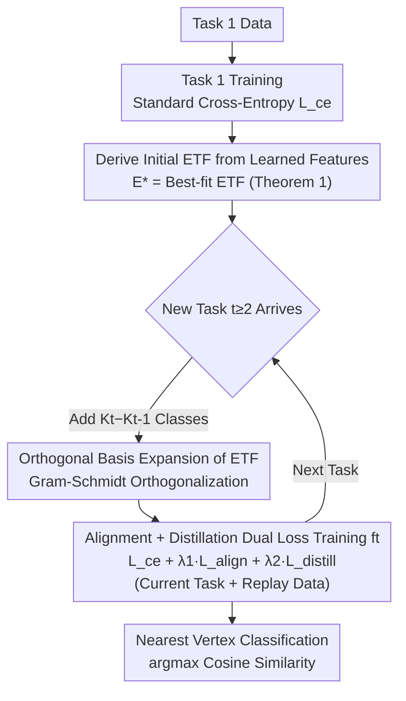

# Rethinking Continual Learning with Progressive Neural Collapse

## Basic Information

- **Conference**: ICLR 2026
- **arXiv**: [2505.24254](https://arxiv.org/abs/2505.24254)
- **Code**: [GitHub](https://github.com/Continue-Edge-AI-Lab/ProNC)
- **Area**: Continual Learning / Model Compression
- **Keywords**: Continual Learning, Neural Collapse, ETF, Class-Incremental Learning, Knowledge Distillation

## TL;DR

Ours proposes the ProNC framework, which balances maximum inter-class separation and minimum forgetting in continual learning by progressively expanding Equiangular Tight Frame (ETF) targets instead of using fixed, predefined ETFs.

## Background & Motivation

### Background
Continual Learning (CL) aims to enable models to learn new tasks sequentially without forgetting old knowledge, where the core challenge is Catastrophic Forgetting. Recently, research has found that a **Neural Collapse (NC)** phenomenon occurs at the end of deep network training—feature prototypes of all classes geometrically converge to a Simplex ETF (Equiangular Tight Frame), achieving maximum equidistant separation between classes.

### Limitations of Prior Work
Existing works (such as NCT) attempt to pre-define a global fixed ETF as a training target in CL, but face three major issues:

**Unrealistic**: Pre-defining an ETF requires knowing the total number of classes across all tasks in advance, which is impossible in practical scenarios;

**Performance Constraints**: When the total number of classes is large, the distance between ETF vertices decreases, hindering the discriminative ability in early stages (as shown in Figure 1, accuracy drops as $k$ increases);

**Violation of NC Principles**: NC is an evolving phenomenon during the training process; randomly initialized ETFs often lead to geometric mismatch.

### Key Insight
The number of vertices in the ETF target should always equal the number of currently observed classes to maintain maximum inter-class separation. Therefore, a dynamic, progressive ETF expansion mechanism is required.

## Method

### Overall Architecture

ProNC (Progressive Neural Collapse) no longer fixes an ETF covering all classes before training begins, as NCT does. Instead, it allows the ETF target to grow synchronously with the number of observed classes. The pipeline consists of four steps: after the first task is trained with standard cross-entropy, a best-fitting initial ETF is derived from the learned features as an anchor; subsequently, when a new task arrives, the ETF is expanded into higher dimensions along orthogonal directions to add vertices for new classes; after expansion, an alignment loss pulls sample features toward their respective ETF vertices, and a distillation loss prevents the drifting of old class vertices while training on a mixture of current task and replay data; during inference, classification is performed by finding the nearest ETF vertex based on cosine similarity. This ensures the number of ETF vertices at each stage exactly equals the number of currently observed classes, maintaining maximum inter-class separation.

### Key Designs

**1. Deriving Initial ETF from Learned Features: Aligning the Starting Point with NC Evolution**

The risk of a fixed ETF lies in the misalignment between the randomly initialized target geometry and the actual feature directions learned by the network, whereas NC is a phenomenon that emerges spontaneously at the end of training. ProNC therefore waits for the first task to finish training, calculates the feature means $\tilde{M}_{K_1}$ for each class, and solves for the standard ETF closest to them as the target: $\mathbf{E}^* = \sqrt{\frac{K_1}{K_1-1}} \mathbf{W}\mathbf{V}^\top \left(\mathbf{I}_{K_1} - \frac{1}{K_1}\mathbf{1}_{K_1}\mathbf{1}_{K_1}^\top\right)$, where $\mathbf{W}\mathbf{\Sigma}\mathbf{V}^\top$ is the SVD decomposition of the centralized feature matrix. Theorem 1 utilizes the lemma that the "closest orthogonal matrix is given by SVD" to ensure that $\mathbf{E}^*$ is the ETF with the highest alignment to actual features, avoiding geometric mismatch and providing a reliable anchor for subsequent expansion.

**2. Orthogonal Basis Expansion of ETF: Increasing Dimensions for New Classes while Keeping Old Vertices Stable**

When task $t$ introduces $K_t-K_{t-1}$ new classes, the key is to provide discriminative space for new classes without disturbing the converged positions of old classes. The core observation is that the ETF matrix $\mathbf{E}$ is entirely determined by its orthogonal basis $\mathbf{U}$. By keeping the original orthogonal basis unchanged during expansion, the displacement of old ETF vertices can be suppressed. ProNC expands the previous stage basis $\mathbf{U}_{t-1}\in\mathbb{R}^{d\times K_{t-1}}$ using Gram-Schmidt orthogonalization to form $\mathbf{U}_t\in\mathbb{R}^{d\times K_t}$, where new directions are orthogonal to all existing bases. $\mathbf{U}_t$ and $K_t$ are then substituted back into the ETF construction formula from Design 1 to obtain the new target $\mathbf{E}_t$ with $K_t$ vertices. Because the original basis is preserved, the drift of old class vertices is minimized, and new classes expand in a subspace orthogonal to the old ones, naturally maintaining equidistant separation.

**3. Alignment + Distillation Dual Loss: Pulling New Classes into Place while Stabilizing Old Ones**

The ETF target is only a "goal"; losses are needed to train features toward it. From task $t\ge 2$, the training objective is a weighted sum of three terms: $\mathcal{L} = \mathcal{L}_{\text{ce}} + \lambda_1\mathcal{L}_{\text{align}} + \lambda_2\mathcal{L}_{\text{distill}}$. The alignment loss pushes each normalized sample feature $\boldsymbol{\mu}_{k,i}^t$ toward its corresponding ETF vertex $\mathbf{e}_{k,t}$, written as $\mathcal{L}_{\text{align}}=\frac{1}{2}(\mathbf{e}_{k,t}^\top\boldsymbol{\mu}_{k,i}^t-1)^2$. This essentially requires the cosine similarity between the two to approach 1, compressing intra-class variance and forcing equidistant separation. Ablations show this is the most critical component. The distillation loss constrains the features $\boldsymbol{\mu}_{k,i}^{(t-1)}$ and $\boldsymbol{\mu}_{k,i}^{(t)}$ of the same sample before and after expansion to remain consistent: $\mathcal{L}_{\text{distill}}=\frac{1}{2}((\boldsymbol{\mu}_{k,i}^{(t-1)})^\top\boldsymbol{\mu}_{k,i}^{(t)}-1)^2$. This specifically compensates for the minor drift in old class vertices caused by ETF expansion, directly reducing the forgetting rate. Training utilizes a mixture of current task data and a replay buffer.

**4. Nearest Vertex Classification: Consistency between Inference and ETF Geometry**

Since training shapes features toward ETF vertices, inference no longer uses a standard linear classification head. Instead, it classifies by finding the nearest ETF vertex via cosine similarity: $\hat{y}=\arg\max_k\boldsymbol{\mu}_j^\top\mathbf{e}_k$. This corresponds precisely to the fourth property of NC (prediction collapses to the nearest class centroid rule). The classification criterion is perfectly aligned with the feature shaping objective, and it eliminates the need for a linear layer that would be susceptible to overwrite by new tasks.

## Key Experimental Results

### Main Results

| Buffer | Method | Seq-CIFAR-10 (Class-IL) | Seq-CIFAR-100 (Class-IL) | Seq-TinyImageNet (Class-IL) |
|--------|------|------------------------|--------------------------|----------------------------|
| 200 | ER | 44.79 | 21.78 | 8.49 |
| 200 | DER++ | 64.88 | 28.13 | 11.34 |
| 200 | STAR | 65.94 | 38.15 | 13.64 |
| 200 | NCT (Fixed ETF) | 51.59 | 26.38 | 10.95 |
| 200 | **Ours (ProNC)** | **72.70** | **44.32** | **20.11** |
| 500 | DER++ | 72.25 | 41.67 | 19.69 |
| 500 | STAR | 73.42 | 49.72 | 22.18 |
| 500 | **Ours (ProNC)** | **79.42** | **52.49** | **28.27** |

### Ablation Study

| Components | Seq-CIFAR-10 (FAA) | Seq-CIFAR-100 (FAA) | Seq-TinyImageNet (FAA) |
|------|-------------------|--------------------|-----------------------|
| Full ProNC | **72.70** | **44.32** | **20.11** |
| w/o Alignment Loss | 65.94 | 38.15 | 13.64 |
| w/o Distillation Loss| 69.82 | 41.76 | 17.53 |
| Fixed Global ETF (NCT) | 51.59 | 26.38 | 10.95 |

### Key Findings

1. **ProNC significantly outperforms baselines across all datasets**, particularly improving Class-IL accuracy by over 6 percentage points on TinyImageNet;
2. **Alignment loss is the most critical component**, without which performance degrades to STAR levels;
3. **Progressive ETF is far superior to fixed ETF**, as NCT's fixed global ETF is severely limited in scenarios with many classes;
4. **Forgetting rate is significantly reduced**, with ProNC showing a much lower average forgetting rate than DER++ and STAR.

## Highlights & Insights

- Completely avoids pre-defined global ETFs by adaptively extracting an initial ETF from the first task and expanding it progressively.
- Theoretical guarantee (Theorem 1) ensures optimal alignment of the initial ETF.
- ETF expansion strategy is based on orthogonal basis preservation, minimizing the drift of old class vertices.
- The framework is simple and flexible, serving as a plug-and-play feature regularizer for any replay-based CL method.

## Limitations & Future Work

- The feature dimension $d$ must satisfy $d \geq K-1$; ETF expansion is restricted when the total number of classes approaches the feature dimension.
- Ours still relies on a replay buffer; its effectiveness in purely buffer-free scenarios remains unverified.
- SVD computation for ETF construction may incur additional overhead when the number of classes is extremely large.
- Evaluations were conducted only on ResNet-18, without exploring larger-scale models or real-world deployment scenarios.

## Related Work

- **Neural Collapse**: Papyan et al. (2020) discovered that features converge to a Simplex ETF at the end of training.
- **ETF-based CL**: NCT (Yang et al., 2023b) uses pre-defined fixed global ETFs; MNC3L (Dang et al., 2025) combines with contrastive learning.
- **Replay-based CL**: DER/DER++ (Buzzega et al., 2020), STAR (Eskandar et al., 2025).
- **Knowledge Distillation CL**: iCaRL (Rebuffi et al., 2017), LODE (Liang & Li, 2023).

## Rating

- Novelty: ⭐⭐⭐⭐ — The progressive ETF expansion idea is novel and theoretically supported.
- Technical Depth: ⭐⭐⭐⭐ — Complete from theory to implementation; Theorem 1 provides rigorous mathematical guarantees.
- Experimental Thoroughness: ⭐⭐⭐⭐ — Covers 3 datasets and 2 CL scenarios with comprehensive ablations.
- Value: ⭐⭐⭐⭐ — A plug-and-play feature regularizer compatible with multiple CL frameworks.

<!-- RELATED:START -->

## Related Papers

- [\[ICLR 2026\] Revisiting Weight Regularization for Low-Rank Continual Learning](revisiting_weight_regularization_for_low-rank_continual_learning.md)
- [\[ICML 2025\] Come Together, But Not Right Now: A Progressive Strategy to Boost Low-Rank Adaptation](../../ICML2025/model_compression/come_together_but_not_right_now_a_progressive_strategy_to_boost_low-rank_adaptat.md)
- [\[ICLR 2026\] UniFlow: A Unified Pixel Flow Tokenizer for Visual Understanding and Generation](uniflow_a_unified_pixel_flow_tokenizer_for_visual_understanding_and_generation.md)
- [\[ICLR 2026\] S2R-HDR: A Large-Scale Rendered Dataset for HDR Fusion](s2r-hdr_a_large-scale_rendered_dataset_for_hdr_fusion.md)
- [\[ICLR 2026\] SERE: Similarity-based Expert Re-routing for Efficient Batch Decoding in MoE Models](sere_similarity-based_expert_re-routing_for_efficient_batch_decoding_in_moe_mode.md)

<!-- RELATED:END -->
