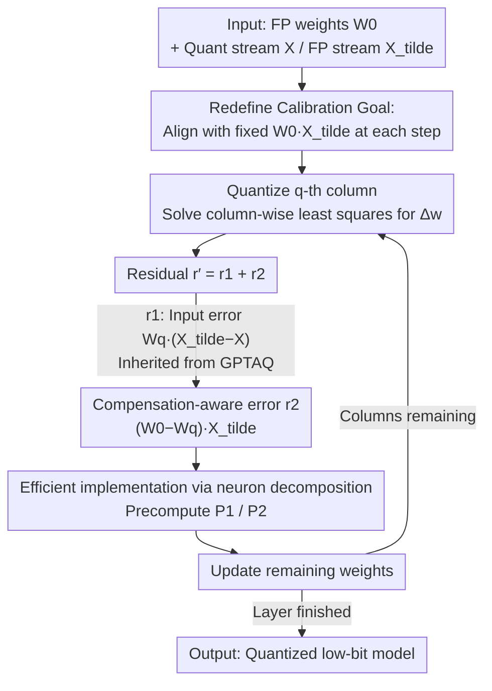

# Rethinking Residual Errors in Compensation-based LLM Quantization

**Conference**: ICLR 2026  
**OpenReview**: [https://openreview.net/forum?id=LWYZ1nNkJl](https://openreview.net/forum?id=LWYZ1nNkJl)  
**Code**: https://github.com/list0830/ResComp  
**Area**: Model Compression  
**Keywords**: Post-training quantization, weight compensation, GPTQ, residual error, compensation-aware error

## TL;DR
This paper revisits the column-level calibration objectives of "column-wise quantization + compensated residual weights" methods like GPTQ / GPTAQ. It points out that these methods erroneously treat the "output of compensated weights" as the alignment baseline. Consequently, it derives a missing residual term—Compensation-aware Error (CAE)—and integrates it efficiently into weight update formulas using the neuron decomposition from GPTAQ. This modification, which requires almost zero structural changes to GPTQ / GPTAQ, consistently improves perplexity and downstream accuracy in 2~3 bit quantization.

## Background & Motivation
**Background**: To compress large-scale LLMs into low bits, Post-Training Quantization (PTQ) is widely adopted due to its low cost and lack of fine-tuning requirements. Among these, the "compensation-based" family is most representative: OBQ → GPTQ → GPTAQ. Their common paradigm involves quantizing weights column-by-column and adjusting the remaining floating-point weights using second-order Hessian information to keep the layer output close to the original. GPTQ scaled this to large models using lazy batch-updates and Cholesky reconstruction; GPTAQ further identified that "layer-level error accumulation" causes the calibration baseline to drift, introducing asymmetric calibration to incorporate output errors from previous layers as "residuals" into the current layer.

**Limitations of Prior Work**: While GPTAQ's **layer-level goal** is correct—it always uses the floating-point stream output $w\tilde{X}$ as the reference—the authors find that its **column-level goal** subtly deviates during iteration. When quantizing the $q$-th column, GPTAQ defines the alignment target as $w^{(q)}\tilde{X}$, using the **weights $w^{(q)}$ already compensated for $q$ steps** multiplied by the floating-point input. This holds at step 0 (where $w^{(0)}\tilde{X}$ is the true floating-point output), but for $q\geq1$, $w^{(q)}\tilde{X}$ is no longer the true output of the floating-point layer—it is the output of "modified weights."

**Key Challenge**: The true objective should be to align with the original floating-point model output $w^{(0)}\tilde{X}$, which serves as a **fixed gold standard** throughout the column-wise process. However, GPTAQ shifts the alignment target at each step to $w^{(q)}\tilde{X}$, which changes with compensation. The discrepancy $(w^{(0)}-w^{(q)})\tilde{X}$ accumulates in the later stages of iteration but is entirely ignored by existing formulas.

**Goal**: To re-anchor the column-level target to $w^{(0)}\tilde{X}$ and explicitly incorporate the resulting extra error term into weight updates.

**Key Insight**: Since the issue stems from "selecting the wrong alignment baseline in the objective function," the objective should be rewritten and the Lagrange multipliers re-solved to determine how the correct residual differs from GPTAQ.

**Core Idea**: Correct the residual from "only containing input error $r_1$" to "input error $r_1$ + compensation-aware error $r_2$," where $r_2=(w^{(0)}-w^{(q)})\tilde{X}$ characterizes the "endogenous error introduced by intra-layer compensation modifying the weights." This $r_2$ is then computed efficiently using the existing neuron decomposition from GPTAQ.

## Method

### Overall Architecture
The method is essentially a "correction of the objective function": compensation-based quantization quantizes weights column-by-column, solving a least-squares problem at each step for the weight update $\Delta w$ of remaining weights. GPTAQ adds an error correction term $rX^\top H^{-1}_{-q}$ to the standard update, where the residual $r$ only accounts for "input errors from previous layers." This paper re-aligns the column-level objective to the fixed floating-point output $w^{(0)}\tilde{X}$, deriving a new residual $r'=r_1+r_2$ that includes the compensation-aware error $r_2$. Using neuron decomposition, $r_2$ is expressed via a precomputable matrix $P_2$, making the enhancement a **simple addition** to the weight update step in GPTQ / GPTAQ, while the overall structure, Hessian, and Cholesky remains unchanged.

The overall process can be viewed as a "column-wise loop" pipeline: for each quantized column, both residual components (input error inherited from GPTAQ + the new compensation-aware error) are factored into the compensation of remaining weights until the entire layer is quantized.

### Key Designs

**1. Redefining column-level calibration: Aligning with fixed floating-point output at every step**

As previously noted, GPTAQ quantizes the $q$-th column by minimizing $\min_{\Delta w}\lVert(w^{(q)}+\Delta w)X-w^{(q)}\tilde{X}\rVert_F^2$, where the right side $w^{(q)}\tilde{X}$ uses **weights already compensated for $q$ steps**. The authors change the target to consistently align with the **invariant gold standard** $w^{(0)}\tilde{X}$:

$$\min_{\Delta w}\lVert(w^{(q)}+\Delta w)X-w^{(0)}\tilde{X}\rVert_F^2,\quad \text{s.t. } \Delta w_{:q}=0,\ \Delta w_q=\hat{w}^{(q)}_q-w^{(q)}_q$$

The constraint ensures updates only act on unquantized columns. Rearranging this into the form "$\Delta w$ times input = residual" results in the residual $r'=w^{(0)}\tilde{X}-w^{(q)}X$. This substitution makes the error term missed by GPTAQ explicit.

**2. Compensation-aware Error: Compensating for endogenous bias from intra-layer updates**

Decomposing the new residual is the most critical step:

$$r'=\underbrace{w^{(q)}(\tilde{X}-X)}_{r_1}+\underbrace{(w^{(0)}-w^{(q)})\tilde{X}}_{r_2}$$

The first term $r_1=w^{(q)}(\tilde{X}-X)$ reflects the error from the "difference between quantized stream input $X$ and floating-point stream input $\tilde{X}$," which is the **inter-layer input error** already addressed by GPTAQ. The second term $r_2=(w^{(0)}-w^{(q)})\tilde{X}$ is the **Compensation-aware Error (CAE)**: it measures the response of the "difference between original weights $w^{(0)}$ and $q$-step compensated weights $w^{(q)}$" on the floating-point input. In other words, it is the **endogenous bias** caused by the act of compensation itself. Because GPTAQ aligned to $w^{(q)}\tilde{X}$ instead of $w^{(0)}\tilde{X}$, it treated $r_2$ as zero. This paper explicitly adds it back:

$$\Delta w=\frac{\hat{w}^{(q)}_q-w^{(q)}_q}{H^{-1}_{qq}}\cdot H^{-1}_{q,:}+(r_1+r_2)X^\top H^{-1}_{-q}$$

Notably, $r_2$ exists even in a pure GPTQ framework without cross-layer error propagation, making it **complementary** to GPTAQ's $r_1$.

**3. Efficient implementation via neuron decomposition: $r_2$ with minimal computation**

Recalculating $R_1$ and $R_2$ for every column is too expensive. Following GPTAQ's **neuron decomposition**, $R_2$ is split into an accumulative form $R_2=\sum_q(W^{(0)}_{:,q}-W^{(q)}_{:,q})\tilde{X}_{q,:}$, allowing for parallelization and lazy updates. Crucially, the two correction coefficient matrices can be **precomputed once**:

$$P_1=\big[(\Delta XX^\top L)\odot M_U\big]L^\top,\qquad P_2=\big[(\tilde{X}X^\top L)\odot M_U\big]L^\top$$

Where $L$ is the inverse Cholesky factor of $\tilde{H}^{-1}=LL^\top$ and $M_U$ is an upper triangular mask. Furthermore, $\tilde{X}X^\top$ does not need separate storage because $\tilde{X}X^\top=XX^\top+\Delta XX^\top$. Each column update simply appends the **term $(W^{(0)}_{:,q}-W^{(q)}_{:,q})P2_{q,q:}$** (highlighted in Algorithm 1). While offline calibration requires extra storage for $W^{(0)}$ and $P_2$, increasing peak memory slightly (e.g., 19.8GB to 20.6GB on 7B), the **inference memory of the quantized model remains unchanged**.

## Key Experimental Results

### Main Results
The experiments cover Llama 2/3 (1B~70B) using WikiText-2 / C4 perplexity (lower is better) and the average accuracy of 6 zero-shot downstream tasks (higher is better). Selected results for 3-bit per-group weight-only quantization (Table 1):

| Model | Method | Wiki2(↓) | C4(↓) | Downstream Avg(↑) |
|------|------|----------|-------|-------------|
| Llama2-7B | GPTQ | 6.73 | 13.60 | 64.9 |
| Llama2-7B | **Ours+GPTQ** | **6.40** | **8.34** | **66.5** |
| Llama2-7B | GPTAQ | 6.53 | 8.40 | 66.3 |
| Llama2-7B | **Ours+GPTAQ** | **6.25** | **8.19** | **66.6** |
| Llama3-8B | GPTAQ | 8.39 | 12.96 | 68.8 |
| Llama3-8B | **Ours+GPTAQ** | **7.77** | **12.25** | **70.5** |
| Llama3.1-8B-Inst | GPTQ | 9.06 | 14.15 | 70.3 |
| Llama3.1-8B-Inst | **Ours+GPTQ** | **8.96** | **13.97** | **72.7** |

Notably, on Llama2-7B, adding CAE to GPTQ recovered the collapse on C4 (perplexity **13.60 → 8.34**) and improved downstream accuracy from 64.9% to 66.5%.

In extreme 2-bit + rotation settings (Table 2, W2A16 + QuaRot), gains are more pronounced: on Llama2-13B, QuaRot+GPTAQ Wiki2 improved from 7.50 to 7.32, with an average downstream gain of +2.4. For weight+activation quantization (Table 3, W2A4KV4), SpinQuant+GPTAQ on Llama2-13B saw Wiki2 drop significantly from 9.55 to **8.60**.

### Ablation Study
Table 4 verifies the added term $(W^{(0)}_{:,q}-W^{(q)}_{:,q})P2_{q,q:}$ specifically (W2A16 + QuaRot):

| Config | Terms in $\Delta W$ | L2-7B Wiki2 | L2-7B Avg | L2-13B Avg |
|------|----------------|-------------|-----------|-------------|
| GPTQ | Standard Update only | 19.0 | 44.9 | 50.5 |
| Ours+GPTQ | + $r_2$ term | 17.9 | 47.5 | 54.3 |
| GPTAQ | Standard + $r_1$ term | 9.5 | 51.5 | 55.8 |
| Ours+GPTAQ | Standard + $r_1$ + $r_2$ term | **8.9** | **54.0** | **58.2** |

### Key Findings
- **$r_2$ is an independent and complementary error source**: Adding $r_2$ alone to pure GPTQ (without cross-layer propagation) improves Llama2-7B accuracy from 44.9% to 47.5%, proving CAE does not depend on GPTAQ's $r_1$. The combination (Ours+GPTAQ) yields the best results, as they address different error types.
- **Greater gains at lower bit-widths**: Improvements are modest at 3-bit (0.2~1.7 points) but often exceed 2 points in 2-bit or W2A4KV4 scenarios where errors are amplified.
- **Manageable offline cost**: Quantization time increases by roughly 5-8% (7B: 952s→1001s; 70B: 5883s→6344s). Peak memory rises slightly, but there is **zero overhead at inference**.
- **Observation of Failure**: On Llama3-70B with SpinQuant (W2A4KV4), the overall system collapses (perplexity >1e5). This is attributed to the rotation matrix being optimized for W16A4KV4, which cannot handle 2-bit weight distribution shifts; CAE improves this slightly but cannot fully recover it.

## Highlights & Insights
- **"Wrong alignment baseline" is a detail overlooked by the industry**: GPTAQ's layer-level goal was correct, but the column-level goal drifted. This kind of "high-level correct, low-level drifting" bug is hard to detect. Identifying it through objective rewriting rather than increased compute is a significant contribution.
- **Zero new hyperparameters and plug-and-play**: The enhancement boils down to a single term in the update formula and one precomputed matrix. It integrates seamlessly with GPTQ, GPTAQ, QuaRot, and SpinQuant.
- **Transferable logic**: The observation that "alignment targets in greedy compensation algorithms can drift" can be generalized to other "modify-and-compensate" second-order frameworks like pruning (OBS/OBC) or low-rank decomposition.

## Limitations & Future Work
- **Offline memory and time overhead**: Requires storing $W^{(0)}$ and $P_2$. 70B calibration peak memory rose from 63.7GB to 69.5GB. While offline, this is still a burden for memory-constrained environments.
- **Cannot fix rotation matrix mismatch**: CAE only addresses the "compensation target shift" and cannot resolve fundamental failures when upstream transformations (like SpinQuant on Llama3) are inherently incompatible.
- **Bitrate dependency**: Gains are smaller at 3-bit; the method's value is primarily in aggressive compression (2-bit).
- **Future Directions**: Exploring low-rank or block-based approximations of $P_2$ to reduce storage, or extending the "anchor to original output" concept from column-wise to block-wise updates.

## Related Work & Insights
- **vs. GPTQ**: GPTQ only uses the quantized stream $X$ for reconstruction and ignores cross-layer accumulation. Adding $r_2$ to GPTQ significantly improves it even without GPTAQ's cross-layer terms (e.g., fixing C4 perplexity), filling the gap of "endogenous errors from intra-layer compensation."
- **vs. GPTAQ**: GPTAQ compensates for **inter-layer input error** $r_1$ but misses $r_2$ due to shifted column-level targets. This work provides a "correction and completion" within the same framework.
- **vs. AWQ / QuaRot / SpinQuant**: These methods focus on outlier management via scaling or rotation. This work is **orthogonal** to them, focusing on error modeling within compensation, and can be stacked on top of these preprocessing techniques for further gains.

## Rating
- Novelty: ⭐⭐⭐⭐ Not a brand-new framework, but precisely identifies and fixes a hidden bias in GPTAQ's column-level objectives.
- Experimental Thoroughness: ⭐⭐⭐⭐⭐ Comprehensive coverage across Llama 2/3, different bit-widths, weight-only/joint quantization, and multiple baselines.
- Writing Quality: ⭐⭐⭐⭐ Clear derivation and explanation of the $r_1/r_2$ split.
- Value: ⭐⭐⭐⭐ Zero-hyperparameter, plug-and-play enhancement with significant gains at low bit-widths.

<!-- RELATED:START -->

## Related Papers

- [\[ICLR 2026\] ParoQuant: Pairwise Rotation Quantization for Efficient Reasoning LLM Inference](paroquant_pairwise_rotation_quantization_for_efficient_reasoning_llm_inference.md)
- [\[ICML 2026\] ReSpinQuant: Efficient Layer-Wise LLM Quantization via Subspace Residual Rotation Approximation](../../ICML2026/model_compression/respinquant_efficient_layer-wise_llm_quantization_via_subspace_residual_rotation.md)
- [\[ICLR 2026\] SERQ: Saliency-Aware Low-Rank Error Reconstruction for LLM Quantization](serq_saliency-aware_low-rank_error_reconstruction_for_llm_quantization.md)
- [\[ICLR 2026\] The Geometry of LLM Quantization: GPTQ as Babai's Nearest Plane Algorithm](the_geometry_of_llm_quantization_gptq_as_babais_nearest_plane_algorithm.md)
- [\[AAAI 2026\] First-Order Error Matters: Accurate Compensation for Quantized Large Language Models](../../AAAI2026/model_compression/first-order_error_matters_accurate_compensation_for_quantized_large_language_mod.md)

<!-- RELATED:END -->
