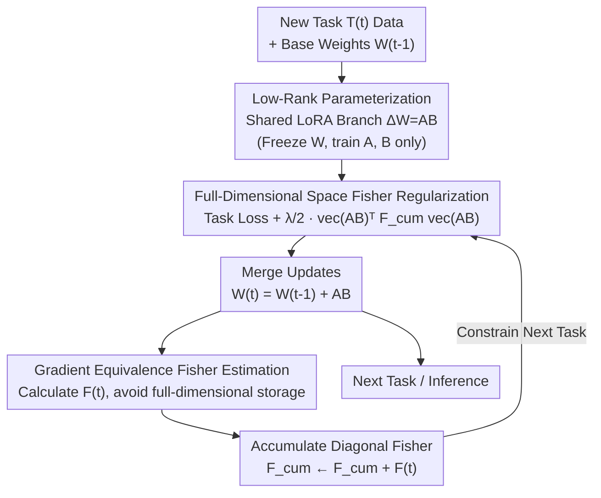

# Revisiting Weight Regularization for Low-Rank Continual Learning

## Basic Information

- **Conference**: ICLR 2026
- **arXiv**: [2602.17559](https://arxiv.org/abs/2602.17559)
- **Code**: [GitHub](https://github.com/yaoyz96/low-rank-cl)
- **Area**: Continual Learning / Model Compression
- **Keywords**: Continual Learning, EWC, LoRA, Fisher Information, Parameter-Efficient Learning

## TL;DR

This work reintroduces Elastic Weight Consolidation (EWC) into low-rank continual learning by estimating the Fisher Information Matrix in the full-dimensional space to regularize shared LoRA modules, achieving effective forgetting mitigation with constant storage overhead.

## Background & Motivation

### Background
With the rise of large-scale Pre-trained Models (PTMs), the paradigm of continual learning has shifted from training from scratch to the continuous adaptation of PTMs. Parameter-Efficient Continual Learning (PECL) has become mainstream, typically alleviating task interference by allocating independent LoRA modules for each task.

### Limitations of Prior Work

**Linear Storage Growth**: Existing low-rank CL methods (e.g., InfLoRA, SD-LoRA) maintain independent LoRA branches for every task, resulting in storage overhead that grows linearly with the number of tasks.

**Weight Regularization Overlooked**: Classical regularization methods like EWC have not been fully explored in the PTM era. Directly applying EWC to PTMs requires memory three times the model size to store old model copies and Fisher matrices.

**Suboptimal Naive Integration**: Simply combining EWC with LoRA (regularizing A and B matrices separately) ignores their interaction, leading to information distortion.

### Key Insight
Through low-rank parameterization, EWC can be efficiently implemented: estimating Fisher information in the full-dimensional space $\Delta\mathbf{W} = \mathbf{AB}$ accurately captures parameter importance while maintaining constant storage.

## Method

### Overall Architecture

EWC-LoRA discards the expansionist approach of "one LoRA set per task" and maintains only one set of shared LoRA modules and a diagonal Fisher matrix throughout the process. Each new task is updated on this shared set, using accumulated Fisher information to constrain update directions within subspaces that do not damage old knowledge. After task training, low-rank updates are merged back into the base weights, and the importance measure of the current task is superimposed into the cumulative Fisher for the next task—completing the continual learning pipeline under constant storage.

### Key Designs

**1. Problem Formulation of Low-Rank Parameterization: Locking weight updates in a low-rank subspace to provide a constant-sized carrier for regularization.**

For task $\mathcal{T}_t$, the method does not directly modify the massive base weights. Instead, it restricts the changes brought by this task to a low-rank increment, namely $\mathbf{W}_t = \mathbf{W}_{t-1} + \Delta\mathbf{W} = \mathbf{W}_{t-1} + \mathbf{AB}$, where $\mathbf{A} \in \mathbb{R}^{d_O \times r}$, $\mathbf{B} \in \mathbb{R}^{r \times d_I}$, and rank $r \ll \min(d_I, d_O)$. Thus, each task only requires training two small matrices, $\mathbf{A}$ and $\mathbf{B}$. This inherits the parameter efficiency of LoRA and ensures the targets for subsequent regularization are always the same set of shared parameters, avoiding linear storage expansion.

**2. Full-Dimensional Space Fisher Regularization: Measuring importance on $\Delta\mathbf{W}$ instead of A and B to preserve interaction information.**

Naively applying EWC to LoRA would calculate and penalize Fisher information for $\mathbf{A}$ and $\mathbf{B}$ separately. However, $\mathbf{A}$ and $\mathbf{B}$ only have physical meaning when multiplied; measuring them separately loses their coupling and distorts importance estimation. EWC-LoRA applies regularization to the synthesized full-dimensional increment $\Delta\mathbf{W}=\mathbf{AB}$:

$$
\mathcal{L}_t'(\mathbf{A}, \mathbf{B}) = \mathcal{L}_t(\mathbf{A}, \mathbf{B}) + \frac{\lambda}{2} \text{vec}(\mathbf{AB})^\top \mathbf{F}_{t-1}^{\text{cum}} \text{vec}(\mathbf{AB})
$$

where $\mathbf{F}_{t-1}^{\text{cum}}$ is the diagonal Fisher matrix accumulated up to the previous task, and $\lambda$ controls the regularization strength. The paper verifies both theoretically and experimentally that "regularizing low-rank matrices separately is suboptimal":

| Strategy | $\bar{A}_{10}$ | Stability | Plasticity | Extra Memory |
|------|----------------|--------|--------|---------|
| No Fisher | 82.99 | 87.56 | **98.86** | 0 GB |
| Precomputed $\mathbf{F}_{\mathbf{W}}$ | 83.87 | 93.15 | 94.74 | 1 GB |
| Separate $\mathbf{F}_{\mathbf{A}}, \mathbf{F}_{\mathbf{B}}$ | 86.41 | 94.23 | 96.47 | 4 GB |
| **Full-dim $\mathbf{F}_{\Delta\mathbf{W}}$ (Ours)** | **87.91** | **94.45** | 97.99 | 6 GB |

Measuring $\mathbf{F}_{\mathbf{A}}, \mathbf{F}_{\mathbf{B}}$ separately is approximately 1.5% lower than the full-dimensional scheme, confirming that interaction information cannot be discarded.

**3. Fisher Estimation via Gradient Equivalence to Avoid Full-Rank Storage: Accurately measuring parameter importance without the cost of three times the model size.**

After task $\mathcal{T}_t$ converges, the method estimates the diagonal Fisher according to the classical definition:

$$
F_t^{i,i} = \mathbb{E}_{x \sim \mathcal{D}_t}\left[\mathbb{E}_{y \sim p_{\mathbf{W}_t^*}}\left[\left(\frac{\partial \log p_{\mathbf{W}}(y|x)}{\partial w_i}\bigg|_{\mathbf{W}=\mathbf{W}_t^*}\right)^2\right]\right]
$$

The reason direct EWC for PTMs is costly is that it requires storing old model copies and the full-dimensional Fisher. The key observation here is: since only the low-rank increment $\Delta\mathbf{W}$ is trainable, the gradient with respect to $\mathbf{W}$ is equivalent to the gradient with respect to $\Delta\mathbf{W}$ in the trainable directions. Therefore, the required importance measure can be obtained without explicitly constructing or storing full-dimensional updates—this is why full-dimensional Fisher is accurate without exhausting memory.

### Loss & Training

The training and conclusion of each task follow a fixed pipeline: first, initialize the shared LoRA branch ($\mathbf{A}$ zero-initialized, $\mathbf{B}$ uniformly initialized); during training, freeze base weights $\mathbf{W}_{t-1}$ and update only $\mathbf{A}, \mathbf{B}$ while applying the above regularization to $\Delta\mathbf{W}=\mathbf{AB}$ using the cumulative Fisher $\mathbf{F}_{t-1}^{\text{cum}}$; after the task ends, merge updates back into base weights $\mathbf{W}_t = \mathbf{W}_{t-1} + \mathbf{AB}$, estimate the current task Fisher $\mathbf{F}_t$, and add it to the cumulative matrix $\mathbf{F}_t^{\text{cum}}$. Subsequently, task data and single-task Fisher can be discarded. The process always carries only one LoRA set and one diagonal Fisher, so storage does not grow with the number of tasks.

## Key Experimental Results

### Main Results (Vision Tasks)

| Method | CIFAR-100 $\bar{A}_{10}$ | DomainNet $\bar{A}_{5}$ | ImageNet-R $\bar{A}_{10}$ | ImageNet-A $\bar{A}_{10}$ |
|------|--------------------------|------------------------|--------------------------|--------------------------|
| Finetune | 79.09 | 65.57 | 60.42 | 32.85 |
| L2P | 83.18 | 70.26 | 71.26 | 42.94 |
| CODA-Prompt | 86.31 | 70.58 | 74.05 | 45.36 |
| InfLoRA | 86.34 | 71.01 | 74.41 | 50.75 |
| SD-LoRA | 86.77 | — | — | — |
| **EWC-LoRA (Ours)** | **87.91** | **72.13** | **75.20** | **52.48** |

### Ablation Study: Stability-Plasticity Trade-off

| Regularization Strength $\lambda$ | Stability (↑) | Plasticity (↑) | $\bar{A}_{10}$ (↑) |
|---------------------|-----------|-----------|-------------------|
| 0 (No Regularization) | 87.56 | 98.86 | 82.99 |
| 10 | 92.13 | 98.12 | 86.42 |
| 100 | 94.45 | 97.99 | 87.91 |
| 1000 | 96.21 | 95.34 | 87.15 |

### Key Findings

1. **EWC-LoRA improves vanilla LoRA by an average of 8.92%**, achieving a state-of-the-art 87.91% on CIFAR-100.
2. **Constant Storage**: Unlike methods like InfLoRA that require linearly growing LoRA branches, EWC-LoRA maintains only one LoRA set and one diagonal Fisher.
3. **Crucial Full-Dimensional Fisher**: Regularizing A and B separately causes a 1.5% accuracy loss, validating the importance of interaction information.
4. **Flexible Stability-Plasticity Trade-off**: Adjusting $\lambda$ allows free movement along the Pareto frontier, superior to methods with fixed operating points.
5. **Effective in Language Tasks**: Versatility is verified on T5-large and LLaMA-3.2-1B.

## Highlights & Insights

- First systematic study of EWC application in low-rank CL, revealing theoretical flaws in naive integration.
- Full-dimensional Fisher estimation skillfully utilizes gradient equivalence, bypassing explicit storage of full-dimensional updates.
- Constant storage overhead independent of the number of tasks, suitable for long-sequence task scenarios.
- Provides complete theoretical analysis (mathematical proofs in Appendix A).

## Limitations & Future Work

- Fisher matrix estimation still operates in full-dimensional space; memory overhead remains significant for ultra-large models (>10B parameters).
- Diagonal Fisher assumption ignores correlations between parameters, potentially underestimating certain parameter importance.
- Vision experiments were limited to ViT-B/16; effects on larger backbones are unknown.
- The choice of low-rank constraint $r$ significantly impacts performance, but an automatic selection mechanism is lacking.

## Related Work & Insights

- **EWC**: Kirkpatrick et al. (2017) proposed penalizing changes to important parameters via the Fisher Information Matrix.
- **LoRA**: Hu et al. (2022) proposed the low-rank adaptation method for efficient fine-tuning.
- **Low-Rank CL**: InfLoRA (Liang & Li, 2024), SD-LoRA (Wu et al., 2025), O-LoRA (Wang et al., 2023).
- **Prompt-based CL**: L2P, DualPrompt, CODA-Prompt.

## Rating

- Novelty: ⭐⭐⭐⭐ — A profound revisit of a classic method in a new paradigm.
- Technical Depth: ⭐⭐⭐⭐⭐ — Theoretical proofs + experimental validation + systematic analysis.
- Experimental Thoroughness: ⭐⭐⭐⭐ — Covers vision and language tasks across multiple benchmarks.
- Value: ⭐⭐⭐⭐ — Constant storage, plug-and-play, deployment-friendly.

<!-- RELATED:START -->

## Related Papers

- [\[ICLR 2026\] Rethinking Continual Learning with Progressive Neural Collapse](rethinking_continual_learning_with_progressive_neural_collapse.md)
- [\[ICML 2025\] Come Together, But Not Right Now: A Progressive Strategy to Boost Low-Rank Adaptation](../../ICML2025/model_compression/come_together_but_not_right_now_a_progressive_strategy_to_boost_low-rank_adaptat.md)
- [\[ICLR 2026\] SERE: Similarity-based Expert Re-routing for Efficient Batch Decoding in MoE Models](sere_similarity-based_expert_re-routing_for_efficient_batch_decoding_in_moe_mode.md)
- [\[ICLR 2026\] S2R-HDR: A Large-Scale Rendered Dataset for HDR Fusion](s2r-hdr_a_large-scale_rendered_dataset_for_hdr_fusion.md)
- [\[ICLR 2026\] UniFlow: A Unified Pixel Flow Tokenizer for Visual Understanding and Generation](uniflow_a_unified_pixel_flow_tokenizer_for_visual_understanding_and_generation.md)

<!-- RELATED:END -->
