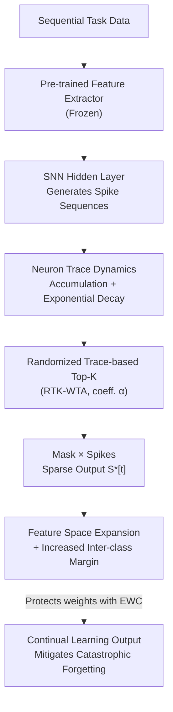

# Robust Selective Activation with Randomized Temporal K-Winner-Take-All in Spiking Neural Networks for Continual Learning

**Conference**: ICLR 2026  
**OpenReview**: [https://openreview.net/forum?id=uAkexWJ7dW](https://openreview.net/forum?id=uAkexWJ7dW)  
**Code**: TBD  
**Area**: Model Compression / Spiking Neural Networks / Continual Learning  
**Keywords**: Spiking Neural Networks, Continual Learning, K-Winner-Take-All, Temporal Trace, Randomized Selection

## TL;DR
To address catastrophic forgetting in Spiking Neural Networks (SNNs) for continual learning, this paper upgrades the traditional rate-based deterministic K-WTA to "Randomized Temporal K-WTA (RTK-WTA)". By ranking neurons based on their temporal traces rather than instantaneous firing rates and injecting controlled randomness $\alpha$ into Top-K selection, the method expands the effective feature space and increases inter-class margins, achieving a 3.07–10.05% improvement over deterministic K-WTA on splitMNIST/splitCIFAR100.

## Background & Motivation
**Background**: Spiking Neural Networks are considered ideal candidates for continual learning due to their event-driven nature, low power consumption, and inherent temporal dynamics. To reduce representation overlap and mitigate catastrophic forgetting in sequential task streams, a common practice is to introduce sparse selection mechanisms like K-Winner-Take-All (K-WTA), which allows only a small subset of "winner" neurons to fire at each time step, thereby separating activation paths for different tasks.

**Limitations of Prior Work**: The "winner" criteria in mainstream K-WTA are based on neurons' **instantaneous firing rates or membrane potentials**, representing a purely spatial deterministic competition. This ignores the rich temporal information within spike signals and fails to simulate the brain's ability to modulate activation patterns across time. Furthermore, deterministic selection **rigidly binds** neurons to fixed patterns: when subsequent tasks share features with learned ones, the same set of neurons is repeatedly selected and overwritten, making the system extremely vulnerable to input perturbations and task interference.

**Key Challenge**: Continual learning must satisfy two conflicting requirements: task-specific **selectivity** (different tasks using different neurons to reduce interference) and cross-task **robustness/generalization** (activation patterns shouldn't be too rigid to tolerate noise). Deterministic K-WTA favors the former at the expense of the latter. While previous trace-based K-WTA (SA-SNN) introduced temporal traces, its selection remains deterministic, leaving robustness limited.

**Key Insight**: The authors noted that biological WTA circuits are not purely deterministic but combine **deterministic competition with controlled randomness**. The brain uses this randomness to prevent neurons from over-specializing, maintaining flexibility and redundancy in activation patterns. Simultaneously, biological neurons rely on "temporal traces" of past activity to guide future responses. Coupling these two elements (temporal traces + randomized Top-K) into SNNs allows for both temporal selectivity and interference resistance.

**Core Idea**: Replace "rate-ranking + deterministic Top-K" with "trace-ranking + probabilistic Top-K". At each time step, neurons are ranked by their accumulated temporal traces, but with probability $\alpha$, a portion of non-Top-K neurons is also activated. This expands selection from the spatial to the spatio-temporal domain and utilizes controlled randomness to increase the explorable activation space.

## Method

### Overall Architecture
RTK-WTA is positioned after a pre-trained feature extractor. Input data is encoded into embeddings by a frozen feature extractor and fed into SNN hidden layers to generate spike sequences. Each hidden neuron maintains a **trace** that accumulates with spikes and decays over time. At each time step, the RTK module performs Top-K selection based on trace values, but with a random coefficient $\alpha$, some non-Top-K neurons are given activation opportunities. This generates a binary mask $\text{Mask}[t]$, which is multiplied by the original spikes to produce the sparsified output $S^*[t]$. This "time-varying randomized sparse activation" implicitly separates active subspaces for different tasks in the temporal domain without requiring explicit task labels. Finally, it works with Elastic Weight Consolidation (EWC) to protect important weights and collectively defend against catastrophic forgetting.

### Key Designs

**1. Temporal Trace as Selection Metric: Ranking by Cumulative Activity**

Traditional K-WTA ranks by instantaneous firing rates, losing the temporal structure of spike signals. This paper uses the neuron's **trace** $tr_i[t]$ as the competitive metric. The discrete update rule for the trace is:

$$tr_i[t+1] = tr_i[t] - \frac{tr_i[t]}{\tau} + S_i[t+1],$$

where $\tau$ is the decay constant and $S_i[t+1]\in\{0,1\}$ is the spike. Each firing adds 1 to the trace, while the trace decays at a rate of $1/\tau$ in the absence of a spike—essentially an **exponential moving average** of the spike history, biased toward recent activity. Over a time window $T$, the integral trace $Tr_i^{(T)}=\sum_{t=1}^{T}(1-\frac{1}{\tau})^{T-t}S_i[t]$ represents exponentially weighted accumulation. Compared to pure rates, the trace is a more compact and stable internal state: the same spike pattern at different positions generates distinguishable trace states, supporting position-invariant pattern recognition and reducing task interference without sacrificing temporal resolution.

**2. Randomized Trace-based Top-K Selection: Controlled Randomness for Diversity**

Trace-ranking alone is still deterministic and thus limited in robustness. RTK injects controlled randomness into Top-K selection: for $d$ neurons, a binary mask $\text{Mask}[t]=\text{RTK}(tr[t])$ is generated at each time step. The probability of neuron $i$ being selected is:

$$P(\text{RTK}(tr_i[t])=1)=\begin{cases}(1-\alpha)/K, & tr_i[t]\ \text{is in Top-}K\ \text{trace}\\ \alpha/(d-K), & \text{otherwise}\end{cases}$$

where $\alpha\in[0,1]$ controls the degree of randomness and $K$ is the number of neurons selected per step. $\alpha=0$ reduces to deterministic Top-K. Increasing $\alpha$ allows more non-Top-K neurons to activate. The sparsified output is $S^*[t]=S[t]\cdot\text{Mask}[t]$. This randomness provides two benefits: first, it expands reachable activation combinations from a "fixed few" to a much larger subset, avoiding local minima; second, it creates **implicit task separation** in the temporal domain. Different tasks occupy different active subspaces due to random perturbations; if a new task interferes with some neurons, others retain the historical information of old tasks as redundant memory. Experiments confirm that the gradient noise variance $\mathrm{Var}(\Delta\theta_{noise})\propto\frac{\alpha(1-\alpha)}{K(d-K)}$ acts as a regularizer, helping the model converge to flatter minima.

**3. Theoretical Guarantees for Feature Space and Margins: Why It's More Robust**

The authors theoretically demonstrate why randomness works. Under deterministic Top-K, only a tiny fraction of the $\binom{d}{K}$ possible combinations is reachable. RTK introduces temporal variation, making the effective number of activation combinations per step approximately $N_t=\binom{d}{K}\big[(1-\alpha)+\frac{\alpha K}{d-K}\big]^K$. Over $T$ steps, the effective spatio-temporal feature space volume grows exponentially:

$$V_{eff}^{(T)}\propto\Big[\binom{d}{K}\big(1+\frac{\alpha K}{(1-\alpha)(d-K)}\big)^K\Big]^T.$$

A larger feature space directly translates to stronger generalization. Furthermore, generalization correlates with the minimum inter-class margin $d_W=\min_{i\neq j}\|W_i-W_j\|_2$. The effective margin under RTK, $d_W^{RTK}\propto\big(V_{eff}^{(T)}/n\big)^{1/(KT-1)}$, is significantly larger than under deterministic Top-K, substantially reducing generalization error. This theoretical link connects "randomness + temporal traces" directly to "larger margins and less forgetting."

### Loss & Training
RTK-WTA is a plug-and-play selection mechanism that introduces no extra learnable modules. The only new hyperparameter is the random coefficient $\alpha$ (optimal at $\approx 0.1$ in experiments). It can be used alone or combined with EWC during training. EWC uses Fisher Information to protect weights important to old tasks, while RTK’s random mask prevents overfitting to noise or task-specific connections. Robustness training also involves simulating unstable synaptic transmission by randomly corrupting a portion of Top-K neuron connections based on a Noise Level.

## Key Experimental Results

### Main Results
Comparison with similar architectures on splitMNIST, splitCIFAR10, and splitCIFAR100 (Accuracy %):

| Method | splitMNIST | splitCIFAR10 | splitCIFAR100 |
|------|-----------|--------------|----------------|
| Rate-based SA-SNN | 50.22 | 76.88 | 21.37 |
| Trace-based SA-SNN | 60.06 | 77.73 | 22.86 |
| Randomized Rate K-WTA | 48.15 | 76.11 | 20.76 |
| **RTK-WTA** | **60.37** | **78.37** | **32.91** |
| SA-SNN + EWC | 82.18 | 80.39 | 36.47 |
| **RTK-WTA + EWC** | **85.25** | **80.56** | **41.46** |

Standing alone, RTK-WTA reaches 32.91% on splitCIFAR100, a **10.05%** gain over the runner-up Trace-based SA-SNN (22.86%). When combined with EWC, it achieves 85.25% on splitMNIST (+3.07% over SA-SNN+EWC) and 41.46% on splitCIFAR100 (+5.0%), verifying that feature space expansion from randomized selection helps retain task-specific features.

### Ablation Study: Random Coefficient α and Robustness

| Configuration | Key Observation | Explanation |
|------|---------|------|
| $\alpha = 0$ (Deterministic) | Baseline | No randomness, smaller margins. |
| $\alpha = 0.1$ (Optimal) | ~1.3–1.64% gain over $\alpha=0$ | Optimal balance between diversity and Top-K mechanism. |
| $\alpha = 0.5$ | ~14.47% drop | Too many non-Top-K neurons disrupt temporal consistency. |
| + EWC | Flatter degradation curve | EWC constrains Fisher-important weights, mitigating high $\alpha$ instability. |

Noise Robustness (CIFAR100, noise injected during training, Accuracy %):

| Noise Level | 0 | 0.2 | 0.5 | 0.8 |
|---------|---|-----|-----|-----|
| Trace-based SA-SNN + EWC | 36.47 | 31.24 | 26.32 | 10.56 |
| **RTK-WTA + EWC** | **41.46** | **37.64** | **32.42** | **17.69** |

### Key Findings
- **Randomness is non-monotone**: Performance for all variants peaks at $\alpha=0.1$. Beyond this, the high proportion of non-Top-K neurons breaks temporal consistency, causing a sharp drop (e.g., -14.47% at $\alpha=0.5$), indicating randomness must be "controlled."
- **Temporal Trace outweighs Firing Rate**: Rate-based methods (Randomized Rate K-WTA) lag by ~12.2% on splitCIFAR100. Higher-dimensional tasks highlight the value of temporal dynamics.
- **Robustness from Flatter Minima**: RTK-WTA+EWC leads across all noise levels. Its performance on splitMNIST only drops by 14.56% when noise goes from 0 to 0.8. Random masking acts as implicit regularization, guiding convergence toward perturbation-resistant flat minima.
- **Resource Efficiency**: Visualization of neuron selectivity shows that RTK-WTA maintains activation patterns highly consistent with trace-based K-WTA, preserving balanced neuron utilization and similar resource efficiency while improving performance.

## Highlights & Insights
- **Elevating "Randomness" from a trick to a principled mechanism**: By defining $V_{eff}^{(T)}$ and $d_W^{RTK}$, the paper links injected randomness directly to "better generalization and less forgetting" rather than relying solely on empirical tuning.
- **Elegant reuse of Traces**: A single recursive line $tr_i[t+1]=tr_i[t]-tr_i[t]/\tau+S_i[t+1]$ simultaneously achieves short-term memory, temporal position sensitivity, and a stable ranking metric with near-zero cost.
- **Implicit Task Separation**: Randomized temporal selection allows tasks to automatically occupy different active subspaces without task labels—a concept applicable to other continual learning scenarios where task boundaries are unknown (e.g., sparse activation in ANNs).
- **Plug-and-play with Zero Overhead**: It introduces no new learning modules or complex hyperparameters beyond $\alpha$, making it friendly for neuromorphic hardware deployment.

## Limitations & Future Work
- Absolute accuracy remains low: Even the best RTK-WTA+EWC on splitCIFAR100 reaches only 41.46%, far from the Joint training upper bound (65.28%). SNN continual learning is still in its early stages.
- Dependency on frozen pre-trained feature extractors limits end-to-end plasticity; representational power stems more from the selection mechanism than feature learning itself.
- High sensitivity to the optimal value of $\alpha$ (≈0.1), which was found empirically. A closed-form characterization for different dataset scales or network widths is lacking.
- Theoretical derivations for the inter-class margin $d_W^{RTK}$ are qualitative approximations rather than strict bounds.

## Related Work & Insights
- **vs. Rate-based K-WTA (Rate-based SA-SNN)**: They use instantaneous rates for spatial competition; this paper uses temporal traces for spatio-temporal competition, utilizing spike history. The advantage is significant in high-dim tasks (splitCIFAR100 +12%).
- **vs. Deterministic Trace-based K-WTA (Trace-based SA-SNN)**: Both use traces, but SA-SNN is deterministic and less robust. RTK adds controlled randomness $\alpha$ to expand combinations and margins, leading to slower degradation under noise.
- **vs. EWC**: EWC mitigates forgetting by "protecting important weights," while RTK does so through "activation path separation." They are orthogonal and complementary.
- **vs. SDMLP (ANN Sparse Activation)**: SDMLP uses Top-K sparse activation in the non-spiking domain. Using it as a control isolates the specific benefits of "spiking temporal dynamics," which this paper proves to provide an additional boost.

## Rating
- Novelty: ⭐⭐⭐⭐ Integrating bio-inspired "temporal traces + controlled randomness" into K-WTA with theoretical grounding is highly novel.
- Experimental Thoroughness: ⭐⭐⭐⭐ Complete evaluation across three datasets, $\alpha$ scanning, bi-directional noise testing, and visualization, though absolute accuracy is still capped.
- Writing Quality: ⭐⭐⭐⭐ Clear chain from motivation to mechanism to theory; well-aligned with biological motivations.
- Value: ⭐⭐⭐⭐ Provides a near-zero cost, interpretable robust selection mechanism for neuromorphic continual learning with good transfer potential.

<!-- RELATED:START -->

## Related Papers

- [\[ICLR 2026\] Many Eyes, One Mind: Temporal Multi-Perspective and Progressive Distillation for Spiking Neural Networks](many_eyes_one_mind_temporal_multi-perspective_and_progressive_distillation_for_s.md)
- [\[ICLR 2026\] Robust Training of Neural Networks at Arbitrary Precision and Sparsity](robust_training_of_neural_networks_at_arbitrary_precision_and_sparsity.md)
- [\[ICLR 2026\] FlyPrompt: Brain-Inspired Random-Expanded Routing with Temporal-Ensemble Experts for General Continual Learning](flyprompt_brain-inspired_random-expanded_routing.md)
- [\[ICLR 2026\] Cannistraci-Hebb Training on Ultra-Sparse Spiking Neural Networks](cannistraci-hebb_training_on_ultra-sparse_spiking_neural_networks.md)
- [\[ICLR 2026\] Rethinking Continual Learning with Progressive Neural Collapse](rethinking_continual_learning_with_progressive_neural_collapse.md)

<!-- RELATED:END -->
