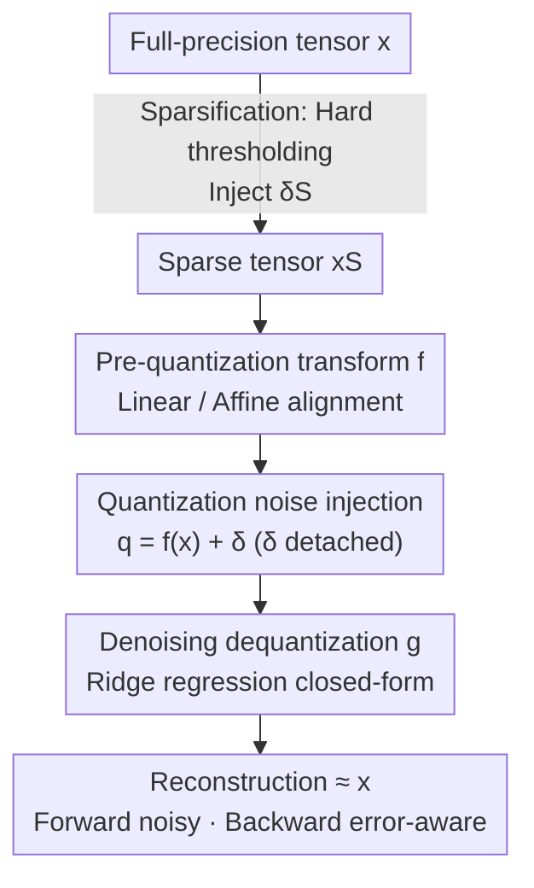

# Robust Training of Neural Networks at Arbitrary Precision and Sparsity

**Conference**: ICLR 2026  
**OpenReview**: [https://openreview.net/forum?id=e6nZrzSccj](https://openreview.net/forum?id=e6nZrzSccj)  
**Code**: Not provided (Pseudo-code snippets in PyTorch/JAX provided in the paper)  
**Area**: Model Compression  
**Keywords**: Quantization-Aware Training, STE, Dequantization, Ridge Regression, Structured Sparsity

## TL;DR
This paper argues that the instability in ultra-low-bit quantization training stems not from "non-differentiability" but from the fact that Straight-Through Estimator (STE) backpropagation is blind to quantization errors. By redefining quantization as additive noise and employing a denoising dequantization transform $g$ derived from ridge regression, the authors explicitly reintegrate errors into the gradient path, enabling stable training of A1W1 and even sub-1-bit networks under standard training recipes.

## Background & Motivation

**Background**: To fit large models into edge devices, quantization and sparsification are the primary techniques. However, operations like rounding or thresholding are non-differentiable. For over a decade, the community has relied on the Straight-Through Estimator (STE) for training quantized networks—performing real quantization in the forward pass while approximating the derivative of rounding as an identity mapping ($\frac{dq}{df(x)}=I$) in the backward pass to maintain gradient flow.

**Limitations of Prior Work**: STE performs adequately on high-bit, overparameterized large models. However, when applied to ultra-low-bit settings (especially A1W1, where both activations and weights are 1-bit) or small models with low redundancy, training often suffers from oscillations, divergence, or NaN issues. To mitigate this, practitioners have introduced numerous heuristic patches: extra normalization, learning rate scheduling, specific optimizers, and extensive fine-tuning—all of which are ad-hoc.

**Key Challenge**: The authors identify the root cause for the first time: the issue is not that quantization is "non-smooth," but the **absence of a gradient path that allows the model to learn to resist quantization noise**. Representing quantization as $y = s\cdot\text{round}(x/s)$ and defining the rounding error as $\delta = \text{round}(x/s) - x/s$, the forward pass becomes $y = x + s\cdot\delta$. In contrast, the STE backward pass sets $\frac{dy}{dx}=1$, causing $\delta$ to vanish from the gradients. This error affects the forward pass but receives no gradient, behaving like the "ghosts of departed quantities." Consequently, preceding layers remain unaware of the error and cannot learn to adapt to it.

**Goal**: To eliminate the need for empirical patches by providing a **well-defined gradient path without relying on proxy gradient estimation**, allowing ultra-low-bit and sparse training to converge stably with off-the-shelf training recipes.

**Key Insight**: Since $\delta$ is essentially noise, dequantization should be explicitly designed as a **denoising** step. By deriving dequantization parameters from the statistics of the noisy vector $q$, $\delta$ naturally enters the forward input and is propagated into the backward gradients via the chain rule.

**Core Idea**: Model dequantization as a ridge regression problem to derive a closed-form denoising dequantization transform $g$. This replaces the "blind" backward pass of STE with an error-sensitive gradient path for correction.

## Method

### Overall Architecture

The framework consists of a three-stage Quantization-Aware Training (QAT) pipeline that explicitly splits quantization into "noise injection + denoising" to ensure error visibility in both forward and backward passes. Given a full-precision tensor $x$: **Stage 1** applies a pre-quantization transform $f$ to map $x$ to a range suitable for rounding (linear $f(x)=x/s_f$ for zero-mean data, affine $f(x)=(x-b_f)/s_f$ for asymmetric data). **Stage 2** models rounding as additive error $q = f(x) + \delta$, where $\delta=\text{round}(f(x))-f(x)$ is detached (no gradients). **Stage 3** utilizes the denoising dequantization transform $g$ to map the noisy $q$ back to the high-precision domain to reconstruct $x$. The parameters of $g$ are solved via ridge regression using the statistics of $q$, ensuring $\delta$ is present in the input of $g$ and the backward gradient via the derivative of $g$ with respect to $q$. Sparsification is treated as a "special quantization that only zeros out small values" and is placed before Stage 1, reusing the same denoising path. For inference, affine quantization matrix multiplications are compressed into a fast formula to approximate linear quantization costs.

### Key Designs

**1. Quantization Noise Injection: Exposing STE's Blind Spot by Rewriting Rounding as Additive Error**

To address the root cause of ultra-low-bit training divergence, the authors first perform a critical rewriting: quantization is no longer viewed as an indifferentiable black box but as $q = f(x) + \delta$, where $\delta = \text{round}(f(x)) - f(x)$ is the rounding error. While seemingly a simple change in notation, it exposes the flaw in STE—STE approximates $\frac{dq}{df(x)}$ as identity, resulting in $\frac{dL}{dx}=\frac{dL}{dq}$, which completely erases $\delta$ in the backward pass. Thus, while the forward pass is "quantization-aware," the backward pass remains "quantization-ignorant." The error perturbs the forward output without providing corrective signals to preceding layers, leading to the accumulation of unmanaged perturbations and eventual divergence. Explicitly isolating and detaching $\delta$ allows it to be reconnected to the gradient in Stage 3.

**2. Denoising Dequantization Transform $g$: Building an Error-Correcting Gradient Path via Ridge Regression**

This is the central innovation of the paper, addressing the "blindness to $\delta$" in the backward pass. Standard dequantization merely reverses the scaling from Stage 1. Instead, the authors formulate dequantization as a ridge regression objective: for asymmetric data using an affine $g(q)=s_g\cdot q + b_g$, they solve:

$$\min_{s_g,b_g}\ \frac{1}{2N}\lVert s_g\cdot q + b_g\cdot\mathbf{1} - x\rVert^2 + \frac{\lambda}{2}s_g^2$$

This yields the closed-form dequantization vector $g(q)=\frac{\text{Cov}_{xq}}{\text{Var}_q+\lambda}(q-\bar q)+\bar x$. For zero-mean data, it simplifies to a more efficient linear $g(q)=s_g q$, where $s_g=\frac{\langle q,x\rangle}{\langle q,q\rangle+\lambda}$. This solves the STE blind spot because the forward input is the noisy $q=f(x)+\delta$, naturally containing the error. During backpropagation, $\frac{dL}{dq}=\frac{dL}{dg(q)}\frac{dg(q)}{dq}$, and since the scale/offset of $g$ are calculated from the statistics of $q$, the derivative $\frac{dg(q)}{dq}$ is shaped by $q$ (and thus $\delta$). The gradient becomes an explicit function of $\delta$, recovering the lost learning signal. The parameter $\lambda$ acts as a "denoising knob": as $\lambda\to\infty$, $s_g\to 0$, and dequantization reverts to the mean $\bar x$, ignoring noise. Experiments show $\lambda=0.01$ suffices for stability across all settings. The paper also notes that $g$ is structurally equivalent to a LayerNorm layer (with $\lambda$ analogous to $\epsilon$), making the computational overhead comparable to LayerNorm/RMSNorm.

**3. Sparsity as Special Quantization: A Unified Framework for Dual Compression**

To bridge the gap between separate training mechanisms for quantization and sparsification, the authors treat sparsification as a special case of quantization that maps unimportant values to zero. Both forms of compression are modeled as serial additive error injections: first, hard thresholding (e.g., 2:4 structured sparsity) is applied to the full-precision $x$, yielding sparsity error $\delta_S=\text{threshold}(x)-x$ and sparse tensor $x_S=x+\delta_S$. Then, $x_S$ enters the quantization pipeline, introducing a second error $\delta_Q$ to get $q=f(x_S)+\delta_Q$. The key is that the denoising transform $g$ operates on $q$ (containing "dual perturbations") to reconstruct the original dense high-precision $x$. Since the parameters of $g$ are derived from $q$'s statistics, it automatically learns to correct the joint error distribution of $\delta_S$ and $\delta_Q$. The backward pass thus becomes aware of the "total perturbation," making the network robust to both compression types simultaneously.

**4. Fast Formula for Affine Quantization Matmul: Making the Most Robust Solution Deployable**

While affine quantization (bilateral, per-channel) provides the highest quality, naive implementations expand $\tilde Y=\tilde X\tilde W$ into four additive terms, which is computationally expensive. The authors use a mean-centering identity $Y = (X-\bar x\mathbf 1^T)(W-\mathbf 1\bar w^T)+\bar x\bar w^T n$ to derive the theorem: bilateral per-channel affine dequantization can be written as:

$$\tilde Y = (s_X\cdot s_W^T)\odot(Q_X Q_W - \bar q_X\bar q_W^T n) + \bar x\bar w^T n$$

This represents "one standard linear quantization matmul + two cheap rank-1 corrections." The primary term is the standard integer matrix multiplication, supplemented by a subtraction term based on quantized means and an addition term reconstructing the output mean using original high-precision means. This reduces the overhead of affine quantization from four matrix terms to one integer matmul plus two low-rank corrections, achieving inference speeds nearly identical to linear quantization.

### Loss & Training
No additional training losses or proxy gradients are introduced. The parameters of the denoising dequantization $g$ are provided directly by the closed-form ridge regression solution. The only added hyperparameter is the regularization term $\lambda=0.01$ (unified across all experiments). All quantization experiments directly follow the BF16 baseline hyperparameters without specific scheduling. 1/2/4-bit quantization uses affine transforms, while ternary (1.5-bit) and structured sparsity use linear transforms. Sub-channel quantization (SCQ) with a block size of 128 is used for fine-grained quantization.

## Key Experimental Results

### Main Results

| Setting | Task/Model | Ours | Comparisons | Conclusion |
|------|-----------|------|------|------|
| A1W1 Training Stability | nanoGPT (Shakespeare, 11M) | Smooth convergence | STE / BitNet / ParetoQ diverge or high loss | Only method to converge stably at extreme bits |
| A1W1 (GPT-2 small 124M) | OpenWebText 25k steps | Stable convergence | STE/BitNet oscillatory val loss or NaN; ParetoQ poorly converged | Consistently stable on real-world tasks |
| A4W1 + 2:4 Sparsity | Gemma3 4B (C4) | 0.4517 | BF16 Gemma3 1B 0.4494 / A4W4 1B 0.4443 | Aggressive quantization on large models > High-precision small models |

Regarding affine vs. linear quantization under A1W1 SCQ128 (C4 accuracy): the proposed method achieves 0.3547 (Linear) and **0.3751** (Affine, a significant leap), whereas STE achieves 0.3399 (Linear) and 0.3397 (Affine, failing to utilize the extra expressive power of affine parameters). This demonstrates that only a stable backward pass can truly learn the optimal affine scale/bias.

### Ablation Study

| Configuration | Key Observation | Description |
|------|---------|------|
| A4W1 (Asymmetric Allocation) | Falls on the storage Pareto frontier | Retaining activation precision while aggressively compressing weights outperforms symmetric A2W2. |
| A4W1 + 2:4 Structured Sparsity | 0.4068 → 0.4080, halving FLOPs | Positive synergy: Higher accuracy with lower computation. |
| SCQ128 (Sub-channel) vs Hadamard | SCQ defines superior frontier | Localizing outlier impact within small blocks is more direct than complex rotation transforms. |
| $\lambda=0.01$ | Stable across all settings | A single regularization value suffices; no per-bit tuning needed. |

### Key Findings
- **Denoising dequantization $g$ is the source of stability**: It reintegrates the quantization error discarded by STE into the backward gradient, which is fundamental for training A1W1/sub-1-bit networks. Removing it reverts the model to STE's divergent behavior.
- **Asymmetric bit allocation is optimal**: The storage Pareto frontier does not lie at symmetric A2W2 but at A4W1 (high-precision activations + extremely low-bit weights), as weights are static and suitable for aggressive compression.
- **Positive synergy between sparsity and quantization**: Applying 2:4 sparsity to A4W1 reduces computation by half while slightly improving accuracy (0.4068 → 0.4080), rather than traditional accuracy-efficiency trade-offs.
- **Quantized Large Model > High-Precision Small Model**: At a fixed compute budget, an aggressively quantized 4B model is more accurate and efficient than a BF16/quantized 1B model.

## Highlights & Insights
- **Redefining the Problem**: For a decade, the community assumed quantization training was difficult due to "non-differentiability." This paper correctly identifies the absence of an error-aware gradient path as the root cause—a conceptual shift more valuable than another heuristic patch.
- **Ridge Regression = Denoising Dequantization = Normalization Layer**: The self-consistency of these three interpretations for $g$ is elegant. $\lambda$ serves as both a ridge regression regularizer and a LayerNorm $\epsilon$, naturally explaining the low overhead.
- **Unifying Sparsity and Quantization**: By modeling these as "serial additive error injections," the authors unify the structures under a single denoising path. This abstraction could potentially extend to other non-differentiable operations like low-rank or codebook quantization.
- **Affine Matmul Fast Formula**: Reducing bilateral affine quantization overhead to "linear quantization + two rank-1 corrections" proves that high quality and high efficiency are not mutually exclusive.

## Limitations & Future Work
- Energy comparisons rely on hardware-agnostic proxy costs (Sparsity Factor × Activation Bits × Weight Bits × Total Ops). The authors acknowledge that this omits dominant factors like data movement and quantization overhead, serving only as a first-order lower bound for arithmetic energy.
- Large-scale experiments are concentrated on Gemma3 1B/4B and nanoGPT/GPT-2. Performance on larger LLMs (e.g., 7B+) and over longer training horizons remains to be fully explored.
- The denoising transform depends on block-wise statistics of $q$. The sub-channel SCQ block size (128) is an implicit hyperparameter; the impact of block size on statistical estimation stability was not systematically ablated.
- Future directions: Making the ridge regression $\lambda$ learnable or layer-adaptive, and extending the denoising path to KV-cache quantization or post-training quantization (PTQ) scenarios.

## Related Work & Insights
- **vs STE / BitNet / ParetoQ**: These rely on proxy gradients (identity approximation) combined with ad-hoc recipes (extra normalization, modified LR/optimizers, bit-specific tuning). The proposed method avoids proxy estimation, deriving well-defined gradients from ridge regression. While others diverge or NaN under A1W1, this method converges smoothly and leverages the expressive power of affine quantization.
- **vs Hadamard Rotations (e.g., QuaRot)**: These methods "smear" outliers across dimensions. This paper also "mixes" them, but does so within the statistical calculations of the denoising parameters and localizes the impact via SCQ, yielding a better frontier and more direct implementation.
- **vs Spiking Neural Networks**: SNNs aim for similar efficiency via discrete pulses but suffer from non-differentiability. This robust 1-bit training achieves comparable computational sparsity within a standard gradient-based framework, offering a more practical alternative.

## Rating
- Novelty: ⭐⭐⭐⭐⭐ Redefines the root cause of ultra-low-bit instability from "non-differentiability" to "lack of error-correcting gradient path" and provides a solution via ridge regression.
- Experimental Thoroughness: ⭐⭐⭐⭐ Covers a range from nanoGPT to Gemma 4B and both storage/energy Pareto frontiers, though energy results are proxy-based and ultra-large model validation is light.
- Writing Quality: ⭐⭐⭐⭐⭐ Sharp diagnosis ("ghosts of departed quantities"), clear three-stage framework, and logical progression from normalization analogies to matmul optimizations.
- Value: ⭐⭐⭐⭐⭐ Enables stable A1W1/sub-1-bit training with standard recipes, providing a theoretically grounded universal solution for ultra-efficient edge networks.

<!-- RELATED:START -->

## Related Papers

- [\[ICLR 2026\] BEP: A Binary Error Propagation Algorithm for Binary Neural Networks Training](bep_a_binary_error_propagation_algorithm_for_binary_neural_networks_training.md)
- [\[ICLR 2026\] Robust Selective Activation with Randomized Temporal K-Winner-Take-All in Spiking Neural Networks for Continual Learning](robust_selective_activation_with_randomized_temporal_k-winner-take-all_in_spikin.md)
- [\[ICLR 2026\] Adaptive Width Neural Networks](adaptive_width_neural_networks.md)
- [\[ICLR 2026\] Towards Lossless Memory-efficient Training of Spiking Neural Networks via Gradient Checkpointing and Spike Compression](towards_lossless_memory-efficient_training_of_spiking_neural_networks_via_gradie.md)
- [\[ICLR 2026\] Cannistraci-Hebb Training on Ultra-Sparse Spiking Neural Networks](cannistraci-hebb_training_on_ultra-sparse_spiking_neural_networks.md)

<!-- RELATED:END -->
