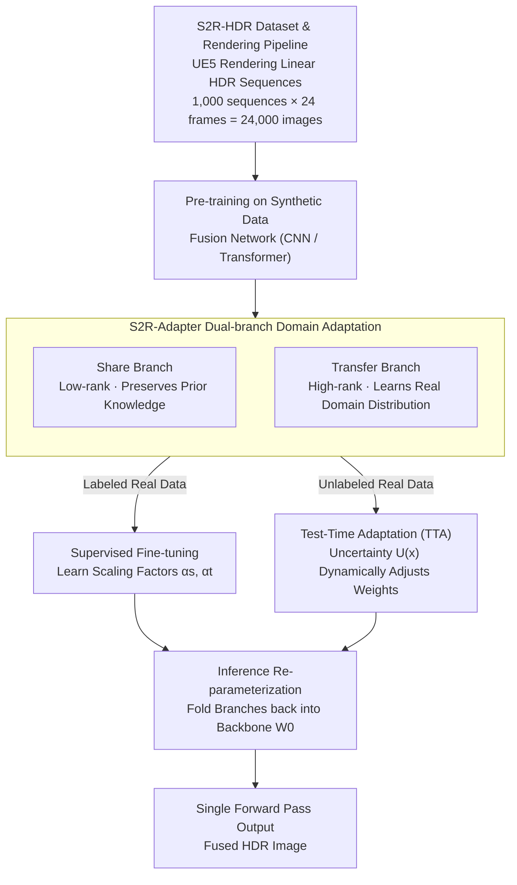

# S2R-HDR: A Large-Scale Rendered Dataset for HDR Fusion

## Basic Information

- **Conference**: ICLR 2026
- **arXiv**: [2504.07667](https://arxiv.org/abs/2504.07667)
- **Code**: [Project Page](https://openimaginglab.github.io/S2R-HDR)
- **Area**: Computer Vision / Image Processing
- **Keywords**: HDR Fusion, Synthetic Dataset, Domain Adaptation, Unreal Engine, Sim-to-Real

## TL;DR

Proposes S2R-HDR, the first large-scale high-quality synthetic HDR fusion dataset (24,000 samples), and designs S2R-Adapter, a domain adaptation method to bridge the synthetic-to-real gap, achieving SOTA HDR fusion performance on real-world datasets.

## Background & Motivation

### Background
HDR fusion is critical for computational photography and autonomous driving. However, existing HDR datasets are extremely small (maximum 144 images) and largely restricted to simple, manually controlled dynamic scenes, failing to cover extreme conditions like direct sunlight or large-scale motion.

### Limitations of Prior Work

- **Extremely Small Scale**: Kalantari (89 pairs), SCT (144 images), Challenge123 (123 images);
- **Simple Dynamics**: Most datasets only include basic human movement, lacking diverse dynamic elements like animals or vehicles;
- **Acquisition Difficulty**: Capturing real HDR ground truth requires frame-by-frame captures at different exposures with manual motion control, making it time-consuming and difficult to scale;
- **Limited Dynamic Range**: Beam splitters only support two exposures, failing to cover scenes with extremely high dynamic ranges.

### Mechanism
Leveraging Unreal Engine 5 to render high-quality synthetic HDR data, combined with domain adaptation techniques to bridge the synthetic-to-real gap.

## Method

### Overall Architecture

To solve the bottleneck of "insufficient and simplistic real HDR fusion data," the approach follows two steps: first, rendering a large-scale, scene-rich synthetic HDR dataset (S2R-HDR) using Unreal Engine 5 (UE5); second, employing a plug-and-play domain adaptation module (S2R-Adapter) to transfer models pre-trained on synthetic data to the real domain. The workflow consists of: UE5 rendering linear HDR sequences → pre-training fusion networks on 24,000 synthetic images → injecting S2R-Adapter into the backbone for domain adaptation (learning scaling factors for labeled data or test-time adaptation for unlabeled data) → re-parameterizing adapters back into the backbone during inference for zero overhead. Synthetic data provides scale and diversity, while domain adaptation fills the distribution gap.

### Key Designs

**1. S2R-HDR Dataset & Rendering Pipeline: Scaling from Hundreds to Tens of Thousands**

To address the limited scale and lack of extreme lighting in existing datasets, the authors bypass physical capture constraints using UE5 procedural rendering. Crucial modifications ensure rendering outputs are usable as HDR ground truth: default tone mapping and gamma correction in UE5 are modified to maintain outputs in linear HDR space; EXR floating-point format is used to avoid quantization loss; and handheld camera shake is simulated to mimic real-world acquisition. Scenes cover pedestrians, animals, vehicles, and varied environments (indoor/outdoor, day/dusk/night), including direct sunlight. The final dataset includes 24,000 HDR images (1,000 sequences × 24 frames) at 1920 × 1080 resolution, approximately **166 times** larger than previous real datasets.

**2. S2R-Adapter Dual-branch: Low-rank for Prior Knowledge, High-rank for New Distributions**

Even with realistic synthesis, texture distributions differ from real data. Standard fine-tuning risks overfitting or forgetting structural knowledge from the synthetic stage. S2R-Adapter parallelizes two adaptation branches with complementary ranks: the Share Branch uses a low-rank adapter to preserve shared synthetic knowledge,

$$
f_s = U_s V_s x, \quad r_s \ll \min(h_{in}, h_{out})
$$

while the Transfer Branch uses a high-rank adapter to learn domain-specific knowledge from real data,

$$
f_t = U_t V_t x, \quad r_t \geq \max(h_{in}, h_{out})
$$

Both branches are weighted by scaling factors and combined with the frozen backbone $W_0$:

$$
f = W_0 x + \alpha_s \times f_s + \alpha_t \times f_t
$$

This design allows the model to retain generalization while flexibly adapting to real-world distributions.

**3. Test-Time Adaptation (TTA): Dynamic Weight Adjustment via Uncertainty**

In scenarios where real HDR ground truth is unavailable, S2R-Adapter utilizes model uncertainty $\mathcal{U}(x)$ to automatically allocate weights:

$$
\alpha_s = 1 - \mathcal{U}(x); \quad \alpha_t = 1 + \mathcal{U}(x)
$$

$\mathcal{U}(x)$ measures the output variance of $N$ augmentations (exposure, white balance, noise, flips). Higher uncertainty indicates the sample deviates from synthetic priors, requiring more reliance on the Transfer Branch. This is implemented within a mean-teacher framework for continuous calibration during inference.

**4. Inference Re-parameterization: Zero-overhead Deployment**

Since adaptation branches are linear operators, $\alpha_s f_s + \alpha_t f_t$ can be folded back into the backbone weights $W_0$ after training. This ensures the inference phase remains a single forward pass without additional computation or memory overhead, making S2R-Adapter compatible with both CNN and Transformer architectures at zero cost.

## Key Experimental Results

### Main Results: HDR Fusion Performance on Real Datasets

| Method | SCT PSNR-μ | SCT SSIM-μ | Challenge123 PSNR-μ | Challenge123 SSIM-μ |
|------|-----------|-----------|---------------------|---------------------|
| DHDRNet | 40.05 | 0.9794 | 37.83 | 0.9707 |
| AHDRNet | 42.08 | 0.9837 | 40.44 | 0.9877 |
| HDR-Transformer | 42.39 | 0.9844 | 40.70 | 0.9881 |
| SCTNet | 42.55 | 0.9850 | 40.65 | — |
| EHDRNet (S2R-HDR) | 42.93 | 0.9858 | **42.15** | **0.9895** |
| **EHDRNet + S2R-Adapter** | **43.47** | **0.9871** | 41.89 | 0.9891 |

### Ablation Study: Domain Adaptation Component Analysis

| Configuration | SCT PSNR-μ | Challenge123 PSNR-μ |
|------|-----------|---------------------|
| S2R-HDR Training Only | 41.32 | 39.85 |
| + Share Branch | 42.15 | 40.71 |
| + Transfer Branch | 42.78 | 41.43 |
| + Share + Transfer (S2R-Adapter) | **43.47** | **42.15** |
| Direct Real Data Fine-tuning | 42.55 | 40.65 |

### Dataset Quality Comparison

| Metric | Kalantari | SCT | Challenge123 | **S2R-HDR** |
|------|----------|-----|-------------|------------|
| FHLP ↑ | 15.07 | 12.43 | 26.91 | **28.02** |
| EHL ↑ | 3.07 | 2.43 | 5.19 | **5.47** |
| SI ↑ | 18.4 | 18.25 | 20.47 | **38.02** |
| DR ↑ | 2.71 | 2.55 | 2.36 | **3.86** |
| Sample Size | 89 | 144 | 123 | **24,000** |

### Key Findings

1. **Models trained on S2R-HDR significantly outperform those trained on small real datasets**, despite the domain gap.
2. **S2R-Adapter effectively bridges the domain gap**, bringing significant improvements in both labeled and unlabeled scenarios.
3. **Dual-branch design outperforms single-branch**: Share and Transfer branches each contribute approximately 1 dB PSNR gain.
4. **Direct fine-tuning is inferior to S2R-Adapter**: Direct fine-tuning on real data leads to overfitting and knowledge forgetting.
5. **Effective in TTA mode**: Test-time adaptation improves performance by about 0.5 dB even without ground truth labels.

## Highlights & Insights

- First large-scale synthetic HDR fusion dataset with 24,000 samples covering diverse scenes and extreme lighting.
- Customized UE5 rendering pipeline maintains linear HDR space and simulates handheld motion blur.
- S2R-Adapter is plug-and-play and compatible with both CNN and Transformer architectures.
- Supports labeled domain adaptation and unlabeled test-time adaptation.
- Zero extra overhead at inference via re-parameterization.

## Limitations & Future Work

- Synthetic data still exhibits a texture distribution gap compared to real data (visible in t-SNE visualizations).
- Although diverse, rendered scenes are still finite and may not cover all real-world edge cases.
- UE5 rendering requires significant computational resources and artistic design effort.
- Domain adaptation efficacy depends on the representativeness of the calibration dataset.

## Related Work & Insights

- **HDR Datasets**: Kalantari et al. (2017), SCT (Tel et al., 2023), Challenge123 (Kong et al., 2024).
- **HDR Fusion Methods**: AHDRNet (Yan et al., 2019), HDR-Transformer (Liu et al., 2022), DiffHDR.
- **Sim-to-Real Domain Adaptation**: LoRA (Hu et al., 2021), TTA (Wang et al., 2022).
- **Synthetic Data**: Li et al. (2023) for depth estimation, Yang et al. (2023) for semantic segmentation.

## Rating

- Novelty: ⭐⭐⭐⭐ — First large-scale synthetic dataset for HDR, filling a significant gap.
- Technical Depth: ⭐⭐⭐⭐ — Comprehensive design covering rendering, dual-branch adapters, and TTA.
- Experimental Thoroughness: ⭐⭐⭐⭐ — Multi-benchmark comparisons and thorough ablation.
- Value: ⭐⭐⭐⭐⭐ — Both the dataset and methodology are directly applicable to HDR research and production.

<!-- RELATED:START -->

## Related Papers

- [\[AAAI 2026\] StepFun-Formalizer: Unlocking the Autoformalization Potential of LLMs Through Knowledge-Reasoning Fusion](../../AAAI2026/model_compression/stepfun-formalizer_unlocking_the_autoformalization_potential_of_llms_through_kno.md)
- [\[ICLR 2026\] Rethinking Continual Learning with Progressive Neural Collapse](rethinking_continual_learning_with_progressive_neural_collapse.md)
- [\[ICLR 2026\] UniFlow: A Unified Pixel Flow Tokenizer for Visual Understanding and Generation](uniflow_a_unified_pixel_flow_tokenizer_for_visual_understanding_and_generation.md)
- [\[ICLR 2026\] Revisiting Weight Regularization for Low-Rank Continual Learning](revisiting_weight_regularization_for_low-rank_continual_learning.md)
- [\[ICLR 2026\] SERE: Similarity-based Expert Re-routing for Efficient Batch Decoding in MoE Models](sere_similarity-based_expert_re-routing_for_efficient_batch_decoding_in_moe_mode.md)

<!-- RELATED:END -->
