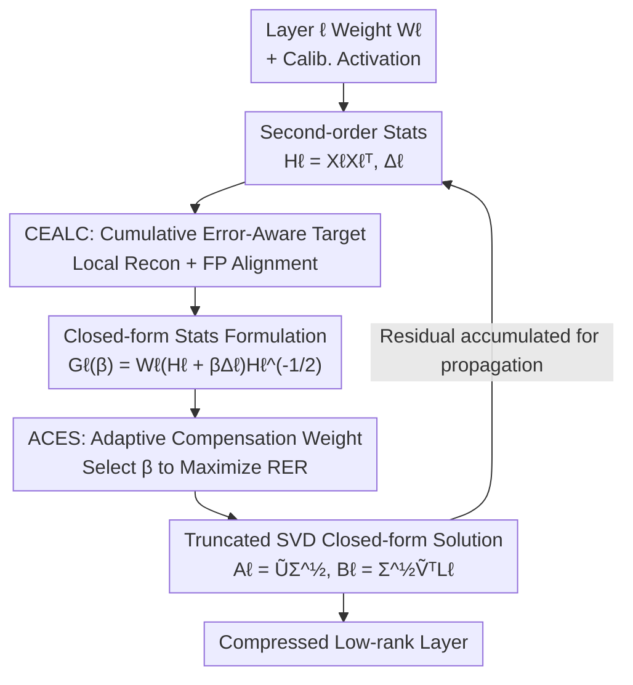

# SAES-SVD: Self-Adaptive Suppression of Accumulated and Local Errors for SVD-based LLM Compression

**Conference**: ICLR 2026  
**OpenReview**: [https://openreview.net/forum?id=KMAYsQO8pU](https://openreview.net/forum?id=KMAYsQO8pU)  
**Area**: Model Compression  
**Keywords**: SVD low-rank compression, accumulated error, closed-form solution, adaptive weights, LLM compression

## TL;DR
SAES-SVD explicitly incorporates a "full-precision reference output alignment" cumulative error compensation term into the objective of layer-wise SVD low-rank compression. It derives a closed-form solution relying only on second-order activation statistics and adaptively selects the optimal compensation weight for each layer. This ensures the compressed model's output remains close to the full-precision baseline—reducing the average accuracy drop of LLaMA-7B at a 0.2 compression ratio from >0.05 to approximately 0.02, without requiring fine-tuning or mixed-rank allocation.

## Background & Motivation
**Background**: The explosion in LLM size has generated significant demand for compression. Low-rank decomposition (typically via truncated SVD) is favored for being hardware-agnostic, plug-and-play, and stackable with quantization/pruning. It decomposes a weight matrix $W$ into two low-rank factors $A B$, directly reducing parameter count and computation. Mainstream advancements like ASVD, SVD-LLM, AdaSVD, and DipSVD focus on minimizing "single-layer reconstruction error" through activation-aware scaling, whitening transforms, iterative refinement, or importance weighting.

**Limitations of Prior Work**: These methods share a fundamental flaw: they minimize reconstruction errors **independently for each layer**, ignoring the propagation and accumulation of errors throughout the network. Compression errors in earlier layers alter the input distribution for subsequent layers, causing errors to snowball and significantly amplifying the deviation of the final output from the full-precision baseline. The authors validated this using SVD-LLM on LLaMA2-7B: despite achieving the theoretical minimum truncation error per layer, the cosine similarity between compressed and full-precision outputs plummeted from 0.97 in shallow layers to 0.79 in deep layers.

**Key Challenge**: "Layer-wise local optimality" does not equate to "end-to-end global fidelity." Each layer greedily optimizes its own reconstruction without considering that its input is already corrupted by upstream layers, nor does it take responsibility for downstream cumulative bias.

**Goal**: Transform traditional "independent layer optimization" into a "globally collaborative error suppression mechanism." Each layer should solve its local reconstruction error while actively compensating for upstream cumulative errors—all within a single SVD pass, without fine-tuning or mixed-rank allocation.

**Key Insight**: The authors observe that by adding a constraint to "align with the full-precision reference output $W_\ell X_\ell^f$" to the compression objective, the current layer can "perceive" upstream errors and actively correct them. Crucially, this new objective can still be formulated as a weighted Frobenius norm minimization problem, preserving the elegance of the SVD closed-form solution.

**Core Idea**: Replace the purely local reconstruction objective with a dual objective of "local reconstruction + full-precision alignment." Derive a closed-form low-rank solution based only on second-order activation statistics, and use an adaptive weight coefficient to dynamically balance the two, concentrating energy into the dominant singular subspace.

## Method

### Overall Architecture
SAES-SVD is a unified low-rank compression framework designed to suppress two types of errors: the current layer's reconstruction error and the cumulative bias from upstream layers. It consists of two components: **CEALC (Cumulative Error-Aware Layer Compression)**, which incorporates cumulative error compensation into the compression objective to derive a closed-form solution, and **ACES (Adaptive Collaborative Error Suppression)**, which automatically tunes the optimal compensation weight $\beta_\ell$ to utilize the rank budget effectively.

The overall process is a layer-wise sequential closed loop: for layer $\ell$, second-order statistics (input covariance $H_\ell$ and differential covariance $\Delta_\ell$) are collected from calibration data. CEALC then constructs the target matrix $G_\ell(\beta)$ compensated for cumulative error. ACES selects $\beta_\ell^\star$ to maximize the "Retained Energy Ratio." Finally, a truncated SVD on $G_\ell(\beta_\ell^\star)$ yields the closed-form solution $A_\ell, B_\ell$. The compressed residual of the current layer is accumulated into the statistics for the next layer, allowing downstream layers to "anticipate" and compensate for upstream errors.

### Key Designs

**1. CEALC: Letting the Compression Target "See" Upstream Corruption**

Traditional objectives only require $A_\ell B_\ell X_\ell$ to approximate the current output $W_\ell X_\ell$. Since $X_\ell$ is already corrupted by upstream compression, even a perfect reconstruction merely reproduces a "deviated input." CEALC introduces **Full-Precision Reference Alignment**: making the compressed layer's output align with what the output *should* have been if the input were full-precision, i.e., $W_\ell X_\ell^f$. The dual objective is formulated as a weighted Frobenius norm:

$$\arg\min_{A_\ell,B_\ell}\ \underbrace{\|(A_\ell B_\ell - W_\ell)X_\ell\|_F^2}_{\text{Intra-layer Recon Error}} + \alpha_\ell\underbrace{\|A_\ell B_\ell X_\ell - W_\ell X_\ell^f\|_F^2}_{\text{FP Reference Alignment}}$$

where $\alpha_\ell \ge 0$ controls the alignment strength. The authors prove that by letting $T_\ell = W_\ell X_\ell$ and $R_\ell = W_\ell X_\ell^f$, this dual objective simplifies to approximating a single "hybrid target" $Z_\ell = \frac{T_\ell + \alpha_\ell R_\ell}{1+\alpha_\ell}$ via $\min \|A_\ell B_\ell X_\ell - Z_\ell\|_F^2$. The brilliance of this step is that the objective remains a standard low-rank approximation problem, allowing the SVD closed-form approach to be fully retained while steering the "target" toward the full-precision direction.

**2. Closed-form Statistics Formulation: Solution Without Raw Activations**

Directly aligning with $X_\ell^f$ poses an engineering challenge: storing original activations and their full-precision counterparts requires prohibitive memory. CEALC solves this by rewriting the objective to **depend only on second-order statistics**. By defining the input covariance $H_\ell = X_\ell X_\ell^\top$ and differential covariance $\Delta_\ell = (X_\ell^f - X_\ell)X_\ell^\top$ (representing the upstream drift), the term $X_\ell^f X_\ell^\top$ simplifies to $H_\ell + \Delta_\ell$. The hybrid target becomes:

$$Z_\ell X_\ell^\top = W_\ell(H_\ell + \beta_\ell \Delta_\ell),\quad \beta_\ell := \frac{\alpha_\ell}{1+\alpha_\ell}\in[0,1)$$

Combined with the whitening matrix $L_\ell = H_\ell^{-1/2}$, the problem becomes finding the optimal low-rank approximation of $G_\ell = W_\ell(H_\ell + \beta\Delta_\ell)H_\ell^{-1/2}$. By the Eckart–Young–Mirsky theorem, a truncated SVD on $G_\ell$ yields the closed-form solution $A_\ell = \tilde U_{r_\ell}\Sigma_{r_\ell}^{1/2}$ and $B_\ell = \Sigma_{r_\ell}^{1/2}\tilde V_{r_\ell}^\top L_\ell$. This requires only batch collection of $H_\ell$ and $\Delta_\ell$, avoiding massive storage and adding negligible computational overhead.

**3. ACES: Optimal Rank Budget Allocation via Adaptive Weights**

Using a fixed $\beta_\ell$ across the network is problematic: different layers have varying sensitivity to cumulative errors. A uniform alignment strength may disrupt the low-rank structure of the weights, wasting truncation capacity by scattering spectral energy. The authors quantify "low-rank friendliness" using the **Retained Energy Ratio (RER)**—the ratio of the sum of the top-$k$ squared singular values to the total sum. ACES aims to select $\beta_\ell^\star$ for each layer that maximizes the RER.

To avoid computing SVD for every candidate $\beta$, the authors utilize a first-order approximation (FS-FOA Theorem 4.2): freezing the principal subspace at $\beta=0$ and approximating the truncation energy using the projection residual of $S_\ell = W_\ell H_\ell L_\ell$ outside the top-$r_\ell$ subspace. The relative error ratio becomes a rational function of $\beta$, $\tilde\rho(\beta) = \frac{a + 2b\beta + c\beta^2}{A + 2B\beta + C\beta^2}$. Setting its derivative to zero yields a quadratic equation. Solving for real roots in $[0,1]$ allows for the selection of the optimal $\beta_\ell^\star$ without repeated SVD passes.

### Loss & Training
The method is post-training and training-free: solutions are derived analytically for each layer without gradient backpropagation or mixed-rank allocation. CEALC and ACES form a **closed-loop compression mechanism**—each layer adaptively selects $\alpha_\ell$ to suppress newly introduced truncation errors while downstream layers pre-emptively compensate for upstream drift. In practice, the search interval for $\alpha$ in ACES is set to $[\alpha_{\min},\alpha_{\max}]=[0.25,0.75]$.

## Key Experimental Results

### Main Results
Evaluated on LLaMA-1/2/3 series. Perplexity was measured on WikiText2 and C4 (length 2048), and zero-shot accuracy covered 7 benchmarks (ARC-c/e, HellaSwag, MathQA, PIQA, WinoGrande, OpenbookQA). Baselines included ASVD, SVD-LLM, FW-SVD, Dobi-SVD, AdaSVD, and Dip-SVD (some requiring fine-tuning or mixed-rank).

LLaMA-7B Results (Selection, Avg↑ is the mean of 7 benchmarks, Drop↓ is relative to FP baseline):

| Ratio | Method | Wiki2↓ | C4↓ | Avg↑ | Drop↓ |
|-------|--------|--------|------|------|-------|
| 0.0 | Baseline | 5.68 | 7.34 | 0.52 | 0.0% |
| 0.2 | SVD-LLM† | 7.94 | 15.84 | 0.44 | 14.7% |
| 0.2 | Dobi-SVD∗† | 8.54 | 10.01 | 0.46 | 10.8% |
| 0.2 | Dip-SVD∗ | 7.95 | 14.07 | 0.47 | 9.2% |
| 0.2 | **Ours** | **7.17** | **13.77** | **0.50** | **3.9%** |
| 0.4 | Dip-SVD∗ | 12.76 | 34.35 | 0.40 | 22.8% |
| 0.4 | **Ours** | **10.42** | **32.79** | **0.41** | **21.1%** |
| 0.6 | Dobi-SVD∗† | 46.18 | — | 0.32 | 38.0% |
| 0.6 | **Ours** | **22.01** | 93.97 | **0.34** | **34.1%** |

At a 0.2 ratio, SAES-SVD restricts the accuracy drop to 3.9%, nearly halving the 9.2% drop of the strongest baseline, Dip-SVD. At a radical 0.6 ratio, perplexity (22.01) is halved compared to Dobi-SVD (46.18). On larger models (LLaMA-13B/30B), it maintains a lead; on 30B, Wiki2 PPL drops to 5.49 (vs ASVD 22.71, SVD-LLM 5.63). LLaMA3-8B achieves 1.29×–3.79× speedup on a single A6000 GPU.

### Ablation Study
Component-wise ablation (Avg Acc is mean of PIQA/ARC-e/HellaSwag/WinoGrande):

| Model | CEALC | ACES | Wiki PPL↓ | Avg Acc↑ |
|-------|-------|------|-----------|----------|
| LLaMA2-7B | × | × | 9.34 | 58.66 |
| LLaMA2-7B | ✓ | × | 7.66 | 62.02 |
| LLaMA2-7B | ✓ | ✓ | 7.37 | 63.03 |
| LLaMA3-8B | × | × | 16.59 | 55.76 |
| LLaMA3-8B | ✓ | × | 12.25 | 58.82 |
| LLaMA3-8B | ✓ | ✓ | 11.48 | 60.18 |

### Key Findings
- **CEALC is the Primary Driver**: Adding CEALC alone reduces LLaMA2-7B PPL from 9.34 to 7.66 and improves accuracy from 58.66 to 62.02, accounting for the bulk of the gain. ACES provides further refinement.
- **Robustness to $\alpha$ Range**: Optimal performance for LLaMA2-7B (0.2 ratio) is found around $[0.25, 0.75]$. Setting many layers to high alignment ($\alpha_{\min} > 0.8$) risks overfitting the calibration set, leading to accuracy drops.
- **Scalability**: Performance gains hold from 7B to 30B, outperforming methods that utilize complex fine-tuning or mixed-rank allocation.

## Highlights & Insights
- **Global Problem, Local Solution**: Cumulative error is inherently an end-to-end, coupled global issue. The authors transform it into a local objective via "full-precision reference alignment" that still permits a single-shot SVD solution—retaining efficiency while capturing global fidelity.
- **Efficiency through Second-order Statistics**: Using $H_\ell$ and $\Delta_\ell$ instead of raw activations compresses the required storage from orders of magnitude larger than parameters to a few matrices. This approach (reminiscent of GPTQ) is highly applicable to other post-training compression tasks.
- **First-order Approximation for Weights**: Using the RER metric and a frozen-subspace approximation to find $\beta^\star$ avoids prohibitive SVD re-computations, providing a reusable technique for "differentiating" discrete selection targets.

## Limitations & Future Work
- Collecting "full-precision activations $X_\ell^f$" requires a full-precision forward pass, which might be burdensome for extremely large models or sensitive to numerical stability (whitening via $H_\ell^{-1/2}$).
- The ACES $\beta^\star$ derivation relies on an approximation that identifies the principal subspace at $\beta=0$. If the subspace rotates significantly with $\beta$, the optimality of the approximation might degrade.
- The $\alpha$ search range is fixed to $[0.25, 0.75]$. Performance may be sensitive to calibration data distribution. Evaluation is currently limited to the LLaMA series and zero-shot tasks, lacking instruction-following or generation quality assessments.

## Related Work & Insights
- **vs SVD-LLM**: SVD-LLM uses whitening to achieve theoretical minimum layer-wise truncation but ignores error accumulation. SAES-SVD augments this with alignment terms to upgrade from "layer-wise optimal" to "end-to-end faithful."
- **vs ASVD / AdaSVD**: These rely on learnable scaling or iterative refinement, often assuming layer independence. SAES-SVD outperforms them using a single-pass closed-form solution.
- **vs Dip-SVD / FW-SVD**: These focus on importance weighting for layer stability. SAES-SVD takes a more direct approach by embedding cross-layer error accumulation into the optimization objective itself.

## Rating
- Novelty: ⭐⭐⭐⭐⭐ Explicitly embedding cumulative error into a closed-form SVD objective is both novel and technically sound.
- Experimental Thoroughness: ⭐⭐⭐⭐ Coverage of multiple scales and benchmarks is strong, though evaluation is mainly limited to LLaMA.
- Writing Quality: ⭐⭐⭐⭐ The derivation is complete and logical, with clear motivations and diagrams.
- Value: ⭐⭐⭐⭐⭐ High practical utility for deployment as it outperforms more complex methods without fine-tuning.

<!-- RELATED:START -->

## Related Papers

- [\[ICLR 2026\] Rethinking Residual Errors in Compensation-based LLM Quantization](rethinking_residual_errors_in_compensation-based_llm_quantization.md)
- [\[ICML 2026\] Swift-SVD: Theoretical Optimality Meets Practical Efficiency in Low-Rank LLM Compression](../../ICML2026/model_compression/swift-svd_theoretical_optimality_meets_practical_efficiency_in_low-rank_llm_comp.md)
- [\[ICLR 2026\] KBVQ-MoE: KLT-guided SVD with Bias-Corrected Vector Quantization for MoE Large Language Models](kbvq-moe_klt-guided_svd_with_bias-corrected_vector_quantization_for_moe_large_la.md)
- [\[ICLR 2026\] Adaptive Nonlinear Compression for Large Foundation Models](adaptive_nonlinear_compression_for_large_foundation_models.md)
- [\[ICLR 2026\] LeSTD: LLM Compression via Learning-based Sparse Tensor Decomposition](lestd_llm_compression_via_learning-based_sparse_tensor_decomposition.md)

<!-- RELATED:END -->
