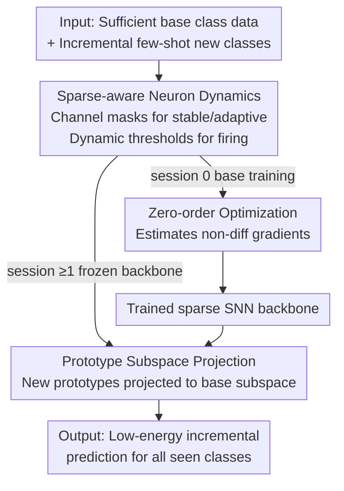

# SAFA-SNN: Sparse-aware Fast Adaptive Spiking Neural Network for On-device Few-Shot Class-Incremental Learning

**Conference**: ICLR 2026  
**OpenReview**: [https://openreview.net/forum?id=9jcB40wjk3](https://openreview.net/forum?id=9jcB40wjk3)  
**Code**: https://github.com/ZhangHuiJing2020/SAFA-SNN  
**Area**: Model Compression / On-device Learning / Spiking Neural Networks / Class-Incremental Learning  
**Keywords**: Spiking Neural Networks, Few-Shot Class-Incremental Learning, On-device Learning, Dynamic Threshold, Zero-order Optimization

## TL;DR
This paper proposes SAFA-SNN, which utilizes a "sparse-aware dynamic threshold + zero-order optimization + prototype orthogonal subspace projection" toolkit to enable Spiking Neural Networks (SNNs) to perform Few-Shot Class-Incremental Learning (FSCIL) on resource-constrained edge devices. It achieves a 4.01% higher accuracy than the second-best method in the final session of Mini-ImageNet and reduces training energy consumption by approximately 20% on CIFAR-100.

## Background & Motivation
**Background**: Edge devices need to continuously learn from streaming new class data with extremely few samples under privacy constraints and high labeling costs, a task known as on-device FSCIL. Existing mainstream FSCIL solutions are primarily based on Parameter-Efficient Fine-Tuning (PEFT) of Artificial Neural Networks (ANNs), which freeze a large pre-trained backbone and only fine-tune a small number of prompts or parameters.

**Limitations of Prior Work**: These ANN solutions are impractical for edge deployment—PEFT relies on large models with VRAM budgets of 4–12 GB, far exceeding the memory limits of smart devices. Moreover, communication in ANN neurons via dense floating-point multiplication imposes unbearable memory and computational overheads on the edge. Another line of research on on-device SNNs is mostly tied to specialized neuromorphic hardware, involving offline training and static deployment, which heavily relies on sufficient labeled data and cannot address real-time incremental scenarios at the edge.

**Key Challenge**: FSCIL requires balancing "plasticity (learning new classes)" and "stability (preserving old classes)"—simultaneously facing the challenges of catastrophic forgetting and overfitting. Edge deployment adds additional hard constraints on memory, energy consumption, and inference latency. While SNNs are event-driven and fire only upon activation, making them energy-efficient and neuromorphic-friendly, the regulation of the stability-plasticity trade-off using spike neuron firing dynamics has not been previously explored.

**Goal**: To develop the first SNN solution for general on-device FSCIL that simultaneously addresses three issues: (1) mitigating catastrophic forgetting; (2) handling the non-differentiability of spike activations that prevents backpropagation; and (3) overcoming overfitting caused by prototype bias in few-shot settings.

**Key Insight**: The authors observe that biological neural networks naturally form different "sub-networks" through distinct spike firing dynamics. They hypothesize that instead of modifying synaptic weights, one could regulate **neuron firing thresholds** to form task-specific sub-networks, allowing most neurons to maintain stable firing (preserving old knowledge) while a few neurons fire adaptively (learning new classes).

**Core Idea**: Use sparse-aware dynamic thresholds to divide neurons into "stable" and "adaptive" categories to naturally protect synaptic traces of old classes. Employ zero-order optimization to bypass the non-differentiability of spikes and use prototype orthogonal subspace projection to correct the bias of few-shot new class prototypes.

## Method

### Overall Architecture
SAFA-SNN is built upon Leaky Integrate-and-Fire (LIF) neurons. The process consists of two stages: the **base training phase** (session 0, sufficient data) and the **incremental inference phase** (sessions 1...S, each being an N-way K-shot few-shot task). It addresses how a single lightweight SNN can first learn effectively on base classes and then integrate new classes on-device using only a few samples without forgetting old classes or consuming excessive power.

The three core components have clear functions: (a) **Sparse-aware neuron dynamics** are utilized throughout the process, dividing neurons into stable/adaptive groups via channel masks and controlling firing via dynamic thresholds; (b) **Zero-order optimization** is used only during base class training in session 0 to estimate gradients for non-differentiable terms $\partial S_t / \partial U_t$; (c) **Prototype subspace projection** is used only during the incremental phase, where the backbone is frozen and only the classifier prototypes are updated by projecting new class prototypes onto the subspace spanned by base classes to debias them. This forms a complete pipeline: "sparse-aware base training → frozen backbone → few-shot projection-corrected new prototypes."

### Key Designs

**1. Sparse-aware Neuron Dynamics: Allocating plasticity between "stable/adaptive" neurons using dynamic thresholds**

This design directly addresses the "plasticity-stability" trade-off. Instead of altering synaptic weights, a random mask $M=\{m_c\}$ is assigned to each channel, where $m_c = \mathbb{1}_{c \le \lfloor \eta C \rfloor}$ and $\eta \in (0,1)$ is the adaptive ratio. Neurons in a few channels ($m_c=1$) are "adaptive," allowing significant threshold changes to learn new classes; neurons in most channels are "stable," with almost fixed thresholds to maintain firing rates consistent with base training, naturally preserving synaptic traces of old knowledge. This echoes biological homeostatic plasticity rules where stable neurons maintain firing frequencies close to those during base training.

Specifically, sparsity is defined as the channel-level firing rate $r = \frac{1}{|\Omega|}\sum_{(b,t,n)\in\Omega} S(b,t,n)$, and a threshold adjustment factor is set as:
$$A = \beta(1-M) + \gamma M,$$
where $\beta > \gamma$ ensures that the thresholds of adaptive neurons change more freely than those of stable neurons. Thresholds are updated dynamically based on the difference between the current task firing rate $r_c$ and the base firing rate $r_b$: $U'_{th} = U_{th} + A(r_c - r_b)$. When a group of neurons deviates too much from the base firing rate, the threshold is pushed back to suppress unnecessary synaptic updates. This is the essence of "sparse-aware": permitting plasticity for new tasks only in a few adaptive neurons while maintaining sparse, stable spike patterns in the rest.

**2. Zero-order Optimization: Bypassing non-differentiable BP via function value estimation**

Spike activation $S_t = H(U'_t - U_{th})$ is the Heaviside step function, and $\partial S_t / \partial U_t$ is non-differentiable. Conventional methods use surrogate gradients (SG), but SG often has large deviations from the true gradient, limited width, and suffers from vanishing gradients. This paper adopts Zero-order Optimization (ZOO), a gradient-free method that approximates gradients using only function values.

A symmetric two-point finite difference is used for estimation. Let $u = u_t - u_{th}$; the single-sample estimate is:
$$g_2(u; \delta, z) = \frac{H(u+\delta z) - H(u-\delta z)}{2\delta} z = \begin{cases} 0, & |u| > \delta|z| \\ \frac{|z|}{2\delta}, & |u| < \delta|z| \end{cases},$$
which determines the gradient by checking if perturbations $u \pm z\delta$ trigger a spike. Averaging over $b$ i.i.d. sampled points $\{z_i\}$ yields $\partial S_t / \partial U_t := \frac{1}{b}\sum_{i=1}^{b} g_2(u; \delta, z_i)$, where multi-point averaging makes the estimate robust across neighborhoods. The convergence analysis shows the squared gradient norm bound is $O(\delta^2 + 1/b)$ and the convergence upper bound is $O(1/\sqrt{T})$, indicating that ZOO converges controllably even for non-convex spike optimization. ZOO is only applied during base training in session 0.

**3. Fast Adaptive Prototype Subspace Projection: Debiasing new class prototypes by projecting onto the base subspace**

During the incremental stage, the backbone is frozen, and only classifier prototypes are updated. However, few-shot new class prototypes (feature means) have narrow distributions and are prone to bias and overfitting toward base classes. The authors propose orthogonal subspace projection in two steps: first, construct a generalized inverse projection operator from normalized base prototypes $\tilde{B}$:
$$G = \tilde{B}(\tilde{B}^\top \tilde{B})^{-1}\tilde{B}^\top,$$
where the normalization term $\tilde{B}^\top\tilde{B}$ is necessary because the subspace basis is not guaranteed to be orthogonal. The new class prototype $\tilde{C}$ is projected onto the base subspace to obtain $\tilde{P}_{proj} = \tilde{C}G$, and then fused with the original prototype via a convex combination:
$$\tilde{P} = (1-\alpha)\tilde{C} + \alpha\tilde{P}_{proj}.$$
A larger projection magnitude indicates higher cosine similarity and contribution from the base classes, resulting in a corrected prototype that is closer to the expected semantic direction and more discriminative. This step incurs almost zero additional training cost, providing "fast adaptation."

### Loss & Training
The total loss for base training combines Temporal Error Transformation (TET) and MSE:
$$L = (1-\lambda)\frac{1}{T}\sum_{t=1}^{T} L_{CE}(u_t, y) + \lambda L_{MSE}(u_t, y),$$
where $T$ is the number of time steps and $\lambda$ balances the contribution of temporal prediction error and MSE. Key hyperparameters: learning rate 0.001, $\beta=1.2$, number of samples $b=5$, perturbation $\delta=0.5$; CIFAR-100/Mini-ImageNet were trained for 300 epochs (batch size 128), and neuromorphic datasets for 100 epochs. All experiments were conducted on an NVIDIA Jetson AGX Orin across three random seeds.

## Key Experimental Results

### Main Results
On Mini-ImageNet with 8 incremental 5-way 5-shot sessions, SAFA-SNN leads throughout:

| Dataset | Metric | SAFA-SNN | Suboptimal (CLOSER-SNN) | Gain |
|--------|------|----------|------------------|------|
| Mini-ImageNet | Last Session Acc | 48.70% | 44.69% | +4.01% |
| Mini-ImageNet | Average Acc $A_{avg}$ | 59.45% | 53.38% | +6.07% |
| Mini-ImageNet | First Session Acc | 74.66% | 65.88% | +8.78% |

It also outperforms WARP/TEEN on three neuromorphic datasets:

| Dataset | Metric | SAFA-SNN | TEEN | WARP |
|--------|------|----------|------|------|
| CIFAR10-DVS | $A_{last}$ | 36.96% | 34.60% | 12.75% |
| DVS128 Gesture | $A_{last}$ | 77.91% | 74.31% | 13.02% |
| N-Caltech101 | $A_{last}$ | 39.69% | 27.86% | 14.40% |

Compared with SNN training methods (Mini-ImageNet, Spiking VGG-9): SAFA-SNN has only 22.63M parameters (compared to 106.87M for SLTT), with $A_{last}$ of 49.25% vs 32.58% for SLTT, and Harmonic Accuracy $A_h$ of 24.67% vs 18.93%, demonstrating smaller size and higher accuracy.

### Ablation Study
Verifying the three components (SA: Sparse-aware Dynamics, ZOO: Zero-order Optimization, SP: Subspace Projection):

| Configuration | Relative Performance | Description |
|------|---------|------|
| SA only | Lowest (baseline) | Dynamic thresholding only, no featurespace adjustment |
| SA + SP | Significant Improvement | Extracts more informative features from base prototypes after projection |
| Full SAFA-SNN (SA+ZOO+SP) | Highest | Adds ZOO for gradient estimation, resulting in the highest curve |

### Key Findings
- **SP (Subspace Projection) contributes the most**: SA alone performs worst due to lack of feature space adjustment; once SP is added, incremental accuracy jumps significantly, indicating that prototype debiasing is the bottleneck in few-shot scenarios.
- **Substantial energy and efficiency gains**: On Jetson Orin, SAFA-SNN (Spiking ResNet20) consumes ~12624 J, roughly 20% lower than the baseline (~15752 J). Training time is also superior because it does not modify synaptic weights or parameters.
- **High and robust sparsity**: Even with $T=2,3,4$, firing sparsity reaches 80%, balancing sparsity and accuracy and validating computational efficiency.
- **Increasing shots improves performance with diminishing returns**: Accuracy rises from 1-shot to 50-shot on DVS128 Gesture/CIFAR10-DVS, proving robustness to sample size.

## Highlights & Insights
- **"Fixed Weights, Regulated Thresholds" sub-network perspective**: Shifting the plasticity-stability trade-off from "synaptic weights" to "neuron firing thresholds" provides a lever unique to SNNs. The channel mask allows most neurons to stay stable while others adapt, fitting the low-power requirements of edge devices.
- **Replacing Surrogate Gradients with Zero-order Optimization**: This is an interesting application of ZOO for on-device SNN training, bypassing traditional SG issues like vanishing gradients. Since it is only used in base training, it adds no incremental cost and is supported by convergence proofs.
- **Zero-cost Prototype Subspace Projection**: Using the generalized inverse of base prototypes to pull new class prototypes back toward semantic directions involves only matrix operations without training. This is ideal for the "few-shot + on-device + fast adaptive" constraints.

## Limitations & Future Work
- **Degradation in Deep Networks**: Performance drops in deeper networks like Spiking ResNet-34 due to identity mapping failure; the authors suggest SEW-style residual connections as a mitigation.
- **Idealized Fixed Way-Shot Assumption**: Fixed class counts per session simplify real data streams; future work should handle imbalanced way-shot settings.
- **Accuracy Gap with ANN-PEFT**: ANN-based PEFT (pre-trained on ImageNet-1K) still has slightly higher accuracy. SAFA-SNN prioritizes efficiency and deployability over absolute accuracy ceilings.
- **Random Channel Masks**: The division of stable/adaptive neurons currently uses random masks; exploring importance-based partitioning strategies could be valuable.

## Related Work & Insights
- **vs CLOSER / TEEN (SNN versions of ANN-based FSCIL)**: These follow the prototype classifier + frozen backbone paradigm but lack spike-level stability regulation. This paper protects old knowledge at the neuron firing level, yielding 4.01% higher last-session accuracy.
- **vs SG-trained SNNs**: SGs use fixed-width approximations for non-differentiable spikes and are prone to vanishing gradients. This paper uses ZOO to estimate gradients using only function values, offering a more theoretically grounded approach.
- **vs On-device SNNs (e.g., Lite-SNN, SNN Pruning)**: Those focus on inference compression or specialized hardware, often for static deployment. This paper supports both base training and incremental inference for dynamic on-device FSCIL.
- **vs Subspace Regularization (WARP, Subspace-reg)**: While those methods use space compression for parameter representation, the orthogonal subspace projection here specifically corrects few-shot prototype bias, consistently leading with ResNet backbones.

## Rating
- Novelty: ⭐⭐⭐⭐⭐ First SNN solution for general on-device FSCIL; the combination of threshold-regulated sub-networks, ZOO, and prototype projection is highly novel.
- Experimental Thoroughness: ⭐⭐⭐⭐⭐ 5 datasets, multiple Spiking backbones, real-device energy/time measurements, and complete ablation studies.
- Writing Quality: ⭐⭐⭐⭐ Clear methodology and formulas, though some details are pushed to the appendix, making the main text slightly dense.
- Value: ⭐⭐⭐⭐ Clear application for low-power on-device incremental learning; the 20% energy reduction is convincing.

<!-- RELATED:START -->

## Related Papers

- [\[CVPR 2025\] Tripartite Weight-Space Ensemble for Few-Shot Class-Incremental Learning](../../CVPR2025/model_compression/tripartite_weight-space_ensemble_for_few-shot_class-incremental_learning.md)
- [\[ICLR 2026\] Cannistraci-Hebb Training on Ultra-Sparse Spiking Neural Networks](cannistraci-hebb_training_on_ultra-sparse_spiking_neural_networks.md)
- [\[ICLR 2026\] Robust Selective Activation with Randomized Temporal K-Winner-Take-All in Spiking Neural Networks for Continual Learning](robust_selective_activation_with_randomized_temporal_k-winner-take-all_in_spikin.md)
- [\[ICLR 2026\] Beyond Student: An Asymmetric Network for Neural Network Inheritance](beyond_student_an_asymmetric_network_for_neural_network_inheritance.md)
- [\[AAAI 2026\] A Closer Look at Knowledge Distillation in Spiking Neural Network Training](../../AAAI2026/model_compression/a_closer_look_at_knowledge_distillation_in_spiking_neural_ne.md)

<!-- RELATED:END -->
