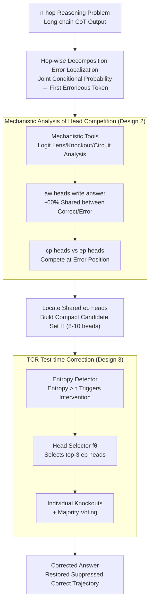

# Scaling Reasoning Hop Exposes Weaknesses: Demystifying and Improving Hop Generalization in Large Language Models

**Conference**: ICLR 2026  
**arXiv**: [2601.21214](https://arxiv.org/abs/2601.21214)  
**Area**: Model Compression/LLM Interpretability  
**Keywords**: reasoning hop generalization, Chain-of-Thought, attention head competition mechanism, erroneous processing heads, test-time intervention  

## TL;DR

This work systematically reveals the internal mechanism behind Large Language Model (LLM) failures in reasoning hop generalization—specifically, the competition between attention heads driving correct versus erroneous reasoning trajectories. The authors propose TCR (Test-time Correction of Reasoning), which dynamically identifies and deactivates erroneous processing heads (ep heads) during inference, achieving an average accuracy improvement of 5-7%.

## Background & Motivation

- **Background**: Chain-of-Thought (CoT) reasoning has become the standard paradigm for LLMs to solve complex problems. However, performance degrades sharply when the number of reasoning steps required at test time exceeds the training distribution (known as reasoning hop generalization).
- **Limitations of Prior Work**: For instance, 3×8 bit multiplication requires the same skills as 2×2 bit multiplication, yet performance declines significantly in multi-hop versions. Existing solutions either require post-training on downstream data (Hu et al., 2025) or architectural modifications (e.g., the looped transformer by Fan et al., 2025), making them incompatible with the out-of-the-box reasoning capabilities of off-the-shelf LLMs.
- **Key Challenge**: There is an insufficient understanding of the internal mechanisms causing hop generalization failure. Existing interpretability tools primarily target simple local prediction tasks (e.g., factual recall, simple arithmetic), making them difficult to apply directly to long-chain CoT reasoning involving hundreds of tokens.
- **Key Insight**: Starting from an error-centric perspective, this work first systematically identifies key error types and their corresponding token positions. It then employs mechanistic interpretability tools (Logit Lens, Knockout, Circuit Analysis) to explore the internal dynamics.
- **Core Idea**: LLMs internally maintain both correct and erroneous reasoning trajectories driven by different attention heads. Erroneous processing heads (ep heads) lead to reasoning failure by amplifying error signals and suppressing correct ones. Deactivating these ep heads can restore correct predictions.

## Method

### Overall Architecture

The study aims to determine why LLMs succeed at reasoning skills during training (e.g., two-digit multiplication) but fail when the required hops are extended (e.g., three-digit multiplication). The work consists of two interconnected steps: first, a **mechanistic analysis** to locate the "pathology" at the attention-head level, and second, the design of a **test-time intervention method (TCR)** to address it.

The mechanistic analysis follows an "error-centric" route: instead of analyzing the entire long-chain CoT, it decomposes the chain into individual hops to identify the most frequent error types and specific error token positions. Tools like Logit Lens, Knockout, and Circuit Analysis are then used to examine the internal state at those positions. The conclusion is that correct and erroneous trajectories coexist within the LLM; the dominance of one over the other determines the final answer. TCR operationalizes this insight by using entropy during generation to detect suspicious error positions and employing a trained head selector to choose which "erroneous processing head" to deactivate, steering the answer back to the correct path.

### Key Designs

**1. Systematic Decomposition of Reasoning Errors: Granular Analysis of CoT**

Analyzing a CoT with hundreds of tokens is impractical. Thus, the first step is hop-wise decomposition. For an $n$-hop problem $x \to r_1 \to \cdots \to r_n \to y$, the overall CoT accuracy is decomposed into the product of hop-wise conditional probabilities: $p(r_1, \ldots, r_n, y \mid x) = \prod_{i=1}^{n} p(r_i \mid x, r_1, \ldots, r_{i-1}) \cdot p(y \mid x, r_1, \ldots, r_n)$. This allows precise localization of the first erroneous token. A critical observation followed: errors are highly concentrated, with 1-2 key error types accounting for $\ge 30\%$ of failures. For example, in the Parity-NL 50-hop task, 78.6% of errors stem from a single pattern: "misrecalling the parity of a name." Such concentration suggests a coherent underlying mechanism rather than random noise.

**2. Competition Mechanism of Attention Heads: A Tug-of-War for the Output**

This is the core discovery of the paper. Reasoning circuit attention heads are categorized into three types. **Answer-Writing Heads (aw heads)**, located in middle-to-deep layers (e.g., layers 20-26), are responsible for writing answer information into the residual stream. To locate them accurately, the authors designed an improved metric $s_{\text{aw-head}}(\mathbf{a}_i^l)$ (Eq. 4), which uses knockout effects for normalization to counteract probability scale differences across layers. Interestingly, correct and erroneous predictions share approximately 60% of aw heads. These heads encode signals for both correct and incorrect tokens; they are the "writers," but other heads decide what is written.

Decision-making happens in the shallow-to-middle layer **Processing Heads**. These are split into **Correct Processing Heads (cp heads, $\mathcal{H}_{cp}$)** and **Erroneous Processing Heads (ep heads, $\mathcal{H}_{ep}$)**, which are almost entirely disjoint. Additionally, **Basic Heads ($\mathcal{H}_{basic}$)** extract fundamental input information for both pathways. Competition occurs at critical error positions: ep heads amplify spurious signals and suppress correct ones, causing the probability of the wrong token to overtake the correct one. Conversely, deactivating a single ep head can "revive" the suppressed correct circuit. 93.3% of the mechanisms in corrected predictions align with those of originally correct samples, proving the correct trajectory was present but inhibited.

This explains why more hops lead to more errors: longer chains increase input size and the number of states to track, making retrieval for $\mathcal{H}_{cp}$ harder. Simultaneously, when hops exceed the training distribution, the correct trajectory is more frequently overridden by $\mathcal{H}_{ep}$, which often relies on local patterns or shortcut reasoning.

**3. TCR: Translating Mechanistic Insights into Test-time Correction**

Since the "pathology" lies in a few unruly ep heads at key positions, TCR dynamically deactivates them using three components. First is the **Candidate ep head set construction**: $\mathcal{H}_{ep}$ are located across five representative tasks, selecting only "shared heads" that appear repeatedly across different tasks and error types. This results in a compact set $\mathbf{H}$ (8 for Qwen2.5-7B, 9 for Phi-3 and Qwen3-8B, 10 for LLaMA3-8B). Second is the **Head Selector**: a classifier $f_\theta(\cdot)$ (Qwen2.5-0.5B fine-tuned with LoRA) identifies which head to deactivate based on context. Third is the **Entropy Detector**: it monitors prediction entropy per token. If entropy exceeds a threshold $\tau$, intervention is triggered—the top-3 selected heads are knocked out individually, and the final correction is decided via majority voting.

## Key Experimental Results

### Main Results: TCR Performance across 7 Tasks × 4 LLMs

| Method | Parity-NL | MDM | LLC | CLF | MOAS | ObjC | NumS | Average |
|---|---|---|---|---|---|---|---|---|
| Qwen2.5-7B Base | 48.3% | 43.0% | 11.7% | 56.8% | 39.2% | 52.0% | 41.1% | 41.7% |
| +DoLa | 58.1% | 38.5% | 8.0% | 52.3% | 40.0% | 52.3% | 48.7% | 42.6% |
| **+TCR** | **60.4%** | **48.2%** | **16.2%** | **66.6%** | **46.0%** | **56.0%** | **46.0%** | **48.5% (+6.8%)** |
| **+TCR-gold** | **81.2%** | **58.3%** | **23.0%** | **71.3%** | **62.0%** | **76.0%** | **54.5%** | **61.3% (+19.6%)** |
| LLaMA3-8B Base | 70.0% | 0.0% | 81.0% | 15.2% | 22.9% | 68.8% | 4.5% | 37.5% |
| **+TCR** | **82.0%** | 0.0% | **82.3%** | **28.2%** | **39.4%** | 67.8% | **7.8%** | **43.9% (+6.4%)** |
| **+TCR-gold** | **88.0%** | 0.0% | **90.7%** | **32.7%** | **47.0%** | **76.4%** | **10.1%** | **49.3% (+11.8%)** |

### Head Selector Generalization (Hit@1 Accuracy)

| Model | In-Distribution (ID) | Out-of-Distribution (OOD) |
|---|---|---|
| Qwen2.5-7B-Instruct | 79.6% | 53.4% |
| Phi-3-Instruct | 75.2% | 58.2% |
| LLaMA3-8B-Instruct | 80.8% | 35.5% |
| Qwen3-8B-Instruct | 87.2% | 82.2% |

### Key Findings

1. TCR consistently improves reasoning hop generalization across four models by an average of 5-7%; TCR-gold (using ground-truth error localization) shows a potential ceiling improvement of nearly 20% on Qwen2.5.
2. DoLa (contrastive decoding for hallucination mitigation) shows marginal or negative effects in reasoning scenarios, indicating that reasoning errors differ fundamentally from factual hallucinations.
3. While Qwen3-8B is nearly saturated on some tasks (98.7% on Parity-NL), TCR-gold still provides a 22.4% boost on the challenging MDM task.
4. Corrected predictions show 93.3% overlap in cp heads with original correct predictions, confirming that the correct reasoning circuit exists but is suppressed.

## Highlights & Insights

1. **Impact of Core Discovery**: The revelation that correct and erroneous reasoning trajectories run in parallel, with the outcome decided by a few competing attention heads, provides a novel perspective on LLM failure.
2. **Methodological Innovation**: The improved answer-writing head localization metric (Eq. 4) addresses layer-wise probability scale differences, making it more reliable than standard Logit Lens.
3. **Cross-task Shared ep heads**: The high overlap of ep heads across different tasks and error types allows for a compact, universal candidate set (8-10 heads).
4. **Insight from TCR-gold**: The jump from 41.7% to 61.3% with an oracle detector suggests LLMs possess latent reasoning capabilities far beyond their current performance, hindered only by erroneous mechanisms.

## Limitations & Future Work

1. **Simplistic Entropy Detector**: The fixed threshold $\tau$ causes "false alarms" (interpreting normal high-entropy tokens as errors), explaining the gap between TCR and TCR-gold (6.8% vs 19.6%).
2. **Limited OOD Generalization of Head Selector**: The Hit@1 for LLaMA3 OOD is only 35.5%, showing significant activation pattern differences for ep heads across tasks.
3. **Manual Effort for Candidate Set**: Building the candidate set requires per-task mechanistic analysis and manual intersection.
4. **Task Scope**: The method was validated only on symbolic, mathematical, and coding tasks; its effectiveness on Natural Language Inference (NLI) or planning is unknown.
5. **Efficiency**: Majority voting introduces overhead (3 knockouts + regenerations).
6. **Inference Models**: Compatibility with models like o1/R1 remains unverified.

## Related Work & Insights

- **Reasoning Hop Generalization**: Dziri et al. (2023) attributed issues to error accumulation; Hu et al. (2025) proposed rule-recitation fine-tuning. This work is the first to explain it via attention head competition.
- **Mechanistic Analysis**: Extends circuit analysis (Wang et al., 2023) and causal mediation (Meng et al., 2022) from simple tasks to long-chain CoT.
- **Intervention**: Unlike DoLa (Chuang et al., 2024), which uses contrastive layers, the knockout intervention is more surgical and effective for reasoning.
- **Insight**: The shared nature of ep heads implies a potential "universal error reasoning module" in LLMs, which could be targeted via systematic circuit editing.

## Rating

⭐⭐⭐⭐ (4/5)

- **Novelty**: ⭐⭐⭐⭐⭐ First to reveal the competition mechanism in hop generalization.
- **Experiments**: ⭐⭐⭐⭐ Comprehensive coverage of 7 tasks and 4 models.
- **Writing**: ⭐⭐⭐⭐ Clear problem definition and rigorous logic; Figure 1 is highly intuitive.
- **Value**: ⭐⭐⭐ Requires a pre-trained selector, and the gap between TCR and TCR-gold limits practical gain.

<!-- RELATED:START -->

## Related Papers

- [\[ICLR 2026\] A Fano-Style Accuracy Upper Bound for LLM Single-Pass Reasoning in Multi-Hop QA](a_fano-style_accuracy_upper_bound_for_llm_single-pass_reasoning_in_multi-hop_qa.md)
- [\[ICLR 2026\] Landscape of Thoughts: Visualizing the Reasoning Process of Large Language Models](landscape_of_thoughts_visualizing_the_reasoning_process_of_large_language_models.md)
- [\[ICLR 2026\] SPARTA: Scalable and Principled Benchmark of Tree-Structured Multi-hop QA over Text and Tables](sparta_scalable_and_principled_benchmark_of_tree-structured_multi-hop_qa_over_te.md)
- [\[ICLR 2026\] BeyondBench: Contamination-Resistant Evaluation of Reasoning in Language Models](beyondbench_contamination-resistant_evaluation_of_reasoning_in_language_models.md)
- [\[ICML 2026\] Model Merging Scaling Laws in Large Language Models](../../ICML2026/model_compression/model_merging_scaling_laws_in_large_language_models.md)

<!-- RELATED:END -->
