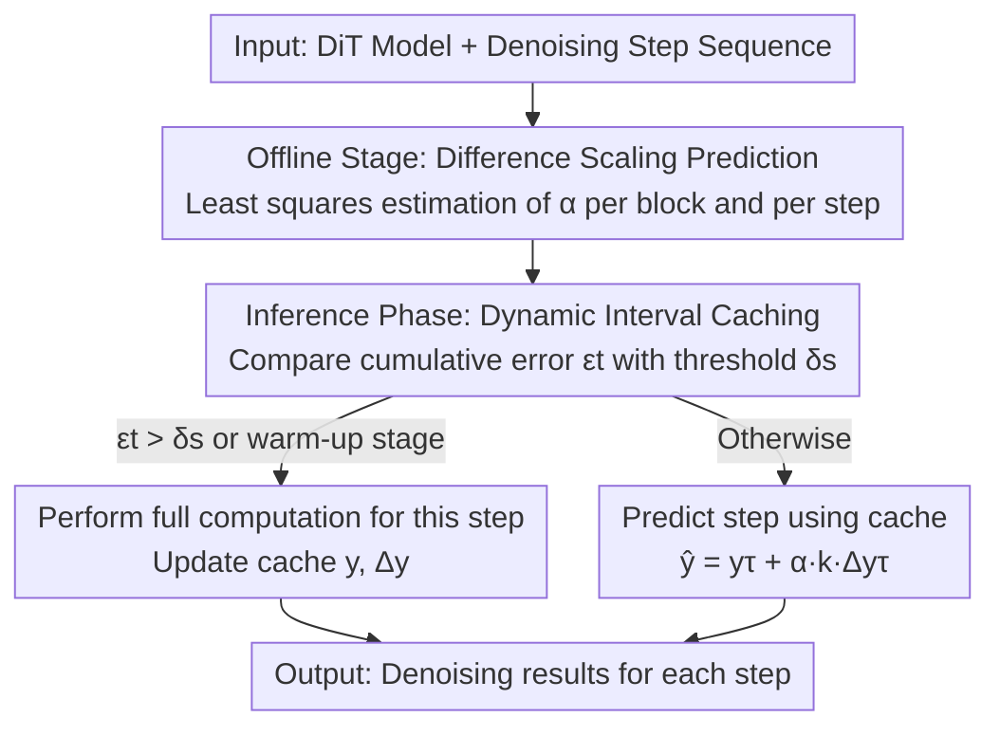

# ScalingCache: Extreme Acceleration of DiTs through Difference Scaling and Dynamic Interval Caching

**Conference**: ICLR 2026  
**OpenReview**: [https://openreview.net/forum?id=uXmbrTlko7](https://openreview.net/forum?id=uXmbrTlko7)  
**Code**: https://github.com/KlingAIResearch/ScalingCache  
**Area**: Model Compression / Diffusion Model Acceleration  
**Keywords**: Diffusion Transformer, Feature Caching, Training-free Acceleration, Difference Scaling, Dynamic Interval

## TL;DR
ScalingCache is a training-free DiT inference acceleration framework. By offline estimation of a "difference scaling coefficient $\alpha$", it adaptively fuses zero-order (direct reuse) and first-order (linear extrapolation) cached features. Combined with a runtime dynamic caching interval strategy, it achieves approximately 2.5× acceleration on Wan2.1 and HunyuanVideo with only a 0.5% drop in VBench, and 3.1× near-lossless acceleration on FLUX.

## Background & Motivation
**Background**: Diffusion Transformers (DiT) have become the mainstream architecture for video/image generation. However, the structure of iterative denoising combined with deep transformer blocks introduces massive computational overhead, often requiring minutes to generate a few seconds of video. Among training-free acceleration methods, "feature caching" is the most common—it leverages the temporal similarity of features between adjacent denoising steps to skip full computations of certain blocks by reusing previously computed activations.

**Limitations of Prior Work**: Feature caching is inherently lossy, while professional-grade video generation requires near-lossless quality. Problems concentrate on two core questions: **how to use the cache** and **when to use the cache**. For the former, the simplest approach is zero-order reuse of the previous step’s cached features $y^{(0)}$, but similarity decays rapidly as temporal distance increases, causing error explosion. Improved versions like Taylorseer use first-order differences for linear extrapolation $y^{(1)}$, but first-order differences alone cannot capture the dynamic changes of features. Increasing the Taylor expansion order yields negligible quality gains but drastically increases cache I/O and storage overhead. For the latter, recalculating features at fixed intervals is too rigid to adapt to the model's dynamic behavior across denoising stages; existing dynamic strategies (e.g., TeaCache, EasyCache) often only monitor the input of the first block and the output of the last block, ignoring the dynamics of intermediate blocks.

**Key Challenge**: There is a trade-off between cache prediction accuracy and computational savings—pure reuse is fast but inaccurate, while high-order extrapolation is accurate but suffers from cache bloat. Fixed intervals are simple but non-adaptive, while existing dynamic scheduling only considers boundary blocks.

**Key Insight**: The authors observe a key phenomenon (Figure 1 in the paper)—for **certain specific blocks at specific denoising steps**, zero-order reuse $y^{(0)}$ is actually closer to the full computation than first-order extrapolation $y^{(1)}$. This suggests that zero-order and first-order methods have distinct suitable regions. **Block-wise and step-wise adaptive mixing** of both is superior to using either one exclusively.

**Core Idea**: An offline-learned, per-block and per-step "difference scaling coefficient $\alpha$" is applied to the first-order extrapolation term to adaptively mix zero-order and first-order predictions. Simultaneously, during inference, the caching interval is dynamically decided based on cumulative error, triggering full computation only when the error exceeds a threshold.

## Method

### Overall Architecture
A DiT model can be denoted as $M = B_1 \circ B_2 \circ \cdots \circ B_L$, where each block $B_l$ contains self-attention, cross-attention, and FFN modules with residual connections. Given input $x_t^l$, the output is $y_t^l$. The goal of ScalingCache is to skip full block computations as much as possible during denoising, replacing them with cache predictions while keeping prediction error near-lossless. It consists of two complementary modules: **Difference Scaling Prediction** addresses "how to use the cache" (using a more accurate prediction formula to approximate full computation), and **Dynamic Interval Caching** addresses "when to use the cache" (adaptively deciding which steps to skip or recompute). The $\alpha$ for the former is computed once offline using approximately 20–50 prompts with zero extra overhead during inference; the latter is scheduled online based on relative error during inference.

### Key Designs

**1. Difference Scaling Prediction: Adaptive mixing of zero-order and first-order cache using offline-learned $\alpha$**

This targets the pain point where first-order differences are insufficient and high-order Taylor expansions cause cache bloat. The first-order extrapolation formula in Taylorseer is $y_t'^l = y_\tau^l + \frac{k}{T}(y_\tau^l - y_{\tau-T}^l)$, where $\tau = t-k$ is the step of the last full computation and $\Delta y_\tau^l = (y_\tau^l - y_{\tau-T}^l)/T$ is the average feature change rate. Based on the observation that zero-order reuse is more accurate in some block-steps, the authors add a scaling coefficient to the first-order term:

$$\hat{y}_t^l = y_\tau^l + \alpha_t^l\, k\, \Delta y_\tau^l$$

As $\alpha_t^l \to 0$, it degrades to zero-order reuse; as $\alpha_t^l \to 1$, it reverts to first-order extrapolation. Intermediate values represent a continuous mixture. $\alpha_t^l$ is solved via offline least squares—minimizing the gap between prediction and full computation output: $\min_{\alpha_t^l} \|y_\tau^l - y_t^l + \alpha_t^l k \Delta y_\tau\|$. For $k=1, T=1$, there is a closed-form solution:

$$\alpha_t^l = \frac{\langle y_{t-1}^l - y_t^l,\ -\Delta y_{t-1}^l\rangle}{\langle \Delta y_{t-1}^l,\ \Delta y_{t-1}^l\rangle}$$

For stability and generalization, $\alpha$ is updated via Exponential Moving Average (EMA): $\alpha_t^l \leftarrow \beta\, \alpha_t'^l + (1-\beta)\alpha_t^l$ ($\beta=0.97$, precomputed offline with ~50 prompts). Since scaling factors vary between full computations, the step-wise estimation of $\Delta y_\tau$ is corrected with weighted cumulative products of $\alpha$. The benefit is that each module only needs to store two tensors ("cached feature $y_{t-1}^l$ + feature difference $\Delta y_{t-1}^l$"), yet achieves more accurate predictions than pure first-order methods with zero online overhead for $\alpha$.

**2. Runtime Dynamic Interval Caching: Adaptive recomputation based on cumulative error**

This addresses the rigidity of fixed intervals and the limitation of boundary-only monitoring. The authors found that cache prediction error follows a **U-shape**—low in the middle of denoising and high at the beginning and end. Thus, static intervals either waste computation in the middle or accumulate error at the ends. They define the average relative error for **all blocks** at each step:

$$\bar{e}_t = \frac{1}{L}\sum_{l=1}^{L}\left\|\frac{y_t^l - y_{t-1}^l}{y_{t-1}^l}\right\|_1$$

Then, the cumulative error desde the last full computation is defined as $\epsilon_t = \sum_{i=\tau}^{t-1}\bar{e}_t$. The update rule is: if $\epsilon_t > \delta_s$ or during the warm-up stage $t \in [0, S_f-1]$, perform full computation (to capture rapidly changing early features); otherwise, use the cache prediction $\hat{y}_t^l = y_{t-1}^l + \alpha_t^l \Delta y_{t-1}^l$. The threshold $\delta_s$ is not fixed but estimated online using errors from the first $S_f$ steps by maintaining a set of cumulative errors $E$ and setting $\delta_s = \frac{1}{|E|}\sum_{\epsilon\in E}\epsilon$. Thus, high-variance videos automatically get a smaller $\delta_s$ (more conservative, more recomputation), while slow-variance videos get a larger $\delta_s$ (more aggressive, higher speedup). The key difference is monitoring **average error across all blocks** rather than just boundary blocks, allowing aggressive reuse in stable segments and conservative updates in fast-changing segments. The strategy only requires one user-specified hyperparameter $S_f$.

### Loss & Training
The method is entirely training-free with no parameter fine-tuning. The only "learning" is the offline least squares estimation of $\alpha$: calculated offline using ~20 prompts (each with 5 random seeds) and smoothed with $\beta=0.97$ EMA. The only inference hyperparameter is the warm-up step count $S_f$, adjusted for target speedup ($S_f \le 14$ reaches over 2.0x end-to-end acceleration for all models).

## Key Experimental Results

### Main Results
Evaluated on Wan2.1 (1.3B / 14B), HunyuanVideo (three T2V models using prompt-enhanced VBench), and FLUX 1.dev (T2I).

| Model | Method | Speedup | PSNR↑ | SSIM↑ | LPIPS↓ | Quality Score↑ |
|------|------|---------|-------|-------|--------|---------|
| Wan2.1 1.3B | Taylorseer | 1.9× | 13.52 | 0.510 | 0.447 | 81.97 (VBench) |
| Wan2.1 1.3B | EasyCache | 2.5× | 25.24 | 0.834 | 0.095 | 82.48 |
| Wan2.1 1.3B | **Ours** | 2.5× | **26.61** | **0.890** | **0.071** | **82.92** |
| Wan2.1 14B | MixCache | 1.8× | 23.45 | 0.814 | 0.124 | 83.97 |
| Wan2.1 14B | **Ours** | **2.5×** | **25.63** | **0.861** | **0.083** | 83.87 |
| HunyuanVideo | EasyCache | 2.2× | 29.20 | 0.904 | 0.063 | 80.69 |
| HunyuanVideo | **Ours** | 2.3× | **30.80** | **0.930** | **0.049** | **81.13** |
| FLUX 1.dev | Taylorseer3 | 2.8× | 30.76 | 0.780 | 0.230 | 80.17 (CLIP) |
| FLUX 1.dev | **Ours** | **3.1×** | **32.28** | **0.819** | **0.131** | 80.25 |

At similar speedups, ScalingCache reduces LPIPS by 45% on image tasks and 20–30% on video tasks compared to Prev. SOTA. In FLUX human preference tests, accelerated generation was chosen almost as often as original output (44.4% vs 55.2%), outperforming Taylorseer (67.2% vs 32.2%).

### Ablation Study
Deconstructing the contributions of difference scaling $\alpha$ and dynamic caching interval on FLUX 1.dev and Wan2.1 1.3B.

| Model | $\alpha$ | Dynamic Interval | Speedup | PSNR↑ | SSIM↑ | LPIPS↓ |
|------|---------|---------|-------|-------|--------|---------|
| FLUX 1.dev | ✗ | ✗ | 2.9× | 29.15 | 0.652 | 0.324 |
| FLUX 1.dev | ✓ | ✗ | 2.9× | 29.83 | 0.701 | 0.259 |
| FLUX 1.dev | ✗ | ✓ | 2.6× | 31.04 | 0.772 | 0.192 |
| FLUX 1.dev | ✓ | ✓ | 3.0× | **32.28** | **0.819** | **0.131** |
| Wan2.1 1.3B | ✗ | ✗ | 2.4× | 24.53 | 0.857 | 0.092 |
| Wan2.1 1.3B | ✓ | ✓ | 2.5× | **26.61** | **0.890** | **0.071** |

### Key Findings
- Both modules are essential: Adding $\alpha$ alone primarily improves quality (LPIPS 0.324→0.259), and dynamic interval alone improves quality while slightly sacrificing speed (LPIPS→0.192); synergy yields the best LPIPS 0.131 at 3.0× speedup.
- Stability of $\alpha$: In 8 sub-tasks of Wan2.1-1.3B, most $\alpha$ values deviated from the global mean by less than 2.5% ($|\alpha_i - \bar\alpha|$ was mostly 0.006–0.022), indicating that offline $\alpha$ generalizes across prompts/tasks.
- Fast convergence: Approximately 20 prompts are enough for the mean $\alpha$ of SA/CA/FFN modules to converge with low variance.
- Only one "knob" ($S_f$): Setting $S_f \le 14$ ensures >2.0× end-to-end speedup for all models; increasing it yields higher speedups.

## Highlights & Insights
- **The "zero-order is sometimes better" observation is crucial**: While common wisdom assumes first-order extrapolation is always more accurate, the authors use Figure 1 to prove that zero-order is better in many block-steps. This transforms the "binary choice" into a "continuous interpolation" via $\alpha$, unifying two baselines with a single scalar.
- **Offloading expensive fitting to offline**: $\alpha$ is computed offline via least squares + EMA with zero runtime cost, avoiding the extra profiling or similarity calculation overhead found in TeaCache/AdaCache—a clever solution for being "adaptive without slowdown."
- **Full-block dynamic thresholding**: Using the average relative error across all blocks $\bar e_t$ to drive cache decisions is more reflective of internal dynamics than existing boundary-block methods. Furthermore, $\delta_s$ automatically tightens or relaxes based on video motion intensity.
- The logic of "offline-learned positional mixing coefficients + online scheduling based on cumulative error" is transferable to other iterative inference acceleration scenarios (e.g., U-Net diffusion, autoregressive KV cache skipping).

## Limitations & Future Work
- Although offline $\alpha$ is stable, it still relies on a representative set of prompts. Its optimality for content significantly different from the offline distribution (e.g., extreme motion, rare styles) remains to be verified (though the report shows high-variance samples require smaller $\delta_s$, suggesting some boundary).
- Caching requires storing two tensors ($y$ and $\Delta y$) per module; the extra VRAM and I/O overhead on ultra-large models is quantified in Appendix G but not fully explored in the main body.
- Dynamic intervals depend on the first $S_f$ steps to estimate $\delta_s$, necessitating full computation during warm-up; this limits the benefit for models with very few denoising steps (e.g., distilled models).
- Positioned as a training-free accelerator, it lacks a direct peak-quality comparison against training-based distillation methods at identical speedups.

## Related Work & Insights
- **vs Taylorseer**: Taylorseer relies on high-order Taylor expansions for block-level prediction, but higher orders offer diminishing returns while increasing cache I/O and storage; ScalingCache uses only first-order differences + an offline scalar $\alpha$, storing just two tensors while outperforming Taylorseer (3.1× vs 2.8×, LPIPS 0.131 vs 0.230 on FLUX).
- **vs TeaCache / EasyCache**: Their dynamic scheduling only monitors the first/last blocks; ScalingCache uses average error across all blocks and adaptively adjusts $\delta_s$ based on video variance.
- **vs ∆-DiT / ToCa series**: These share the delta/dynamic correction cache route, but ScalingCache decouples "how to use" (Scaling) and "when to use" (Interval) into complementary modules and provides a closed-form solution for $\alpha$.
- **vs DeepCache / Faster Diffusion**: Designed for U-Net, their structural assumptions are hard to port to isotropic DiTs; this is a DiT-specific caching mechanism.

## Rating
- Novelty: ⭐⭐⭐⭐ "Zero-order sometimes superior to first-order" observation + offline $\alpha$ is elegant and counter-intuitive.
- Experimental Thoroughness: ⭐⭐⭐⭐⭐ Covers 4 mainstream models, T2I and T2V, includes human preference, ablation, and cross-task stability analysis.
- Writing Quality: ⭐⭐⭐⭐ Motivation and derivation are clear, including full formulas/algorithms, though some chart details rely on the appendix.
- Value: ⭐⭐⭐⭐⭐ Training-free, zero extra inference overhead, single hyperparameter; high engineering feasibility (Open-sourced by KlingAI).

<!-- RELATED:START -->

## Related Papers

- [\[ICLR 2026\] RAPID$^3$: Tri-Level Reinforced Acceleration Policies for Diffusion Transformer](rapid3_tri-level_reinforced_acceleration_policies_for_diffusion_transformer.md)
- [\[ICLR 2026\] Plug-and-Play Fidelity Optimization for Diffusion Transformer Acceleration via Cumulative Error Minimization](plug-and-play_fidelity_optimization_for_diffusion_transformer_acceleration_via_c.md)
- [\[ICLR 2026\] Inconsistency Biases in Dynamic Data Pruning](inconsistency_biases_in_dynamic_data_pruning.md)
- [\[ICLR 2026\] SeeDNorm: Self-Rescaled Dynamic Normalization](seednorm_self-rescaled_dynamic_normalization.md)
- [\[AAAI 2026\] Can You Tell the Difference? Contrastive Explanations for ABox Entailments](../../AAAI2026/model_compression/can_you_tell_the_difference_contrastive_explanations_for_abox_entailments.md)

<!-- RELATED:END -->
