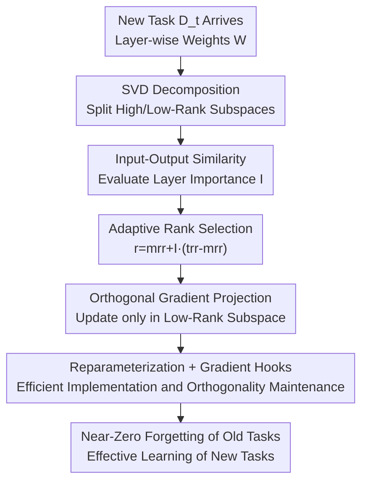

# Sculpting Subspaces: Constrained Full Fine-Tuning in LLMs for Continual Learning

**Conference**: ICLR 2026  
**OpenReview**: [https://openreview.net/forum?id=vQcyqsGJDw](https://openreview.net/forum?id=vQcyqsGJDw)  
**Code**: https://github.com/Red-Hat-AI-Innovation-Team/mini_trainer (Available)  
**Area**: Model Compression / Continual Learning / Parameter-Efficient Fine-Tuning  
**Keywords**: Continual Learning, Catastrophic Forgetting, SVD, Orthogonal Gradient Projection, PEFT

## TL;DR
This paper proposes OSFT (Orthogonal Subspace Fine-Tuning): performing SVD on each layer's weights, freezing the "high-rank subspace" corresponding to large singular values as old knowledge, and performing full-parameter updates only in the orthogonal "low-rank subspace." This enables continuous learning of new tasks with fixed parameters and no task-gradient storage, achieving near-zero forgetting. It outperforms O-LoRA by 1.7 points on a 15-task benchmark and exceeds average accuracy on TRACE by approximately 7 points.

## Background & Motivation

**Background**: Large Language Models (LLMs) need to continuously learn new tasks (products, regulations, terminology) when deployed in real-world scenarios. However, sequential full-parameter fine-tuning leads to catastrophic forgetting—a sharp decline in performance on old tasks after learning new ones. Mainstream approaches follow two paths: Parameter-Efficient Fine-Tuning (PEFT, e.g., Adapter/LoRA), which freezes the base model and trains few new parameters; or direction-constrained updates (e.g., EWC regularization, O-LoRA/GPM gradient projection).

**Limitations of Prior Work**: PEFT methods have restricted parameter budgets and locked expressivity, requiring either task-specific modules (linear parameter growth) or complex merging strategies for continual learning. Regularization methods like EWC provide "soft constraints" using diagonal Hessian approximations that fail to capture the true non-diagonal curvature of the loss surface, only slowing forgetting rather than preventing it. Activation-based gradient projection (GPM/SGP) requires accumulating activation subspace bases for every task, leading to memory growth linear to the number of tasks, which is infeasible for billion-parameter LLMs.

**Key Challenge**: The trade-off between plasticity (ability to learn new tasks) and stability (retaining old tasks). Existing methods either sacrifice expressivity (fixed adapters), waste parameters (full fine-tuning), or have uncontrollable memory overhead (activation projection), failing to achieve "full-parameter expressivity + constant memory + strong anti-forgetting" simultaneously.

**Key Insight**: The authors leverage an overlooked fact—**not all parameter directions are equally important**. Prior work (Sharma et al. 2023) shows significant redundancy in neural network weight matrices, where directions corresponding to small singular values contribute minimally to model behavior, while large singular values encode critical knowledge. Consequently, these "dormant" low-singular-value directions can be recycled for new tasks while protecting the high-singular-value directions.

**Core Idea**: Perform SVD on each layer's weights and **project updates into the low-rank subspace orthogonal to the high-singular-value directions**. This utilizes the expressivity of full-parameter updates but only modifies directions that do not carry old knowledge, making new task gradients "impenetrable" to old knowledge.

## Method

### Overall Architecture

OSFT aims to "learn new tasks continuously without forgetting old ones." Its core transformation is reframing the question from "which parameters to update" to "in which directions to update." It performs SVD on each weight matrix $W^{(l)}$, splitting it into high-rank (old knowledge) and low-rank (recyclable capacity) components based on singular value magnitude, then strictly constrains every gradient step to the low-rank subspace orthogonal to the high-rank subspace.

The workflow: For each new task, SVD is performed per layer. Then, "input-output similarity" is calculated using data from the previous task to evaluate layer importance. This adaptively determines the number of frozen singular vectors (protecting important layers more). During training, gradient components falling into the high-rank subspace are projected out, ensuring updates occur only in orthogonal low-rank directions. The total parameters remain fixed, with no task-specific gradients or activation bases stored.

### Key Designs

**1. SVD Partitioning of High/Low-Rank Subspaces: Separating "Old Knowledge" and "Recyclable Capacity"**

This addresses the pain point where previous methods either crudely freeze entire weights (sacrificing plasticity) or lack knowledge of which parameters carry old information. OSFT performs $W^{(l)} = U^{(l)} \Sigma^{(l)} (V^{(l)})^\top$ for each layer, with singular values in descending order. Directions corresponding to large singular values are treated as the "high-rank subspace" encoding critical old knowledge that must be protected. The "low-rank subspace" corresponding to small singular values contributes minimally and can be safely recycled. Theoretically, using second-order Taylor expansion of the loss surface, the authors argue that protecting directions of maximum Hessian eigenvalues (maximum curvature) most effectively suppresses forgetting. Empirical evidence suggests Hessian eigenvalues correlate highly with weight singular values; thus, freezing high-singular-value directions approximates freezing high-curvature directions without the extreme cost of computing the Hessian. SVD is computed once per task/layer, making its overhead negligible compared to training.

**2. Input-Output Similarity-Driven Adaptive Rank Allocation: Functional Role-Based Protection**

Fixed-rank projection (freezing $k$ vectors for all layers) ignores layer heterogeneity, leading to either over-protection (harming plasticity) or under-protection (causing forgetting). OSFT borrows from AdaSVD, using cosine similarity between layer input activations $X^{(l)}$ and linear outputs $Y^{(l)} = W^{(l)} X^{(l)}$ to quantify importance:

$$I^{(l)} = \frac{1}{N} \sum_{i=1}^{N} \text{cosine\_similarity}(X^{(l)}_i, Y^{(l)}_i)$$

High similarity indicates the layer mainly "preserves" rather than "transforms" representations (e.g., early attention layers), making it critical for stable information propagation. Low similarity layers (e.g., late MLPs) primarily transform representations and can release more capacity. Importance scores are normalized to a layer mean of 1. The preserved singular vector ratio $r^{(l)}_{\text{frac}}$ is:

$$r^{(l)}_{\text{frac}} = \text{mrr} + I^{(l)}(\text{trr} - \text{mrr})$$

Hyperparameters mrr (minimum retention rate) and trr (target retention rate) are robust at 0.1 and 0.8, respectively. The retention count is $k^{(l)} = \lfloor r^{(l)}_{\text{frac}} \cdot \min(d^{(l)}_O, d^{(l)}_I) \rfloor$. This design allows the model to automatically allocate budgets between stability and plasticity based on the functional role of each layer.

**3. Orthogonal Gradient Projection in Low-Rank Subspace: An "Impenetrable" Wall for Old Knowledge**

After determining high-rank bases $U^{(l)}_{\text{high}}$ and $V^{(l)}_{\text{high}}$ to be frozen, OSFT subtracts the components of each gradient step that fall into the high-rank subspace, forcing updates to be strictly orthogonal to protected directions:

$$\nabla W^{(l)}_{\text{proj}} = \nabla W^{(l)} - U^{(l)}_{\text{high}} \left( (U^{(l)}_{\text{high}})^\top \nabla W^{(l)} V^{(l)}_{\text{high}} \right) (V^{(l)}_{\text{high}})^\top$$

Unlike O-LoRA's soft regularization (which only penalizes interference), this is a hard constraint. Compared to activation-based subspace construction (GPM/SGP), OSFT performs SVD directly on weights and only stores singular vectors of the current weights. Memory overhead is constant and does not grow with the number of tasks, making it the first weight-SVD projection method validated at the billion-parameter scale.

**4. Reparameterization + Gradient Hooks: Efficient Implementation and Preventing Subspace Drift**

OSFT replaces the weight with its SVD components: high-rank components $(U^{(l)}_{\text{high}}, \Sigma^{(l)}_{\text{high}}, V^{(l)}_{\text{high}})$ are registered as frozen buffers, while low-rank components $(U^{(l)}_{\text{low}}, \Sigma^{(l)}_{\text{low}}, V^{(l)}_{\text{low}})$ are trainable. During the forward pass, the full weight is reconstructed as $W = W_{\text{high}} + W_{\text{low}}$. To prevent the trainable low-rank bases from "drifting" and losing orthogonality with the frozen high-rank bases, a gradient hook is attached to the trainable parameters. After calculating the gradient (e.g., $\nabla U^{(l)}_{\text{low}}$), the hook projects it to be orthogonal to the high-rank bases, ensuring mathematical integrity throughout training.

### Loss & Training
No additional regularization terms are introduced; the training objective is the standard fine-tuning loss for each task. Constraints are entirely realized through gradient projection and reparameterization. Parameter counts are fixed, and no task-wise gradients are stored. SVD per task/layer is the primary additional overhead. Experiments were conducted on T5-Large, LLaMA-2 7B, and Mistral-7B.

## Key Experimental Results

### Main Results

Standard continual learning benchmark on T5-Large (Average Accuracy % in AA, higher is better). The 15-task scenario reflects anti-forgetting performance in long sequences:

| Benchmark | Metric | OSFT | O-LoRA (SOTA) | Gain |
|-----------|--------|------|---------------|------|
| 5-Task CL | Avg AA | 75.9 | 75.8          | +0.1 |
| 15-Task CL| Avg AA | 71.3 | 69.6          | +1.7 |

TRACE benchmark (LLaMA-2-7B-Chat, 8 instruction fine-tuning tasks), showing Average Accuracy (AA) and Backward Transfer (BT, closer to 0 indicates less forgetting):

| Method | AA (%) | BT (%) |
|--------|--------|--------|
| SeqFT | 23.0 | -8.3 |
| O-LoRA | 41.3 | -6.2 |
| **OSFT (ours)** | **48.4** | **-7.1** |
| PerTaskFT (Upper) | 57.6 | NA |
| MTL (Upper) | 52.3 | NA |

OSFT achieves ~7 points higher average accuracy than O-LoRA on TRACE, dominating the Pareto frontier (leading in both learning and retention) while using only ~56% of effective trainable rank.

### General Ability and Safety Retention

| Model | MMLU | GSM | BBH | TydiQA | BoolQA | PIQA |
|-------|------|-----|-----|--------|--------|------|
| Base Instruct | 46.6 | 26.1 | 40.2 | 23.5 | 70.5 | 76.2 |
| OSFT (ours) | 47.7 | 7.7 | 34.2 | 35.8 | 76.6 | 77.6 |

Win/Tie/Lose for Instruction Following and Safety (relative to LLaMA-2-7B-Chat base): OSFT achieves Win 24 / Tie 56 / Lose 20 for instruction following, and Win 18 / Tie 78 / Lose 4 for safety, significantly better than baseline methods like Replay and SeqFT, which often exceed 50% in the Lose category.

### Key Findings
- **Advantage in Long Sequences**: OSFT and O-LoRA are comparable on 5 tasks, but the gap widens to +1.7 points on 15 tasks, showing that hard orthogonal constraints are more effective as task count and cumulative interference increase.
- **Forward Transfer**: In related tasks like NumGLUE-cm and NumGLUE-ds within TRACE, learning a subsequent task improved accuracy on the prior one, indicating that constrained updates promote knowledge sharing.
- **Reasoning Remains a Bottleneck**: GSM8K (math reasoning) scores drop significantly (26.1 to 7.7), but this is common across all methods in TRACE due to the lack of CoT supervision, not an OSFT-specific issue.
- **Hyperparameter Robustness**: Accuracies vary <1% with mrr/trr perturbations of ±0.05, though overly aggressive retention causes significant performance drops.

## Highlights & Insights
- **From "Which Parameter" to "Which Direction"**: Instead of freezing entire weights, OSFT freezes high-singular-value directions and opens low-singular-value directions. This preserves full-parameter expressivity without damaging old knowledge—a more fundamental approach than LoRA's module additions.
- **Weight SVD vs. Activation SVD**: By performing SVD on weights rather than activations, OSFT achieves constant memory overhead. This is the key to scaling to billion-parameter LLMs.
- **Grounded Theory and Engineering**: Uses Hessian curvature to justify freezing high-singular-value directions and employs reparameterization with gradient hooks to keep orthogonal constraints computationally efficient and mathematically consistent.
- **Transferability**: This paradigm—splitting subspaces by singular values and constraining updates to the orthogonal complement—can be applied to any scenario requiring the protection of existing capabilities (e.g., domain adaptation, multi-task incremental deployment).

## Limitations & Future Work
- **Reasoning Degradation**: Math reasoning (GSM8K) drops significantly. Authors acknowledge that explicit reasoning supervision, like CoT, is needed; OSFT alone does not protect this capability.
- **SVD and Reparameterization Dependency**: Performing SVD and reparameterization per layer for each task introduces a one-time overhead. Detailed wall-clock time analysis is relegated to the appendix.
- **Hyperparameter Search**: While robust, mrr/trr still benefit from a small grid search on the first task.
- **Importance Measure Selection**: Using input-output cosine similarity is an empirical choice. The authors mention alternatives like CKA as natural extensions, suggesting this metric might not be optimal.

## Related Work & Insights
- **vs. O-LoRA**: O-LoRA applies soft orthogonal regularization to low-rank adapters, which only slows forgetting and is limited by the low-rank budget. OSFT uses full-parameter updates and hard orthogonal projection, showing stronger anti-forgetting in long sequences (15 tasks: 71.3 vs. 69.6).
- **vs. MiLoRA / PiSSA**: MiLoRA updates only low-singular-value components, making it structurally similar to OSFT. However, OSFT adds orthogonal gradient projection and adaptive rank selection per layer. PiSSA, conversely, updates high-singular-value components.
- **vs. GPM / SGP**: These are also gradient projection methods, but they use activation SVD, leading to linear memory growth. OSFT uses weight SVD for constant memory and is the first to validate this approach on billion-parameter LLMs.
- **vs. EWC**: EWC penalizes weight changes using diagonal Hessian approximations, failing to capture non-diagonal curvature. OSFT uses singular values as a more principled approximation of curvature directions.

## Rating
- Novelty: ⭐⭐⭐⭐ Combines weight SVD, adaptive rank, and orthogonal projection for constant-memory full-parameter continual learning; scales to billion-parameter models for the first time.
- Experimental Thoroughness: ⭐⭐⭐⭐ Covers three models and three benchmarks, including general ability, safety, and instruction following, though some comparisons are in the appendix.
- Writing Quality: ⭐⭐⭐⭐ Solid motivation and derivation; both theoretical justification and engineering implementation are clearly explained.
- Value: ⭐⭐⭐⭐ Provides a practical, scalable, fixed-parameter solution for LLM continual learning with strong deployment potential.

<!-- RELATED:START -->

## Related Papers

- [\[ICLR 2026\] IDER: IDempotent Experience Replay for Reliable Continual Learning](ider_idempotent_experience_replay_for_reliable_continual_learning.md)
- [\[ICLR 2026\] Study of Training Dynamics for Memory-Constrained Fine-Tuning (TraDy)](study_of_training_dynamics_for_memory-constrained_fine-tuning.md)
- [\[ICLR 2026\] LoFT: Low-Rank Adaptation That Behaves Like Full Fine-Tuning](loft_low-rank_adaptation_that_behaves_like_full_fine-tuning.md)
- [\[ICLR 2026\] Quantized Gradient Projection for Memory-Efficient Continual Learning](quantized_gradient_projection_for_memory-efficient_continual_learning.md)
- [\[CVPR 2026\] Mining Attribute Subspaces for Efficient Fine-tuning of 3D Foundation Models](../../CVPR2026/model_compression/mining_attribute_subspaces_for_efficient_fine-tuning_of_3d_foundation_models.md)

<!-- RELATED:END -->
