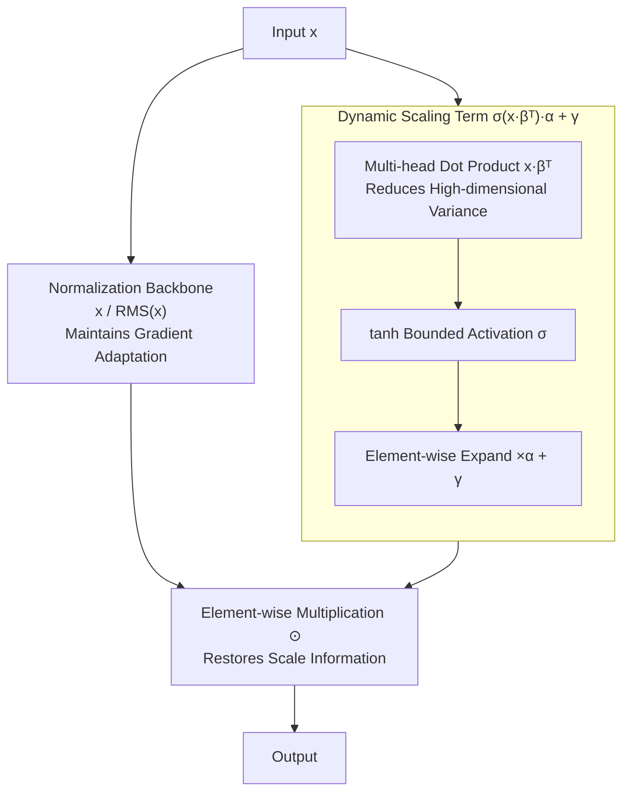

# SeeDNorm: Self-Rescaled Dynamic Normalization

**Conference**: ICLR 2026  
**arXiv**: [2510.22777](https://arxiv.org/abs/2510.22777)  
**Code**: None  
**Area**: Model Compression / Normalization Layer  
**Keywords**: Normalization Layer, Dynamic Scaling, RMSNorm, DyT, Large Language Models

## TL;DR

SeeDNorm is proposed as an adaptive dynamic normalization layer that dynamically adjusts the scaling coefficient by using the input itself as a condition. This preserves input norm information during the forward pass while maintaining RMSNorm-like adaptive gradient adjustment capabilities during backpropagation. It consistently outperforms RMSNorm, LayerNorm, and DyT across language modeling and vision tasks with minimal additional parameters.

## Background & Motivation

Normalization layers are fundamental building blocks of modern deep neural networks, playing a crucial role in stabilizing training and accelerating convergence. In Transformer architectures, RMSNorm is the most widely used normalization method. It constrains vectors onto a unit hypersphere and then uses learnable scaling parameters $\gamma$ to perform element-wise scaling for restoring expressive power.

However, RMSNorm has two core limitations:

**Discarding input norm information in the forward pass**: The normalization operation itself erases input scale information, which limits the network's expressive capacity, particularly in zero-shot generalization scenarios.

**Static scaling factor $\gamma$ lacks flexibility**: Since $\gamma$ is a fixed parameter independent of the input, it cannot adapt to wide variations in input data and distribution shifts.

Recent alternatives like DyT (Dynamic Tanh) preserve input norm information in the forward pass but suffer from vanishing gradients due to the saturation properties of tanh. The authors provide a theoretical analysis (Proposition 6.1) proving that, under the assumption of a constant input norm, DyT is equivalent to the element-wise operation of RMSNorm at the gradient level. This implies that DyT loses the ability of RMSNorm to dynamically adjust gradients according to the input norm.

This leads to a fundamental question: **Can a method be designed that simultaneously achieves training stability, optimization efficiency, and the preservation of input norm information?**

## Method

### Overall Architecture

SeeDNorm aims to address two weaknesses of RMSNorm: the erasure of scale information in the forward pass and the lack of input-dependent scaling. It retains the normalization backbone but modifies the static scaling term. The computation is divided into two parallel paths: one performs standard RMS normalization, projecting $\mathbf{x}$ onto a unit hypersphere to obtain $\frac{\mathbf{x}}{\text{RMS}(\mathbf{x})}$; the other uses the input itself to calculate a dynamic scaling matrix $\sigma(\mathbf{x}\cdot\boldsymbol{\beta}^T)\cdot\boldsymbol{\alpha}+\boldsymbol{\gamma}$. This allows the scaling coefficient of each token to vary with its content. The two paths are element-wise multiplied to reintroduce the discarded scale information. The complete formula is:

$$\text{SeeDNorm}(\mathbf{x}) = [\sigma(\mathbf{x} \cdot \boldsymbol{\beta}^T) \cdot \boldsymbol{\alpha} + \boldsymbol{\gamma}] \odot \frac{\mathbf{x}}{\text{RMS}(\mathbf{x})}$$

where $\text{RMS}(\mathbf{x}) = \sqrt{\frac{1}{D}\sum_{i=1}^D x_i^2 + \epsilon}$, $\boldsymbol{\alpha}, \boldsymbol{\beta}, \boldsymbol{\gamma} \in \mathbb{R}^{1 \times D}$ are learnable parameters, and $\sigma$ is a non-linear activation function (tanh by default).

### Key Designs

**1. Adaptive Scaling Matrix: Restoring Norm with Dynamic Terms while Retaining 1/RMS for Gradient Adaptation**

RMSNorm erases scale information in the forward pass because its scaling factor is input-independent, rooted in the static $\boldsymbol{\gamma}$. SeeDNorm replaces this with an input-dependent dynamic term $\sigma(\mathbf{x} \cdot \boldsymbol{\beta}^T) \cdot \boldsymbol{\alpha}$. The input $\mathbf{x}$ performs a dot product with $\boldsymbol{\beta}$ to produce a scalar, is constrained to $[-1, 1]$ via tanh, and is then expanded into an element-wise scaling matrix by multiplying with $\boldsymbol{\alpha}$. Consequently, the scaling coefficient for each token is determined by its own content. Inputs with different norms and distributions receive different scaling, allowing erased scale information to be re-encoded into features at the cost of only two $D$-dimensional vectors, $\boldsymbol{\alpha}$ and $\boldsymbol{\beta}$.

Crucially, SeeDNorm keeps the normalization backbone and the division structure of $\frac{1}{\text{RMS}(\mathbf{x})}$. This allows it to inherit the stability of RMSNorm during backpropagation. DyT fails because tanh saturation kills gradients and, under constant norm assumptions, its gradient loses the ability to adjust based on the norm. In SeeDNorm, gradients are still guided by $\frac{1}{\text{RMS}(\mathbf{x})}$: if an input $k\mathbf{x}$ is exceptionally large, $\frac{1}{\text{RMS}(k\mathbf{x})} = \frac{1}{k \cdot \text{RMS}(\mathbf{x})}$ automatically scales the gradient down by $k$. This input-norm-driven automatic scaling is key to stability—restoring scale in the forward pass while maintaining gradient adaptation in the backward pass.

**2. Scale-Invariant Initialization: Restricting Dynamic Terms during Early Training**

Introducing input-dependent terms could make the model overly sensitive to input scales in early training. When the input is scaled by $k$, $\frac{\mathbf{x}}{\text{RMS}(\mathbf{x})}$ remains unchanged due to the scale invariance of RMS normalization. In SeeDNorm, only the dynamic term $\sigma(k\mathbf{x} \cdot \boldsymbol{\beta}^T)$ changes with $k$. The authors initialize $\boldsymbol{\beta}$ to zero, ensuring $\nabla_\mathbf{x} f$ is zero at the start of training. The network is thus immune to scale perturbations initially, effectively behaving as standard RMSNorm and gradually learning dynamic behaviors to avoid early instability.

**3. Multi-head Form: Using Split Dot Products to Suppress High-dimensional Gradient Variance**

Calculating $\mathbf{x} \cdot \boldsymbol{\beta}^T$ directly on high-dimensional features is problematic as the variance of the dot product is proportional to the dimension $D$ (Theorem 3.2). High variance leads to severe gradient oscillation. Borrowing from multi-head attention, SeeDNorm splits $\mathbf{x}$ and $\boldsymbol{\beta}$ into $n$ sub-vectors. Dot products are calculated in each subspace and concatenated. This reduces the dimension involved in a single dot product from $D$ to $D/n$, suppressing variance. Vision tasks are particularly sensitive to this; thus, a multi-head version is used by default. Ablations show ViT-B fails to converge with a single head, while 16 heads achieve optimal stability.

**4. AdaSeeDNorm: Adapting to the Condition Injection Structure of AdaLN in DiT**

The AdaLN in DiT injects class conditions $c$ via scaling and shifts, which differs from RMSNorm. The authors designed a compatible variant embedding the dynamic scaling term into the AdaLN framework:

$$\text{AdaSeeDNorm}(\mathbf{x}, c) = [(\sigma(\mathbf{x} \cdot \boldsymbol{\beta}^T) \cdot \boldsymbol{\alpha} + 1) \odot \frac{\mathbf{x}}{\text{RMS}(\mathbf{x})}](1 + \boldsymbol{\gamma}(c)) + \boldsymbol{\eta}(c)$$

where $\boldsymbol{\gamma}(c)$ and $\boldsymbol{\eta}(c)$ are condition-generated scaling and shifts. This preserves SeeDNorm's input-adaptive scaling without disrupting the original condition pathway of DiT.

### Loss & Training

Parameter initialization follows the principle of "starting as RMSNorm, with dynamic terms growing from zero": $\boldsymbol{\gamma}$ is initialized to 1 for alignment; $\boldsymbol{\beta}$ is initialized to zero to let gradients for $\boldsymbol{\alpha}$ start small; $\boldsymbol{\alpha}$ is initialized to 1 for language modeling—ablations show small values (0.1) limit convergence, while large values (10) cause instability. Weight decay is applied to $\boldsymbol{\alpha}$ and $\boldsymbol{\beta}$ for stability. Vision tasks require two additional "patches": applying dropout (matching the drop path rate) to dynamic coefficients and dividing $\boldsymbol{\alpha} \cdot \boldsymbol{\beta}^T$ by dimensions to further lower variance.

## Key Experimental Results

### Main Results

**Large Language Models (MoE Architecture)**

| Model | Training Tokens | c4_en Loss | PPL | ARC-C | ARC-E | HellaSwag | PIQA |
|------|----------|-----------|------|-------|-------|-----------|------|
| OLMoE-1.3B (RMSNorm) | 500B | 2.922 | 18.63 | 32.3 | 62.2 | 55.2 | 72.6 |
| OLMoE-1.3B-DyT | 500B | 2.968 | 19.45 | 30.4 | 61.9 | 53.2 | 70.6 |
| **OLMoE-1.3B-SeeDNorm** | 500B | **2.900** | **18.12** | **34.5** | **65.4** | **56.8** | **73.1** |
| OLMoE-7B (RMSNorm) | 1000B | 2.644 | 14.07 | 40.8 | 73.7 | 71.2 | 76.6 |
| **OLMoE-7B-SeeDNorm** | 1000B | **2.631** | **13.88** | **44.5** | **76.1** | **71.8** | **79.1** |

**Large Language Models (Dense Architecture)**

| Model | Training Tokens | c4_en Loss | PPL | ARC-C | ARC-E |
|------|----------|-----------|------|-------|-------|
| OLMo2-1B (RMSNorm) | 500B | 2.884 | 17.88 | 35.6 | 68.7 |
| **OLMo2-1B-SeeDNorm** | 500B | **2.879** | **17.79** | **37.8** | **70.0** |

**Computer Vision Tasks** (ImageNet-1K Classification Acc@1)

| Model | LayerNorm | DyT | SeeDNorm |
|------|-----------|-----|----------|
| ViT-B | 82.3 | 82.5 | **82.7** |
| ViT-L | 83.1 | 83.6 | **83.6** |
| ConvNeXT-B | 83.7 | 83.7 | **83.7** |
| ConvNeXT-L | 84.3 | 84.4 | **84.6** |
| ViT-B (MAE) | 83.2 | 83.2 | **83.5** |
| ViT-L (MAE) | 85.5 | 85.4 | **85.5** |

### Ablation Study

| Configuration | c4 Loss | PPL | ARC-C | Description |
|------|---------|------|-------|------|
| SeeDNorm (Default, α←1) | 2.900 | 18.12 | 34.5 | Best configuration |
| α←0.1 | 2.912 | 18.39 | 31.2 | Initial value too small limits convergence |
| α←10 | 3.154 | 23.42 | 27.8 | Initial value too large causes instability |
| scalar α | 2.909 | 18.33 | 32.6 | Element-wise is better than scalar scaling |
| Element-wise Mul x⊙β | 2.909 | 18.33 | 36.5 | Dot product has better expressivity |
| Without α | 2.907 | 18.29 | 32.1 | Loses element-wise dynamic adjustment |
| Without β | 2.911 | 18.37 | 31.9 | Loses non-linear shape control |
| Without γ | 2.913 | 18.41 | 33.7 | Equivalent to replacing RMS scaling directly |

**Multi-head Ablation** (ViT-B ImageNet Classification)

| Heads | Acc@1 | Description |
|------|-------|------|
| 1 Head | Fail | Gradient variance too high |
| 8 Heads | 82.5 | Feasible but not optimal |
| 16 Heads | **82.7** | Best |
| 32 Heads | 82.5 | Excess heads reduce gradient diversity |

### Key Findings

1. **MoE Architectures Amplify SeeDNorm Advantages**: Dynamic activation in MoE models makes SeeDNorm's convergence acceleration more evident. While Dense models show smaller training loss gains, Zero-shot evaluation gains are significant.
2. **Bounded Activation is Mandatory**: The model fails to converge with unbounded functions like GeLU/Swish. Tanh, sigmoid, and hardtanh are all viable, with tanh performing best.
3. **DyT Fails in LLM Pre-training**: Replacing the normalization layer with DyT in OLMoE-1.3B leads to slow convergence and performance drops.
4. **Gains Scale with Training Tokens**: As training tokens increase, the loss advantage of SeeDNorm over the baseline continues to expand.

## Highlights & Insights

1. **Strong Theoretical Depth**: Proposition 6.1 proves that DyT is equivalent to an element-wise differential equation solution of RMSNorm under constant norm assumptions, revealing DyT's fundamental inability to adjust gradients by input norm.
2. **Minimalist but Effective Design**: Only adds two $D$-dimensional vectors ($\boldsymbol{\alpha}$, $\boldsymbol{\beta}$). The computational complexity increases by $O(D)$, which is significantly less than the $O(D^2)$ of linear layers, making it a true "plug-and-play" improvement.
3. **Variance Analysis of Multi-head Mechanism**: Analyzing instability via dot product variance and solving it through head-splitting demonstrates theory-driven design.
4. **Comprehensive Gradient Analysis**: Detailed analysis of gradient behavior for all parameters ($\boldsymbol{\alpha}$, $\boldsymbol{\beta}$, $\boldsymbol{\gamma}$, $\mathbf{x}$) under extreme conditions goes beyond mere heuristics.

## Limitations & Future Work

1. **Limited Native PyTorch Efficiency**: Fragmented operations in SeeDNorm increase memory access frequency, affecting latency. Kernel fusion is required to match the efficiency of RMSNorm.
2. **Special Handling for AdaLN Compatibility**: DiT's AdaLN cannot be directly replaced; a specialized AdaSeeDNorm variant is required.
3. **Vision Task Hyperparameters**: Head counts, dropout, and dimension scaling require careful tuning for vision tasks, increasing the barrier to entry.
4. **Large-scale Validation Pending**: The largest experiment is on OLMoE-7B (1B active parameters); performance at 70B+ scales remains unknown.
5. **KV Cache Compatibility**: Impact and overhead on KV cache during inference warrant further investigation.

## Related Work & Insights

- **Evolution: BatchNorm → LayerNorm → RMSNorm**: A path of simplifying normalization that consistently faces the issue of discarding input scale information.
- **DyT (Zhu et al., 2025b)**: Uses dynamic tanh to replace the normalization layer, preserving input norm but sacrificing gradient adaptation.
- **Frac-Connection (Zhu et al., 2025a)**: SeeDNorm can be combined with this method for further performance gains.
- The gradient equivalence between RMSNorm and DyT revealed here may inspire future designs for better normalization/activation alternatives.

## Rating

- Novelty: ⭐⭐⭐⭐ — Dynamic scaling is intuitive yet effective; theoretical analysis elevates the design.
- Experimental Thoroughness: ⭐⭐⭐⭐⭐ — Covers LLM (MoE+Dense), classification, generation, and self-supervised learning with detailed ablations.
- Writing Quality: ⭐⭐⭐⭐ — Complete theoretical derivations, clear experimental narrative, and rich appendices.
- Value: ⭐⭐⭐⭐ — A practical plug-and-play component, though kernel fusion is needed for widespread deployment.

<!-- RELATED:START -->

## Related Papers

- [\[ICLR 2026\] Inconsistency Biases in Dynamic Data Pruning](inconsistency_biases_in_dynamic_data_pruning.md)
- [\[ICLR 2026\] Dr.LLM: Dynamic Layer Routing in LLMs](drllm_dynamic_layer_routing_in_llms.md)
- [\[NeurIPS 2025\] Dependency Parsing is More Parameter-Efficient with Normalization](../../NeurIPS2025/model_compression/dependency_parsing_is_more_parameter-efficient_with_normalization.md)
- [\[ICLR 2026\] OrderDP: A Theoretically Guaranteed Lossless Dynamic Data Pruning Framework](orderdp_a_theoretically_guaranteed_lossless_dynamic_data_pruning_framework.md)
- [\[ICLR 2026\] LD-MoLE: Learnable Dynamic Routing for Mixture of LoRA Experts](ld-mole_learnable_dynamic_routing_for_mixture_of_lora_experts.md)

<!-- RELATED:END -->
