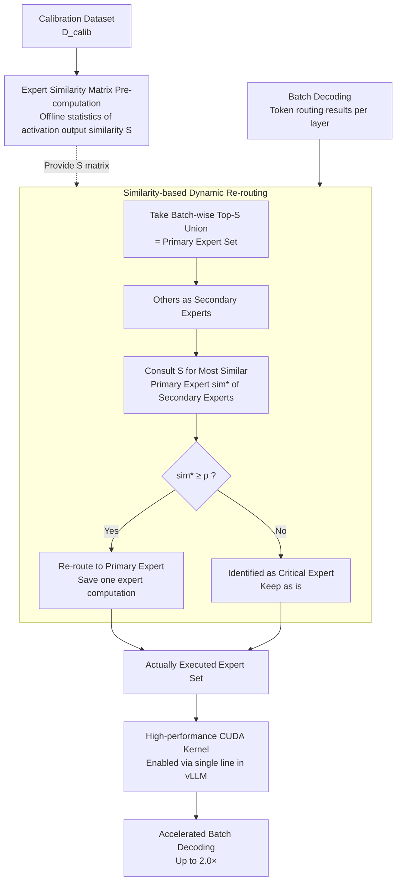

# SERE: Similarity-based Expert Re-routing for Efficient Batch Decoding in MoE Models

## Basic Information

- **Conference**: ICLR 2026
- **arXiv**: [2602.07616](https://arxiv.org/abs/2602.07616)
- **Code**: [GitHub](https://github.com/JL-Cheng/SERE)
- **Area**: Model Compression / Efficient Inference
- **Keywords**: Mixture-of-Experts, Batch Decoding, Expert Skipping, CUDA Kernel, vLLM

## TL;DR

The SERE method is proposed to dynamically re-route secondary experts to the most similar primary experts during batch decoding by pre-computing an expert similarity matrix. This achieves up to 2.0× acceleration with minimal quality loss and provides a plug-and-play CUDA kernel for vLLM.

## Background & Motivation

### Background
The Mixture-of-Experts (MoE) architecture enables efficient inference through sparse activation, where each token activates only a small number of experts (e.g., 8 out of 128 in Qwen3-30B-A3B). However, in practical deployment, **batch inference** causes different tokens within a batch to require different experts, making the number of actually activated experts far exceed the single-token budget.

### Key Challenge
- **Sparsity vs. Batching**: Larger batches lead to more activated experts (Figure 1), which increases the memory bandwidth overhead during the decoding stage.
- **Load Balancing during training further exacerbates the problem**: Load balancing objectives distribute tokens more uniformly across experts, resulting in higher expert diversity within a batch.

### Limitations of Prior Work
- **Static Compression** (Pruning/Merging): High computational cost, task-dependent, and reduces model capacity and generalization.
- **Dynamic Skipping** (Threshold/Top-p routing): Only relies on routing scores, ignores intrinsic expert characteristics, requires additional training or threshold tuning, and is difficult to integrate into high-performance inference frameworks.

## Method

### Overall Architecture

SERE is built upon three observations of MoE experts: a large number of experts within the same layer are highly functional similar and interchangeable; top-ranked primary experts dominate the output while secondary experts provide marginal contributions; and a few "critical experts" in each layer are dissimilar to all others, acting as irreplaceable specialized units. Based on this, SERE first uses calibration data to offline pre-compute the expert similarity matrix for each layer. During batch decoding, it dynamically re-routes low-contribution secondary experts to their most similar primary experts while protecting critical experts from being modified. Finally, a plug-and-play CUDA kernel is used to seamlessly integrate this logic into vLLM. The entire pipeline consists of three stages: "offline similarity calculation → online merging of redundant experts per batch/layer while protecting critical experts → kernel-based acceleration."

### Key Designs

**1. Expert Similarity Matrix Pre-computation: Characterizing substitutability using activation outputs instead of routing scores**

If skipping decisions only rely on routing scores, the functional characteristics of the experts themselves are ignored. SERE instead performs offline statistical analysis of the similarity between expert activation outputs on a calibration dataset $\mathcal{D}_{\text{calib}}$. For an expert pair $(p,q)$ in layer $l$, it calculates $\mathbf{S}_{p,q}^{(l)} = \frac{1}{N} \sum_{i=1}^{N} \text{Sim}(\mathbf{A}_{i,p}^{(l)}, \mathbf{A}_{i,q}^{(l)})$, where $\mathbf{A}_{i,j}^{(l)} = \mathbf{E}_j^{(l)}(\mathbf{X}_i^{(l-1)})$ is the actual output of the expert for the $i$-th sample. The similarity function can be Cosine, Frobenius norm, or CKA (Frobenius performed best in ablations). On Qwen3-30B-A3B, these matrices reveal clear inter-layer differences: almost all expert pairs in Layer-1 have similarity $>0.9$ (highly redundant), while most pairs in Layer-6 have similarity $<0.4$ (highly differentiated), and each layer contains critical experts with extremely low similarity to others—this serves as the basis for subsequent layer-adaptive skipping. The entire matrix only needs to be pre-computed once without re-training or task-specific tuning.

**2. Similarity-based Dynamic Re-routing: Distinguishing primary/secondary experts based on actual batch activation and merging redundant experts**

Since expert activation in batch decoding changes with input, SERE makes dynamic decisions for each layer and each batch. It first takes the union of Top-$S$ experts for all tokens as the primary expert set $\mathcal{E}_p^{(l)} = \bigcup_{\mathcal{T}} \{\mathbf{E}_{r_k}^{(l)} \mid 1 \leq k \leq S\}$ (where hyperparameter $S$ controls the acceleration ratio; smaller $S$ leads to more skipping); the rest are secondary experts. For each secondary expert $\mathbf{E}_u^{(l)}$, the most similar expert $v_u^* = \arg\max_{\mathbf{E}_v^{(l)} \in \mathcal{E}_p^{(l)}} \mathbf{S}_{u,v}^{(l)}$ is sought within the primary expert set. When the maximum similarity $\text{sim}_u^* \geq \rho$, all its tokens are re-routed to $\mathbf{E}_{v_u^*}^{(l)}$, saving an expert computation. If $\text{sim}_u^* < \rho$, it is identified as a critical expert with no substitute and is kept as is. The final executed expert set is $\mathcal{E}_{\text{final}}^{(l)} = \mathcal{E}_p^{(l)} \cup \{\mathbf{E}_u^{(l)} \mid \text{sim}_u^* < \rho\}$. The threshold $\rho$ acts as an automatic protection switch for critical experts—in ablations, setting $\rho=\infty$ (disabling protection) caused a 1.8% drop, while random skipping without distinguishing primary/secondary experts caused a 5.2% drop, proving that the three steps of "distinguishing primary/secondary, merging by similarity, and protecting irreplaceable experts" are all essential.

**3. High-performance CUDA Kernel: Implementing re-routing as a single-line plugin for vLLM**

To ensure the aforementioned logic translates into actual gains, SERE implements it as a model-agnostic CUDA kernel compatible with various MoE architectures, requiring no changes to vLLM's core execution pipeline—it can be enabled with a single line of code in the inference framework. This allows the theoretical acceleration of "skipping redundant experts to save memory bandwidth" to be directly applied to production deployment. Ultimately, it achieves nearly lossless performance with $K{=}2$ and remains superior to all baselines with $K{=}1$, reaching up to 2.0× acceleration on Qwen3-30B-A3B.

## Key Experimental Results

### Main Results: Accuracy and Acceleration Comparison (Qwen1.5-MoE-A2.7B)

| Method | Exam Avg | Math Avg | Code Avg | Overall Mean | TPOT (ms) ↓ |
|------|---------|---------|---------|--------|------------|
| Top-4 (Original) | 61.67 | 42.28 | 38.17 | 48.52 | 17.29 |
| Top-2 (Naive) | 58.27 | 36.19 | 29.71 | 42.85 | 13.53 |
| HC-SMoE (40 experts) | 49.69 | 24.86 | 3.34 | 28.79 | 14.20 |
| LYNX top-2 | 48.26 | 24.51 | 7.97 | 29.28 | 14.49 |
| **SERE top2; ρ=0.0** | **60.48** | **40.87** | **36.58** | **47.15** | **13.83** |
| **SERE top2; ρ=0.3** | **61.02** | **41.55** | **35.14** | **47.25** | **13.93** |

### Qwen3-30B-A3B Experimental Results

| Method | Exam Avg | Math Avg | Code Avg | Overall Mean | Speedup |
|------|---------|---------|---------|--------|-------|
| Top-8 (Original) | — | — | — | Baseline | 1.0× |
| Top-K Reduction | — | — | — | Significant Drop | 1.3× |
| LYNX | — | — | — | Substantial Drop | 1.4× |
| **SERE (K=2)** | — | — | — | **Nearly Lossless** | **1.5×** |
| **SERE (K=1)** | — | — | — | **Superior to all Baselines** | **2.0×** |

### Ablation Study: Impact of Key Designs

| Ablation Item | Change in Overall Mean | Description |
|--------|----------|------|
| Remove critical expert protection (ρ=∞) | -1.8% | Critical experts are irreplaceable |
| No primary/secondary distinction (Random Skip) | -5.2% | Distinction is crucial |
| Static Similarity vs. Dynamic | Small difference | Pre-computed similarity is reliable enough |
| Different Similarity Functions | Frobenius Best | Superior to Cosine and CKA |

### Key Findings

1. **SERE achieves 2.0× acceleration with minimal quality loss**: SERE (K=2) is nearly lossless across all tasks, and SERE (K=1) still outperforms all baselines.
2. **Significant superiority over existing methods**: HC-SMoE static pruning leads to a 20% absolute accuracy drop, LYNX drops by 19%, while SERE only drops by 1-3%.
3. **Effective Critical Expert Protection**: Irreplaceable experts are automatically retained via the similarity threshold $\rho$.
4. **Input-aware Dynamics**: Different expert subsets are activated for different batches; SERE adaptively skips experts with high redundancy.
5. **Plug-and-play Deployment**: CUDA kernel integration into vLLM requires only one line of code.

## Highlights & Insights

- Leverages intrinsic expert similarity properties rather than just routing scores to guide skipping decisions.
- Dynamic, input-aware strategy—skips more when redundancy is high and less when diversity is required.
- Automatic critical expert protection mechanism prevents capability degradation.
- Only requires one-time pre-computation of the similarity matrix; no re-training or task-specific tuning needed.
- Provides production-grade CUDA kernels, enabling vLLM via a single line of code.

## Limitations & Future Work

- Re-routing changes the token-to-expert mapping without modifying routing weights, which may introduce slight output offsets.
- The choice of calibration dataset may impact the representativeness of the similarity matrix.
- Hyperparameters $S$ and $\rho$ require a trade-off between speed and quality; different models may require different settings.
- Currently primarily validated in the decoding stage; applicability in the pre-fill stage has not been explored.
- When tokens within a batch are highly diverse (e.g., mixed-domain requests), the number of skippable redundant experts may decrease.

## Related Work & Insights

- **Static Expert Compression**: MoE-I2 (Yang et al., 2024), HC-SMoE (Chen et al., 2025), EEP (Liu et al., 2024c)
- **Dynamic Expert Skipping**: Top-p routing (Huang et al., 2024), AdaMoE (Zhong et al., 2024), LYNX (Gupta et al., 2024)
- **MoE Inference Optimization**: vLLM (Kwon et al., 2023), DeepSeekV2-Lite (Liu et al., 2024b)
- **MoE Architecture**: Qwen-MoE (Bai et al., 2023), Qwen3-30B-A3B (Yang et al., 2025a)

## Rating

- Novelty: ⭐⭐⭐⭐ — The idea of re-routing based on expert similarity is clear and effective.
- Technical Depth: ⭐⭐⭐⭐ — Complete engineering chain from observation to method to CUDA kernel.
- Experimental Thoroughness: ⭐⭐⭐⭐⭐ — Comprehensive evaluation across three MoE models, multiple benchmarks, latency measurements, and ablations.
- Value: ⭐⭐⭐⭐⭐ — Plug-and-play vLLM integration, directly usable for production deployment.

<!-- RELATED:START -->

## Related Papers

- [\[ICLR 2026\] Revisiting Weight Regularization for Low-Rank Continual Learning](revisiting_weight_regularization_for_low-rank_continual_learning.md)
- [\[ICLR 2026\] S2R-HDR: A Large-Scale Rendered Dataset for HDR Fusion](s2r-hdr_a_large-scale_rendered_dataset_for_hdr_fusion.md)
- [\[ICLR 2026\] UniFlow: A Unified Pixel Flow Tokenizer for Visual Understanding and Generation](uniflow_a_unified_pixel_flow_tokenizer_for_visual_understanding_and_generation.md)
- [\[ICLR 2026\] Rethinking Continual Learning with Progressive Neural Collapse](rethinking_continual_learning_with_progressive_neural_collapse.md)
- [\[AAAI 2026\] StepFun-Formalizer: Unlocking the Autoformalization Potential of LLMs Through Knowledge-Reasoning Fusion](../../AAAI2026/model_compression/stepfun-formalizer_unlocking_the_autoformalization_potential_of_llms_through_kno.md)

<!-- RELATED:END -->
