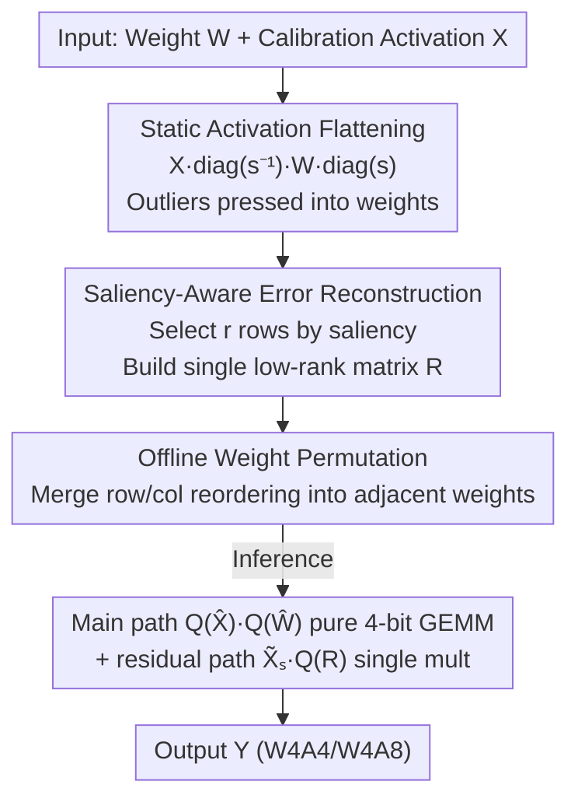

# SERQ: Saliency-Aware Low-Rank Error Reconstruction for LLM Quantization

**Conference**: ICLR 2026  
**OpenReview**: [https://openreview.net/forum?id=nFjj8NEBqv](https://openreview.net/forum?id=nFjj8NEBqv)  
**Code**: https://github.com/acalabys/SERQ  
**Area**: Model Compression  
**Keywords**: LLM Quantization, Post-Training Quantization, Low-Rank Error Reconstruction, Saliency, W4A4

## TL;DR
SERQ unifies activation outliers and weight saliency into a **single** low-rank compensation matrix. Through three steps—static activation flattening, saliency-aware error reconstruction, and offline weight permutation—linear layers achieve a pure 4-bit end-to-end computation path under W4A4. It outperforms previous LoRA-style reconstruction and rotation-based methods in accuracy while adding negligible inference latency.

## Background & Motivation

**Background**: Post-Training Quantization (PTQ) is a mainstream approach for deploying LLMs, with the core difficulty being the handling of **channel-level activation outliers**. Currently, there are three technical routes: ① Pre-quantization scaling (SmoothQuant, OmniQuant) to flatten activation distributions; ② Online transformations (random Hadamard in QuaRot, learned rotations in SpinQuant) to suppress outliers via tensor rotation; ③ **Low-rank error reconstruction**—using a pair of LoRA-style low-rank factors $L_1L_2 \approx W - Q(W)$ to compensate for quantization errors. The third route is particularly popular as it requires no retraining and adds no online layers, with L2QER being nearly lossless under W4A8.

**Limitations of Prior Work**: Despite their utility, low-rank error reconstruction methods face two major issues. First, accuracy collapses severely under **W4A4** configurations—L2QER becomes nearly ineffective on LLaMA-3. Second, traditional low-rank adaptation relies on **two serial factors** $L_1, L_2$, requiring the calculation of $X_q W_q + X_q L_1 L_2$ during inference. The intermediate values produced between the two sequential matrix multiplications necessitate **on-the-fly quantization** to maintain low-precision execution, which offsets the advantages of low-precision GEMM kernels. While rotation methods can handle INT4, they suffer from either expensive calibration or performance variance due to random matrices.

**Key Challenge**: The two serial factors in low-rank error reconstruction are both the source of its "lightweight" nature and the root of its "slow and inaccurate" performance under W4A4. The intermediate quantization steps and fragmented rank budget make error compensation inefficient and poorly targeted. SVD distributes a fixed rank budget across all rows and columns, **diluting** the capacity for the truly problematic salient rows.

**Goal**: Use a **single** low-rank matrix to simultaneously compensate for quantization errors on both the weight and activation sides, achieving: ① elimination of intermediate online quantization, ② a pure 4-bit execution path, ③ low calibration cost, and ④ stable accuracy under W4A4.

**Key Insight**: Following the insight from AWQ, protecting approximately 1% of **salient channels (corresponding to weight rows)** can significantly reduce error. Consequently, rather than extracting rank from the entire weight matrix using SVD, it is more effective to **select the $r$ most critical rows based on row saliency** for error reconstruction, concentrating all low-rank capacity on these rows.

**Core Idea**: Fold activation statistics into weights, select $r$ salient weight rows, and construct a single low-rank compensation matrix $R = \tilde{W}_s - Q(\tilde{W}_s)$ only for these rows. The residual path requires only **one** matrix multiplication, fundamentally removing the serial second factor and intermediate quantization.

## Method

### Overall Architecture
SERQ addresses how to precisely compensate for quantization errors under W4A4 using a single low-rank matrix without breaking the pure 4-bit GEMM path. The process consists of three sequential steps: static **activation flattening** to press outliers into weights; **saliency-aware error reconstruction** to identify salient rows in the folded weights and construct a single low-rank compensation matrix $R$; and **offline weight permutation** to merge row/column reordering into weight parameters, ensuring no online reordering is needed during inference. Calibration determines scaling factors, salient rows, and permutation orders; during inference, the main path executes 4-bit GEMM, while the residual path performs a single multiplication for salient activation channels $\tilde{X}_s$ with $R$.

### Key Designs

**1. Static Activation Flattening: Replacing online outlier handling with offline scaling**

The most vulnerable part of activation quantization is channel-level outliers. While online schemes like rotation or auxiliary layers are effective, they introduce latency. Since SERQ already equips linear layers with a low-rank residual path, it bypasses online flattening in favor of SmoothQuant-style **static per-channel scaling**: use a scaling factor $s$ to flatten activations and fold $s$ into the weights, $Y = XW = (X\cdot \mathrm{diag}(s^{-1}))(\mathrm{diag}(s)\cdot W) = \tilde{X}\tilde{W}$. Scaling factors are calculated during calibration and merged offline into adjacent layers, resulting in **zero runtime overhead**. The trade-off is that the outlier burden shifts from activations to weights, increasing weight quantization difficulty—which is precisely compensated by the subsequent low-rank reconstruction. This division of labor is key to avoiding online transformations.

**2. Saliency-Aware Error Reconstruction: Single matrix for salient rows to eliminate intermediate quantization**

This is the core of SERQ, targeting the "two serial factors + intermediate quantization" bottleneck. After static flattening, activation outliers are pushed into corresponding weight rows. Assuming original weights are approximately normally distributed, **salient rows in the folded weights can be directly identified by their scale magnitudes**. SERQ permutes weight rows in descending order of saliency $P$, expressing the folded matrix as $\hat{W} = P\cdot\mathrm{diag}(s)\cdot W = [\tilde{W}_s; \tilde{W}_r]$, and constructs a low-rank compensation matrix only for the top $r$ salient rows $\tilde{W}_s$:

$$R = \tilde{W}_s - Q(\tilde{W}_s)$$

The linear operation becomes $Q(\hat{X})\cdot Q(\hat{W}) \approx \hat{X}_q\hat{W}_q + \tilde{X}_{s,q}\cdot Q(R)$. The fundamental difference from SVD is that SVD extracts rank from the whole matrix, requiring two serial factors and intermediate quantization. SERQ extracts salient rows directly, so the residual path requires **only one** $\mathbb{R}^{s\_len\times r}\times \mathbb{R}^{r\times d}$ matrix multiplication. Since $R$ itself is quantized, the **entire process remains pure low-precision without intermediate quantization**. Placing the fixed rank budget entirely on the rows most in need of compensation explains why a single matrix yields lower perplexity than SVD-based full-matrix decomposition.

**3. Offline Weight Permutation: Zero-latency row/column reordering**

Saliency reconstruction requires both weights and activations to be reordered by saliency ($\hat{X}=[\tilde{X}_s\,\tilde{X}_r]$, $\hat{W}=[\tilde{W}_s;\tilde{W}_r]$). Real-time reordering during inference would introduce latency. SERQ proposes a **mergeable permutation scheme**: row and column indices of weights are reordered offline during calibration. Row permutations are pre-applied to weight parameters. To ensure corresponding activations follow the same channel order, a **column permutation is applied to the previous layer's weights**. For example, the permutation order $P_4$ for a down-projection is propagated to the weight columns of the preceding up/gate-projections, ensuring their output activations are naturally ordered by $P_4$. Consequently, all linear layers avoid on-the-fly reordering, incurring zero additional latency.

## Key Experimental Results

### Main Results

Comparison with low-rank matrix decomposition methods (Perplexity↓ / Average 8-shot Zero-shot Reasoning↑ / MMLU↑) for LLaMA-2/3 series:

| Configuration | Method | #Eff.(w) | L2-7B PPL | L2-7B 0-shot | L3-8B PPL | L3-8B MMLU |
|---------------|--------|----------|-----------|--------------|-----------|------------|
| FP16 | baseline | 16 | 5.47 | 64.09 | 6.13 | 62.13 |
| W4A8 | L2QER | 4.35 | 5.83 | 63.35 | 7.16 | 57.81 |
| W4A8 | SERQ(GPTQ) | 4.24 | **5.59** | 63.04 | **6.52** | **60.25** |
| W4A4 | L2QER | 4.24 | 7.37 | 57.67 | 11.44 | 38.33 |
| W4A4 | L2QER-MXFP4 | 4.37 | 6.30 | 60.95 | 7.83 | 53.82 |
| W4A4 | SERQ(GPTQ) | 4.24 | **5.97** | **61.87** | 7.75 | 53.8 |

Ours leads across almost all metrics at the lowest effective bit-width (4.24). The gap is particularly stark at W4A4—where L2QER collapses to PPL 11.44 and MMLU 38.33 on LLaMA-3, Ours maintains 7.75 / 53.8.

Comparison with W4A4 distribution flattening (rotation-based) methods for LLaMA-2 7B / LLaMA-3 8B:

| Method | Training-free | Latency Overhead | L2-7B PPL | L2-7B MMLU | L3-8B PPL | L3-8B MMLU |
|--------|---------------|------------------|-----------|------------|-----------|------------|
| QuaRot | ✓ | 19.8% | 6.15 | 33.58 | 8.41 | 47.29 |
| SpinQuant | ✗ | 19.8% | 6.0 | 34.8 | 8.26 | 49.93 |
| SERQ | ✓ | **18.7%** | **5.97** | **37.03** | **7.75** | **53.8** |

Under training-free conditions, Ours outperforms SpinQuant (which requires learning rotation matrices) in both accuracy (especially MMLU) and latency.

### Ablation Study

| Configuration | Key Metric | Description |
|---------------|------------|-------------|
| Rank=0 | L3-8B PPL 9.80 | No low-rank reconstruction, significant degradation |
| Rank=16 | L3-8B PPL 8.28 | Equivalent to LoRA rank 8, already competitive |
| Rank=128 | L3-8B PPL 8.07 | Default setting |
| Rank=256 | L3-8B PPL 7.98 | Rapid returns saturation |
| Wiki 128 samples | L3-8B PPL 7.98 | Calibration data |
| Pile 32 samples | L3-8B PPL 8.18 | Stable across datasets/reduced samples |

### Key Findings
- **Perplexity decreases monotonically with rank but saturates quickly**: The gain from rank 0→128 is most significant, while 128→256 offers marginal benefit. Even rank=16 is nearly competitive, proving that errors are highly concentrated in a few salient rows and validating the core hypothesis of "single matrix salient row compensation."
- **High robustness to calibration data**: PPL remains nearly constant between WikiText-2 and Pile, or between 128 and 32 samples, allowing for extremely low calibration costs.
- **Latency advantage stems from removing the serial factor**: At W4A4, the residual path of Ours is up to **4.5× faster** than L2QER's dual-serial LoRA multiplication. Compared to rotation methods, which incur ~1.6× rotation overhead due to unbalanced matrix dimensions, Ours adds only ~1% total latency. End-to-end on Blackwell GPUs, TTFT is speeded up by >2× vs FP16, with peak memory savings up to 2.48×.

## Highlights & Insights
- **The "Single Matrix" is the fulcrum for balancing latency and accuracy**: Traditional LoRA-style reconstruction's two serial factors are slow and necessitate intermediate quantization. Ours uses a "single $R$ compensating only salient rows" to eliminate the second factor, turning the residual into a single matrix multiplication—the foundation for its pure 4-bit end-to-end path at W4A4.
- **Unifying saliency from "Activation" to "Weight Row"**: By folding activation outliers into weights via static flattening, salient rows can be identified directly by scale. Saliency across both sides is thus unified into a single task of "selecting weight rows," making modeling and implementation clean.
- **Propagation of offline permutations**: Propagating the row permutation order of one layer to the column permutation of the previous layer achieves "zero runtime overhead" for reordering. This strategy is applicable to any quantization/pruning method requiring channel reordering.

## Limitations & Future Work
- The method focuses on **linear layer** quantization; KV-cache quantization is not included (rotation comparisons also excluded KV quantization for fairness). Full benefits for end-to-end low-bit deployment require this component.
- Salient row identification relies on the assumption that original weights are roughly normal and scale indicates saliency; whether this holds for models with abnormal distributions is not deeply explored. The number of salient rows is fixed to rank, which might not adapt to extreme outlier structures.
- During single-batch decoding, quantization is slightly slower than FP16 (similar to the MXFP4 trend). Gains are primarily seen in prefill and larger batches; small batch decoding latency remains an area for optimization.

## Related Work & Insights
- **vs L2QER**: Both use low-rank error reconstruction. L2QER uses SVD for two serial factors, 8-bit low-rank matrices, and intermediate online quantization. Ours uses a single 4-bit matrix for salient rows and a single residual multiplication without intermediate quantization, making it more accurate and up to 4.5× faster at W4A4 with lower effective bit-width.
- **vs QuaRot / SpinQuant**: Rotation methods use Hadamard/learned rotations to flatten outliers online. QuaRot suffers from random matrix variance, and SpinQuant requires training. Ours is a training-free static scheme with higher accuracy and lower latency, particularly on compact models like LLaMA-3.2.
- **vs SmoothQuant**: Ours reuses the static per-channel flattening of SmoothQuant but provides the missing piece: how to precisely compensate for the errors pushed into the weights after flattening—using a single low-rank matrix for salient weight row reconstruction.

## Rating
- Novelty: ⭐⭐⭐⭐⭐ First to use a single saliency-guided low-rank matrix to achieve 4-bit end-to-end error reconstruction for linear layers, eliminating the serial second factor and intermediate quantization.
- Experimental Thoroughness: ⭐⭐⭐⭐ Covers various scales of LLaMA-2/3 and Qwen, W4A8/W4A4 configurations, rotation comparisons, and GPU latency/memory; KV-cache quantization is missing.
- Writing Quality: ⭐⭐⭐⭐ Clear motivation-method-experiment logic; the three-step framework and formulas are well-expressed.
- Value: ⭐⭐⭐⭐⭐ Balances accuracy and pure low-precision inference efficiency under the difficult W4A4 setting; directly practical for edge and server LLM deployment.

<!-- RELATED:START -->

## Related Papers

- [\[ICLR 2026\] UniQL: Unified Quantization and Low-Rank Compression for Adaptive Edge LLMs](uniql_unified_quantization_and_low-rank_compression_for_adaptive_edge_llms.md)
- [\[ICML 2026\] Preserve-Then-Quantize: Balancing Rank Budgets for Quantization Error Reconstruction in LLMs](../../ICML2026/model_compression/preserve-then-quantize_balancing_rank_budgets_for_quantization_error_reconstruct.md)
- [\[ICLR 2026\] Rethinking Residual Errors in Compensation-based LLM Quantization](rethinking_residual_errors_in_compensation-based_llm_quantization.md)
- [\[ICLR 2026\] Towards Quantization-Aware Training for Ultra-Low-Bit Reasoning LLMs](towards_quantization-aware_training_for_ultra-low-bit_reasoning_llms.md)
- [\[ICML 2026\] Saliency-Aware Model Merging](../../ICML2026/model_compression/saliency-aware_model_merging.md)

<!-- RELATED:END -->
