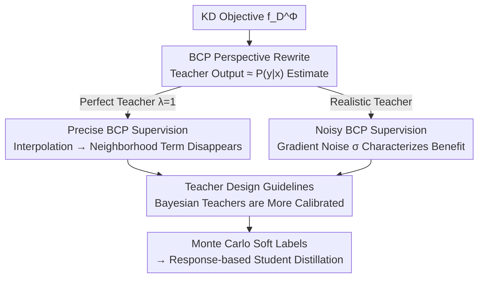

# SGD-Based Knowledge Distillation with Bayesian Teachers: Theory and Guidelines

**Conference**: ICLR 2026  
**OpenReview**: [https://openreview.net/forum?id=YZGBnZbMYN](https://openreview.net/forum?id=YZGBnZbMYN)  
**Area**: Model Compression / Knowledge Distillation Theory  
**Keywords**: Knowledge Distillation, SGD Convergence Analysis, Bayes-class Posteriors, Teacher Calibration, Bayesian Deep Learning

## TL;DR
This paper views Knowledge Distillation (KD) from a Bayesian perspective as "supervision using Bayes Class Probabilities (BCP) instead of one-hot labels." It rigorously analyzes the convergence behavior of students trained with SGD, proving that learning from precise BCP eliminates the "neighborhood term" in the convergence bound (zeroing variance and allowing larger learning rates). Based on this, it provides a practical guideline: use better-calibrated Bayesian teachers for distillation. Experiments show student accuracy improvements of up to +4.27% and convergence noise reduction of up to 30%.

## Background & Motivation
**Background**: The core of knowledge distillation is to make a small student network fit the "soft probabilities" output by a large teacher network, rather than hard one-hot labels. This soft supervision is effective for compression, transfer, and enhancing generalization, leading to numerous methods like dynamic temperature, feature distillation, and task-aware matching.

**Limitations of Prior Work**: Despite the empirical success of KD, its theoretical foundation is only "partially understood." Specifically, how the probabilities output by the teacher influence the student's **optimization trajectory** and **generalization** has not been clearly characterized. Existing theories mostly focus on special scenarios like self-distillation or analyze from the perspective of statistical risk (excess risk), rarely touching upon the dynamics of learning algorithms actually used in practice, such as SGD.

**Key Challenge**: KD replaces the supervision signal from "discrete labels" to "continuous probabilities." What specific stage of SGD convergence does this substitution change? Furthermore, since teacher probabilities are estimates (potentially noisy) of the true Bayes class posterior $P(y|x)$, how does the accuracy of this estimate (calibration) specifically help student optimization, and when does it become useless? These questions determine "what kind of teacher should be designed."

**Goal**: (1) Characterize the influence of "supervision via BCP estimates" on SGD convergence for both precise and noisy teacher scenarios, comparing them with one-hot supervision; (2) Derive actionable teacher design criteria from the analysis.

**Key Insight**: The authors interpret the teacher's output as an estimate of the **Bayes Class Probability (BCP)** $P(y|x)$—a perfect teacher outputs the true BCP, while a realistic teacher outputs a noisy BCP. Under this unified modeling, the distillation objective $f_D^\Phi$ simplifies to empirical risk using "soft labels as supervision," allowing the application of mature tools for SGD convergence analysis.

**Core Idea**: Replacing "one-hot supervision" with "BCP supervision" transforms the optimization problem from "fitting hard labels" into an **interpolation task**, thereby eliminating the stochastic noise neighborhood term in the SGD convergence bound. This benefit strengthens as noise decreases (teacher becomes more calibrated)—thus, **Bayesian teachers**, which are naturally better calibrated, should be used.

## Method

### Overall Architecture
This paper does not propose a new module but instead establishes a "theory $\to$ criteria $\to$ practice" chain for KD. It first simplifies the standard KD objective:
$$\min_{\theta}\; f_D^\Phi(\theta)=\frac{1}{|D|}\sum_n \big[(1-\lambda)\,\ell(\phi_\theta(x_n),y_n)+\lambda\,\ell(\phi_\theta(x_n),\Phi(x_n))\big]$$
under cross-entropy (which is linear in the second parameter) into supervision against **mixed soft labels** $(1-\lambda)y_n+\lambda\Phi(x_n)$. When the teacher $\Phi$ outputs the true BCP and $\lambda=1$, it reduces to pure BCP supervision. SGD convergence bounds are then derived for two cases—**precise BCP** (perfect teacher) and **noisy BCP** (realistic teacher)—and contrasted with the standard bound for one-hot supervision, resulting in the conclusion of "eliminated neighborhood terms / reduced gradient noise." Finally, this theoretical finding is translated into an engineering guideline: since the benefits stem from the teacher's approximation accuracy of BCP (calibration), Bayesian deep learning models should be used as teachers. Two implementation paths are provided (training via VI from scratch / converting existing deterministic teachers using Laplace Approximation). Downstream response-based distillation is used as usual, with soft labels obtained via Monte Carlo averaging of multiple teacher forward passes.

### Key Designs

**1. BCP Supervision under a Bayesian Perspective: Rewriting KD as an Analyzable Optimization Problem**

To address the unclear impact of teacher probabilities on optimization, the authors unify the supervision target as BCP. Standard risk uses one-hot labels $\min_\theta f_P(\theta)=\mathbb{E}[\ell(\phi_\theta(x),y)]$, while BCP risk replaces $y$ with the true posterior $\min_{\hat\theta}\hat f_P(\hat\theta)=\mathbb{E}[\ell(\phi_\theta(x),P(y|x))]$. **Proposition 1** proves that when student expressivity is sufficient (AS4), both have the **same optimal solution and optimal value** (both are the true BCP, and the minimum loss equals the conditional entropy of $y$ given $x$). This means switching to BCP supervision does not change the target model but only the path to reach it. This step serves as the foundation for subsequent convergence analysis, ensuring that the comparison between BCP and one-hot supervision examines different paths to the same destination.

**2. Interpolation Property of Perfect BCP Supervision: Eliminating Neighborhood Terms and Increasing Usable Learning Rates**

This is the most core conclusion of the paper, explaining why KD is stable. **Proposition 2 + Lemma 1** prove that BCP risk satisfies the **interpolation property**: the optimal solution $\hat\theta^*$ simultaneously minimizes the loss for every sample, meaning the gradient of each sample at the optimum is exactly zero: $\nabla_{\hat\theta}\ell(\phi_{\hat\theta^*}(x),P(y|x))=0$. This brings two direct benefits (**Theorem 1-2**): First, both parameters and risk converge geometrically at $(1-\alpha\mu)^t$, and the **neighborhood term** (proportional to $\frac{\alpha}{\mu}\sigma_f^*$) in the standard SGD bound **disappears**—the student no longer jitters near the optimum but converges precisely to it. Second, the range of learning rates that guarantee convergence is **twice** that of standard SGD, allowing for larger steps and faster convergence. Intuitively, distillation transforms the inherently non-interpolating problem of "fitting noisy one-hot labels" into an interpolating one, thereby eradicating stochastic noise in SGD. This also explains why KD can still generalize in settings where one-hot supervision would lead to overfitting.

**3. Characterizing Gradient Noise of Noisy BCP: Providing a Criterion for "When Distillation is Beneficial"**

Realistic teachers are imperfect. The authors model noisy BCP as the true BCP plus zero-mean noise with variance $\nu$: $\Phi(x)\equiv[P(y_k|x)+\epsilon_k]_k$. In this case, the neighborhood term reappears in the convergence bound (**Theorem 3-4**), but its magnitude is determined by a clean gradient noise term. **Proposition 3** provides two side-by-side closed forms. For one-hot supervision:
$$\sigma_f^*=\mathbb{E}_x\Big[\sum_{k=1}^K \tfrac{1}{P(y_k|x)}\,\|J_{\theta,k}[\phi_{\theta^*}(x)]\|^2\Big],$$
For noisy BCP supervision:
$$\sigma_{\tilde f}^*=\nu\cdot\mathbb{E}_x\Big[\sum_{k=1}^K \tfrac{1}{[P(y_k|x)]^2}\,\|J_{\tilde\theta,k}[\phi_{\tilde\theta^*}(x)]\|^2\Big].$$
Both are weighted averages of Jacobian columns, differing in weights: one-hot uses the inverse of BCP, while noisy BCP uses the noise variance $\nu$ times the inverse of squared BCP. The conclusion is sharp: as $\nu\to0$ (teacher outputs true BCP), it degenerates to the case without a neighborhood term. Distillation is **beneficial if and only if** $\sigma_{\tilde f}^*<\sigma_f^*$, meaning the teacher's noise is smaller than the inherent variance of one-hot labels relative to true BCP. This tipping point depends on data distribution, model smoothness (Jacobian), and teacher quality ($\nu$), quantifying the criterion for "whether a teacher is good enough to justify distillation" into a comparable inequality.

**4. Bayesian Teacher as a Practical Guideline: Approximating BCP with More Calibrated Probabilities**

The theory suggests "the more calibrated the teacher (the closer to BCP), the better." The authors argue for using **Bayesian Neural Networks (BNNs)** as teachers because BNNs are naturally better calibrated than deterministic networks. Two complementary paths are provided for implementation: (i) training a Bayesian teacher from scratch using Variational Inference (VI); (ii) converting existing deterministic pre-trained teachers into Bayesian models using **Laplace Approximation (LA)** via second-order expansion. The benefit of the latter is that it requires no retraining. Stochasticity can be injected into all weights, specific layers, or only the last layer to adjust complexity according to the compute budget. During inference, teacher soft labels are obtained via Monte Carlo estimation through $S$ random forward passes (averaging after softmax), then fed to the student via response-based distillation. This step transforms the abstract "approximating BCP" into concrete, interchangeable teacher construction methods.

### Loss & Training
Students use the standard cross-entropy distillation objective (Eq. 4), with the key hyperparameter being the distillation weight $\lambda\in[0,1]$. Analysis shows that the **optimal $\lambda$ varies with teacher noise level**—the more calibrated the teacher, the more one can lean toward pure soft labels (larger $\lambda$). Teacher side: VI training or LA conversion; soft labels via $S$-pass MC averaging. Theoretical assumptions include strong quasi-convexity/PL conditions (AS1/AS2), expected smoothness (AS3), and sufficient student expressivity to realize true BCP (AS4). The authors note that the guidelines remain effective in experiments even when these assumptions are not strictly met.

## Key Experimental Results

### Main Results
CIFAR-100, 12 teacher-student pairings (6 same architecture + 6 different architectures), comparing 6 teacher types per pairing over 5 runs. Student accuracy (%), subscripts indicate changes relative to the "Deterministic Teacher":

| Pairing (Heterogeneous) | Det. Teacher → Student | Bayesian (VI, Ours) | Laplace (LA, Ours) |
|--------|------|------|------|
| ResNet-50→VGG-8 | 75.66 | 77.27 (**+1.62**) | 76.11 (+0.46) |
| VGG-13→WRN-40-1 | 67.90 | 71.37 (**+3.47**) | 70.87 (+2.97) |
| ResNet-50→WRN-16-2 | 69.36 | 73.63 (**+4.27**) | 72.52 (+3.16) |
| ResNet-50→WRN-40-2 | 73.79 | 75.82 (+2.03) | 74.57 (+0.77) |

Bayesian teachers yield the largest gains in heterogeneous pairings (up to +4.27%), confirming the theoretical prediction that "better calibration $\to$ better student." Gains in same-architecture pairings are smaller but consistently positive.

### Ablation Study

| Teacher Type | Method | Student Performance |
|------|---------|------|
| Deterministic | Standard deterministic teacher (Baseline) | Baseline |
| Bayesian (VI, Ours) | BNN teacher trained from scratch via VI | Consistently best, up to +4.27% |
| Laplace (LA, Ours) | Laplace Approximation on pre-trained teacher | Mostly positive, secondary to VI, no retraining |
| MCMI | Finetuning det. teacher with CMI loss | Negligible gain (mostly within ±0.3) |
| TTDA | Transforming det. teacher for stochastic prediction | Weak gain (within ±0.5) |
| MSE | Changing loss to enhance calibration | **Generally decreases performance** (worst -3.65) |

### Key Findings
- **Bayesian Teachers contribute most**: VI teachers consistently improve student accuracy across 12 pairings, with significant gains in heterogeneous settings (up to +4.27%) and convergence noise reduction of up to 30%—directly corresponding to the "reduced gradient noise" in the theory.
- **Laplace path is cost-effective**: While the teacher's own accuracy sometimes slightly decreases (calibration $\neq$ accuracy), the student mostly benefits. Since LA doesn't require retraining, it is the easiest to deploy in engineering.
- **Loss-modification methods are ineffective**: Methods like MSE, MCMI, and TTDA that try to enhance calibration within a deterministic framework show weak or even negative gains, highlighting that the "natural calibration from the Bayesian paradigm" is key.
- **$\lambda$ varies with teacher quality**: Synthetic experiments show the optimal $\lambda$ for students depends on BCP noise levels, suggesting a future direction for adaptive $\lambda$ selection based on teacher uncertainty.

## Highlights & Insights
- **Translating KD's effectiveness into SGD language**: While previous works labelled soft labels as "regularization," this paper precisely identifies that they turn optimization into an interpolation task, thereby removing the stochastic noise neighborhood term—a mechanistic explanation for KD stability rather than a general one.
- **Clean closed-form gradient noise**: The formulas for $\sigma_f^*$ (weighted by BCP inverse) and $\sigma_{\tilde f}^*$ (weighted by $\nu$ times squared BCP inverse) clearly show how teacher noise $\nu$ enters the convergence bound and provide a testable condition: $\sigma_{\tilde f}^*<\sigma_f^*$.
- **Theory directly produces engineering guidelines**: The logical flow from "approximating BCP $\to$ calibration $\to$ BNN" leads to two practical teacher construction methods (VI training / LA conversion). The Laplace path is particularly useful as it can be applied to any existing deterministic teacher with minimal migration cost.

## Limitations & Future Work
- **Strong Theoretical Assumptions**: Strong quasi-convexity/PL, expected smoothness, and sufficient student expressivity (AS1-AS4) do not strictly hold in real deep networks. Although experiments compensate for this, rigorous guarantees remain limited to ideal settings.
- **Simplified Noise Modeling**: Teacher error is modeled as zero-mean, uncorrelated additive noise (or Dirichlet). Real-world teacher errors might be biased or correlated; although a Dirichlet version is provided in the appendix, coverage is still limited.
- **Limited Experimental Scale**: Validated only on CIFAR-100 without large-scale images or non-visual tasks. The training and inference overhead of Bayesian teachers (especially VI/multiple MC passes) was not fully weighed against the benefits in a cost-benefit analysis.
- **Future Directions**: Developing online algorithms for adaptive $\lambda$ based on teacher uncertainty; extending analysis to non-convex settings, biased noise, and sequential tasks.

## Related Work & Insights
- **vs. Menon et al. (2021) / Dao et al. (2021)**: These also analyze KD from a Bayesian perspective but focus on statistical risk properties (excess risk, $\ell_2$ distance between teacher and BCP). This work instead analyzes the **learning algorithm itself** (SGD convergence/gradient noise) and translates it into teacher design.
- **vs. Safaryan et al. (2024)**: To the authors' knowledge, this is the first work to analyze the impact of distillation on SGD. However, that work was limited to self-distillation (where the student is a compressed version of the teacher) and relied on specific gradient approximations. This work applies to **any teacher**, does not rely on gradient approximations, and explicitly treats the teacher as a BCP estimator.
- **vs. Kim/Fan/MCMI/MSE calibration methods**: These methods modify losses in a deterministic framework. This paper switches to the Bayesian paradigm for natural calibration and uncertainty quantification, significantly outperforming loss-based methods in experiments.
- **vs. ABKD / f-divergence classes**: Those works change the divergence used in KD (how probability mass is transmitted), whereas this work focuses on the **quality** of the teacher's probability estimate and its impact on the student.

## Rating
- Novelty: ⭐⭐⭐⭐⭐ First to clearly characterize the impact of distillation on SGD dynamics and derive the "use Bayesian teachers" criterion directly from theory.
- Experimental Thoroughness: ⭐⭐⭐⭐ 12 pairings × 6 teacher types + synthetic validation is solid, though limited to CIFAR-100 and lacks cost analysis.
- Writing Quality: ⭐⭐⭐⭐⭐ The theory-guideline-experiment chain is very clear; propositions/theorems are well-explained against standard SGD bounds.
- Value: ⭐⭐⭐⭐ Provides an actionable and low-cost (Laplace) answer to "how to design a teacher," offering direct guidance for KD practice.

<!-- RELATED:START -->

## Related Papers

- [\[CVPR 2026\] Continual Distillation of Teachers from Different Domains](../../CVPR2026/model_compression/continual_distillation_of_teachers_from_different_domains.md)
- [\[ICLR 2026\] In Good GRACES: Principled Teacher Selection for Knowledge Distillation](in_good_graces_principled_teacher_selection_for_knowledge_distillation.md)
- [\[ICLR 2026\] Pedagogically-Inspired Data Synthesis for Language Model Knowledge Distillation](pedagogically-inspired_data_synthesis_for_language_model_knowledge_distillation.md)
- [\[ICLR 2026\] Generative Diffusion Prior Distillation for Long-Context Knowledge Transfer](generative_diffusion_prior_distillation_for_long-context_knowledge_transfer.md)
- [\[ICLR 2026\] Knowledge Distillation as Decontamination? Revisiting the "Data Laundering" Concern in Classification Tasks](knowledge_distillation_as_decontamination_revisiting_the_data_laundering_concern.md)

<!-- RELATED:END -->
