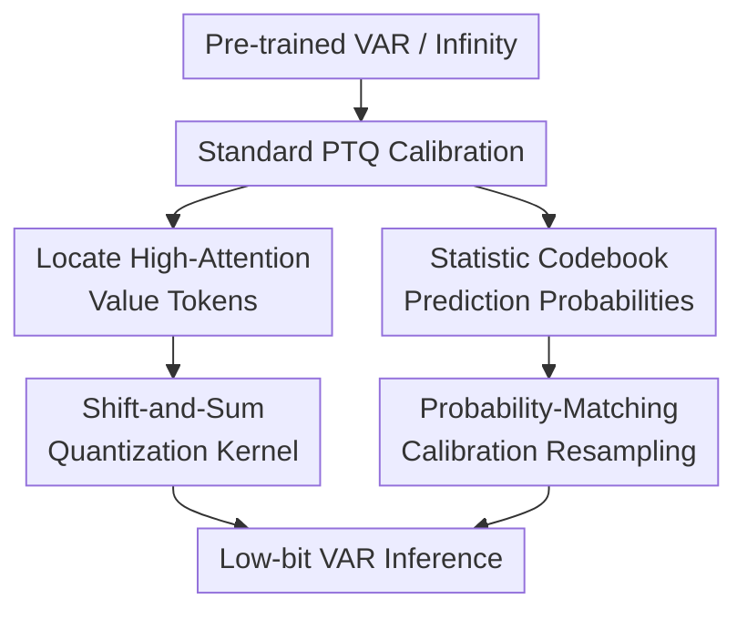

# Shift-and-Sum Quantization for Visual Autoregressive Models

**Conference**: ICLR2026  
**OpenReview**: [https://openreview.net/forum?id=DAZvMAlZRp](https://openreview.net/forum?id=DAZvMAlZRp)  
**Paper**: [OpenReview](https://openreview.net/forum?id=DAZvMAlZRp)  
**Code**: Not disclosed (Project Page: http://cvlab.yonsei.ac.kr/projects/Shift-and-Sum/)  
**Area**: Model Compression / Visual Autoregressive Models / Post-Training Quantization  
**Keywords**: Post-Training Quantization, Visual Autoregressive Models, Shift-and-Sum, Calibration Data Resampling, Attention Quantization  

## TL;DR

This paper proposes Shift-and-Sum quantization and calibration data resampling for Visual Autoregressive (VAR) models. The former specifically reduces errors in attention-value products for high-attention value tokens, while the latter aligns the VQ-VAE codebook sampling frequency in small calibration sets with the model's prediction probabilities. The method consistently outperforms BRECQ and LiteVAR on low-bit VAR and Infinity generation tasks.

## Background & Motivation

**Background**: Visual Autoregressive (VAR) models transform image generation from traditional raster-scan token prediction to next-scale prediction from coarse to fine scales. They first determine the global structure on low-resolution token maps and then progressively refine details, finally reconstructing images using a VQ-VAE decoder. This paradigm competes with diffusion and GAN models but requires multiple transformer blocks and repeated attention and feed-forward calculations at each scale during inference.

**Limitations of Prior Work**: Post-Training Quantization (PTQ) is ideal for deployment as it compresses weights and activations to low bits using minimal calibration data. however, quantization techniques for ViT or diffusion models cannot be directly applied to VAR. The authors find that the product of attention scores and value tokens in VAR transformers suffers from significant quantization errors, particularly at coarse scales. With fewer tokens at coarse scales, attention tends to concentrate on a few value tokens; errors in these "critical" tokens propagate through subsequent scales.

**Key Challenge**: Another specific conflict in VAR arises from the VQ-VAE codebook. During calibration, tokens are sampled from the codebook based on predicted probabilities. However, PTQ typically uses very few calibration samples (e.g., 256 images). With a large codebook (e.g., 4096 entries in VAR-d16), some entries are oversampled randomly while others are undersampled, leading to quantization parameters calibrated on an inaccurate discrete distribution.

**Goal**: The authors aim to solve two specific problems: 1) reduce the reconstruction error of the VAR attention-value product for coarse-scale, high-attention tokens without introducing mixed-precision hardware dependencies, and 2) align the codebook frequency of calibration token maps with the model's own probability distribution without expanding the calibration set.

**Key Insight**: Instead of retraining the model or keeping many layers in full precision, this work targets the two most distinct error sources in VAR quantization: error amplification of "high-weight tokens" in attention and calibration distribution drift caused by random codebook sampling. This approach allows for local modifications while maintaining the lightweight deployment nature of PTQ.

**Core Idea**: For the most influential value tokens in attention, "summing after symmetric shifted quantization" is used, where extra bit-shifts and additions dilute the single-quantization error. Simultaneously, calibration tokens are redistributed to make the actual sampling frequency of codebook entries match the predicted probabilities.

## Method

### Overall Architecture

The proposed method is a PTQ framework for VAR, built upon block reconstruction methods like BRECQ. It first uses standard quantizers for weights, activations, and softmax attention (log2 quantizer for attention, uniform for others). In the self-attention $AV$ product, a Shift-and-Sum kernel is activated for value tokens whose average attention score exceeds a threshold. Finally, probability-matching resampling is applied to VQ-VAE codebook tokens when generating calibration data.

The method focuses additional computational budget on two VAR-specific weaknesses: the internal attention-value product of the transformer and the discrete codebook distribution of calibration data, rather than increasing bit-widths for the entire network.

At the quantizer level, a uniform quantizer maps floating-point values $x$ to $b$-bit integers and dequantizes them as $Q(x;s,z)=s(\hat{x}-z)$. Softmax attention uses a log2 quantizer, outputting $Q(x;s)=s2^{-\hat{x}}$. While log2 attention is hardware-friendly, its relative error affects the final product as attention scores fluctuate, which the design specifically addresses.

### Key Designs

**1. Modeling High-Attention Errors: Why Coarse Scales are Sensitive**

VAR calculates a weighted sum of attention scores $a_i$ and value tokens $v_i$ at each scale. Representing quantization errors as $\epsilon_i^a$ and $\epsilon_i^v$, the quantized attention-value product is approximately $\sum_i (a_i+\epsilon_i^a)(v_i+\epsilon_i^v)$. Under the approximation of independent zero-mean errors, the reconstruction error variance is derived:

$$
\operatorname{Var}[\delta]=\sum_{i=1}^{T} a_i^2\left(\sigma_a^2\lVert v_i\rVert_2^2+d(\sigma_a^2\sigma_v^2+\sigma_v^2)\right).
$$

This indicates that errors are amplified by $a_i^2$ rather than being uniformly distributed. Coarse scales have fewer tokens, leading to more concentrated attention and a higher proportion of tokens exceeding the threshold $\theta$. Consequently, identical value quantization errors result in more structural artifacts at coarse scales.

**2. Shift-and-Sum Quantization Kernel: Refining the Grid via Symmetric Offset Averaging**

For a scalar value $v$, an $n$-th order quantization kernel is defined:

$$
f_n(v;t_n)=\frac{1}{2n}\sum_{k=-n}^{n-1} Q\left(v+(2k+1)t_n\right).
$$

Instead of quantizing $v$ once, it quantizes $2n$ symmetrically shifted versions (e.g., $v-s/4$ and $v+s/4$ for $n=1$) and averages them. Setting $t_n=s/(4n)$, the error bound is $|v-f_n(v;t_n)|\le s/(4n)$, compared to $s/2$ for standard rounding. The averaged output effectively falls on a finer grid, reducing value quantization errors without switching to a higher bit-width format. 

This is applied only to value tokens in set $H$ where $\operatorname{Score}(v_i) = \lVert \alpha_i\rVert_1/T' > \theta$:

$$
AV\approx \sum_{i\in H}Q_a(\alpha_i)f_n(v_i;s_v/(4n))^\top + \sum_{i\notin H}Q_a(\alpha_i)Q_v(v_i)^\top.
$$

**3. Adaptive Kernel Orders: Tying Computation to Attention Scores**

To avoid fixed overhead, the kernel order is restricted to powers of 2 ($1, 2, 4, \ldots$), allowing bit-shifts for Division by $2n$. For tokens where $\operatorname{Score}(v_i)>\theta$, the order $\hat{n}_i=\lceil \log_2(\operatorname{Score}(v_i)/\theta)\rceil$ is chosen to bring the effective score below the threshold. This design allocates more replicates only to tokens with higher weights. The extra BOPs budget is restricted to approximately 1% of total inference cost.

**4. Calibration Data Probability Matching: Correcting Codebook Sampling Bias**

VAR token maps are sampled from the VQ-VAE codebook based on predicted probabilities. With small calibration sets, the actual sampling frequency $s_k$ often deviates from the average predicted probability:

$$
\hat{p}_k=\frac{1}{NT}\sum_{i=1}^{N}\sum_{j=1}^{T}p_k(i,j).
$$

Defining the target frequency as $t_k=NT\hat{p}_k$, entries are considered oversampled if $s_k-t_k\ge 1$ and undersampled if $t_k-s_k\ge 1$. The method redistributes tokens from oversampled entries to undersampled ones based on normalized local probabilities $\tilde{p}_k(i,j)$ until the frequencies align with the target.

## Key Experimental Results

### Main Results

Evaluations were conducted on VAR and Infinity models for tasks including ImageNet class-conditional generation, inpainting, outpainting, and editing. Results for 4/4 and 6/6 (W/A) bit settings are highlighted below (lower FID and higher IS are better).

| Setting | Model | Method | IS ↑ | FID ↓ | FID2FP16 ↓ |
|------|------|------|------|-------|------------|
| 6/6 | VAR-d16 | BRECQ | 202.9 | 5.56 | 4.29 |
| 6/6 | VAR-d16 | LiteVAR | 212.1 | 5.17 | 4.05 |
| 6/6 | VAR-d16 | Ours | 213.5 | 4.46 | 3.14 |
| 6/6 | VAR-d16 | Ours+LiteVAR | 226.1 | 4.08 | 2.64 |
| 4/4 | VAR-d16 | BRECQ | 67.6 | 33.03 | 32.82 |
| 4/4 | VAR-d16 | LiteVAR | 66.9 | 35.87 | 36.67 |
| 4/4 | VAR-d16 | Ours | 90.7 | 24.57 | 24.35 |
| 4/4 | VAR-d16 | Ours+LiteVAR | 110.9 | 18.92 | 18.32 |

For Infinity-2B text-to-image generation at 4/4 bit, ImageReward improved from BRECQ's 0.346 and LiteVAR's 0.407 to 0.748 for Ours+LiteVAR.

### Ablation Study

Ablations on ImageNet (VAR-d16, 4/6 bit) show that both Shift-and-Sum and calibration resampling provide significant gains independently and are complementary.

| Model | Shift-and-Sum | Resample | IS ↑ | FID ↓ | FID2FP16 ↓ |
|------|---------------|----------|------|-------|------------|
| VAR-d16 | ✗ | ✗ | 145.6 | 11.16 | 10.57 |
| VAR-d16 | ✓ | ✗ | 155.4 | 10.15 | 9.55 |
| VAR-d16 | ✗ | ✓ | 152.8 | 10.19 | 9.74 |
| VAR-d16 | ✓ | ✓ | 162.1 | 9.20 | 8.44 |

### Key Findings

- Shift-and-Sum is most effective for coarse scales where attention concentrates.
- Performance gains saturate when the extra BOP overhead reaches approximately 1%.
- Resampling significantly corrects codebook entry distributions for small-sample PTQ.
- The method is complementary to LiteVAR, which preserves weight precision for specific layers (e.g., FC layers after GELU).

## Highlights & Insights

- The diagnosis explicitly links the coarse-to-fine generation mechanism to quantization error amplification, rather than generalizing "transformer difficulty."
- Shift-and-Sum avoids mixed-precision hardware requirements by using symmetric offsets and bit-shifts to create a finer effective quantization grid within the same bit format.
- Probability-matching resampling addresses the discrepancy between discrete codebook sampling and the model's actual predictive distribution in low-data regimes.
- The approach suggests that not all tokens are equal in PTQ; focusing the budget on tokens weighted heavily by attention is more efficient than uniform bit-width allocation.

## Limitations & Future Work

- While BOP overhead is low (~1%), actual hardware latency depends on kernel implementation and batch sizes.
- The reliance on attention scores for token selection makes it most suitable for VAR-like architectures.
- Resampling relies on the model's own predictive probabilities; if the full-precision model is biased, resampling will reproduce that bias.
- Future work could extend this to video autoregressive models or 3D token generation.

## Related Work & Insights

- **vs BRECQ**: This work builds on BRECQ's block reconstruction but adds VAR-specific operator and data corrections for attention amplification and codebook bias.
- **vs LiteVAR**: LiteVAR preserves specific layers in full precision. This work focuses on reducing error in matrix-multiplication-related tensors while maintaining the same bit-width, showing complementary performance When combined.
- **vs Diffusion PTQ**: Similar to how diffusion PTQ methods target specific time-steps or temporal embeddings, this work targets specific resolution scales and codebook distributions unique to VAR.

## Rating

- Novelty: ⭐⭐⭐⭐☆ Specific and effective diagnosis of scale propagation and attention amplification in VAR.
- Experimental Thoroughness: ⭐⭐⭐⭐☆ Covers multiple models, bit-widths, and various generation tasks.
- Writing Quality: ⭐⭐⭐⭐☆ Clear motivation and derivation; hardware efficiency results are primarily BOP-based.
- Value: ⭐⭐⭐⭐⭐ Provides a practical, fine-grained PTQ path for deploying visual autoregressive generation models.

## Related Papers

- [\[ICLR 2026\] PTQ4ARVG: Post-Training Quantization for AutoRegressive Visual Generation Models](ptq4arvg_post-training_quantization_for_autoregressive_visual_generation_models.md)
- [\[ICLR 2026\] Beyond Uniformity: Sample and Frequency Meta Weighting for Post-Training Quantization of Diffusion Models](beyond_uniformity_sample_and_frequency_meta_weighting_for_post-training_quantiza.md)
- [\[CVPR 2026\] Progressive Supernet Training for Efficient Visual Autoregressive Modeling](../../CVPR2026/model_compression/progressive_supernet_training_for_efficient_visual_autoregressive_modeling.md)
- [\[ICCV 2025\] Bridging Continuous and Discrete Tokens for Autoregressive Visual Generation](../../ICCV2025/model_compression/bridging_continuous_and_discrete_tokens_for_autoregressive_visual_generation.md)
- [\[ICLR 2026\] UniFlow: A Unified Pixel Flow Tokenizer for Visual Understanding and Generation](uniflow_a_unified_pixel_flow_tokenizer_for_visual_understanding_and_generation.md)

<!-- RELATED:END -->

<!-- RELATED:START -->

## Related Papers

- [\[ICLR 2026\] PTQ4ARVG: Post-Training Quantization for AutoRegressive Visual Generation Models](ptq4arvg_post-training_quantization_for_autoregressive_visual_generation_models.md)
- [\[ICLR 2026\] Beyond Uniformity: Sample and Frequency Meta Weighting for Post-Training Quantization of Diffusion Models](beyond_uniformity_sample_and_frequency_meta_weighting_for_post-training_quantiza.md)
- [\[CVPR 2026\] Progressive Supernet Training for Efficient Visual Autoregressive Modeling](../../CVPR2026/model_compression/progressive_supernet_training_for_efficient_visual_autoregressive_modeling.md)
- [\[ICCV 2025\] Bridging Continuous and Discrete Tokens for Autoregressive Visual Generation](../../ICCV2025/model_compression/bridging_continuous_and_discrete_tokens_for_autoregressive_visual_generation.md)
- [\[ICLR 2026\] Efficient Quantization of Mixture-of-Experts with Theoretical Generalization Guarantees](efficient_quantization_of_mixture-of-experts_with_theoretical_generalization_gua.md)

<!-- RELATED:END -->
