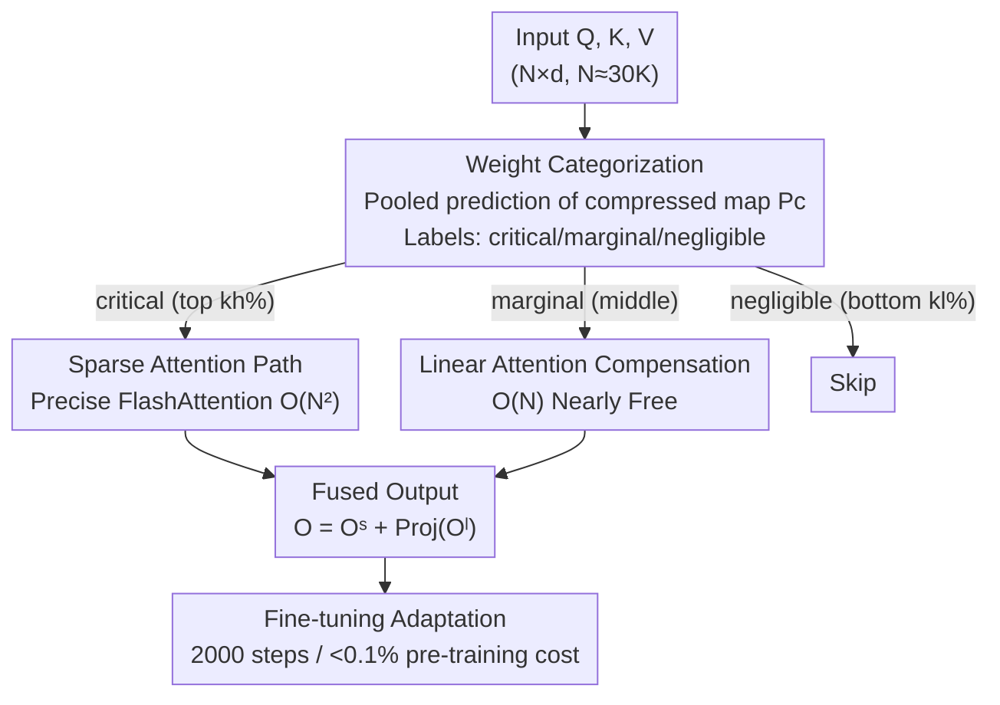

# SLA: Beyond Sparsity in Diffusion Transformers via Fine-Tunable Sparse–Linear Attention

**Conference**: ICLR 2026  
**OpenReview**: [https://openreview.net/forum?id=eD8IPvNoZB](https://openreview.net/forum?id=eD8IPvNoZB)  
**Code**: https://github.com/thu-ml/SLA  
**Area**: Model Compression / Efficient Attention / Diffusion Models  
**Keywords**: Sparse Attention, Linear Attention, Diffusion Transformer, Video Generation Acceleration, GPU kernel

## TL;DR
The authors discover that attention weights in Diffusion Transformers can be decomposed into a "small number of high-rank + large number of extremely low-rank" components. They propose SLA—applying precise sparse attention to critical blocks, linear attention to marginal blocks, and skipping negligible blocks. Integrated into a single GPU kernel and requiring only a few thousand fine-tuning steps, SLA reduces attention computation by approximately 95% and achieves a 2.2× end-to-end acceleration in video generation with nearly zero quality loss.

## Background & Motivation

**Background**: In Diffusion Transformers (DiT), especially for video generation, sequence lengths often reach 10K–100K. Attention is the only operator with $O(N^2)$ complexity, making it the primary computational bottleneck. Existing efficiency strategies follow two paths: sparse attention (calculating only a subset of attention scores) and linear attention (rewriting softmax into an $O(N)$ form).

**Limitations of Prior Work**: Both paths have fatal flaws. Linear attention often fails in practice, particularly in video diffusion—prior works mostly validate on image generation, and video quality collapses when applied (the Linear Only VBench VA score drops to 0.04). Sparse attention struggles to achieve very high sparsity; it is typically limited to 40–60% for sequences under 50K, and 80–85% sparsity is usually only reported for ultra-long sequences ($100K–300K$), where sparsity is naturally easier to achieve.

**Key Challenge**: Visualizing attention weights reveals a dilemma. Due to the exponential amplification of softmax, only about 8.1% of weights are greater than the mean $1/N$, while about 45% are smaller than $1/(100N)$. Skipping the smallest 45% (sparsification) introduces $<3\%$ L1 error, but retaining only the largest 8.1% (92% sparsity) causes the error to jump to ~33%. The problem lies in the "middle weights" between $1/(100N)$ and $1/N$: deleting them tanks accuracy, but calculating them limits sparsity. This is why sparse attention hits a ceiling at 90% sparsity.

**Key Insight**: The authors performed a rank analysis on the attention weight matrix $P$ by splitting it into top-8% and bottom-92% components. They found a structured pattern: the stable rank of the top-8% part is comparable to full attention (high-rank), while the bottom-92% part has an extremely low rank (measured at only ~9). High-rank components are naturally suited for sparse acceleration, whereas low-rank components are ideal for linear/low-rank approximation.

**Core Idea**: Summarized as "sparse for critical, linear for marginal, and skip negligible"—the attention weights are divided into critical, marginal, and negligible categories. Critical blocks use precise sparse attention, marginal blocks use nearly "free" linear attention as a learnable compensation, and negligible blocks are discarded. A few fine-tuning steps adapt the model, pushing sparsity from 70% to 95% without sacrificing quality.

## Method

### Overall Architecture

SLA (Sparse-Linear Attention) is a trainable, differentiable hybrid attention operator. The inputs remain standard $Q, K, V \in \mathbb{R}^{N \times d}$ and the output is the attention result $O$, but the internal allocation of "what to calculate and how" is redesigned. The process involves three steps: first, using pooled $Q, K$ to quickly predict a block-level compressed attention map to categorize blocks; then, critical blocks undergo precise sparse FlashAttention ($O(N^2)$), marginal blocks use linear attention ($O(N)$), and negligible blocks are skipped; finally, the two outputs are merged (with the linear path passing through a learnable projection for distribution alignment). Crucially, the sparse and linear paths are fused into the **same GPU kernel**, supporting both forward and backward passes for practical acceleration.

### Key Designs

**1. High-rank/low-rank decomposition: Splitting attention into "sparse few + low-rank many"**

This is the foundation of the work, addressing the "middle weight" dilemma. The authors express the attention weight matrix $P$ as the sum of two terms using a sparse mask $M$:

$$P = \underbrace{P \odot M}_{\text{稀疏分量}} + \underbrace{P \odot (1-M)}_{\text{低秩分量}}$$

Empirical observation shows that the matrix remaining after removing the top values has an extremely low stable rank (the bottom-92% has a rank of ~9, while the full matrix rank is 6226). Since linear attention is essentially a low-rank approximation of rank at most $d$, previous linear attention failed because it tried to approximate the **entire** high-rank matrix. SLA succeeds by letting linear attention approximate only the **naturally low-rank** residual component.

**2. Tri-classification and block-level prediction: Decisions via a cheap compressed map**

To avoid the GPU inefficiency of element-wise sparsity, SLA operates at the block level. It performs mean pooling on $Q, K$ along the token dimension to compute a compressed attention map:

$$P_c = \mathrm{Softmax}\!\left(\mathrm{pool}(Q)\,\mathrm{pool}(K)^\top / \sqrt{d}\right) \in \mathbb{R}^{(N/b_q) \times (N/b_{kv})}$$

Blocks are then labeled based on intra-row ranking: top $k_h\%$ as critical ($M_c=1$), bottom $k_l\%$ as negligible ($M_c=-1$), and the rest as marginal ($M_c=0$). Prediction happens at the compressed scale of $N/b_q \times N/b_{kv}$ with minimal overhead, yet it determines the execution of the majority of subsequent computations, enabling 95% sparsity.

**3. Linear attention as learnable compensation, not approximation: Nearly "free" accuracy recovery**

This insight distinguishes SLA from simple "sparse + linear" addition. For marginal blocks ($M_c=0$), SLA uses linear attention:

$$H_i = \sum_{j:M_c[i,j]=0} \phi(K_j)^\top V_j,\quad Z_i = \sum_{j:M_c[i,j]=0} \mathrm{rowsum}(\phi(K_j)^\top),\quad O_i^l = \frac{\phi(Q_i) H_i}{\phi(Q_i) Z_i}$$

The final output is $O = O^s + \mathrm{Proj}(O^l)$, where $\mathrm{Proj}$ is a learnable linear transform that mitigates distribution mismatch between softmax and linear attention. The authors emphasize: linear attention here **does not attempt to approximate the true output of marginal weights**; instead, it acts as a "learnable compensation term" to enhance the sparse attention. It must be paired with fine-tuning on pre-training data to let the model learn how to use this compensation. Since linear attention costs $<0.5\%$ of full attention on Wan2.1 ($O(Nd^2)=0.004\times O(N^2 d)$ for $N=32K, d=128$), it effectively pushes sparsity from 90% to 95% for "free" while improving accuracy.

**4. Fusing sparse and linear paths into a single GPU kernel (including backward): Converting FLOPs to wall-clock speedup**

FLOP reduction does not guarantee speedup. SLA fuses both paths into one kernel: the sparse path uses FlashAttention's online-softmax block accumulation for $O_i^s$; the linear path pre-calculates $h_j=\phi(K_j)^\top V_j$ and $z_j$ for each $(K_j, V_j)$, so marginal blocks only require a single matrix addition ($H_i \mathrel{+}= h_j$) with zero extra cost. Backpropagation is similarly fused, allowing SLA to be "fine-tuned" efficiently rather than just inserted post-training.

### Loss & Training
No extra loss functions are introduced; the standard diffusion training objective is used for fine-tuning. After replacing the attention with SLA, the model is fine-tuned for ~2000 steps (batch size 64) on pre-training data, costing $<0.1\%$ of pre-training (approx. 9 hours on 8×H200). The activation $\phi$ is softmax, $k_h\%=5\%$, $k_l\%=10\%$, and block size $b_q=b_{kv}=64$.

## Key Experimental Results

The model tested is Wan2.1-1.3B (video, 30K sequence). Image experiments use LightningDiT (see Appendix). Video quality metrics include VBench (VA/VT/IQ/OC/AQ/SC) and Vision Reward (VR). Efficiency is measured by FLOPs and Sparsity.

### Main Results

| Method | VA ↑ | VT ↑ | VR ↑ | FLOPs ↓ | Sparsity ↑ |
|------|------|------|------|---------|---------|
| Full Attention | 76.78 | 82.88 | 0.059 | 52.75T | 0% |
| Sparge-F (Training-free) | 0.002 | 0.026 | −0.216 | 7.91T | 85% |
| Sparge-T (Trainable) | 73.83 | 77.87 | 0.014 | 7.38T | 84% |
| VMoBa | 32.33 | 35.79 | −0.175 | 7.91T | 85% |
| VSA | 55.37 | 64.61 | −0.069 | 5.92T | 89% |
| **Ours (SLA)** | **76.96** | **83.92** | **0.048** | **2.74T** | **95%** |

At 95% sparsity (FLOPs of 2.74T, ~19.3× efficiency gain), SLA's VA/VT scores slightly exceed full attention, while all baselines show significant quality degradation at lower sparsity. Training-free methods like Sparge-F and VMoBa collapse on VA/VT. Notably, the computation for SLA at 95% sparsity is nearly half that of 90% sparse attention because the linear path is almost free.

### Ablation Study

| Configuration | VA ↑ | VT ↑ | FLOPs ↓ | Sparsity | Description |
|------|------|------|---------|--------|------|
| Full Attention | 76.78 | 82.88 | 52.75T | 0% | Upper bound |
| Linear Only | 0.042 | 0.099 | 0.10T | 100% | Pure linear, quality collapse |
| Sparse Only | 64.00 | 70.50 | 7.91T | 85% | Only sparse path |
| L+S | 29.65 | 41.15 | 5.37T | 90% | Simple sparse + linear sum |
| **SLA (softmax)** | **76.96** | **83.92** | 2.73T | 95% | Full model |
| SLA (elu+1) | 75.50 | 81.01 | 2.74T | 95% | Alternative activation |
| SLA (Top 10%) | 75.29 | 82.20 | 5.38T | 90% | Higher $k_h$ |
| SLA (Top 20%) | 75.81 | 83.82 | 10.65T | 80% | Even higher $k_h$ |

Fine-tuning steps ablation (VA): 0 steps 41.11 → 250 steps 64.46 → 1000 steps 74.58 → 2000 steps 76.96. This highlights that fine-tuning is essential for the linear compensation to work.

### Key Findings
- **Three-path structure is essential, "fusion" beats "addition"**: Linear Only fails (VA 0.04), Sparse Only hits 64.0. Most telling is L+S (simple sum of outputs), which only reaches 29.65. SLA's learnable projection + fine-tuning fusion reaches 76.96, proving the linear path's value as a "learned compensation" rather than a geometrical output superposition.
- **$k_h$ (critical ratio) is a quality-efficiency knob**: Top 5% is sufficient (95% sparsity, VA 76.96). Increasing to 10%/20% does not improve quality significantly but multiplies FLOPs, confirming that most blocks are low-rank and linearizable.
- **Real wall-clock acceleration**: On RTX5090, forward pass is 13.7× faster than FlashAttention2 and 6.8× faster in backward pass. End-to-end attention latency dropped from 97s to 11s (8.8×), boosting overall video generation speed by 2.2×.

## Highlights & Insights
- **Converting a classification problem into a structural one**: While others struggle with whether to delete middle-weight blocks, the authors use rank analysis to show these weights are naturally low-rank, efficiently handled by linear attention. This elegant reframing turns thresholding into matrix decomposition.
- **Perspective shift: "Compensation" vs. "Approximation"**: Linear attention has long been used as a cheap (and failed) substitute for softmax. SLA correctly assigns it to handle only the low-rank residual as a compensate term, turning its "low-rank" weakness into a targeted strength.
- **High Transferability**: The high-rank/low-rank decomposition, tri-classification, and kernel fusion strategy could potentially extend to any long-sequence Transformer (LLM long-context, other DiT modalities) that exhibits a "few high-rank + many low-rank" weight structure.

## Limitations & Future Work
- **Dependency on Fine-tuning**: SLA is not training-free; quality at 0 steps is poor (VA 41.11). Requiring ~2000 steps may be a barrier for users without access to training data or significant compute compared to training-free methods like Sparge-F.
- **Universality of Structural Assumptions**: The decomposition was observed on models like Wan2.1. If some models/layers do not satisfy the "bottom is extremely low-rank" condition, linear compensation effectiveness may decrease.
- **Video-Centric Evaluation**: Core conclusions are based on 30K sequence video generation. Images (LightningDiT) and MM-DiT are mostly in the Appendix. Performance on ultra-long sequences (100K+) and potential error accumulation require further study.

## Related Work & Insights
- **vs. Sparse Attention (VSA / VMoBa / SpargeAttn)**: These methods only "calculate critical, skip rest," capping sparsity at ~90% due to middle weights. SLA adds a nearly free linear compensation path to recover information, reaching 95% with better accuracy.
- **vs. Linear Attention (Image diffusion work)**: These try to approximate the entire high-rank attention, which fails for video. SLA only approximates the already low-rank portion and uses learnable projections to align distributions.
- **vs. L+S (Naive sparse+linear sum)**: With the same two paths, simple addition yields only 29.65, while SLA's fine-tuned fusion reaches 76.96, proving that "how to fuse" is more critical than "which paths to use."

## Rating
- Novelty: ⭐⭐⭐⭐⭐ High-rank/low-rank decomposition + sparse-linear fusion is a novel, clean perspective on efficiency.
- Experimental Thoroughness: ⭐⭐⭐⭐ Extensive main, ablation, and efficiency results, though non-video modalities are mainly in the appendix.
- Writing Quality: ⭐⭐⭐⭐⭐ Clear flow from motivation to observation to method and kernel implementation.
- Value: ⭐⭐⭐⭐⭐ Practical 2.2× end-to-end acceleration plus an open-sourced kernel is highly valuable for video DiT deployment.

<!-- RELATED:START -->

## Related Papers

- [\[CVPR 2026\] Trainable Log-linear Sparse Attention for Efficient Diffusion Transformers](../../CVPR2026/model_compression/trainable_log-linear_sparse_attention_for_efficient_diffusion_transformers.md)
- [\[ICLR 2026\] FASA: Frequency-Aware Sparse Attention](fasa_frequency-aware_sparse_attention.md)
- [\[ICLR 2026\] LaplacianFormer: Rethinking Linear Attention with Laplacian Kernels](laplacianformerrethinking_linear_attention_with_laplacian_kernel.md)
- [\[ICLR 2026\] MaskPro: Linear-Space Probabilistic Learning for Strict (N:M)-Sparsity on LLMs](maskpro_linear-space_probabilistic_learning_for_strict_nm-sparsity_on_llms.md)
- [\[CVPR 2026\] BinaryAttention: One-Bit QK-Attention for Vision and Diffusion Transformers](../../CVPR2026/model_compression/binaryattention_one-bit_qk-attention_for_vision_and_diffusion_transformers.md)

<!-- RELATED:END -->
