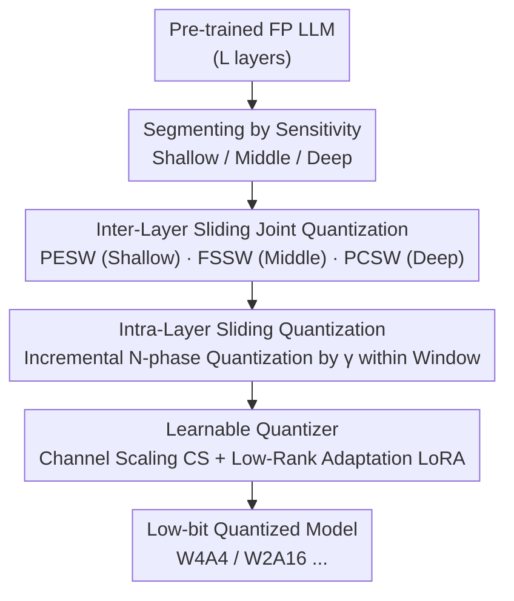

# SliderQuant: Accurate Post-Training Quantization for LLMs

**Conference**: ICLR 2026  
**OpenReview**: [https://openreview.net/forum?id=YNqZqw4fLT](https://openreview.net/forum?id=YNqZqw4fLT)  
**Code**: https://github.com/deep-optimization/SliderQuant  
**Area**: Model Compression  
**Keywords**: Post-Training Quantization, LLM, Sliding Window, Layer Sensitivity, Low-bit Quantization

## TL;DR
SliderQuant observes that shallow/deep layers (especially the first and last) of LLMs are significantly more sensitive to quantization than middle layers. It proposes an adaptive sliding quantization framework incorporating "inter-layer sliding windows (progressive expansion for shallow, fixed for middle, progressive contraction for deep) + intra-layer incremental quantization." This approach significantly outperforms existing PTQ methods like GPTQ, OmniQuant, and CBQ under extremely low-bit settings such as W4A4 and W2A16.

## Background & Motivation

**Background**: Post-training quantization (PTQ) is a mainstream compression technique for deploying LLMs, enabling the conversion of high-precision weights/activations to low-precision using a few calibration samples without expensive retraining. Existing methods are mostly built on a "sequential quantization framework," partitioning the model into equal-sized disjoint segments and quantizing segment by segment. Depending on window size, these are categorized as layer-wise (GPTQ, SmoothQuant, one layer per segment), block-wise (OmniQuant, FlatQuant, one block per segment), and multi-block-wise (QLLM, CBQ, using fixed-size sliding windows across multiple blocks).

**Limitations of Prior Work**: These methods treat all layers equally in their formulation—regardless of being layer-wise or block-wise, they use the same window size and stride for every layer. While acceptable in mild 8-bit settings, the authors hypothesize this is sub-optimal for aggressive settings like 4-bit weight-activation quantization.

**Key Challenge**: Using three representative methods (SmoothQuant, OmniQuant, CBQ) under W4A4, the authors conducted a horizontal sensitivity analysis, yielding three observations: (1) Middle layers have far less impact on quantization than shallow/deep layers, meaning **shallow and deep layers are more sensitive while middle layers are easier to quantize**; (2) In shallow/deep regions, the **first and last layers exhibit the highest quantization errors** because they handle foundational feature extraction and final abstraction; (3) As sequential quantization progresses, errors amplify layer-by-layer, and existing "equal-layer" frameworks struggle to suppress this accumulation. In short: quantization difficulty varies greatly between layers, but current frameworks treat them uniformly.

**Goal**: Design an improved sequential quantization framework that maintains a fixed bit-width but (a) provides special consideration to shallow/deep layers (especially the first and last) and (b) establishes quantization synergy between adjacent layers to suppress error accumulation.

**Key Insight**: Replace the "fixed sliding window" with an "adaptive sliding window"—dynamically changing window size from shallow to middle to deep (expanding, fixed, contracting)—and perform incremental intra-layer sliding within each window, utilizing minimal learnable parameters to spread quantization synergy across the network.

## Method

### Overall Architecture

SliderQuant adheres to the sequential quantization framework but optimizes the "window" concept. The base concept is **fixed-sized sliding quantization**: a window $\{s, i\}$ slides along the layers ($s$ is window size, $i$ is stride), where adjacent windows overlap by $s-i$ layers, minimizing the reconstruction error of output features window-by-window: $\arg\min_{\hat{W}} \|F(W, X) - F(\hat{W}, X)\|_2^2$. When $i=s$ (no overlap) and $s$ is 1 layer/block/multi-block, it degrades to conventional methods.

SliderQuant introduces two components. **Inter-Layer Sliding Quantization** divides the model into shallow ($L_s$ layers), middle, and deep ($L_d$ layers) segments, applying three window types: **Progressive Expanding Sliding Windows (PESW)** for shallow, **Fixed Step Sliding Windows (FSSW)** for middle, and **Progressive Contracting Sliding Windows (PCSW)** for deep. **Intra-Layer Sliding Quantization** operates within each current window, splitting all layers along weight/activation dimensions into $N=1/\gamma$ phases for incremental quantization. Quantization is performed via a learnable quantizer using "Channel Scaling (CS) + Low-Rank Adaptation (LoRA)."

### Key Designs

**1. Inter-Layer Sliding Quantization: Mapping Window Shapes to Sensitivity**

This targets the observations regarding shallow/deep sensitivity. Instead of a fixed window, three shapes are used. For $L_s$ **shallow layers**, **PESW** starts by quantizing only the first layer (size 1) as an anchor, incrementing window size by 1 at each step—ensuring **the first layer appears in every expanding window** to build dense "local-to-global" synergy. For $L_d$ **deep layers**, **PCSW** starts with a single window for all deep layers and decrements size by 1 until only the last layer remains, repeatedly anchoring the sensitive final layer. Middle layers use **FSSW** $\{s=2, i=1\}$ with overlapping layers at segment boundaries to ensure smooth transitions.

**2. Intra-Layer Sliding Quantization: Incremental Quantization within Windows**

While inter-layer design handles "cross-window" synergy, layers within a single window are typically quantized jointly. Intra-layer sliding applies the "progressive" concept internally: the $s$ layers in the current window are partitioned by ratio $\gamma$ along weight/activation dimensions. Quantization is completed incrementally in $N=1/\gamma$ phases. With $\gamma=0.5, N=2$, the first phase quantizes the first half of the matrices, and the second phase quantizes the full matrices including the first half, establishing internal "local-to-global" parameter synergy.

**3. Learnable Quantizer: CS + LoRA for Outlier Suppression**

To handle outliers, SliderQuant combines Channel Scaling (CS) and Low-Rank Adaptation (LoRA). For $W_i$ and $X_i$ at layer $i$: $\tilde{X}_i = X_i \oslash \alpha_i$, $\tilde{W}_i = W_i \odot \alpha_i + A_i B_i$, where $\alpha_i$ is a learnable scaling vector (migrating difficulty from activations to weights) and $A_i, B_i$ are low-rank $(r=4)$ matrices for weight refinement. Finally, $X_{i+1} = \text{quantizer}(\tilde{X}_i) \cdot \text{quantizer}(\tilde{W}_i)$.

### Loss & Training

The objective is MSE reconstruction error of output features for each window. For weight-activation quantization, $F(\hat{W}, X)$ is replaced with $F(\hat{W}, \hat{X})$. Calibration samples $c=128$, rank $r=4$, $L_s=L_d=4$, $\gamma=0.5$.

## Key Experimental Results

### Main Results

Language generation (PPL, lower is better) and zero-shot common-sense reasoning (Acc, higher is better):

| Model / Setting | Metric | Prev. SOTA | SliderQuant | Note |
|------|------|------|------|------|
| Llama2-7B W4A4 | WikiText2 ↓ | 12.73 (CBQ) | **8.34** | Significant low-bit advantage |
| Llama3-8B W4A4 | WikiText2 ↓ | 35.97 (CBQ) | **15.47** | Large gap on hard models |
| Llama2-7B W2A16 | WikiText2 ↓ | 12.10 (CBQ) | **9.59** | Robust at 2-bit |
| Qwen2.5-14B W4A4 | Avg. 7-task acc ↑ | 53.50 (CBQ) | **58.96** | +5.5 Reasoning gain |
| Llama2-13B W4A4 | Avg. 7-task acc ↑ | 54.67 (CBQ) | **56.77** | — |

SliderQuant+ (with rotation) also outperforms rotation-based methods like QuaRot and FlatQuant. On Qwen2.5-32B (R1-Distill), W4A16 achieved 82.71 (Avg. Math/Code) vs. 83.17 (FP16).

### Ablation Study

Llama2-7B, using fixed window $\{s=2, i=1\}$ as baseline:

| Configuration | W4A4 Wiki ↓ | W2A16 Wiki ↓ | Note |
|------|---------|---------|------|
| Baseline (Fixed) | 12.73 | 12.10 | Multi-block-wise starting point |
| + PESW | 10.34 | 10.71 | Major improvement |
| + PCSW | 10.30 | 10.67 | Similar effect to PESW |
| + Intra-S | 9.84 | 10.92 | Intra-window synergy |
| Inter-S (Both) | 9.13 | 10.53 | Dual-window synergy |
| Full (Inter + Intra) | **8.34** | **9.59** | Complete model |

### Key Findings

- **Three window shapes are essential**: PESW and PCSW alone reduce W4A4 PPL from 12.73 to ~10.3, validating the "shallow/deep sensitivity" hypothesis.
- **Intra-layer phases have a sweet spot**: $\gamma=0.5$ is better than $\gamma=1$ (12.73→10.34), but $\gamma=0.25$ degrades performance (11.32), likely because early phases fix parameters too early with incomplete information.
- **Aggressive settings benefit most**: The relative advantage is largest in W4A4/W2A16, confirming that the "equal treatment" assumption fails primarily at low bit-widths.

## Highlights & Insights
- **Hard-coding sensitivity analysis**: Directly encoding the "layer sensitivity variance" into the quantization schedule represents a clean orthogonal contribution that can be stacked with rotation.
- **Hardware-friendly priority**: Expanding/contracting windows "weighted" sensitive layers by including them in more windows, achieving better accuracy without needing hardware-intensive mixed-precision (like SpQR/QUIK).
- **Unification**: The sliding concept provides a unified perspective where layer/block/multi-block-wise methods are just special static instances of the SliderQuant design space.

## Limitations & Future Work
- Larger windows improve accuracy but increase memory/compute overhead; the quantization phase is costlier than GPTQ. Detailed time-cost overhead is not fully explored.
- Hyperparameters ($L_s$, $L_d$, $\gamma$) are chosen empirically; generalizability across diverse architectures (e.g., SSMs) or scales requires further verification.

## Related Work & Insights
- **vs CBQ / QLLM**: These use **fixed** sliding windows; SliderQuant uses **adaptive** shapes (expanding/contracting), acting as a strict superset.
- **vs OmniQuant / FlatQuant**: These are block-wise with no overlap synergy; SliderQuant establishes cross-layer paths.
- **vs SpQR / LLM-MQ**: These use mixed-precision (FP16 for outliers), which is hardware unfriendly; SliderQuant uses uniform bits more effectively.

## Rating
- Novelty: ⭐⭐⭐⭐⭐ Elegant perspective on adaptive window shapes.
- Experimental Thoroughness: ⭐⭐⭐⭐⭐ Covers 5 model families, up to 70B, including MoE and R1.
- Writing Quality: ⭐⭐⭐⭐ Clear logic, though cost metrics are slightly thin.
- Value: ⭐⭐⭐⭐⭐ Practical, plug-and-play improvement for extreme low-bit LLM deployment.

<!-- RELATED:START -->

1. **GPTQ**: Accurate Post-Training Quantization for Generative Pre-trained Transformers, ICLR 2023.
2. **OmniQuant**: Omnidirectionally Calibrated Quantization for Large Language Models, ICLR 2024.
3. **CBQ**: Cross-Block Quantization for Large Language Models, ArXiv 2024.
4. **QuaRot**: Outlier-Free 4-bit Inference in Quantized LLMs, ArXiv 2024.

<!-- RELATED:END -->

## Related Papers

- [\[ICLR 2026\] Post-Training Quantization for Video Matting](post-training_quantization_for_video_matting.md)
- [\[ICLR 2026\] Training Dynamics Impact Post-Training Quantization Robustness](training_dynamics_impact_post-training_quantization_robustness.md)
- [\[ICLR 2026\] PTQ4ARVG: Post-Training Quantization for AutoRegressive Visual Generation Models](ptq4arvg_post-training_quantization_for_autoregressive_visual_generation_models.md)
- [\[CVPR 2025\] Q-DiT: Accurate Post-Training Quantization for Diffusion Transformers](../../CVPR2025/model_compression/q-dit_accurate_post-training_quantization_for_diffusion_transformers.md)
- [\[ICLR 2026\] Quant-dLLM: Post-Training Extreme Low-Bit Quantization for Diffusion Large Language Models](quant-dllm_post-training_extreme_low-bit_quantization_for_diffusion_large_langua.md)

<!-- RELATED:END -->
