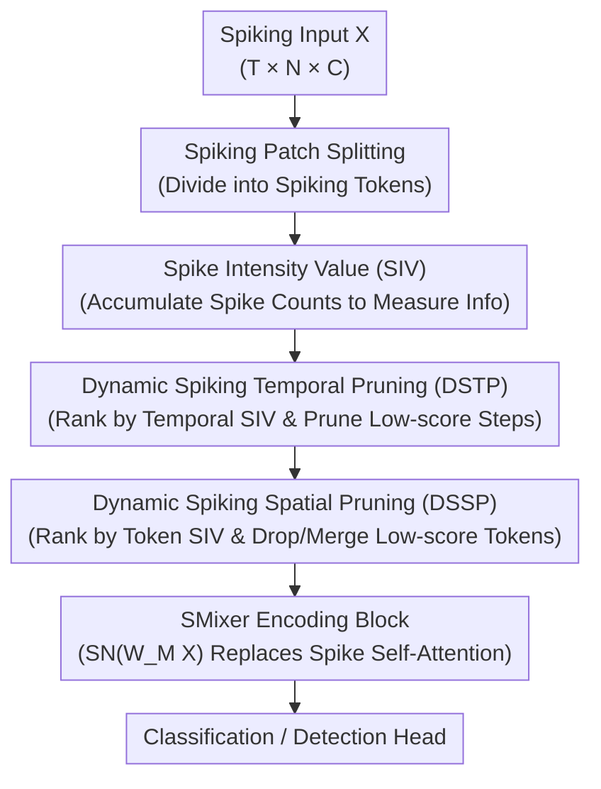

# SMixer: Rethinking Efficient-Training and Event-Driven SNNs

**Conference**: ICLR 2026  
**OpenReview**: [https://openreview.net/forum?id=78glEsQB0v](https://openreview.net/forum?id=78glEsQB0v)  
**Area**: Model Compression / Spiking Neural Networks  
**Keywords**: Spiking Neural Networks, Event-Driven, Efficient Training, Feature Pruning, Token Mixer

## TL;DR
Addressing the dilemma where high-performance Spiking Neural Network (SNN) architectures are not truly event-driven and suffer from high training overheads, this paper proposes the Spiking-token Mixer (SMixer) backbone for deployment on asynchronous chips, combined with a zero-parameter Dynamic Spatial-Temporal Spiking Pruning (DSTSP) framework. This approach reduces training memory and energy consumption by approximately half while maintaining accuracy.

## Background & Motivation

**Background**: SNNs utilize asynchronous binary spikes to transmit information. Neurons update their membrane potentials only upon receiving a spike, naturally bypassing zero-value computations. This makes them highly suitable for neuromorphic chips such as TrueNorth and Loihi, positioning them as a promising route for low-power computing. Current mainstream approaches involve migrating advanced ANN architectures to the spiking domain, such as Spiking CNNs and Spiking Transformers.

**Limitations of Prior Work**: Both existing paths are suboptimal. Spiking ResNet/CNNs exhibit significantly lower accuracy. High-performance Spiking Transformers (e.g., Spikformer series) achieve SOTA results, but their core Spiking Self-Attention (SSA) relies on the multiplication of two spike matrices $Q$ and $K$. On asynchronous chips, imprecise spike arrival times cause this multiplication to produce significant computational bias, leading to severe performance degradation. Consequently, SSA is **not truly event-driven** and cannot be deployed on asynchronous neuromorphic hardware. Simultaneously, SNN training overhead is immense: models must be trained on GPUs, which cannot execute SNNs in an event-driven manner and consume power even for zero-valued features. This, combined with intrinsic time steps and hidden states, further exhausts computational resources.

**Key Challenge**: It is difficult to simultaneously satisfy event-driven friendliness, training efficiency, and high performance. SSA is performant but not event-driven; CNNs are event-driven but lack performance; and neither addresses training costs effectively.

**Goal**: The authors argue that a "reasonable SNN architecture" should possess three characteristics: being fully event-driven, having low training overhead, and delivering competitive performance. They aim to design a network that meets all three.

**Key Insight**: At the architectural level, the authors replace SSA with a Spiking-token Mixer (STMixer), which substitutes the spike matrix multiplication between $Q$ and $K$ with a learnable weight matrix $W_M$ to fit the attention map. This avoids spike-to-spike multiplication and ensures compatibility with asynchronous hardware. On the efficiency side, the authors observe that SNN firing rates are naturally low, and features are highly redundant and concentrated in specific spatial-temporal regions. While unstructured weight pruning yields little actual speedup and requires high pruning rates ($\ge 0.3$), the authors pivot to **structured feature pruning**.

**Core Idea**: Use a learnable token mixing matrix instead of spiked self-attention to guarantee true event-driven operation. Additionally, employ a parameter-free spatial-temporal feature pruning framework based on spike counts to discard low-information spiking features and accelerate training.

## Method

### Overall Architecture

The method consists of two layers: "Architecture" and "Pruning." The architecture layer uses the Spiking-token Mixer as the backbone. Input spiking features are divided into tokens via Spiking Patch Splitting (SPS), passing through several encoding blocks composed of SMixer modules and Spiking MLPs, followed by a classification head. The key to the SMixer module is replacing the SSA's $\mathrm{SN}(QK^TV)$ with $\mathrm{SMixer}(X)=\mathrm{SN}(W_M X)$, where $W_M$ is a learnable attention weight matrix. Through the elimination of spike matrix multiplication, it can run on asynchronous chips.

The pruning layer is the core contribution: DSTSP (Dynamic Spatial-Temporal Spiking Pruning). It first employs a parameter-free Spike Intensity Value (SIV) metric to measure the importance of each spike feature block, revealing that spiking representations are highly imbalanced across space and time. It then prunes unimportant time steps in the **temporal dimension** and low-SIV tokens in the **spatial dimension**, reducing the volume of features and the number of neuron states to lower training costs. The entire pruning process relies only on summation and sorting without introducing trainable parameters, aligning with the spike-driven nature of SNNs.

### Key Designs

**1. Spiking-token Mixer: Replacing SSA with Learnable Matrices for True Event-Driven Operation**

This directly addresses the pain point that high-performance Spiking Transformers are not event-driven. SSA requires computing $\mathrm{SSA}(Q,K,V)=\mathrm{SN}(QK^TV\cdot s)$, where $Q, K, V$ are in spiking form (obtained via $\mathrm{SN}(\text{L-BN}(X))$). Multiplying $Q$ and $K$ on asynchronous hardware causes large biases due to timing jitters. SMixer collapses $Q$ and $K$ into a single learnable matrix $W_M$, transforming the forward pass into:

$$\mathrm{SMixer}(X)=\mathrm{SN}(W_M X)$$

During training, $W_M$ fits the attention map, avoiding spike-to-spike matrix multiplication. This preserves the expressive power of token mixing while ensuring the forward pass is a "weight matrix × spiking input" format, which is friendly to asynchronous neuromorphic chips. Experiments show that replacing SSA with SMixer in three SOTA Spiking Transformers (SpikformerV2, QKFormer, SDT-V3) maintains comparable accuracy.

**2. SIV Metric and Spatio-Temporal Redundancy Analysis: Identifying Prunable Features via Addition**

Pruning requires an efficient and reliable importance metric. The authors define Spike Intensity Value (SIV) as the sum of spike events within a specified feature region. Analogous to activation magnitude in ANNs, a higher SIV indicates concentrated semantic information. Analysis on DVS-Gesture shows that SIV distribution is extremely imbalanced: many tokens have very low SIV (50% of tokens fall within a small SIV range), and high-SIV regions correspond to foreground objects. Crucially, model accuracy using only high-SIV tokens is far higher than using only low-SIV tokens (97.9% vs 79.9%). Comparisons using RIE / MS-SSIM scores for pruning low-SIV (LP), high-SIV (HP), and random (RP) strategies show that pruning low-SIV features is the best strategy for information preservation in SNNs.

**3. Dynamic Spiking Spatial Pruning (DSSP): Pruning Tokens and Weight Matrices**

DSSP addresses spatial redundancy. For spiking features $X\in S^{T\times N\times C}$, spatial SIV is calculated by summing across channels: $I_S=\sum_{i=1}^{C}X[:,:,i]$. Tokens are sorted by $I_S$ in descending order, and the top $N'=N\cdot(1-P_S)$ tokens are retained ($P_S$ is the spatial pruning rate):

$$X'=X_i[:N'],\quad W_M'=W_M[N',N'],\quad \mathrm{SMixer}(X)=\mathrm{SN}(W_M'X')$$

The weight matrix $W_M$ is also cropped to an $N'\times N'$ "active attention weight" $W_M'$. Discarded tokens are merged using a Softmatch strategy to prevent information loss.

**4. Dynamic Spiking Temporal Pruning (DSTP): Reducing Time Steps and Neuron States**

DSTP addresses temporal redundancy. It prunes in two ways: evaluating time step importance and imposing a dynamic limit on the maximum number of spikes a neuron can fire. For $X\in S^{T\times N\times C}$, temporal SIV is $I_T=\sum_{n=1}^{N}\sum_{i=1}^{C}X[:,n,i]$. After sorting, $T'=T\cdot(1-P_T)$ steps are kept. Since the number of time steps directly determines the number of neuron states and total computation, reducing $T$ directly lowers training costs and inference latency. DSTSP is executed in a "temporal then spatial" sequence.

### Loss & Training

The training epochs and hyperparameters remain consistent with the original models. The default pruning configuration is a spatial pruning rate $P_S=0.30$ and temporal steps reduced to 1 (detection tasks use $P_S=0.20$ and $T=1$). DSTSP is integrated directly into the training loop as a unified stage without adding extra training burden. Spatial pruning must be placed after the SPS module to preserve initial 2D feature map dimensions.

## Key Experimental Results

### Main Results

On ImageNet-1K, DSTSP significantly reduces costs while maintaining or slightly improving accuracy (e.g., +0.2% accuracy on STMixer-8-768 while reducing memory to 76.44% and energy to 53.03%):

| Method | Architecture | Time Steps | Memory (MB) | Energy (mJ) | Top-1 (%) |
|------|------|--------|----------|----------|----------|
| STMixer | STMixer-8-768 | 1 | 17008 | 4.45 | 76.68 |
| STMixer + DSTSP | STMixer-8-768 | 1 | 13002 | 2.36 | 76.87 |
| SpikformerV2→M | SpikformerV2-8-512 (T=1) | 1 | 5384 | 2.12 | 79.16 |
| SpikformerV2→M + DSTSP | SpikformerV2-8-512 (T=1) | 1 | 3368 | 1.98 | 78.99 |
| QKFormer→M + DSTSP | HST-10-512 | 1 | 9751 | 3.15 | 77.39 |

Replacing SSA with SMixer (→M) in three SOTA Spiking Transformers yields performance comparable to the originals. When combined with DSTSP, QKFormer/SDT-V3 variants drop <2% accuracy, and SpikformerV2 (T=4) drops only 1.3%, while gaining significant improvements in memory, energy, and throughput.

On CIFAR and neuromorphic datasets, with $P_S=0.30$ and $T=1$, the accuracy drop is minimal:

| Dataset | SMixer | SMixer+DSTSP | Note |
|--------|--------|--------------|------|
| CIFAR-10 (T=4) | 96.01 | 95.67 | Static Images |
| CIFAR-100 (T=4) | 81.87 | 81.03 | Static Images |
| DVS128 (T=16) | 98.61 | 98.26 | Neuromorphic |
| CIFAR10-DVS (T=16) | 83.02 | 82.34 | Neuromorphic |

### Ablation Study

Trade-off between spatial/temporal pruning rates on CIFAR-100:

| $P_S$ | $P_T$ | Throughput (im/s) | Memory | FLOPs | CIFAR-100 Acc |
|-------|-------|-----------|------|-------|---------------|
| 0 | 0 | 266 | 5329M | 3.45G | 81.78 |
| 0.40 | 0 | 337 | 3498M | 2.72G | 80.81 |
| 0 | 0.50 | 671 | 3526M | 2.54G | 81.25 |
| 0.30 | 0.75 | 738 | 2346M | 2.04G | 81.03 |

Temporal pruning provides the highest efficiency gain with minimal accuracy loss.

### Key Findings
- **Temporal pruning offers the best cost-performance ratio**: Reducing time steps ($P_T=0.5$) barely affects accuracy but jumps throughput from 266 to 671, indicating heavy temporal redundancy.
- **Pruning low SIV is the correct direction**: Compared to high-SIV pruning (HP, 78.11%) and random pruning (RP), pruning low-SIV features (DSTSP, 81.03%) is optimal.
- **Pruning during both training and inference is ideal**: Performance is highest when pruning is enabled for both stages.
- **SMixer is inherently strong**: The accuracy of SMixer (without pruning) is comparable to or better than SSA across multiple datasets.

## Highlights & Insights
- **Reconciling "Event-Driven" and "High Performance"**: SMixer elegantly balances these previously conflicting goals using a learnable matrix.
- **Zero-Parameter Pruning**: SIV calculation is just spike summation. Unlike ANNs that use extra trainable gates, DSTSP aligns with the additive/spike-driven nature of SNNs.
- **Temporal Pruning as an SNN-specific Lever**: Shaving time steps directly reduces the number of neuron states, a dimension unique to SNNs that provides "free" acceleration.
- **Plug-and-Play**: DSTSP can be integrated into various frameworks like SpikformerV2, QKFormer, and SpikeYOLO.

## Limitations & Future Work
- On complex tasks like COCO detection, DSTSP leads to a ~1.5 mAP drop, suggesting high pruning rates have costs in dense prediction.
- There is a lack of a unified adaptive mechanism to select pruning rates; rates must currently be tuned per task.
- SIV uses spike counts alone, potentially neglecting temporal sequence information (treating tokens with the same count but different distributions as equal).
- The practical hardware implications of the two $W_M'$ implementations were not fully explored.

## Related Work & Insights
- **vs. SSA / Spiking Transformer**: These rely on $Q \times K$ multiplications, achieving SOTA performance but failing true event-driven deployment due to bias on asynchronous chips. SMixer replaces this with a single matrix.
- **vs. STMixer (Deng et al. 2024)**: This paper adopts the core idea of using learnable weight maps but is the first to design high-ratio feature pruning specifically for Mixer architectures.
- **vs. Traditional SNN Weight Pruning**: Conventional methods often use unstructured pruning, which yields limited actual acceleration. DSTSP offers structured feature pruning with zero trainable parameters and achieves the smallest performance loss across cost/sparsity/accuracy benchmarks.

## Rating
- Novelty: ⭐⭐⭐⭐ First spatio-temporal feature pruning designed for Spiking-token Mixers; SIV+DSTSP is simple yet effective.
- Experimental Thoroughness: ⭐⭐⭐⭐ Covers classification, time-series, and detection across diverse datasets.
- Writing Quality: ⭐⭐⭐⭐ Clear logic; however, terminology slightly fluctuates (STP vs. DSTSP).
- Value: ⭐⭐⭐⭐ Improves event-driven characteristics, memory, and energy efficiency, facilitating SNN deployment on neuromorphic hardware.

<!-- RELATED:START -->

## Related Papers

- [\[ICLR 2026\] Memba: Membrane-driven Parameter-Efficient Fine-Tuning for Mamba](memba_membrane-driven_parameter-efficient_fine-tuning_for_mamba.md)
- [\[ICLR 2026\] INSTANT: Compressing Gradients and Activations for Resource-Efficient Training](instant_compressing_gradients_and_activations_for_resource-efficient_training.md)
- [\[ICLR 2026\] Rethinking Residual Errors in Compensation-based LLM Quantization](rethinking_residual_errors_in_compensation-based_llm_quantization.md)
- [\[ICLR 2026\] LaplacianFormer: Rethinking Linear Attention with Laplacian Kernels](laplacianformerrethinking_linear_attention_with_laplacian_kernel.md)
- [\[ICLR 2026\] Rethinking Continual Learning with Progressive Neural Collapse](rethinking_continual_learning_with_progressive_neural_collapse.md)

<!-- RELATED:END -->
