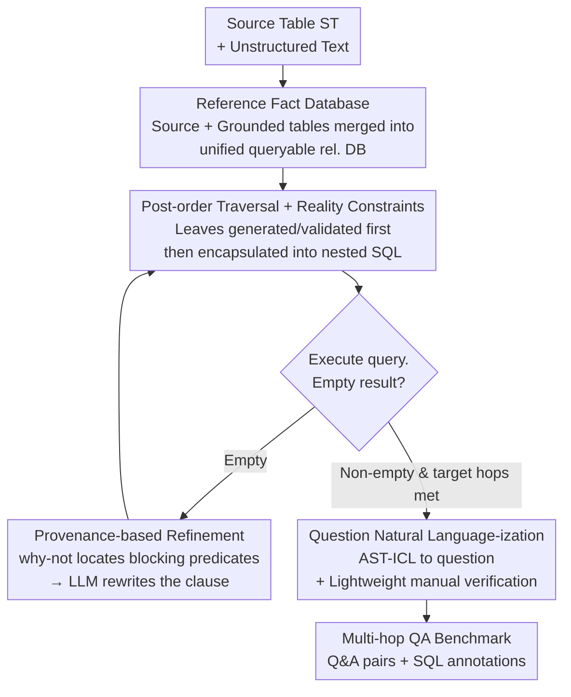

# SPARTA: Scalable and Principled Benchmark of Tree-Structured Multi-hop QA over Text and Tables

**Conference**: ICLR 2026  
**arXiv**: [2602.23286](https://arxiv.org/abs/2602.23286)  
**Code**: [github.com/pshlego/SPARTA](https://github.com/pshlego/SPARTA)  
**Area**: Audio and Speech  
**Keywords**: Multi-hop Reasoning, Table-Text QA, Benchmark Construction, SQL, Cross-modal Reasoning

## TL;DR

Ours proposes SPARTA, an end-to-end framework for automatically constructing large-scale table-text multi-hop QA benchmarks. It generates high-quality nested SQL queries by referencing fact databases, utilizing provenance-based refinement and realistic structural constraints. SOTA models show an F1 drop of over 30 points on SPARTA.

## Background & Motivation

- **Limitations of Prior Work**:
  1. **Limited question types and shallow reasoning**: Most benchmarks only require $\le 2$ hops of reasoning and do not support advanced operations like aggregation or grouping.
  2. **Severe labeling noise**: An audit of 100 HybridQA samples found 21% contained errors (redundant modalities 52.4%, incomplete answers 23.8%, incorrect/unanswerable 23.8%).
  3. **Reliance on small-scale web tables**: Average size is ~15 rows, far below the scale of thousands of rows found in real-world databases.
- The complexity of manual annotation limits the scale and quality of benchmarks, necessitating automated methods.

## Method

### Overall Architecture

SPARTA addresses the issues where existing table-text multi-hop QA benchmarks either feature shallow reasoning, high annotation noise, or small-scale web tables, while manual annotation is too costly to scale. The core idea is to build the benchmark construction **entirely upon SQL**. Specifically, heterogeneous tables and text are unified into a queryable relational database, where the SQL queries themselves serve as "reasoning problems with standard answers," and are subsequently translated into natural language questions. Since answers are derived directly from the execution of SQL on the database, annotation shifts from "human reading and synthesising" to "machine execution," ensuring scale, depth, and accuracy are guaranteed by the database engine.

The pipeline consists of three stages. The first stage involves **building a reference fact database**, merging source tables with grounded tables extracted from text into a unified relational database. The second stage performs **query generation**, where nested SQL is encapsulated layer-by-layer via post-order traversal; queries returning empty results are "revived" using provenance-based refinement until the nesting depth matches the target number of hops. The third stage is **Question Natural Language-ization**, which converts validated SQL into fluent natural language questions. This pipeline is domain-agnostic—extending to new domains only requires replacing the source and grounded tables, while the query generation and refinement processes remain unchanged.

### Key Designs

**1. Reference Fact Database: Turning text into SQL-queryable relational tables**

A major pain point in multi-hop QA is that answers are scattered across tables and unstructured text modalities, making unified retrieval difficult. SPARTA incorporates both into a relational database $\mathcal{D}$. Source tables $\mathcal{S}_T$ retain their original relational structure (e.g., 6 Kaggle public tables for NBA salaries, awards, and drafts). Grounded tables $\mathcal{G}_T$ decompose unstructured text into atomic fact tuples, stored as queryable SQL tables. Text grounding prioritizes verified corpora (e.g., ROTOWIRE), but can also use template-based table-to-text conversion. Crucially, both types of tables share entity attributes (e.g., PLAYER_NAME), and primary-foreign key constraints ensure cross-table joinability, allowing a single SQL query to span both modalities for multi-hop reasoning.

**2. Post-order Traversal + Realistic Structural Constraints: Validating every layer of nested queries**

The difficulty in generating deep nested multi-hop SQL lies in the fact that one-shot LLM generation often results in non-executable queries with unclear errors. SPARTA models nested SQL as a query graph $G=(V,E)$, where node $v_i$ is a query block (a `SELECT … FROM … WHERE …` subquery) and edge $e_{ij}$ represents the nested predicate. It uses **post-order traversal** for construction: leaf subqueries are generated and validated first, then encapsulated into higher-level queries one predicate at a time, with immediate execution at each step. Unlike top-down or breadth-first approaches, post-order ensures every intermediate block is verified before encapsulation. This isolates errors, prunes unfeasible branches early, and increases the final execution success rate. Realistic structural constraints (large-scale databases, Grouping/Having operators) ensure true logical depth.

**3. Provenance-based Refinement: Reviving empty-result queries via why-not techniques**

The most difficult issue in bottom-up construction is when a query returns an empty result, meaning the question has no answer. SPARTA borrows "why-not provenance" from the database field to locate the issue. It iteratively strips predicates until the query returns non-empty results, samples "expected" target tuples from these results, and then runs a why-not provenance tool to identify which predicate blocked those tuples. This diagnostic report is fed back to the LLM to **rewrite only** the problematic clause. For example, if a filter `salary > 800000` is too strict, provenance identifies it, and the LLM can relax the threshold to `salary > 600000`. This marks the first application of database provenance technology in NLP benchmark construction.

**4. Question Natural Language-ization: Converting SQL to fluent questions with lightweight verification**

Validated SQL must be converted into human-readable questions. SPARTA uses AST-ICL (a SOTA SQL-to-text model that treats the SQL Abstract Syntax Tree as an in-context example) to transform SQL into semantically aligned, fluent questions. Subsequently, three CS graduate students perform lightweight verification. Since correctness is guaranteed by SQL execution, humans only need to check for fluency and semantic alignment, making annotation **4 times** more efficient than HybridQA.

## Key Experimental Results

### Main Results

| Benchmark | Table Scale | Question Generation | Grouping/Having | >3-Hop | Labeling Error Rate |
|------|---------|---------|------------|--------|-----------|
| HybridQA | 4.4 cols × 15.7 rows | Manual | ✗ | ✗ | 21% |
| OTT-QA | 4.4 cols × 15.7 rows | Manual | ✗ | ✗ | 21% |
| TAT-QA | 4.0 cols × 9.4 rows | Manual | ✗ | ✗ | 30% |
| **SPARTA (NBA)** | **12.2 cols × 3280 rows** | **Auto + Light Verification** | **✓** | **✓** | **0%** |

### SOTA Model Performance on SPARTA

| Model | HybridQA F1 | SPARTA F1 | Gain |
|------|------------|-----------|------|
| Best Existing Model | >70 | <40 | >30↓ |
| OTT-QA Best Model | >50 | <20 | >30↓ |

### Ablation Study: Query Generation Strategy

| Method | Execution Success Rate | Query Diversity |
|------|----------|-----------|
| One-Shot (No check) | Low | Low |
| Post-Order (No Provenance) | Medium | Medium |
| **Post-Order + Provenance** | **High** | **High** |

### Key Findings

1. SOTA models (GPT-4, Claude, etc.) show a massive F1 drop on SPARTA, exposing fundamental weaknesses in cross-modal reasoning.
2. The combination of post-order traversal and provenance-based refinement significantly improves query execution rates and diversity.
3. Lightweight manual verification requires only 1/4 of the annotation time compared to HybridQA.
4. The framework was successfully extended to movie and medical domains, verifying its domain-agnostic nature.

## Highlights & Insights

- **Fundamental redesign of Table-Text QA benchmarks**: The SQL-centric pipeline addresses the core issues of scale, noise, and logical depth.
- **Provenance-based refinement is a key innovation**: Introduces database technology (why-not provenance) into NLP benchmark construction.
- **High exposure**: The 30+ point drop in SOTA F1 clearly highlights the fundamental deficiencies in existing cross-modal reasoning capabilities.
- **Scalable and reproducible**: Code, data, and models are fully open-sourced to facilitate future research.

## Limitations & Future Work

- Atomic fact extraction for grounded tables relies on specific corpora (e.g., ROTOWIRE); extending to new domains might require manual template design.
- Natural Language-ization depends on LLMs, which may introduce minor semantic biases.
- Evaluation only covered extractive and generative QA models; Agent or Tool-augmented methods have not yet been tested.

## Related Work & Insights

- Table-Text QA Benchmarks: HybridQA, OTT-QA, TAT-QA, FinQA, MultiHiertt, etc.
- Synthetic Benchmark Generation: ERBench, TDBench, etc. (mostly unimodal or shallow).
- PEEL: Template-based NL-nested SQL pair generation.

## Rating

- **Novelty**: ⭐⭐⭐⭐ — The SQL-centric automated construction approach is highly novel.
- **Technical Depth**: ⭐⭐⭐⭐ — The design of provenance-based refinement and post-order traversal is sophisticated.
- **Experimental Thoroughness**: ⭐⭐⭐⭐ — Comprehensive across multiple domains, models, and ablations.
- **Value**: ⭐⭐⭐⭐⭐ — Directly exposes fundamental weaknesses of SOTA models, providing high value to the community.

<!-- RELATED:START -->

## Related Papers

- [\[ICLR 2026\] A Fano-Style Accuracy Upper Bound for LLM Single-Pass Reasoning in Multi-Hop QA](a_fano-style_accuracy_upper_bound_for_llm_single-pass_reasoning_in_multi-hop_qa.md)
- [\[ICLR 2026\] Scaling Reasoning Hop Exposes Weaknesses: Demystifying and Improving Hop Generalization in Large Language Models](scaling_reasoning_hop_exposes_weaknesses_demystifying_and_improving_hop_generali.md)
- [\[ICLR 2026\] In Good GRACES: Principled Teacher Selection for Knowledge Distillation](in_good_graces_principled_teacher_selection_for_knowledge_distillation.md)
- [\[ICLR 2026\] Learning Semi-Structured Sparsity for LLMs via Shared and Context-Aware Hypernetwork](learning_semi-structured_sparsity_for_llms_via_shared_and_context-aware_hypernet.md)
- [\[ICLR 2026\] MoNE: Replacing Redundant Experts with Lightweight Novices for Structured Pruning of MoE](mone_replacing_redundant_experts_with_lightweight_novices_for_structured_pruning.md)

<!-- RELATED:END -->
