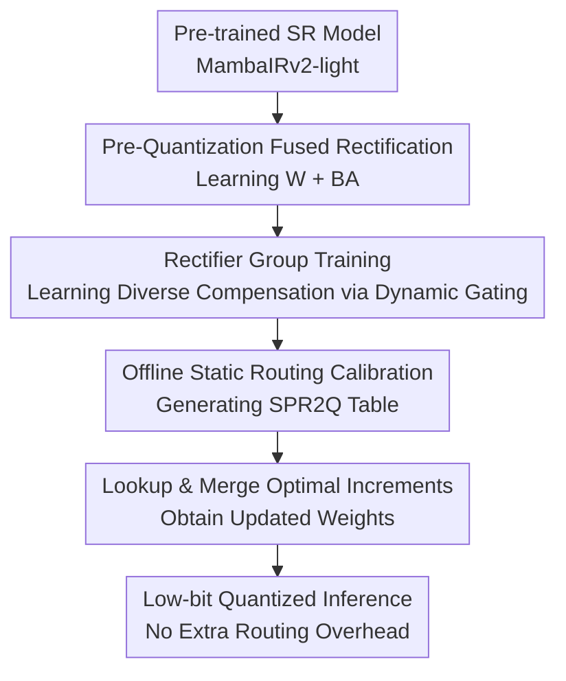

# SPR$^2$Q: Static Priority-based Rectifier Routing Quantization for Image Super-Resolution  

**Conference**: ICLR 2026  
**OpenReview**: [https://openreview.net/forum?id=8tDIzHFOx6](https://openreview.net/forum?id=8tDIzHFOx6)  
**Code**: None  
**Area**: Model Compression  
**Keywords**: Post-Training Quantization, Super-Resolution, Mamba Quantization, Low-Rank Rectifier, Static Routing  

## TL;DR  
SPR$^2$Q targets ultra-low bit Post-Training Quantization (PTQ) for image super-resolution models. By learning a set of low-rank rectifiers to compensate for weight increments before quantization and merging the optimal increments into layer weights via offline static priority routing, it significantly mitigates detail recovery loss in MambaIRv2-light under 4-bit, 2-bit, and even 1-bit settings without increasing inference overhead.  

## Background & Motivation  
**Background**: As image super-resolution (SR) models evolve from CNNs and Transformers to Mamba/SSM architectures, reconstruction quality continues to improve, but deployment costs become more sensitive. Low-bit quantization is a critical technique for deploying these models on real-world devices, compressing floating-point weights and activations to 4-bit, 2-bit, or lower to gain benefits in model size, FLOPs, and inference speed.  

**Limitations of Prior Work**: Mainstream quantization approaches include Quantization-Aware Training (QAT) and Post-Training Quantization (PTQ). QAT accuracy is generally stable but involves high training costs comparable to full-precision training. PTQ is better suited for fast deployment by calibrating quantizer boundaries or reconstructing weights after training. However, in pixel-level tasks like SR, PTQ often leads to significant losses in texture and edges. Specifically for Mamba-based SR models like MambaIRv2, which contain recursive states and dynamic gating, directly applying Mamba quantization methods from classification or language models results in accumulated numerical errors in high-frequency detail regions.  

**Key Challenge**: Most existing PTQ methods treat pre-trained weights as fixed objects, only tuning the clipping range or reconstruction error of the quantizer. Under aggressive compression like 2-bit/4-bit, quantization error is no longer just a matter of optimal boundaries; the model lacks the ability to actively adapt to quantization perturbations. If only the quantizer is tuned, the model cannot pre-encode information that will be lost into a more quantization-resistant weight form.  

**Goal**: The authors aim to retain the low cost and zero inference overhead of PTQ while providing the model with a small amount of learnable compensation capability before quantization. Specifically, the method must address three issues: injecting targeted compensation for quantization errors into original weights, avoiding the limitations of a single low-rank compensator, and ensuring that multi-compensator selection introduces no dynamic routing overhead during inference.  

**Key Insight**: The paper draws on the low-rank increment idea of LoRA, but the goal is not efficient fine-tuning for new tasks but rather learning a set of rectifiers that can be fused into weights before quantization. Thus, the quantizer processes $W+\Delta W$ instead of the original $W$. After quantization, the model remains a standard low-bit model without extra branches.  

**Core Idea**: SPR$^2$Q replaces simple quantizer calibration with "Pre-Quantization Low-Rank Rectification + Offline Static Routing," allowing compensation information to enter weights before being quantized into the final model.  

## Method  
### Overall Architecture  
The SPR$^2$Q workflow consists of three stages: first, training low-rank rectifiers to compensate for errors in quantized pixels and intermediate features; second, expanding a single rectifier into a rectifier group and training diverse compensation capabilities via dynamic routing; finally, calibrating which rectifier weights each module should use offline and writing the results into a fixed SPR$^2$Q Table. During inference, the optimal increments are merged via table lookup, followed by quantization and forward computation. The key is not running an expert router during inference but compressing all selections into static weight increments beforehand.  

Mathematically, basic PTQ clips inputs or weights to $[a,b]$ and discretizes them according to bit width $n$: with step size $s=(b-a)/(2^n-1)$, quant-dequant is written as $x_q=\mathrm{round}((\hat{x}-a)/s)\cdot s+a$. SPR$^2$Q adopts this quantizer but modifies the weight to be quantized from $W$ to a compensated $W'=W+\Delta W$, optimizing both compensation increments and clipping bounds simultaneously.  

### Key Designs  
**1. Pre-Quantization Fused Rectification: Encoding Compensation into Weights**  

Standard PTQ suffers from the limitation of finding a good quantizer for fixed weights. SPR$^2$Q asks: if we know weights will be discretized, can we add a small, learnable correction beforehand so that the discretized result closer matches the full-precision model? To this end, the paper introduces Pre-Quantization Fine-tuning with Fused Rectifier (PQFR), writing each weight to be calibrated as $W'=W+\Delta W$, where $\Delta W=BA$, $A\in\mathbb{R}^{r\times d_{in}}$, and $B\in\mathbb{R}^{d_{out}\times r}$. The original weight $W$ is frozen; only the low-rank matrices $A, B$ and quantization bounds $a, b$ are trained.  

The benefit is that rectifiers are fused directly into weights after training. The resulting quantization target is $Q_{a,b}(W+BA)$. Unlike extra adapters, it requires no parallel computation during inference. For SR tasks, this is vital as reconstruction errors are often amplified at local textures and edges; low-rank increments can absorb these systematic biases using very few parameters.  

**2. Joint Pixel and Block-Level Feature Constraints: Managing Propagation of Errors**  

Relying solely on output image similarity may mask local offsets in intermediate blocks, and deep recovery models like MambaIRv2 are sensitive to layer-wise error propagation. Thus, SPR$^2$Q uses a hybrid loss constraining both the final reconstruction and intermediate features of each block. The pixel term uses $L_1$ distance to keep quantized output $f_q(x)$ close to full-precision output $y_{FP}$: $L_{pixel}=\mathbb{E}_{(x,y_{FP})}[\lVert f_q(x)-y_{FP}\rVert_1]$.  

The feature term denotes the feature of the $l$-th block as $\phi_l(\cdot)$ and requires alignment across every layer:  

$$
L_{feature}=\mathbb{E}_{x}\left[\sum_{l=1}^{L}\lVert \phi_l(f_q(x))-\phi_l(f_{FP}(x))\rVert_2^2\right].
$$  

The final objective is $L=L_{pixel}+\lambda L_{feature}$, providing signals for both PSNR/SSIM fidelity and fine-grained internal alignment. Straight-Through Estimation (STE) is used to approximate the gradient of the round operation.  

**3. Rectifier Group: Avoiding Homogeneity with Multiple Correctors**  

A single low-rank rectifier can compensate for one primary type of error, but SR model layers are heterogeneous: shallow layers handle local textures, while deep layers may involve long-range dependencies, and Mamba modules have numerical sensitivities from recursive states. Consequently, the paper expands the rectifier into a set $E=\{\Delta W_1,\Delta W_2,\ldots,\Delta W_N\}$, with each $\Delta W_i=B_iA_i$.  

During training, a lightweight gating network assigns weights $g_i$ to different rectifiers based on the input, merging them via:  

$$
W'_q=Q_{a,b}\left(W+\sum_{i=1}^{N}g_i\Delta W_i\right).
$$  

This dynamic routing only occurs during training to encourage diverse compensation strategies and does not carry over to final inference.  

**4. Offline Static Priority Routing: Compressing Dynamic Selection into Fixed Tables**  

Dynamic selection during inference would increase complexity and offset deployment gains. The key is Offline Static Routing Calibration (OSRC): after training the rectifier group, backbone weights and rectifier parameters are frozen. Only the static gating weights for each module are optimized using the hybrid loss. Formally, it searches for $\hat{g}=\arg\min_{g\in G}L(f(X,Q_{a,b}(W+\sum_i g_i\Delta W_i)))$ in the allowable space $G$.  

The calibrated $\hat{g}$ is organized into the SPR$^2$Q Table. During inference, each module retrieves its optimal combination from the table and fuses $\sum_i\hat{g}_i\Delta W_i$ into the corresponding weights. This maintains the expressive capacity of multiple rectifiers while ensuring a static graph with zero additional inference cost.  

### Loss & Training  
The DF2K dataset (DIV2K + Flickr2K) is used for training. Evaluation is performed on Set5, Set14, B100, Urban100, and Manga109, reporting PSNR/SSIM on the Y-channel of YCbCr. The backbone is MambaIRv2-light, testing $\times2$ and $\times4$ SR across 4-bit, 2-bit, and 1-bit precisions.  

Rectifier group training runs for 12,000 iterations, and Offline Static Routing Calibration for 500 iterations, both with a batch size of 8. The Adam optimizer is used with a learning rate of $1\times10^{-2}$ and Cosine Annealing. Default settings are rank $r=8$ and group size $N=4$.  

## Key Experimental Results  

### Main Results  
Comparisons are made against Mamba quantization methods like PTQ4VM, Quamba, and MambaQuant on MambaIRv2-light ($\times2$ setting):  

| Method | Bit | Set5 PSNR/SSIM | Urban100 PSNR/SSIM | Manga109 PSNR/SSIM |  
|------|-----|----------------|--------------------|--------------------|  
| MambaIRv2-light | 32 | 38.26 / 0.9615 | 33.26 / 0.9378 | 39.35 / 0.9785 |  
| PTQ4VM | 4 | 37.17 / 0.9549 | 30.47 / 0.9084 | 37.22 / 0.9706 |  
| Quamba | 4 | 37.07 / 0.9544 | 30.54 / 0.9107 | 36.94 / 0.9699 |  
| MambaQuant | 4 | 36.67 / 0.9495 | 28.08 / 0.8407 | 33.47 / 0.9186 |  
| SPR$^2$Q | 4 | 37.72 / 0.9589 | 31.53 / 0.9223 | 38.03 / 0.9754 |  
| PTQ4VM | 2 | 34.38 / 0.9328 | 27.61 / 0.8603 | 32.04 / 0.9399 |  
| Quamba | 2 | 34.66 / 0.9339 | 27.80 / 0.8613 | 32.50 / 0.9407 |  
| MambaQuant | 2 | 34.65 / 0.9337 | 27.78 / 0.8610 | 32.43 / 0.9395 |  
| SPR$^2$Q | 2 | 35.97 / 0.9495 | 28.55 / 0.8819 | 34.39 / 0.9599 |  

At 4-bit, SPR$^2$Q outperforms PTQ4VM by 0.55 dB on Set5. The gains are more significant on Urban100, highlighting the value of the compensation mechanism in texture-rich scenes. At 2-bit, SPR$^2$Q maintains a lead of ~1.31 dB over the strongest baseline on Set5.  

### Ablation Study  
| Config | Set5 PSNR/SSIM | Urban100 PSNR/SSIM | Note |  
|------|----------------|--------------------|------|  
| Baseline | 37.20 / 0.9554 | 30.69 / 0.9112 | Quantization without PQFR, RGT, OSRC |  
| + PQFR | 37.44 / 0.9567 | 31.25 / 0.9188 | Significant gain via single low-rank rectifier |  
| + PQFR + RGT | 37.60 / 0.9581 | 31.24 / 0.9170 | Expanded space further improves Set5 |  
| + PQFR + RGT + OSRC | 37.72 / 0.9589 | 31.53 / 0.9223 | Best performance after static routing calibration |  

### Key Findings  
- **PQFR is the core source of gain**: Adding PQFR alone improves Set5 by 0.24 dB and Urban100 by 0.56 dB, proving that learning compensation before quantization is superior to simple quantizer tuning for SR.  
- **RGT and OSRC Synergy**: RGT enables diverse strategies, and OSRC compresses them into a fixed table, particularly benefiting texture-heavy datasets like Urban100.  
- **Efficiency**: For MambaIRv2-light ($\times4$), the 4-bit model size reduces from 3.01 MB to 1.20 MB, providing a 3.44$\times$ speedup. These gains are not diminished by auxiliary parameters, which disappear after offline fusion.  
- **Architectural Cross-compatibility**: On SwinIR-light (2-bit $\times2$), SPR$^2$Q achieves 37.28 dB on Set5, outperforming ViT quantization baselines like 2DQuant and APHQ-ViT.  

## Highlights & Insights  
- Using LoRA-style low-rank increments for "Pre-Quantization Rectification" is intuitive and effective, targeting the root cause of low-bit degradation.  
- The "dynamic for training, static for inference" design is elegant, offering the expressiveness of multiple experts without MoE inference overhead.  
- Feature distillation alignment prevents error propagation in deep restoration models.  

## Limitations & Future Work  
- Experiments focus on lightweight SR models; performance on massive backbones or specific mobile NPUs requires further validation.  
- Training/calibration is more complex than standard PTQ, though still lighter than QAT.  
- Static routing sacrifices input adaptability; its robustness across different degradation types (noise, artifacts) needs more analysis.  

## Related Work & Insights  
- **vs. PTQ4VM / Quamba / MambaQuant**: These methods focus on quantizing the SSM structure. SPR$^2$Q focuses on SR-specific detail preservation through pre-quantization compensation.  
- **vs. 2DQuant**: SPR$^2$Q moves beyond quantizer boundary calibration to active weight correction, showing superior 2-bit performance on SwinIR-light.  

## Rating  
- Novelty: ⭐⭐⭐⭐☆  
- Experimental Thoroughness: ⭐⭐⭐⭐☆  
- Writing Quality: ⭐⭐⭐⭐☆  
- Value: ⭐⭐⭐⭐⭐  

<!-- RELATED:START -->

...

## Related Papers

- [\[ICML 2026\] Hierarchical Image Tokenization for Multi-Scale Image Super Resolution](../../ICML2026/model_compression/hierarchical_image_tokenization_for_multi-scale_image_super_resolution.md)
- [\[AAAI 2026\] QuantVSR: Low-Bit Post-Training Quantization for Real-World Video Super-Resolution](../../AAAI2026/model_compression/quantvsr_low-bit_post-training_quantization_for_real-world_video_super-resolutio.md)
- [\[CVPR 2026\] Gradient Knows Best: Mixed-Precision Quantization via Gradient-Guided Bit Allocation for Super-Resolution](../../CVPR2026/model_compression/gradient_knows_best_mixed-precision_quantization_via_gradient-guided_bit_allocat.md)
- [\[ICLR 2026\] Post-Training Quantization for Video Matting](post-training_quantization_for_video_matting.md)
- [\[ICLR 2026\] SliderQuant: Accurate Post-Training Quantization for LLMs](sliderquant_accurate_post-training_quantization_for_llms.md)

<!-- RELATED:END -->
