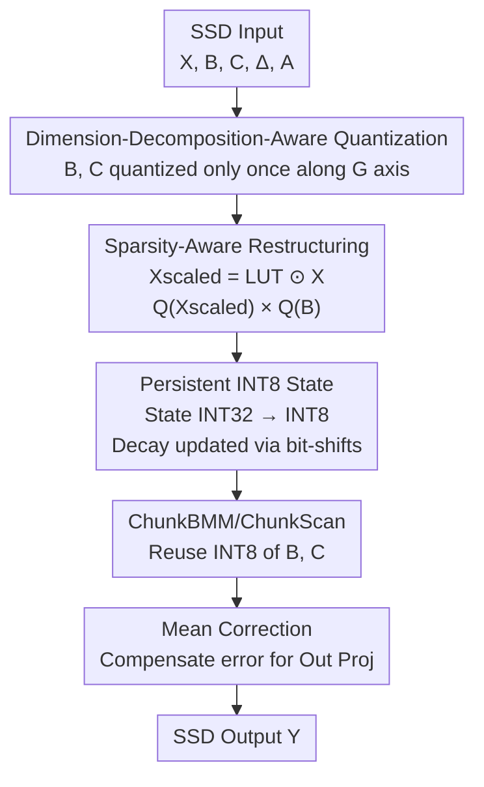

# SSDi8: Accurate and Efficient 8-bit Quantization for State Space Duality

**Conference**: ICLR 2026  
**OpenReview**: [https://openreview.net/forum?id=pjMDZJd4rT](https://openreview.net/forum?id=pjMDZJd4rT)  
**Code**: https://github.com/cau-hai-lab/SSDi8  
**Area**: Model Compression  
**Keywords**: Post-training Quantization, Mamba-2, State Space Duality, INT8, Channel Quantization

## TL;DR
SSDi8 is the first post-training quantization framework specifically designed for the Mamba-2 State Space Duality (SSD) module. By employing a "sparsity-aware restructuring + persistent INT8 state path + dimension-decomposition-aware channel quantization + mean correction" suite, it maintains near-FP16 accuracy under W8A8 / W4A8 while accelerating SSD inference by up to 1.4×.

## Background & Motivation

**Background**: As a representative of State Space Models (SSMs), Mamba provides efficient long-range dependency modeling with linear complexity and is considered a strong alternative to the Transformer. Mamba-2 further proposes Structured State Space Duality (SSD), unifying the "recurrent mode" and "attention mode" while introducing head dimensions similar to multi-head attention. This allows for higher GEMM utilization and scalability to 8B+ parameters. However, as model size increases, memory and latency overhead inflate, creating a demand for SSD-specific compression schemes.

**Limitations of Prior Work**: Directly applying quantization methods designed for Transformers (e.g., Hadamard rotation, GPTQ) to SSD layers leads to significant accuracy degradation. Table 1 shows that for a 2.7B model under W4A8, quantizing only In Proj is nearly lossless (63.6%), but once SSD is quantized per-tensor, accuracy plummets from 63.8% to 58.4%. Adding Out Proj quantization further drops it to 54.6%. Existing Mamba quantization works (MambaQuant, Quamba1) target only Mamba-1. While Quamba2 extends to Mamba-2, it only quantizes the **inputs** of the SSD layer and does not touch the **internal** computations of SSD, interrupting the INT8 execution path and limiting latency optimization.

**Key Challenge**: The internal computation organization of SSD differs completely from Transformers, leading to three quantization sensitivities. First, the model dimension is split into a number of heads $H$ and intra-head dimension $P$; the statistical distributions along these two axes are vastly different, so overall quantization inevitably causes distortion. Second, SSD contains "varying dimension activations" ($B, C$ are stored in memory according to group dimension $G$ and broadcast to $H$ during calculation) and is repeatedly called by multiple sub-modules. Third, element-wise multiplications (decay, softplus, etc.) are highly interleaved with matrix multiplications. If a single FP16 tensor is mixed into an element-wise multiplication, the entire INT8 GEMM path is forced back to floating point.

**Goal**: To establish an uninterrupted **persistent INT8 path** from input to output within SSD to reduce latency without collapsing accuracy.

**Key Insight**: The authors conducted the first systematic analysis of SSD and found that after dimension transformation ($B, L, D \to B, L, H, P$), SSD input activations exhibit a clear "separable" outlier pattern along the $H$ axis (Fig. 2). Furthermore, the activation $X_{scaled}$ after decay scaling is **highly sparse** on the channel axis. These two structural observations serve as breakthroughs for "accurate quantization" and "INT8-maintaining restructuring."

**Core Idea**: Use an algebraic restructuring to move the decay scaling from $B$ to $X$ (replacing $X \times (B \odot LUT)$ with $Q(X_{scaled}) \times Q(B)$), removing the obstruction of element-wise multiplication on the INT8 path. Differential channel quantization is then performed following SSD’s inherent $H/P/G$ dimensional structure, allowing recurrent states to be persisted and reused in INT8 form.

## Method

### Overall Architecture

SSDi8 is implemented on an SSD block of Mamba-2: the input tensor passes through In Proj and Conv before entering SSD. SSD partitions the sequence into $c$ chunks of size $l$ ($L = c \odot l$) and passes through five sub-modules—ChunkCumsum, ChunkState, StatePassing, ChunkBMM, and ChunkScan(1/2)—to produce output $Y$, followed by RMSNorm and Out Proj. The goal of SSDi8 is to keep these five modules running on INT8 as much as possible: it **quantizes once** at the SSD entrance for $B$ and $C$ (along group axis $G$) and reuses them downstream; it applies **sparsity-aware restructuring** for element-wise multiplications that break INT8; it persists the recurrent state directly in INT8 and uses bit-shifts for decay updates; finally, it applies **mean correction** to the output projection to compensate for accumulated errors. A few tensors that truly cannot be recovered (dAcs from ChunkCumsum, ChunkScan2) remain in FP16 due to their minimal size or inability to be restructured after element-wise multiplication.

### Key Designs

**1. Sparsity-Aware Restructuring: Moving decay scaling from B to X to unblock the INT8 path**

The original computation of ChunkState is $\text{State} = X \times (B \odot \text{LUT}_{\text{state}})$ (Eq. 4), where $\text{LUT}_{\text{state}} = \Delta \odot \text{Decay}_{\text{state}}$ is an FP16 look-up table applying decay to $B$ along the intra-chunk step $l$. This step poses three problems: while $B$ is quantized to INT8, the LUT is FP16, pulling the entire multiplication back to floating point; the LUT varies exponentially along the $l$ axis, causing massive errors unless per-$l$ quantization is used, which then accumulates errors after $l$-axis matrix multiplication; if $Q(B \odot \text{LUT})$ is used directly, quantization must occur after the $G \to H$ broadcast, increasing overhead by up to 4x.

The key insight of SSDi8 is that LUT multiplication only acts on the **shared $l$ dimension** of $X$ and $B$, while other dimensions are independent. Thus, moving the scaling from $B$ to $X$ does not change the result. The restructured form is:

$$\text{State}_{\text{INT32}} = Q(X_{\text{scaled}}) \times Q(B),\quad X_{\text{scaled}} = \text{LUT}_{\text{state}} \odot X$$

After restructuring, only $X_{\text{scaled}}$ needs to be quantized once (along $P$ and $H$ axes), allowing the entire multiplication to run on INT8 GEMM. Remarkably, although $X_{\text{scaled}}$ has significant outliers on the channel axis, it is **highly sparse** (Fig. 3a), resulting in low actual quantization error. The paper proves in Appendix A that under mild conditions, the quantization error of $Q(X_{\text{scaled}})$ is **smaller** than $Q(X) \odot \text{LUT}_{\text{state}}$, theoretically backing this "relocation."

**2. Persistent INT8 Representation for Recurrent States: States stored in INT8, updates via bit-shifts**

The restructured $\text{State}_{\text{INT32}}$ accumulates in INT32. Since INT32 occupies twice the space of FP16, it wastes DRAM bandwidth. SSDi8 compresses INT32 directly to INT8 in registers using a quantization scale before writing back to DRAM, skipping the intermediate FP16 representation:

$$\text{State}_{\text{INT8}} = \text{Round}\!\left(\text{State}_{\text{INT32}} \odot \frac{s_x s_b\, q_{\max}}{s_s}\right),\quad q_{\max}=2^{b-1}-1$$

where $s_x, s_b, s_s$ are the quantization scales for $X, B, \text{State}$. The state varies along the head dimension $H$ but remains consistent along $P$ and $N$. Since $N$ participates in subsequent ChunkScan1 multiplications (where quantization error cannot be recovered), state is quantized per $(H,P)$, leaving $N$ untouched. In StatePassing, states between chunks are recursively accumulated with decay per Eq. 6. SSDi8 quantizes the scalar Decay and sets the gating constant to $S=2^k$ (experimentally $k=7$), reducing the recursive update to a **pure bit-shift operation**:

$$Q(\text{State}_{i+1}) \leftarrow Q(\text{State}_{i+1}) + \frac{Q(\text{Decay}_{i+1})}{S} \odot Q(\text{State}_i)$$

Because per-$(H, P)$ quantization allows all chunks to share the same scale, recursion can be completed via shifts instead of floating-point units. Thus, the state proceeds as INT8 through ChunkScan1 to perform INT8 Tensor Core multiplication with $C_{\text{INT8}}$. ChunkBMM and ChunkScan2 similarly reuse the $B_{\text{INT8}}/C_{\text{INT8}}$ quantized at the entrance (since $CB$ is larger than $X$, quantizing it saves significant memory). For ChunkScan2, where $X$ is FP16 and the LUT shape does not match $CB$ for restructuring, the dequantization scale of $CB$ is fused into $\text{LUT}_{\text{Scan2}}$, retaining some FP16 execution.

**3. Dimension-Decomposition-Aware Channel Quantization: Differential quantization along inherent $H/P/G$ axes**

SSD decomposes external dimensions into two independent axes: $H$ (number of heads) and $P$ (intra-head dimension), where $D = H \odot P$ and $H \gg P$. Fig. 2 shows that input activations do not exhibit token-level patterns in $(B, L, D)$ form, but show a clear separable outlier pattern along the $H$ axis after transforming to $(B, L, H, P)$, with distribution differences across heads reaching 5×. Therefore, **direct per-head quantization is unstable**; the heterogeneity of $H$ must be considered. For $B, C$ defined along the group axis $G$, SSDi8 chooses to **quantize once along the $G$ axis at the start of each SSD layer**, rather than re-quantizing in every sub-module. Since $|G| \ll |H|$, quantizing along $G$ is much more efficient than quantizing after broadcasting to $H$, adding only ~3% latency. All downstream modules then reuse this INT8 tensor. While the state dimension $N$ is statistically stable, it enters subsequent matrix multiplications directly where errors are unrecoverable, so it is excluded from quantization axes. This precise determination of "which axis to quantize and which to skip" keeps accuracy loss negligible.

**4. Mean Correction for SSD Quantization Error: Compensating accumulated bias with closed-form channel error means**

Quantization errors accumulating across SSD layers require compensation. Given the full-precision result $Y=XW$ and dequantized result $Y'=X'W'$, the error is modeled as a least squares problem $E_c = \|Y - (Y' + c)\|_F^2$. The optimal correction vector is exactly the mean of quantization errors per channel (closed-form solution):

$$c^\star_p = \frac{1}{N}\sum_{i=1}^{N}(Y-Y')_{i,p}$$

To ensure estimation accuracy, the authors employ **sequential layer-wise updates**: previous layers are corrected first so that subsequent layer statistics reflect the applied corrections, capturing activation drift caused by prior modifications. To control overhead, $c$ is only applied to the output projection layer (which has half the dimension of the input projection and the most significant quantization error), adding only ~1--2% latency while significantly stabilizing accuracy.

### Loss & Training
SSDi8 is a Post-training Quantization (PTQ) method requiring no retraining. Symmetric static quantization is used for W8A8 and W4A8. 4-bit weights use GPTQ with Hadamard-transformed projection layers. $\gamma$-migration handles outliers caused by RMSNorm. The mean correction coefficient is set to 0.15 to prevent estimation overfitting.

## Key Experimental Results

### Main Results

Zero-shot tasks (three Mamba-2 scales, average of six benchmarks, Table 2):

| Model | Bit-width | Method | Avg. ACC |
|---|---|---|---|
| 2.7B | FP16 | — | 63.8% |
| 2.7B | W8A8 | Quamba2 | 62.5% |
| 2.7B | W8A8 | **SSDi8** | **63.2%** |
| 2.7B | W4A8 | Quamba2 | 62.1% |
| 2.7B | W4A8 | **SSDi8** | **62.6%** |
| 8B | W8A8 | Quamba2 | 69.8% |
| 8B | W8A8 | **SSDi8** | **70.2%** (FP16=70.7%) |

WikiText2 Perplexity (lower is better, Table 3): For the 8B model, SSDi8 achieves 7.49 vs Quamba2's 7.79 (↓3.9%) in W8A8, and 7.62 vs 7.94 (↓4.0%) in W4A8, narrowing the gap to FP16 (7.25).

Latency: For Mamba-2 2.7B ($B=32, L=2048$), SSDi8 achieves 1.47× speedup over FP16 and 1.38× over Quamba2. At the module level, ChunkScan is up to 1.77× faster (vs FP16), and StatePassing reaches 2.25×. On edge devices like Orin NX 16G, it consistently outperforms Quamba2 across sequence lengths (e.g., W8A8 $L=2048$: 217.69ms vs 249.29ms).

### Ablation Study

Ablation of internal SSD quantization components (Mamba-2 2.7B, W4A8, Table 5):

| Configuration | Latency | PPL | Description |
|---|---|---|---|
| baseline (SSD all FP16) | 8.63 | 9.34 | W4A8 only outside SSD |
| + Q(X) only | 8.58 | 9.35 | Quantize X only; no persistent INT8 |
| + Sparse Restruct + B,C Quant | 8.05 | 9.37 | Restructuring enables INT8 for ChunkScan1 |
| + Persistent INT8 + ChunkBMM Quant | 6.53 | 9.43 | Full suite; 1.32× speedup |

Ablation of SSD quantization + mean correction (Lambada, Table 6): HadMamba only 51.2% → adding SSD quantization rises to 67.2% → adding mean correction 67.4% (FP16=69.5%), with correction overhead only ~1–2%.

Hybrid architecture Nemotron-H-8B-Reasoning (Table 7): Applying INT8 only to the SSD path, average accuracy is 73.1% → 73.0% (nearly lossless). SSD module latency dropped from 19.834ms to 9.156ms (~2×), and end-to-end forward pass reduced from 109.873ms to 98.904ms.

### Key Findings
- **Sparsity-aware restructuring is the key to latency**: Without restructuring, the persistent INT8 path cannot be established even if $X$ is quantized, resulting in only 1.07× speedup. Enabling restructuring boosts ChunkScan1 to INT8 (1.08×) and then ChunkBMM to 1.32×, with PPL degradation always $<0.1$.
- **Internal SSD quantization contributes far more than mean correction**: The recovery from an accuracy collapse of 51.2% to 67.2% relies on SSD quantization itself; mean correction adds the final 0.2%, serving as a low-cost "cherry on top."
- **Gains amplify with parallelism**: Speedup is more pronounced with larger batches and longer sequences where chunk-level parallelism is fully utilized. For extremely short sequences ($L=256$), FP16 is more efficient due to low arithmetic intensity.
- **W4A4 is intentionally excluded**: Because INT4 activations can be slower at the hardware level, the paper focuses on W8A8 / W4A8.

## Highlights & Insights
- **"Relocation" Restructuring + Sparsity Proof**: Moving decay scaling from $B$ to $X$ seems like a simple algebraic identity, but combined with the theoretical proof that "$X_{scaled}$ is highly sparse $\to$ lower quantization error," it unblocks the INT8 path while providing accuracy guarantees. This is the most elegant part of the paper.
- **State Recursion via Bit-shifts**: By setting the gating constant to $2^k$ and sharing scales among all chunks, recurrent state updates are reduced to bit-shift operations. This is a clever engineering design linking "per-$(H, P)$ shared scales" with hardware efficiency.
- **Precise Selection of Quantization Axes**: The choice of which axis to quantize (and which to skip) among $H/P/G/N$ is entirely based on distribution observations (heterogeneity of $H$, unrecoverable matrix multiplication of $N$). This "axis selection by structure" approach is transferable to any operator with multi-dimensional decomposition.
- **First Persistent INT8 Path inside Mamba-2 SSD**: Previous works like Quamba2 only quantized SSD inputs. This work truly penetrates the five internal modules of SSD with INT8, filling a significant gap.

## Limitations & Future Work
- W4A4 was excluded because INT4 activations are currently slower on some hardware; the extreme compression potential is limited by hardware rather than the algorithm.
- A few tensors like dAcs and ChunkScan2 remain in FP16, so the persistent INT8 path is not 100% "pure," leaving room for further compression.
- Experiments focused on language modeling and zero-shot tasks; there is less validation of Mamba-2 quantization robustness in vision, audio, or multi-modal scenarios.
- Mean correction is only applied to the output projection layer and uses only per-channel means (first-order statistics); more complex error distributions might require second-order or per-token correction.

## Related Work & Insights
- **vs Quamba2**: Quamba2 also supports W4A8/W8A8 for Mamba-2 but only quantizes SSD **inputs**, leaving internal computations in FP16. This breaks the INT8 path and limits latency optimization. SSDi8 penetrates all five internal SSD modules with INT8, outperforming it in both accuracy and latency (e.g., 2.7B W4A8: 62.6% vs 62.1%, 1.38× speedup).
- **vs Quamba1 / MambaQuant**: These target only Mamba-1 architectures and are not applicable to SSD-based Mamba-2. SSDi8 is the first SSD-specific PTQ.
- **vs Direct Transformer Quantization (Hadamard / GPTQ)**: Direct application to SSD results in severe accuracy drops due to distribution heterogeneity in head/group dimensions and interleaved element-wise multiplications (Table 1: 63.8% → 58.4%). SSDi8 avoids these pitfalls via dimension-decomposition-aware quantization and sparsity-aware restructuring.

## Rating
- Novelty: ⭐⭐⭐⭐⭐ First to establish a persistent INT8 path inside Mamba-2 SSD; restructuring + theory is original.
- Experimental Thoroughness: ⭐⭐⭐⭐ Covers various scales, tasks, edge devices, and hybrid architectures, though vision/multi-modal validation is limited.
- Writing Quality: ⭐⭐⭐⭐ Internal SSD mechanisms are explained clearly; formulas and observations are well-coordinated.
- Value: ⭐⭐⭐⭐⭐ A practical quantization solution for Mamba-2 deployment with 1.4× speedup and near-zero loss.

<!-- RELATED:START -->

## Related Papers

- [\[CVPR 2025\] EfficientViM: Efficient Vision Mamba with Hidden State Mixer based State Space Duality](../../CVPR2025/model_compression/efficientvim_efficient_vision_mamba_with_hidden_state_mixer_based_state_space_du.md)
- [\[ICLR 2026\] The Curious Case of In-Training Compression of State Space Models](the_curious_case_of_in-training_compression_of_state_space_models.md)
- [\[ICLR 2026\] SliderQuant: Accurate Post-Training Quantization for LLMs](sliderquant_accurate_post-training_quantization_for_llms.md)
- [\[ICLR 2026\] AIRE-Prune: Asymptotic Impulse-Response Energy for State Pruning in State Space Models](aire-prune_asymptotic_impulse-response_energy_for_state_pruning_in_state_space_m.md)
- [\[ICLR 2026\] Towards Quantization-Aware Training for Ultra-Low-Bit Reasoning LLMs](towards_quantization-aware_training_for_ultra-low-bit_reasoning_llms.md)

<!-- RELATED:END -->
