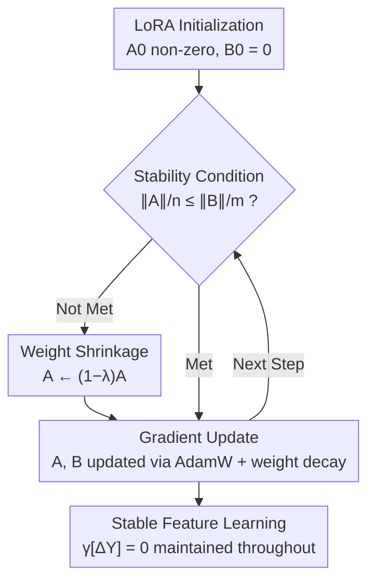

# Stable-LoRA: Stabilizing Feature Learning of Low-Rank Adaptation

**Conference**: ICLR 2026  
**OpenReview**: [https://openreview.net/forum?id=xSa19DAieH](https://openreview.net/forum?id=xSa19DAieH)  
**Code**: https://github.com/Yize-Wu/Stable-LoRA  
**Area**: Model Compression / Parameter-Efficient Fine-Tuning (LoRA)  
**Keywords**: LoRA, Feature Learning Stability, Weight Shrinkage, Parameter-Efficient Fine-Tuning, Training Dynamics

## TL;DR
This paper analyzes LoRA training dynamics from the perspective of feature learning stability, proving that LoRA can be "self-stabilizing" under appropriate hyperparameters and initialization, while the commonly used non-zero initialization $A_0$ disrupts this stability in the long term. Consequently, Stable-LoRA is proposed—applying exponential shrinkage to $A$ during the initial training steps to retain the benefits of non-zero initialization while eliminating the induced instability, consistently outperforming baselines like AdamW across multiple models and tasks with almost no additional memory or computation.

## Background & Motivation

**Background**: LoRA expresses weight updates as $W = W_0 + sBA$ by freezing the original weights $W_0$ and training two low-rank matrices $A \in \mathbb{R}^{r\times n}$ and $B \in \mathbb{R}^{m\times r}$ ($r \ll \min(m,n)$). While empirically effective for fine-tuning Large Language Models (LLMs), a theoretical explanation for its robustness and efficacy has been lacking.

**Limitations of Prior Work**: Recent works (LoRA+, Riemann Preconditioning, LoRA-RITE, etc.) have begun analyzing LoRA from a training dynamics perspective, focusing on "feature learning stability"—ensuring learned features (output updates $\Delta Y$) neither explode nor vanish as model width $n$ increases. However, these methods either rely on empirical learning rate tuning or modify optimizers without clarifying the causal chain of when LoRA is naturally stable or unstable.

**Key Challenge**: Theoretically, the "ideal initialization" for LoRA stability is $A_0 = B_0 = 0$. However, $A=B=0$ is a zero-gradient saddle point that halts training, and $A_0 Z = 0$ prevents $B$ from learning information, leading to vanishing/exploding gradients. The industry standard remedy is $B_0=0$ with $A_0$ sampled non-zero. This paper points out that this non-zero $A_0$ specifically violates the stability condition $\gamma[A_0 Z] \le \gamma[\eta]+1$, and this disruption persists through the training recursion, acting as a "long-term ailment."

**Goal**: (1) Formulate sufficient conditions for LoRA self-stability to explain its empirical robustness; (2) Locate the instability caused by non-zero initialization and design an optimization strategy that eliminates it while retaining its benefits with near-zero overhead.

**Key Insight**: The authors found that initialization-induced instability differs fundamentally from saddle points or vanishing gradients in terms of "time scale." The latter appearing only at the start and resolving naturally, whereas the former, once triggered, is amplified by recursive relations and persists throughout training. Since the benefits of $A_0$ are early-stage while the drawbacks are long-term, $A_0$ should perform its initial role and then have its negative impact gradually erased.

**Core Idea**: Retain non-zero $A_0$ but apply exponential shrinkage $A_{t+1}=(1-\lambda)A_t-\eta g_A^t$ during the earliest training steps. Shrinkage stops once the scale of $A$ is comparable to $B$, thereby capturing the benefits of non-zero initialization while restoring feature learning stability.

## Method

### Overall Architecture
Stable-LoRA is essentially a "patch" for the standard LoRA training loop. It inserts a shrinkage operation for $A$ before gradient descent during the initial steps, controlled by a verifiable "stability condition." The input is a conventional LoRA configuration (non-zero $A_0$, $B_0=0$, AdamW optimizer), and the output is a fine-tuned model that maintains $\gamma[\Delta Y]=0$ (stable feature learning) throughout.

The theoretical side defines "when it is stable" by requiring the three components of the output update $\Delta Y_t$ ($\delta_1, \delta_2, \delta_3$) to be $\Theta(1)$, deriving conditions for LoRA self-stability (Theorem 3.1). The diagnostic side identifies that common non-zero $A_0$ violates these conditions chronically. The method side uses weight shrinkage to pull the scale of $A$ back into the stable regime.

### Key Designs

**1. Self-stability Theory: Characterizing Sufficient Conditions for Natural Stability**

This design answers "why LoRA is empirically robust." Feature learning stability is defined as $\Delta Y_t = \Theta(1)$ (i.e., $\gamma[\Delta Y]=0$), using $\gamma$-notation to describe scales relative to width $n$ ($v=\Theta(n^{\gamma[v]})$, where $\gamma[vv']=\gamma[v]+\gamma[v']$ and $\gamma[v+v']=\max$). By constraining the components of $\Delta Y_t = -s\eta g_B A_t Z - s\eta B_t g_A Z + s\eta^2 g_B g_A Z$ to be $\Theta(1)$ and assuming $\gamma[g_A Z]=1$ (satisfied even by simple sign optimizers as $\mathrm{sign}(Z)^\top Z = \Theta(n)$), the recursion yields $\gamma[A_tZ]\ge\gamma[\eta]+1$ and $\gamma[B_t]\ge\gamma[\eta]$.

The conclusion (Theorem 3.1) is: if hyperparameters satisfy $\gamma[s]+2\gamma[\eta]+1=0$ and initialization satisfies $\gamma[A_0Z]\le\gamma[\eta]+1$ and $\gamma[B_0]\le\gamma[\eta]$ (Case 1), then $\gamma[\delta_1]=\gamma[\delta_2]=\gamma[\delta_3]=0$ are simultaneously satisfied. LoRA naturally achieves and maintains stable feature learning **without any extra operations**.

**2. Diagnosis: Non-zero $A_0$ as a Long-term Ailment**

While the ideal $A_0=B_0=0$ satisfies Case 1 for any $\eta$, it causes training to stall at saddle points and leads to information loss ($A_0Z=0$). The common fix using $B_0=0$ and $A_0$ with $\sigma^2=n^{-1}$ solves the saddle point but creates a new issue: non-zero $A_0$ imposes a lower bound on $\eta$ for the condition $\gamma[A_0Z]\le\gamma[\eta]+1$, which the small learning rates typically used in fine-tuning often violate.

Crucially, the authors argue this cannot be fixed by merely adjusting initialization or hyperparameters: $A_0$ cannot be consistently scaled down for a whole batch ($Z$ varies while $A_0$ is fixed), and $s$ does not appear in this specific condition. Once $\gamma[A_0Z]>\gamma[\eta]+1$ at the start, the recursion $\gamma[A_tZ]=\max(\gamma[A_{t-1}Z],\gamma[\eta]+1)$ propagates it **until the end of training**. This "long-term vs. short-term" insight determines the proposed strategy.

**3. Weight Shrinkage: Making $A_0$ Useful Early and Fading its Impact**

Since the benefits of $A_0$ are early-stage, the method does not change $A_0$ at the start (which would re-trigger saddle points) but weakens it progressively. Specifically, $A$ is shrunk before the parameter update in the initial steps:

$$A_{t+1} = (1-\lambda)A_t - \eta g_A^t$$

where $\lambda\in(0,1)$ is the shrinkage ratio. After $N$ steps, $A_N=(1-\lambda)^N A_0 - \eta g_A^{N-1} - \eta\Delta$. Since $\gamma[(1-\lambda)^k]\le 0$, it follows that $\gamma[A_NZ]=\max\big(N\gamma[1-\lambda]+\gamma[A_0Z],\ \gamma[\eta]+1\big)$. For sufficiently large $N$ or $\lambda$, the first term eventually drops below $\gamma[\eta]+1$, restoring stability. This holds for **any learning rate $\eta$**. This shrinkage is orthogonal to AdamW and weight decay and can be performed in-place.

**4. Stability Condition: Using $\|A\|/n \le \|B\|/m$ to Determine When to Stop**

Shrinkage cannot continue indefinitely. The stopping criterion is set when the average Frobenius norm scales of $A$ and $B$ are comparable: $\|A\|_F/n \le \|B\|_F/m$. This derives from $\delta_1=s\eta g_B A_t Z$ and $\delta_2=s\eta B_t g_A Z$; parity in scales for $A_t$ and $B_t$ ensures parity for $\delta_1$ and $\delta_2$. Since $\gamma[\delta_2]=0$ always holds, satisfying this condition guarantees $\gamma[\delta_1]=0$, thus $\gamma[\Delta Y]=0$.

### Loss & Training
The task loss remains unchanged. Algorithm 1: At each step, if not `stable` and $\|A\|_F/n>\|B\|_F/m$, update $A_t\leftarrow(1-\lambda)A_t$; otherwise, set `stable=true`. Subsequently, update $A$ and $B$ normally via optimizer gradients and weight decay. The shrinkage ratio $\lambda$ is selected from $\{0.0005, 0.001, 0.002, 0.005\}$. Experiments use rank $r=8$ on attention `qproj` and `vproj` by default.

## Key Experimental Results

### Main Results

Average accuracy on Multiple-Choice QA (HellaSwag, SocialIQa, OpenbookQA, ARC-E, ARC-C) for Qwen-2 and LLaMA-3.2:

| Model | AdamW | LoRA+ | Riemann | LoRA-RITE | Stable-LoRA |
|-------|-------|-------|---------|-----------|-------------|
| 0.5B | 61.94 | 62.55 | 61.48 | 61.85 | **64.01** |
| 1B | 71.90 | 71.36 | 69.07 | 71.04 | **72.52** |
| 1.5B | 81.11 | 81.02 | 80.25 | 81.08 | **81.95** |
| 3B | 83.53 | 83.42 | 82.91 | 83.32 | **84.03** |

Stable-LoRA consistently outperforms all models, while other baselines show inconsistent gains across different tasks. In CoT mathematical reasoning (GSM8K), Stable-LoRA also consistently exceeds AdamW (e.g., 59.44 vs 58.83 for 3B @ 5000 steps).

### Ablation Study

| Configuration | 0.5B | 1B | 1.5B | 3B | Note |
|---------------|------|----|------|----|------|
| Stable-LoRA | 62.46 | 72.80 | 80.75 | 84.13 | Full Method (Merged QA) |
| w/o Stability Cond. | 62.52 | 72.72 | 80.61 | 84.10 | Continued shrinkage |

Target module generalization (e.g., 3B): qv→84.13, qkvo→84.93, qkvogud→85.60. Stable-LoRA consistently outperforms AdamW across all target module settings.

Overhead: For 0.5B training time, AdamW (217.4s), LoRA+ (+0.0%), Riemann (+8.3%), LoRA-RITE (+46.0%), while **Stable-LoRA is only +0.6%** with zero additional VRAM (in-place shrinkage).

### Key Findings
- **Diagnosis Confirmed**: Real training shows $\|A\|_F$ never drops below the initial value while $\|B\|_F$ grows rapidly, confirming $\gamma[A_tZ]>\gamma[\eta]+1$. Stable-LoRA effectively lowers $\|A\|_F$ without affecting $\|B\|_F$ early on.
- **Precise Stopping Criterion**: Removing the stopping criterion and continuing shrinkage yields negligible performance differences (≤0.14), validating that meeting the condition is sufficient for stability.
- **Robustness**: Unlike LoRA+ or LoRA-RITE, which may degrade performance in some settings, Stable-LoRA yields consistent improvements across tasks and models.

## Highlights & Insights
- **Temporal Scale Insight**: Distinguishing between "short-term" issues (saddle points) and "long-term" ones (initialization instability) is the core breakthrough, leading naturally to an "early shrink, later stop" approach.
- **Engineering Efficiency**: In-place scalar-matrix multiplication makes it highly practical for resource-constrained scenarios with nearly zero overhead.
- **Verifiable Stability**: Using the norm ratio $\|A\|_F/n \le \|B\|_F/m$ as a stopping criterion translates abstract scaling theory into a concrete, online computable metric.

## Limitations & Future Work
- **Infinite Width Focus**: The analysis relies on $n \to \infty$ limits; precision for finite width and deep network behavior is not fully covered.
- **Hyperparameter Search**: The shrinkage ratio $\lambda$ requires tuning from a candidate set, lacking a search-free adaptive scheme.
- **Task Scope**: Experiments are limited to models up to 3B and focus on QA/CoT; generative or multi-modal tasks remain to be explored.

## Related Work & Insights
- **vs. LoRA+**: LoRA+ uses $\eta_B > \eta_A$. This paper argues that non-zero $A_0$ causes chronic instability that LR tuning alone cannot fully resolve, opting for direct scale shrinkage.
- **vs. Riemann Preconditioning**: Riemann applies matrix preconditioning (+8.3% cost). Stable-LoRA uses scalar shrinkage (+0.6%) with more stable gains.
- **vs. µP / He Init**: These stabilize activation variance at the width limit; this work reveals that even standard He initialization disrupts feature learning in the specific context of LoRA and fixes it during training.

## Rating
- Novelty: ⭐⭐⭐⭐⭐ (Integrates stability theory with a "long-term illness" diagnosis and a zero-cost patch).
- Experimental Thoroughness: ⭐⭐⭐⭐ (Solid coverage of 4 models and QA/CoT, though limited to 3B scale).
- Writing Quality: ⭐⭐⭐⭐ (Clear derivation and motivation; $\gamma$-notation is rigorous but dense).
- Value: ⭐⭐⭐⭐⭐ (Plug-and-play, zero VRAM overhead, consistent gains).

<!-- RELATED:START -->

## Related Papers

- [\[ICLR 2026\] FlexLoRA: Entropy-Guided Flexible Low-Rank Adaptation](flexlora_entropy-guided_flexible_low-rank_adaptation.md)
- [\[ICLR 2026\] E²LoRA: Efficient and Effective Low-Rank Adaptation with Entropy-Guided Adaptive Sharing](e²lora_efficient_and_effective_low-rank_adaptation_with_entropy-guided_adaptive_.md)
- [\[ICLR 2026\] LoFT: Low-Rank Adaptation That Behaves Like Full Fine-Tuning](loft_low-rank_adaptation_that_behaves_like_full_fine-tuning.md)
- [\[ICML 2026\] Energy-Structured Low-Rank Adaptation for Continual Learning](../../ICML2026/model_compression/energy-structured_low-rank_adaptation_for_continual_learning.md)
- [\[AAAI 2026\] Group Orthogonal Low-Rank Adaptation for RGB-T Tracking](../../AAAI2026/model_compression/group_orthogonal_low-rank_adaptation_for_rgb-t_tracking.md)

<!-- RELATED:END -->
