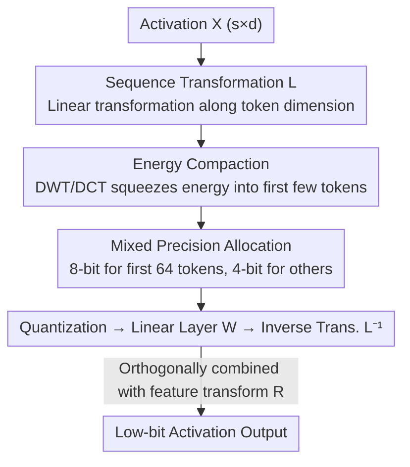

# STaMP: Sequence Transformation and Mixed Precision for Low-Precision Activation Quantization

**Conference**: ICLR 2026  
**OpenReview**: [https://openreview.net/forum?id=suB4wYViDt](https://openreview.net/forum?id=suB4wYViDt)  
**Code**: https://github.com/Qualcomm-AI-research/stamp-quantization  
**Area**: Model Compression / Quantization  
**Keywords**: Activation Quantization, Post-Training Quantization, Sequence Transformation, Mixed Precision, Energy Compaction

## TL;DR
STaMP proposes a reversible linear transformation along the **sequence dimension** (utilizing DCT/wavelets to compact activation energy into a few tokens) and سپس allocating higher bits to these high-energy tokens. This significantly reduces activation quantization errors under a fixed average bit budget. It is orthogonally complementary to existing feature-dimension transformations (Hadamard/QuaRot), providing plug-and-play improvements for W4A4 quantization in LLMs and LVMs.

## Background & Motivation

**Background**: Post-Training Quantization (PTQ) is a key technique for compressing LLM/LVM inference overhead. However, accuracy drops sharply when activations are quantized to 4-bit, primarily due to outliers in weights and activations. To combat outliers, recent works introduce "function-preserving reversible linear transformations": SmoothQuant scales down activation outliers and compensates by scaling up subsequent weights; methods like QuaRot/FlatQuant use Hadamard rotations to distribute outliers across multiple channels, thereby reducing the dynamic range of activations.

**Limitations of Prior Work**: These methods **uniquely operate on the feature dimension**, redistributing values across $d$ channels while completely ignoring the correlation between tokens along the **sequence dimension**.

**Key Challenge**: Images and text naturally possess strong **local correlations**—adjacent pixels and adjacent tokens are highly dependent. This structure is preserved in the intermediate activations of the model. In other words, the activation matrix $X\in\mathbb{R}^{s\times d}$ contains exploitable redundancy along the $s$ direction that existing transformations leave untouched.

**Goal**: (1) Propose a class of activation transformations along the sequence dimension that are complementary to feature transformations; (2) Characterize quantization error under sequence transformations and design a mixed-precision scheme accordingly; (3) Demonstrate that it consistently improves accuracy when stacked on top of feature transformations and weight quantization.

**Key Insight**: The authors draw inspiration from traditional **media compression** (JPEG/JPEG2000/video and audio coding). These codecs use DCT/wavelets to concentrate the energy of spatial signals into a few frequency coefficients and allocate bits based on perceptual importance. The authors port this idea to the activation space of generative models.

**Core Idea**: Use an orthogonal sequence transformation $L$ to **concentrate activation energy into the first few tokens**. Assign 8-bit to these few high-energy tokens and 4-bit to the rest, significantly reducing quantization error with almost no increase in the average bit rate.

## Method

### Overall Architecture

STaMP wraps each linear layer with a thin "sequence transformation + mixed precision" layer. For a linear layer input $X$, a **left-reversible matrix** $L$ is first used to transform along the sequence dimension to obtain $LX$ (squeezing energy into the first few tokens). Quantization is performed per-token with different bits $b_i$, followed by the linear layer $W$, and finally restored using the inverse transformation $L^{-1}$ plus bias. A key property is that the sequence transformation is linear and commutes with the linear layer; thus, $L^{-1}$ can be deferred until after the linear layer (the bias accordingly becomes $\ell\beta^T$) **without touching the weights**. This makes it naturally orthogonal to weight quantization methods like GPTQ and SVDQuant.

The pipeline addresses three components: ① What $L$ is both efficient and effective at energy compaction? ② How to allocate the bit budget across tokens? ③ What is the overhead of this transformation layer? The three key designs below correspond to these questions.

### Key Designs

**1. Sequence Transformation: Converting quantization error into an "energy allocation" problem**

Existing feature transformations only operate between channels, ignoring token correlations. STaMP introduces an orthogonal transformation $L$ along the sequence dimension and provides an error upper bound (Theorem 1): under min-max per-token scaling, the quantization error of the transformed activation is controlled by the weighted sum of the energy of each token:

$$\mathcal{L}(X;L)\le \frac{d}{2}\sum_{i=1}^{s}\frac{e_i}{(2^{b_i}-1)^2},\qquad e_i = E\big[\|l_i^T X\|_2^2\big].$$

Here $e_i$ is the energy of the $i$-th transformed token. Since orthogonal transformations **do not change the total energy** $E=\sum_i e_i$, reducing this upper bound relies on **reallocating bits**. The brilliance of this step is that it precisely reformulates "how to reduce quantization error" into "how to allocate energy and bits across tokens," paving the way for mixed precision—a classic strategy in energy compaction for media compression.

**2. Efficient Energy Compaction: Approximating the optimal KLT with DCT/wavelets**

Theoretically, the optimal transformation to maximize energy concentration into a few tokens is the eigenbasis of the activation autocorrelation matrix $S=E[XX^T]$, i.e., the KLT (Karhunen-Loève Transform), $L=U^T$. However, KLT requires per-activation estimation of $S$ (expensive calibration), and the matrix multiplication is a full-rank $O(s^2 d)$ operation performed twice per layer, making it impractical.

The key observation is that the autocorrelation matrices of LLM/LVM activations exhibit a **(block) Toeplitz structure** due to the natural local correlation in images/text—adjacent tokens are strongly correlated, while distant tokens are weakly correlated. According to Szegő's theorem, the eigenbasis of such matrices can be well-approximated by the **Fourier basis**. Since $S$ is real and symmetric, the **Discrete Cosine Transform (DCT)** ($O(ds\log s)$ complexity) can replace the complex Fourier basis. Furthermore, keeping only the signs of the Fourier coefficients yields the Walsh-Hadamard Transform (WHT), which is hardware-friendly. The **Discrete Wavelet Transform (DWT)** (Haar wavelet) reduces complexity to $O(ds)$, pushing energy to the first half (or first 1/4 for 2D signals) in each step, achieving sufficient concentration in $\log s$ steps. Experiments show that DCT, WHT, and DWT have similar energy compaction effects, leading the authors to choose the cheapest option, DWT.

**3. Optimal Bit Allocation + Discrete Precision: A hardware-friendly "64+8bit" scheme**

Given an energy vector $e$ and a total budget of $B$ bits, the continuous optimal allocation is $b_i^* = \log_2\sqrt{e_i} - C$ (where $C$ is a constant satisfying the budget constraint). That is, **bits are proportional to the logarithm of token energy**. This is because the error upper bound denominator grows exponentially with $b_i$, making the gain from moving a bit from a low-energy token to a high-energy token disproportionately large.

However, hardware only supports integers and ideally only a few precision levels (e.g., 4/8-bit). This is precisely why the authors **prefer DWT over the theoretically superior DCT**: DWT naturally generates **discrete energy hierarchies**, perfectly aligning with the requirement for only two bit levels. The final scheme is minimal: **the first 64 tokens are kept at 8-bit, and the rest at 4-bit**. On PixArt-Σ, the average bit is only 4.0625, requiring almost zero extra budget while significantly improving accuracy. For LLMs, this corresponds to an effective bit rate of W4A4.125KV4.125. A notable limitation: during the token-by-token generation phase of LLMs, only one activation is present at a time, so sequence transformations cannot be applied. Thus, STaMP is primarily used for the prompt pre-filling phase (which is precisely the compute-bound phase where gains are most critical).

### Loss & Training
STaMP is a pure PTQ method and **requires no training or fine-tuning**. The transformation matrices (DWT/DCT) are fixed analytical transforms, and bit allocation follows a deterministic "first 64 tokens 8-bit" rule. The only statistic required is using a calibration set to estimate the autocorrelation structure to confirm the Toeplitz assumption. The entire method is a plug-and-play addition to existing quantization methods.

## Key Experimental Results

### Main Results (LVM: DiT Architecture, W4A4 per-block quantization, block size 64, STaMP fixed at 64 tokens with 8-bit)

| Model / Method | COCO SQNR (None→+STaMP) | COCO IR | MJHQ SQNR | MJHQ IR |
|------|------|------|------|------|
| PixArt-Σ · RTN | 5.88 → 6.16 | 0.38 → 0.80 | 5.75 → 6.23 | 0.38 → 0.76 |
| PixArt-Σ · ViDiT-Q | 7.82 → 6.37 | 0.83 → 0.84 | 7.55 → 8.53 | 0.76 → 0.86 |
| PixArt-Σ · SVDQuant | 8.78 → 9.72 | 0.90 → 0.91 | 8.83 → 9.75 | 0.86 → 0.89 |
| SANA · RTN | 8.63 → 9.32 | 0.89 → 0.91 | 8.56 → 9.40 | 0.95 → 0.99 |
| SANA · SVDQuant | 9.99 → 10.69 | 0.87 → 0.90 | 9.88 → 10.51 | 0.93 → 0.98 |

After adding STaMP, SQNR and Image Reward improve for most configurations, and generated image artifacts are significantly reduced (Fig.1/Fig.6 in paper).

### Main Results (LLM: W4A4KV4, Wikitext-2 PPL, lower is better, all methods use 64 8-bit tokens)

| Method | Llama-3-8B | Llama-3.2-1B-it | Llama-3.2-3B-it | Qwen-2.5-3B-it |
|------|------|------|------|------|
| FP (Ref) | 6.14 | 13.16 | 11.27 | 8.56 |
| RTN → +STaMP | 668 → 95.3 | 1795 → 700 | 483 → 159 | 99723 → 18767 |
| SmoothQuant → +STaMP | 531 → 93.8 | 883 → 407 | 177 → 88.5 | 66929 → 29063 |
| QuaRot → +STaMP | 9.05 → 8.66 | 25.78 → 23.72 | 18.43 → 17.57 | 94.86 → 71.13 |
| FlatQuant → +STaMP | 6.89 → 6.77 | 15.72 → 15.16 | 12.71 → 12.40 | 9.29 → 9.19 |

**PPL consistently decreases for all baselines when adding STaMP**, with the most pronounced improvements seen in hard-to-quantize small models (1B/3B) that are far from FP accuracy.

### Ablation Study

| Dimension | Setting | Key Findings |
|------|------|---------|
| Sequence Transform Selection | Identity / DCT / WHT / DWT (Fig.7) | SQNR/PPL are similar across DCT/WHT/DWT; replacing expensive DCT with cheap DWT incurs almost no loss. |
| Combination with Feature Transform | × {SDCB, QuaRot, SmoothQuant, FlatQuant} | Gains from sequence and feature transforms are **largely complementary**, especially on LVMs. |
| High-Precision Token Count | Varying high-precision count (Fig.4b) | Introducing even a small number of high-precision tokens causes SQNR to **rise sharply**; the 5-bit region is still superior to uniform quantization. |
| Overhead | 3-level DWT + specialized CUDA kernel (Table 3) | Single-step DWT sequence transform flops overhead is 0.21%, and CUDA overhead is 4.8%, comparable to Hadamard feature transforms, accounting for <5% of total runtime. |

### Key Findings
- **Energy compaction + mixed precision is the core source of gain**: Compared to DWT, using identity (no sequence transformation) leads to significantly worse SQNR/PPL. The gain comes from the exponential returns of reallocating bits to high-energy tokens.
- **DWT is the sweet spot for efficiency and accuracy**: While not as optimal as DCT, DWT's discrete energy hierarchy matches the demand for a two-tier bit scheme with minimal $O(ds)$ complexity.
- **Orthogonal complementarity rather than competition**: STaMP does not compete with feature transformations or weight quantization; it can be stacked on top of them for cumulative gains—this is its most practical attribute.

## Highlights & Insights
- **Reframing activation quantization as a signal compression problem**: The authors astutely identified the Toeplitz structure of activation autocorrelation and directly imported the entire paradigm of energy compaction and adaptive bit allocation from JPEG/video coding into the activation space of generative models.
- **Discovery of an orthogonal dimension**: While peers were competing over feature-dimension outliers, STaMP identified the sequence dimension as a "no man's land." The innovation of "changing the axis" provides gains that are both cheap and universal.
- **Closed loop between theory and engineering**: The derivation chain—from error bounds (Theorem 1) to optimal KLT, to DCT approximation via Toeplitz, to DWT matching hardware precision—is rigorous. It results in a highly practical "64 token 8-bit" scheme.
- **Transferability**: The paradigm of "reversible transformation in an ignored dimension + energy-based resource allocation" can be transferred to KV-cache compression, sparsification, and even gradient communication compression.

## Limitations & Future Work
- **Not applicable to LLM decoding phase**: Since generation occurs token-by-token, sequence transformations cannot be applied. STaMP is limited to the prompt pre-filling phase (though this is a critical compute-bound phase).
- **Dependence on Toeplitz/local correlation assumption**: The effectiveness relies on the block-Toeplitz structure of autocorrelation. Activations that do not satisfy this (e.g., cross-attention relying on pooled text embeddings) require separate handling.
- **Latency overhead margin**: DWT's CUDA latency (4.8%) is higher than its flops (0.21%), suggesting the current kernel is not fully optimized. The authors acknowledge that better kernels or specialized hardware could further reduce overhead.
- **Manual setting of high-precision tokens**: The number 64 is empirical. Whether this can be made adaptive to different sequence lengths or models remains to be explored.

## Related Work & Insights
- **vs SmoothQuant / QuaRot / FlatQuant**: These methods mitigate outliers along the feature dimension, while STaMP performs energy compaction along the sequence dimension. They are orthogonal and stackable. STaMP does not touch weights, making it compatible with weight quantization methods.
- **vs SVDQuant**: SVDQuant uses SVD to absorb activation outliers into a high-precision low-rank branch and quantizes the residual to 4-bit. Combining STaMP with SVDQuant (Table 1) further enhances SQNR/IR.
- **vs Traditional Media Compression (JPEG/JPEG2000/HEVC/MP3)**: These codecs use DCT/DWT for energy compaction and perceptual bit allocation. STaMP proves these principles are transferable to generative model activation spaces.
- **vs Federici et al. 2025 (Subtracting sequence mean + Hadamard)**: Both focus on sequence structure, but that specific work subtracts the sequence mean before feature rotation, whereas STaMP is a complete framework of sequence transformation and mixed precision.

## Rating
- Novelty: ⭐⭐⭐⭐⭐ Reframes activation quantization along the ignored sequence dimension as a signal compression problem; original and orthogonal to existing methods.
- Experimental Thoroughness: ⭐⭐⭐⭐ Covers LVM (PixArt-Σ/SANA) and multiple LLMs, multiple baselines, and complete ablation/overhead analysis; decoding phase not covered.
- Writing Quality: ⭐⭐⭐⭐⭐ Clear derivation chain from theoretical bounds to optimal transformation, DCT/DWT approximation, and hardware implementation.
- Value: ⭐⭐⭐⭐⭐ High engineering utility; plug-and-play, training-free, and orthogonally stackable with existing quantization stacks.

<!-- RELATED:START -->

## Related Papers

- [\[ICLR 2026\] PM-KVQ: Progressive Mixed-Precision KV Cache Quantization for Long-CoT LLMs](pm-kvq_progressive_mixed-precision_kv_cache_quantization_for_long-cot_llms.md)
- [\[ICLR 2026\] Channel-Aware Mixed-Precision Quantization for Efficient Long-Context Inference](channel-aware_mixed-precision_quantization_for_efficient_long-context_inference.md)
- [\[ICLR 2026\] MicroMix: Efficient Mixed-Precision Quantization with Microscaling Formats for Large Language Models](micromix_efficient_mixed-precision_quantization_with_microscaling_formats_for_la.md)
- [\[ICCV 2025\] MixA-Q: Revisiting Activation Sparsity for Vision Transformers from a Mixed-Precision Quantization Perspective](../../ICCV2025/model_compression/mixa-q_revisiting_activation_sparsity_for_vision_transformers_from_a_mixed-preci.md)
- [\[AAAI 2026\] DynaQuant: Dynamic Mixed-Precision Quantization for Learned Image Compression](../../AAAI2026/model_compression/dynaquant_dynamic_mixed-precision_quantization_for_learned_i.md)

<!-- RELATED:END -->
