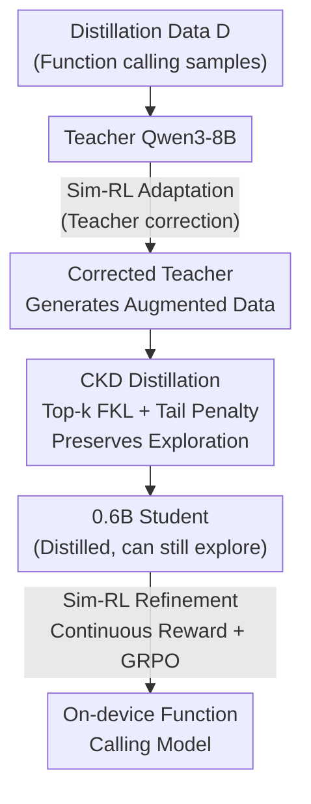

# STAR: Similarity-guided Teacher-Assisted Refinement for Super-Tiny Function Calling Models

**Conference**: ICLR 2026  
**arXiv**: [2602.03022](https://arxiv.org/abs/2602.03022)  
**Code**: [github.com/Qwen-Applications/STAR](https://github.com/Qwen-Applications/STAR)  
**Area**: Model Compression / Knowledge Distillation  
**Keywords**: Knowledge Distillation, Reinforcement Learning, Function Calling, Super-tiny Models, Similarity Reward

## TL;DR

The STAR framework is proposed to synergize Constrained Knowledge Distillation (CKD) and Similarity-guided Reinforcement Learning (Sim-RL). It effectively transfers the function calling capabilities of large models to super-tiny 0.6B models, significantly outperforming baselines on BFCL and ACEBench.

## Background & Motivation

- While LLM function calling is critical for AI Agents, the deployment of large models is often restricted.
- Applying SFT+RL directly to small models faces a **triple challenge**:
  1. Small models are prone to **overfitting** SFT data, memorizing patterns rather than generalizing.
  2. Direct RL training is **unstable**.
  3. The combination of KD and RL introduces new issues: RKL under top-k truncation causes training collapse, binary rewards are unsuitable for multi-solution tasks, and coordinating KD with RL is difficult.

## Method

### Overall Architecture

STAR aims to compress the function calling capabilities of Qwen3-8B into a 0.6B edge model. The difficulty lies in small models memorizing data during SFT and being unstable during RL. Furthermore, sequential KD and RL introduce pitfalls (collapse under top-k truncation and mismatch between binary rewards and multi-solution tasks). The solution is a three-stage curriculum: first, use Sim-RL for teacher adaptation to correct distillation data; second, use CKD to transfer knowledge from the corrected teacher to the student while preserving the student's exploration capability for subsequent RL; finally, use Sim-RL with continuous rewards to refine the student's policy. The exploration capability preserved by CKD in the second step is the prerequisite for the RL in the third step, making the stages interconnected rather than simply concatenated.

### Key Designs

**1. Constrained Knowledge Distillation (CKD): Distilling without stifling exploration for RL.**

The authors first clarify why existing distillation objectives are insufficient. Under top-k truncation (retaining only the $V_k(x)$ tokens with the highest teacher probability), FKL is stable because it ignores the tail distribution, whereas RKL exerts unstable supervision on tokens outside $V_k(x)$, leading to catastrophic collapse. Moreover, the "mode-seeking" nature of RKL aggressively prunes the student's tail distribution, reducing output entropy—where low entropy results in weak exploration, hindering downstream RL. CKD is designed to "suppress without pruning": it adds a tail penalty to the top-k FKL,

$$\mathcal{L}_{CKD} = \mathcal{L}_{FKL\text{-}k} + \lambda_{tail} \mathcal{L}_{tail}$$

The primary term is the standard top-k forward KL,

$$\mathcal{L}_{FKL\text{-}k} = \sum_{x} \sum_{v \in V_k(x)} P_T(v|x) \log \frac{P_T(v|x)}{P_S(v|x)}$$

The tail penalty only exerts pressure on tokens where the student assigns high probability but the teacher considers irrelevant (falling outside top-k),

$$\mathcal{L}_{tail} = \sum_{x} \sum_{v \in V_m(x) \setminus V_k(x)} P_S(v|x)$$

This term suppresses "confident errors" without forcing the entire long-tail distribution to zero, thus preserving the exploration capability needed for the RL stage—a fundamental difference between CKD and direct RKL distillation.

**2. Similarity-guided Reinforcement Learning (Sim-RL): Replacing binary rewards with continuous signals for multi-solution tasks.**

Function calling often involves multiple equivalent correct calls; binary "correct/incorrect" rewards provide sparse signals, failing on samples that are "mostly correct." Sim-RL employs a set of continuous rewards. The format reward $R_{format}$ remains binary, checking for `<think>`/`<tool_call>` tags, JSON format, and function name validity. The Function Call reward $R_{fc}$ uses an IoU-based approach to compare the predicted sequence $P$ and ground truth $G$, calculating the intersection over union at the parameter level:

$$R_{fc} = \frac{\sum_{i=1}^{\min(m,n)} \text{sim}(p_i, g_{\sigma(i)})}{|P| + |G| - |P \cap G|}$$

The similarity function $\text{sim}(p,g)$ measures parameters based on type (ROUGE-L for strings, exact match for numerical values), offering more flexibility than AST parsing and more granularity than binary rewards. Plain text replies use a Response reward $R_{response}$ (ROUGE-L F1). The total reward is synthesis and constrained to $[-1, 1]$:

$$R = (R_{format} - 1) + R_{format} \cdot (R_{fc} + R_{response})$$

A format violation results in a $-1$ penalty; content rewards only apply if the format is correct. Optimization utilizes GRPO with a filtering mechanism that discards homogeneous groups where rewards are all 0 or 1, focusing training on samples with discriminative power.

**3. STAR Training Curriculum: Adaptation, Distillation, and Refinement.**

The three stages form a curriculum. Step one fine-tunes the teacher model (Qwen3-8B) using Sim-RL to adapt it to the target distillation data (teacher correction)—ablations show this improves distillation quality. Step two distills knowledge from the corrected teacher to the 0.6B student via CKD. Step three refines the student policy with Sim-RL. The exploration capability intentionally preserved by CKD in step two enables the RL in step three to function.

## Key Experimental Results

### BFCLv3 Benchmark (Qwen3-0.6B)

| Method | Overall Acc | Non-Live | Live | Multi Turn |
|------|-----------|----------|------|------------|
| Base-model | 47.33 | 71.81 | 65.66 | 1.88 |
| SFT | 44.58 | 66.29 | 62.15 | 1.62 |
| SFT-think | 47.59 | — | — | — |
| FKL | — | — | — | — |
| ToolRL | — | — | — | — |
| **STAR** | **Best** | — | — | — |

### STAR 0.6B Major Achievements

| Comparison | BFCL Relative Gain | ACEBench Relative Gain |
|------|-------------|-----------------|
| vs Baselines | +9.2% | >50% |
| vs all open-source <1B models | **Best** | **Best** |
| vs some larger models | Outperforms | Outperforms |

### Ablation Study

| CKD Component | Effect |
|---------|------|
| top-k FKL alone | Stable but limited downstream RL gain |
| top-k RKL/AKL | Training collapse |
| CKD (FKL + tail penalty) | **Stable + Preserved exploration + Max RL gain** |

### Key Findings

1. The tail penalty in CKD maintains training stability while preserving sufficient exploration capability.
2. Sim-RL's continuous rewards are significantly more effective than binary rewards for multi-solution tasks.
3. A well-designed KD+RL curriculum allows a 0.6B model to outperform certain larger models.
4. Teacher adaptation via Sim-RL (teacher correction) contributes positively to distillation quality.

## Highlights & Insights

- **In-depth Diagnosis**: Systematically analyzes the differences in behavior between FKL and RKL under top-k truncation and their impact on downstream RL.
- **Sophisticated Reward Design**: Parameter-level similarity rewards are more flexible than AST parsing and provide richer signals than binary rewards.
- **High Practicality**: Achieves deployable-level function calling performance for 0.6B super-tiny models.
- **KD → RL Interface**: CKD is specifically designed to preserve exploration characteristics to serve the subsequent RL phase.

## Limitations & Future Work

- Validated only on the Qwen series; cross-architecture generalization remains unknown.
- Reward design depends on specific function calling formats (Qwen tool calling template).
- Distillation upper bound is determined by the quality of the teacher model.
- Training pipeline is relatively complex (Teacher tuning → CKD → Sim-RL).

## Related Work & Insights

- Knowledge Distillation: Discussions on GKD, AKL, FKL vs RKL.
- Function Calling: BFCL benchmark, ToolRL.
- Small Model Training: LUFFY (hybrid offline/online), etc.

## Rating

- **Novelty**: ⭐⭐⭐⭐ — Technical contributions from CKD tail penalty and Sim-RL fine-grained rewards.
- **Technical Depth**: ⭐⭐⭐⭐ — Deep analysis of KL divergence behavior with theoretical support at the gradient level.
- **Experimental Thoroughness**: ⭐⭐⭐⭐ — Multi-scale models, comprehensive ablations, and two major benchmarks.
- **Value**: ⭐⭐⭐⭐⭐ — High practical value for on-device deployment of 0.6B function calling models.

<!-- RELATED:START -->

## Related Papers

- [\[ICLR 2026\] Towards Reliable Benchmarking: A Contamination Free, Controllable Evaluation Framework for Multi-step LLM Function Calling](towards_reliable_benchmarking_a_contamination_free_controllable_evaluation_frame.md)
- [\[ICML 2026\] Critique-Guided Distillation for Robust Reasoning via Refinement](../../ICML2026/model_compression/critique-guided_distillation_for_robust_reasoning_via_refinement.md)
- [\[ICLR 2026\] Unveiling Super Experts in Mixture-of-Experts Large Language Models](unveiling_super_experts_in_mixture-of-experts_large_language_models.md)
- [\[CVPR 2026\] Teacher-Guided Routing for Sparse Vision Mixture-of-Experts](../../CVPR2026/model_compression/teacher-guided_routing_for_sparse_vision_mixture-of-experts.md)
- [\[ACL 2026\] Find Your Optimal Teacher: Personalized Data Synthesis via Router-Guided Multi-Teacher Distillation](../../ACL2026/model_compression/find_your_optimal_teacher_personalized_data_synthesis_via_router-guided_multi-te.md)

<!-- RELATED:END -->
