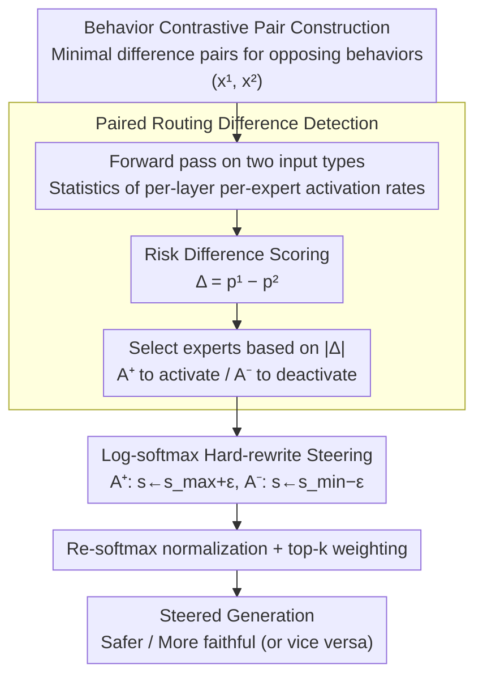

# Steering MoE LLMs via Expert (De)Activation

**Conference**: ICLR 2026  
**arXiv**: [2509.09660](https://arxiv.org/abs/2509.09660)  
**Code**: [github.com/adobe-research/SteerMoE](https://github.com/adobe-research/SteerMoE)  
**Area**: Model Compression / Interpretability and Safety  
**Keywords**: MoE, Expert Routing, Behavior Steering, Safety, Faithfulness, Inference-time Control

## TL;DR

SteerMoE is proposed to detect behavior-associated experts via contrastive paired inputs and steer the behavior of MoE LLMs by activating or deactivating specific experts during inference (+20% safety, +27% faithfulness). The study also reveals a unique safety alignment vulnerability in MoE models (safety drop -100%).

## Background & Motivation

- MoE architectures achieve efficient inference through sparse routing, but the routing mechanism lacks controllability and interpretability.
- **Key Insight**: The MoE router is not just for computation allocation but also a **signal-rich controllable interface**.
- It is hypothesized that specific experts are entangled with specific behaviors (safety, faithfulness, etc.). Detecting and controlling these experts can steer model behavior at test time.
- Duality: This serves as both a tool for alignment and a revelation of unique safety vulnerabilities in MoE models.

## Method

### Overall Architecture

SteerMoE treats the MoE router as a ready-made behavior interface. It first prepares a set of paired inputs that are contrastive only in the target behavior while being otherwise minimal in difference. After performing a forward pass, it calculates the difference in activation rates for each expert across the two input types to locate abstract behaviors like "safety" or "faithfulness" to specific experts. At inference time, routing scores for these experts are directly rewritten to force activation or deactivation, steering the generation toward the target direction. This process requires no weight modification or training, as it only reuses routing statistics already calculated during the forward pass, making it a lightweight inference-time steering method.

### Key Designs

**1. Behavior Contrastive Pair Construction: Isolating single behaviors with minimal difference pairs**

The effectiveness of the method depends on whether the paired inputs differ "only in the target behavior." For faithfulness, SQuAD is used where $x^{(1)}$ is "Document: {Context} Question: {Q}" (with evidence) and $x^{(2)}$ is "Question: {Q}" (without the document). The only difference is whether the answer depends on context or parametric knowledge. For safety, $x^{(1)}$ is a safe refusal response and $x^{(2)}$ is an unsafe compliant response, locking the difference to "refusal vs. compliance." Cleaner pairs yield more pure expert sets and fewer side effects—this is the fundamental reason why general QA on control sets (e.g., MCTest) remains largely unaffected.

**2. Paired Routing Difference Detection: Mapping abstract behaviors to specific experts**

Since "which expert is responsible for safety" cannot be observed directly, SteerMoE uses differentiation to identify them. Paired inputs are passed through the model to count the routing frequency $A_{\ell,i}$ for each expert at each layer, which is normalized into activation rates $p^{(1)}_{\ell,i} = A^{(1)}_{\ell,i}/N^{(1)}$ and $p^{(2)}_{\ell,i} = A^{(2)}_{\ell,i}/N^{(2)}$. The risk difference is then calculated:

$$\Delta_{\ell,i} = p^{(1)}_{\ell,i} - p^{(2)}_{\ell,i}$$

$\Delta_{\ell,i} > 0$ indicates expert $i$ biases toward behavior 1, while $< 0$ biases toward behavior 2. Ranking by $|\Delta_{\ell,i}|$ selects two groups of experts most entangled with the behavior: $\mathcal{A}^+$ for enhancement and $\mathcal{A}^-$ for suppression. Risk difference is preferred over odds ratio because the latter fluctuates wildly when activation counts are near zero, whereas the absolute difference rewards experts that are "consistently and significantly" more active. This differentiation naturally cancels out "general-purpose experts" common to both inputs, leaving behavior-specific signals—observed by the authors to be highly concentrated in the middle layers.

**3. Hard-rewrite Steering in Log-softmax Domain: Forcing routing without destroying the mixture structure**

A challenge after selecting experts is how to force their presence or absence during inference without collapsing the routing to a single expert. Since logits across models or layers vary in scale, SteerMoE maps routing logits to log-softmax scores $\mathbf{s} = \log\,\text{softmax}(\mathbf{z})$. Using $s_{\max}=\max_j s_j$ and $s_{\min}=\min_j s_j$ as anchors, it sets $s_e \leftarrow s_{\max} + \varepsilon$ for $e \in \mathcal{A}^+$ and $s_e \leftarrow s_{\min} - \varepsilon$ for $e \in \mathcal{A}^-$. Other scores remain unchanged. Finally, scores are re-normalized via softmax for the original top-$k$ selection and weighted sum. $\varepsilon$ is intentionally small (e.g., $10^{-2}$) to ensure the steered expert receives the highest or lowest priority without pushing probabilities to extremes or zeroing out other top-$k$ experts. This maintains the "weighted mixture" structure while exerting a clear direction. Notably, if no rewrite is performed, $\text{softmax}(\log\,\text{softmax}(\mathbf{z})) = \text{softmax}(\mathbf{z})$, making this intervention minimally invasive to the original routing.

## Key Experimental Results

### Safety Steering (AdvBench, Evaluated by Llama-Guard-3-8B)

| Model | Direct Instructions | SteerMoE Unsafe | SteerMoE+AIM |
|------|---------|---------------|-------------|
| GPT-OSS-120B | 100% Safety | 90% Safety | **0% Safety** |
| Qwen3-30B | 98% Safety | 60% Safety | 2% Safety |
| Phi-3.5-MoE | 100% Safety | 94% Safety | **0% Safety** |

### Faithfulness Steering

| Steering Direction | FaithEval-CF | FaithEval-Unans | CF-TriviaQA | Average Improvement |
|---------|-------------|----------------|-------------|---------|
| Steer Faithfulness | +10% to +27% | Significant Gain | Significant Gain | **Up to +27%** |
| Control Set MCTest | No drop | — | — | No impact on general QA |

### Key Security Findings

| Combined Attack | GPT-OSS-120B | Qwen3 | Phi-3.5 | OLMoE |
|---------|-------------|-------|---------|-------|
| AIM alone | 100% | 2% | 96% | 100% |
| FFA alone | 100% | 48% | 100% | 92% |
| **SteerMoE + AIM** | **0%** | **2%** | **0%** | **36%** |

### Key Findings

1. Safety and faithfulness associated experts are concentrated in the **middle layers** of the model.
2. Safety experts activate primarily on safe tokens, while unsafe experts activate on unsafe tokens $\rightarrow$ this provides natural token-level attribution.
3. SteerMoE is **orthogonal** to existing jailbreak methods; combining them can completely bypass all safety guardrails.
4. It reveals "alignment fakeout" in MoE: safety alignment is concentrated in a few expert paths, and a slight shift in routing causes it to collapse.

## Highlights & Insights

- **Duality Analysis**: The same method can enhance safety/faithfulness (+20%/+27%) or completely destroy safety (-100%).
- **Lightweight & Efficient**: Does not modify model weights or require extra training, utilizing existing routing computations.
- **Exposing Fundamental Vulnerability**: GPT-OSS-120B safety guardrails drop from 100% to 0% under SteerMoE+AIM.
- **New Dimension of "Alignment Fakeout"**: Safety alignment must cover all routing paths, not just a few expert channels.
- **Interpretability By-product**: Expert activation patterns can serve as signals for token-level attribution and hallucination detection.

## Limitations & Future Work

- Applicable only to MoE architectures; cannot be directly used for dense models.
- Requires construction of contrastive paired inputs, which is difficult for certain subtle behaviors.
- The optimal number of steered experts depends on model architecture parameters, requiring tuning for each model.
- Ethical risks regarding safety attacks.

## Related Work & Insights

- MoE Analysis: Mixtral vocabulary specialization, OLMoE routing saturation, domain specialization, etc.
- LLM Steering: LM-Steers, Representation Engineering, RICE, etc.
- Safety Attacks: GCG, ArtPrompt, AIM jailbreak methods.

## Rating

- **Novelty**: ⭐⭐⭐⭐⭐ — Reinterprets MoE routing as a controllable behavior interface.
- **Technical Depth**: ⭐⭐⭐⭐ — Concise method but comprehensive analysis.
- **Experimental Thoroughness**: ⭐⭐⭐⭐⭐ — 11 benchmarks × 6 models, safety and faithfulness dimensions.
- **Value**: ⭐⭐⭐⭐ — Zero-cost steering at inference, though safety attack surfaces require attention.

<!-- RELATED:START -->

## Related Papers

- [\[ICML 2026\] GEMQ: Global Expert-Level Mixed-Precision Quantization for MoE LLMs](../../ICML2026/model_compression/gemq_global_expert-level_mixed-precision_quantization_for_moe_llms.md)
- [\[ICLR 2026\] MoBE: Mixture-of-Basis-Experts for Compressing MoE-based LLMs](mobe_mixture-of-basis-experts_for_compressing_moe-based_llms.md)
- [\[ICLR 2026\] SERE: Similarity-based Expert Re-routing for Efficient Batch Decoding in MoE Models](sere_similarity-based_expert_re-routing_for_efficient_batch_decoding_in_moe_mode.md)
- [\[ICLR 2026\] TD-MoE: Tensor Decomposition for MoE Models](td-moe_tensor_decomposition_for_moe_models.md)
- [\[ACL 2026\] Analytical FFN-to-MoE Restructuring via Activation Pattern Analysis](../../ACL2026/model_compression/analytical_ffn-to-moe_restructuring_via_activation_pattern_analysis.md)

<!-- RELATED:END -->
