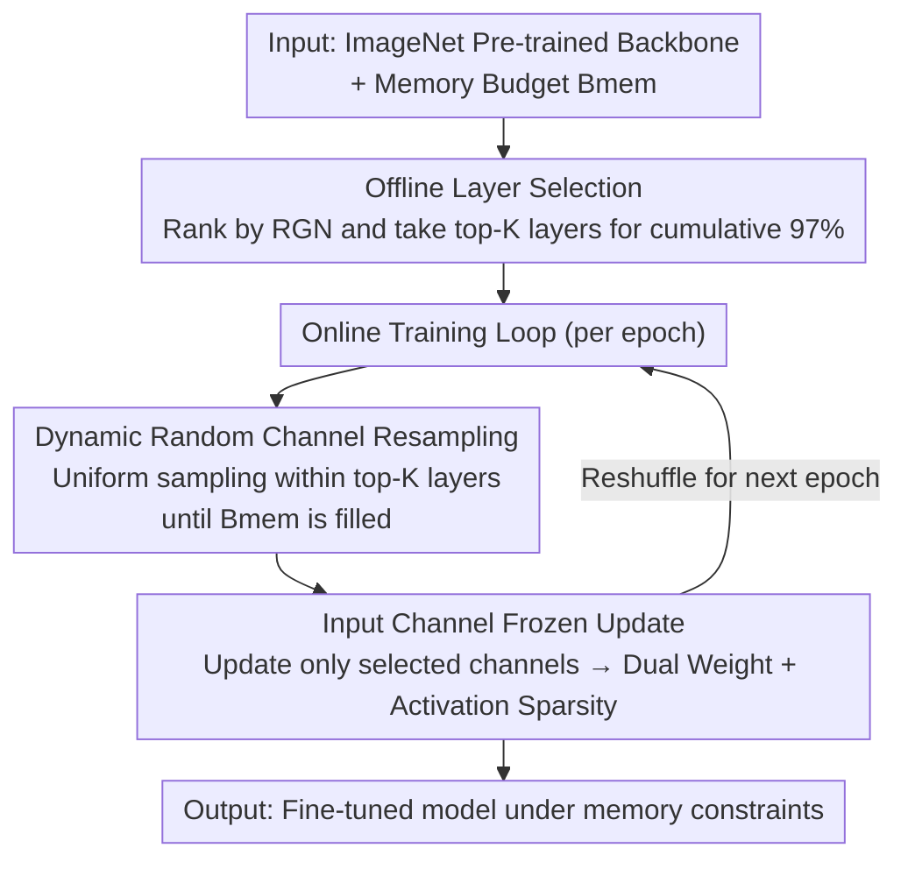

# Study of Training Dynamics for Memory-Constrained Fine-Tuning (TraDy)

**Conference**: ICLR 2026  
**OpenReview**: [https://openreview.net/forum?id=BhfIg0tuti](https://openreview.net/forum?id=BhfIg0tuti)  
**Code**: Anonymous repository provided (includes training_metrics and reproduction scripts)  
**Area**: Model Compression / Memory-Efficient Training / On-Device Learning  
**Keywords**: Memory-Constrained Fine-Tuning, Gradient Pruning, Dynamic Channel Selection, Heavy-Tailed Gradients, On-Device Learning

## TL;DR
Addressing the issue where edge devices are extremely memory-constrained and cannot perform full backpropagation, this paper utilizes three observations regarding fine-tuning training dynamics (heavy-tailed gradients, architecture-driven layer importance, and task-dependent channel importance) to decompose "where to update" into two steps: offline layer selection and online dynamic channel selection. The proposed TraDy randomly resamples input channels within pre-selected high-importance layers every epoch to approximate the full gradient under strict memory budgets. It achieves up to 99% activation sparsity, 95% weight derivative sparsity, and a 97% reduction in backward FLOPs, with accuracy even surpassing the deterministic oracle.

## Background & Motivation
**Background**: When deploying models to edge devices, the mainstream approach involves moving compressed models (quantized, low-rank, compact, distilled, or pruned) for offline inference. However, these works almost exclusively optimize "inference" and do not solve the problem of "on-device continuous training/fine-tuning."

**Limitations of Prior Work**: Models that only perform on-device inference after offline training suffer from performance degradation over time due to data drift. On-device learning is restricted by the memory and compute of backpropagation—edge device memory is a hard constraint that cannot store weight derivatives and activations for all parameters. Existing alternatives have various drawbacks: Sparse Update (SU) by Lin et al. uses a static subnetwork but requires expensive offline contribution analysis and evolutionary search, with fixed selections across all downstream tasks; Kwon et al. use Fisher information for layer ranking, but computing Fisher information is more memory-intensive than computing gradients; Velocity by Quélennec et al. dynamically selects neurons but only considers weight memory, ignoring the equally critical activation memory.

**Key Challenge**: A trade-off exists between the memory budget and the quality of gradient approximation. Reducing memory requires freezing a large number of parameters/channels, but more extensive freezing leads to more biased gradient approximations and greater accuracy loss. Conversely, accurately identifying "which channels are important" requires computing full gradients, which inherently violates memory constraints. Simultaneously, existing methods are either static (not adaptive during training) or only account for half of the memory consumption (weights but not activations).

**Goal**: Maximize accuracy by selecting "which part of the network to update" under a strict joint memory budget for weights and activations, without prior knowledge of the downstream task data.

**Key Insight**: The authors do not directly design selection rules but first study "the nature of training dynamics during fine-tuning." They propose three propositions: ① Stochastic gradients follow a heavy-tailed distribution during fine-tuning, naturally resulting in sparsity concentrated in a few channels; ② The relative importance of layers is primarily determined by the network architecture and remains nearly invariant across downstream tasks, allowing layers to be determined offline (or even a priori); ③ The distribution of importance at the channel level is task-dependent and cannot be pre-determined without target data.

**Core Idea**: Decompose "where to update" into two levels: layers are fixed offline using architectural information (saving online overhead), while channels, being task-dependent, are **randomly resampled per epoch** within the selected layers. This allows the expectation of random selections to approximate the full gradient, achieving both memory compliance and high accuracy without computing full gradients.

## Method

### Overall Architecture
TraDy (Training Dynamics) decomposes memory-constrained fine-tuning into two stages: offline layer selection and online channel selection. The input consists of an ImageNet pre-trained backbone and a memory budget $B_{mem}$ (total weight + activation). The output is a model fine-tuned on the downstream task without ever exceeding the memory budget. In the offline stage, several epochs are run on any available task to rank layers by Reweighted Gradient Norm (RGN), selecting the top-K layers accounting for 97% of cumulative RGN as the "updatable layer pool." In the online stage, during the training loop, input channels are **uniformly and randomly** sampled within these layers every epoch until the memory budget is filled. Only these channels are updated, and they are reshuffled and resampled in the next epoch. This bypasses the memory paradox of requiring full gradients for channel selection and brings the expectation of random subsets toward the full gradient through dynamic resampling.

### Key Designs

**1. Offline Layer Selection: Layer importance depends on architecture and is invariant across tasks**

This step addresses the overhead of determining which layers to update online. The authors define the Reweighted Gradient Norm (RGN) by dividing the channel gradient norm by its memory cost: $\mathrm{RGN}_c = \frac{\lVert (\partial L/\partial W_i)_c \rVert_2}{C^{W_i}_c + C^{A_i}_c}$, where $C^{W_i}_c = C'\times D\times D$ is the weight memory and $C^{A_i}_c = H\times W$ is the activation memory. While raw gradient norms favor channels with more parameters, RGN normalizes by memory cost, favoring channels with "high gradient contribution per unit of memory." This prioritizes memory-efficient updates, allowing more effective updates within the same budget. The RGN of a layer is the sum of its channel RGNs (Proposition 3.1): $\big(\partial L/\partial W_i\big)_{\mathrm{RGN}} = \frac{1}{(\Theta_{space})_i}\sum_c \lVert (\partial L/\partial W_i)_c \rVert_2^2$. A key observation is that the relative ranking between layers remains almost constant throughout training and across different downstream tasks, primarily determined by the architecture (especially residual structures: the first layer of each residual block has a significantly higher gradient norm). Experimental evidence is strong: on MobileNetV2 across 7 datasets × 3 seeds, the Spearman correlation matrix of layer topologies shows that even the worst pair does not fall below 0.8. Thus, layers can be ranked offline (even using only a few epochs) to select the top-K layers accounting for 97% of cumulative RGN (35 layers for MbV2, 27 for MCUNet, 43 for ProxylessNAS), completely removing this overhead from online training.

**2. Dynamic Random Channel Resampling: Channel importance is task-dependent; use randomness to approximate full gradients**

Layers can be fixed offline, but channels cannot. Proposition 3.2 indicates that the distribution of channel gradient norms varies significantly across tasks (T-test p-values across datasets are nearly zero, strongly rejecting the "same mean" hypothesis) because weight derivatives depend on both activation maps (feature extraction) and activation derivatives (task-dependent loss), both of which are task-related. This prevents the "offline pre-selection of channels," while accurate online selection would require full gradient computation, violating memory constraints. TraDy's approach is to avoid computing gradients for selection altogether: in each epoch, input channels are randomly sampled based on a uniform distribution within the top-K layers until $B_{mem}$ is filled. The theoretical basis is that the expectation of stochastic gradients equals the full gradient. Since layer selection has already excluded layers with low-magnitude gradients and channels are sampled uniformly, $\mathbb{E}\big[\sum_t \Delta\tilde W\big] \simeq \mathbb{E}\big[\sum_t \Delta W_{\{C_t\}}\big]$—as epochs accumulate, the set of updated channels covers the full gradient direction in an expected sense. The complexity of randomly selecting $k$ out of $n$ channels is only $O(k\log n)$, which is negligible compared to gradient computation. A counter-intuitive result is that TraDy even outperforms the deterministic oracle D-Det RGN (which computes full gradients every epoch to select the highest RGN channels). The authors explain that deterministic selection permanently freezes a set of channels with "smaller but still significant" RGNs, causing training to follow the steepest gradient and get stuck in local minima; random resampling preserves beneficial stochasticity (shuffling only within significant layers), while the average direction remains aligned with non-zero gradients.

**3. Input Channel Freezing: Simultaneously cutting weight and activation memory**

The remaining question is "which dimension to freeze to save memory." From the weight derivative formula $\big(\partial L/\partial W_i\big)_{c',c,k,l} = \sum_{b,h',w'} [A^p_i]_{b,c,h,w}\,(\partial L/\partial A_{i+1})_{b,c',h',w'}$, convolutional kernels have four dimensions to freeze: input channel, output channel, and two kernel dimensions. Pruning per-parameter results in unstructured sparsity with no real memory/compute gains. Freezing along the output channel only saves memory for storing activation derivatives (which still must be computed to propagate gradients to previous layers). Only **freezing along the input channel** achieves both weight sparsity and activation sparsity—because updating a specific input channel $c$ only requires storing its corresponding activation value. Freezing it saves both the storage of that activation and the computation of the corresponding weight gradient. The space/time complexity per channel is $(\Theta_{space})_c = C^{W_i}_c + C^{A_i}_c$ and $(\Theta_{time})_c = D^2 C' H' W'$. This choice is fundamental to the feasibility of the first two designs: because input channel freezing provides a structured unit for dual weight + activation sparsity, the sparsity of heavy-tailed gradients can be efficiently exploited, ultimately achieving 99% activation sparsity, 95% weight derivative sparsity, and a 97% reduction in weight derivative FLOPs.

### Loss & Training
The loss function is not modified, using standard Cross-Entropy + SGD (without momentum, as storing optimizer states also violates memory constraints), cosine learning rate decay + 5 warm-up epochs, and no weight decay or dropout. The training process is detailed in Algorithm 1: given a pre-trained backbone, number of epochs $n$, memory budget $B_{mem}$, and relevant layer set $\{L_K\}$, in each epoch, channels $\{C_t\}$ are uniformly and randomly sampled within $\{L_K\}$ to fill $B_{mem}$, these channels are updated, and the model is evaluated on the test set after training.

## Key Experimental Results

Experiments cover 3 edge-side CNNs (MobileNetV2-w0.35, ProxylessNAS, MCUNet, all ImageNet pre-trained) × 7 downstream datasets (CIFAR-10/100, CUB, Flowers, Food, Pets, VWW) × 3 memory budgets × 3 seeds = 189 training runs per strategy, ensuring sufficient statistical significance. Main results are presented using paired t-test heatmaps (Fig. 4), with numerical values in Tab. 1.

### Main Results
Average top-1 accuracy for MobileNetV2-w0.35 across 7 datasets under the smallest memory budget ($B_{mem}=27946$) (excerpt from Tab. 1):

| Method | CIFAR-100 | CUB | Food | VWW | 7-Task Avg |
|------|-----------|-----|------|-----|-----------|
| SU (Static SOTA) | 67.34 | 56.85 | 61.62 | 87.73 | 74.22 |
| Velocity (Dynamic Neuron) | 68.14 | 57.51 | 61.79 | 88.29 | 74.47 |
| D-Full Random (Full Net) | 67.85 | 57.42 | 60.69 | 88.56 | 74.24 |
| D-Det RGN (Oracle Upper) | 67.48 | 57.70 | 61.88 | 88.36 | 74.49 |
| **TraDy (Ours)** | **68.68** | **57.90** | **62.61** | **88.76** | **74.91** |

TraDy achieves the highest average accuracy and **outperforms the D-Det RGN oracle**; statistically, every dynamic variant (D-) is superior to its corresponding static variant (S-).

### Ablation Study
The key comparison involves the intersection of "Static vs. Dynamic" and "Full Network vs. Top-K Layers" (Fig. 4 t-test):

| Configuration | Relative Performance | Explanation |
|------|---------|------|
| TraDy = D-TopK Random | Best | Within top-K layers + Dynamic resampling |
| S-Full Random (≈PaCA) | Worst | Full network random + Static; proves both layer selection and dynamics are necessary |
| S-TopK Random | Second Worst | Layers selected but static without resampling → proves dynamic resampling is key |
| Velocity | Second Best | Dynamic but only accounts for weight memory |

### Key Findings
- **Dynamic resampling is more critical than layer selection**: S-TopK Random (layer selection but static) ranks second to last, indicating that selecting the right layers is not enough; reshuffling channels per epoch is the primary driver of performance gains.
- **Randomness outperforms deterministic oracles**: D-Det RGN always selects the maximum RGN, permanently freezing "small but significant" channels and potentially falling into local minima; TraDy's randomness helps the training escape these.
- **Dual sparsity is the key to memory savings**: TraDy achieves 93–99% weight sparsity and 97.5–99.5% activation sparsity. While Velocity ranks second in accuracy, its neuron-level selection results in only 20–40% activation sparsity (updating one neuron requires storing the entire preceding activation map) and saves only ~88% FLOPs, whereas TraDy/channel-based methods save ~97%.
- **Value of RGN Reweighting**: Under the same total memory, raw norm thresholding prunes more channels but leads to earlier accuracy degradation; RGN maintains full accuracy even when half the training memory is removed (Fig. 8).

## Highlights & Insights
- **Layered treatment of "where to update" based on predictability**: Layer importance is determined by architecture → fixed offline; channel importance is determined by task → approximated by online randomness. This "problem decomposition based on information availability" is a clean approach transferable to any efficient training scenario involving subset selection.
- **Defeating the oracle with randomness is truly counter-intuitive**: Typically, we assume "greedy selection with full gradient knowledge" is an upper bound. This paper empirically proves that under extreme memory constraints, random resampling is better, attributing this to avoiding the permanent freezing of significant channels—providing a strong counter-example to "deterministic top-k pruning."
- **RGN as a unified metric**: It solves two things simultaneously—ranking layers and explicitly incorporating memory cost into channel priority. This unifies "gradient importance" and "memory efficiency" into a single scalar.
- **Input channel freezing is the pivot for dual sparsity**: Among the four freeze-able dimensions, only input channels allow for simultaneous savings in both weight and activation memory. This analysis provides clear guidance for future design of sparse on-device training.

## Limitations & Future Work
- **Lack of real hardware metrics**: The authors admit the performance is simulated and do not report on-device latency or energy consumption; dynamic resampling requires specialized engineering to execute efficiently on edge devices.
- **Limited baseline comparisons**: Apart from SU, the paper lacks direct comparisons with Quélennec (Velocity), whose budgets exclude activations, and Kwon (TinyTrain), whose code was not public at the time.
- **Total backward cost may not decrease**: Only reductions in weight derivative FLOPs are reported. TraDy tends to select deeper layers, meaning activation derivatives still need to propagate back from the output, potentially increasing total backward latency.
- **Coarse selection of K**: The 97% RGN threshold is a fixed empirical value and does not adapt to the memory budget; adaptive K selection is left for future work.
- Personal observation: Experiments are conducted on small CNNs and small image classification datasets. While SwinT/BERT/RoBERTa are mentioned in the appendix, whether the propositions regarding "heavy-tails + architecture-driven layer importance" hold robustly for large models and large-scale data remains to be verified.

## Related Work & Insights
- **vs SU (Lin et al. 2022)**: SU uses a static subnetwork + offline evolutionary search, with fixed selections across tasks; TraDy fixes layers offline but resamples channels dynamically online, saving evolutionary search and adapting better to tasks with higher accuracy.
- **vs Velocity (Quélennec et al. 2024)**: Velocity dynamically selects neurons but only accounts for weight memory, leading to low activation sparsity (20–40%); TraDy uses input channel freezing to achieve dual sparsity with 97–99% activation sparsity.
- **vs TinyTrain (Kwon et al. 2024)**: TinyTrain uses activation Fisher information to rank layers, which is more memory-expensive than gradients and still utilizes static selection; TraDy uses cheaper offline RGN ranking + dynamic channel selection.
- **vs PaCA (Woo et al. 2025)**: PaCA randomly selects channels for updates across the whole network without considering layer importance or resampling, corresponding to the worst-performing S-Full Random baseline; TraDy adds layer selection and dynamic resampling.
- **vs Adapter-based PEFT (LoRA/DoRA)**: Adapters introduce parallel paths, requiring dual forward passes during inference and storage of full activations for update during backward passes, making them fundamentally incompatible with extreme activation memory constraints; TraDy adds no modules and performs sparse updates directly within original layers.

## Rating
- Novelty: ⭐⭐⭐⭐ Decomposing the training dynamics into offline layer selection and online random channel selection is clever; the conclusion that randomness outperforms the oracle is impactful.
- Experimental Thoroughness: ⭐⭐⭐⭐ 3 networks × 7 datasets × 3 budgets × 3 seeds = 189 training runs/strategy is statistically solid, though real hardware metrics are missing and horizontal comparisons are limited.
- Writing Quality: ⭐⭐⭐⭐ The link between propositions, validation, and method is clear, with well-integrated formulas and figures.
- Value: ⭐⭐⭐⭐ Provides a simple and implementable solution for on-device/memory-constrained continuous learning, with ideas transferable to broader efficient training contexts.

<!-- RELATED:START -->

## Related Papers

- [\[ICLR 2026\] Sculpting Subspaces: Constrained Full Fine-Tuning in LLMs for Continual Learning](sculpting_subspaces_constrained_full_fine-tuning_in_llms_for_continual_learning.md)
- [\[ICLR 2026\] Training Dynamics Impact Post-Training Quantization Robustness](training_dynamics_impact_post-training_quantization_robustness.md)
- [\[ICLR 2026\] Efficient Orthogonal Fine-Tuning with Principal Subspace Adaptation](efficient_orthogonal_fine-tuning_with_principal_subspace_adaptation.md)
- [\[ICLR 2026\] Memba: Membrane-driven Parameter-Efficient Fine-Tuning for Mamba](memba_membrane-driven_parameter-efficient_fine-tuning_for_mamba.md)
- [\[ICLR 2026\] PiCa: Parameter-Efficient Fine-Tuning with Column Space Projection](pica_parameter-efficient_fine-tuning_with_column_space_projection.md)

<!-- RELATED:END -->
