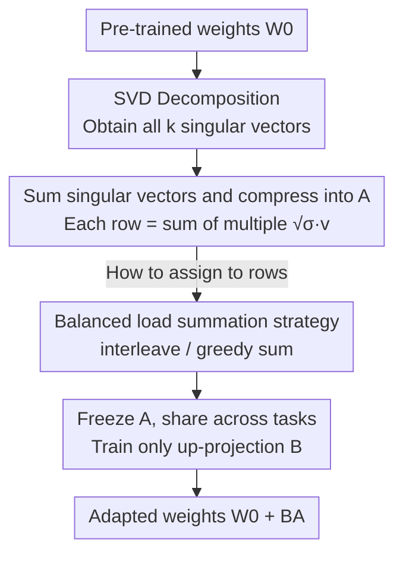

# SumRA: Parameter Efficient Fine-Tuning with Singular Value Decomposition and Summed Orthogonal Basis

**Conference**: ICLR 2026  
**OpenReview**: [https://openreview.net/forum?id=v23Pqcm6qp](https://openreview.net/forum?id=v23Pqcm6qp)  
**Area**: Model Compression / Parameter-Efficient Fine-Tuning  
**Keywords**: PEFT, LoRA, Singular Value Decomposition, Initialization Strategy, Multilingual ASR

## TL;DR
SumRA compresses **all** singular vectors obtained from SVD of pre-trained weights into the LoRA down-projection matrix $A$ in a "disjoint and load-balanced" manner. By freezing $A$ and training only the up-projection matrix $B$, it halves the trainable parameters and enables cross-task sharing of $A$, reducing the WER of Whisper adapted to five new languages from 14.42% (LoRA) to 12.41%.

## Background & Motivation

**Background**: When adapting large models to downstream tasks, the mainstream approach follows the PEFT route, with LoRA being the most classic scheme—freezing pre-trained weights $W_0$ and representing weight updates as the product of two low-rank matrices $W' = W_0 + BA$, training only $A$ and $B$. Subsequently, LoRA-FA further freezes the down-projection $A$ and only trains $B$, halving trainable parameters and memory usage. PiSSA introduces a more sophisticated initialization: using the top $r$ principal singular vectors from the SVD of $W_0$ to initialize $A$ and $B$, allowing fine-tuning to proceed along the directions where $W_0$ has the "strongest stretching," leading to faster convergence and better performance.

**Limitations of Prior Work**: Combining the "frozen $A$" from LoRA-FA with "SVD initialization" from PiSSA is an efficient idea for parameter saving. However, PiSSA only utilizes the top few singular vectors—typically less than 5% of all singular vectors. Since each singular vector roughly encodes knowledge of a specific concept or vocabulary subset, the influence of $A$ is locked within a very narrow subspace, limiting adaptation to only a small fraction of the model's learned knowledge.

**Key Challenge**: The rank $r$ of $A$ is much smaller than the rank $k$ of $W_0$, making it impossible to assign each singular vector to a unique row. However, directions corresponding to small singular values are also useful for adaptation (and should not be discarded). The desire to "use all singular vectors" naturally conflicts with the constraint that "$A$ only has $r$ rows."

**Goal**: Without increasing the rank of $A$ or the number of trainable parameters, allow the initialization of $A$ to cover the knowledge carried by **all** singular vectors, thereby expanding adaptation from "local" to "global."

**Key Insight**: Since there are not enough rows to assign individually, multiple singular vectors can be **summed** into a single row. Summation is equivalent to merging computations originally dispersed across vectors, a "shared computation across concepts" approach that has been proven effective in related work.

**Core Idea**: Initialize each row of $A$ as the "sum of multiple singular vectors selected from SVD," design a summation allocation strategy to spread important vectors evenly, and freeze $A$ for cross-task sharing to achieve parameter-efficient fine-tuning under global knowledge adaptation.

## Method

### Overall Architecture
SumRA is essentially an upgrade of PiSSA initialization. It first performs SVD on the pre-trained weights $W_0$ to obtain all singular vectors. Instead of **only taking the top $r$**, it distributes all $k$ singular vectors into the $r$ rows of $A$ and sums them within each row, resulting in a matrix $A$ that compresses the "entire model knowledge." The up-projection $B$ is initialized to zero to maintain the initial output. Once initialization is complete, $A$ is frozen and only $B$ is trained. Consequently, $A$ can be shared across different tasks or languages, and storage costs grow only with $B$.

The pipeline is as follows:

### Key Designs

**1. Singular Vector Summation Compression: Stuffing all SVD directions into low-rank A**

The immediate pain point is that PiSSA only uses the top-$r$ principal singular vectors, trapping the influence of $A$ in less than 5% of the knowledge subspace. SumRA performs SVD just like PiSSA:

$$\mathrm{SVD}(W_0) = U\Sigma V^\top = \sum_{i=1}^{k} \sigma_i u_i v_i^\top$$

It then assigns all $k$ singular vectors (scaled by $\sqrt{\sigma}$) to the $r$ rows of $A$. Let $a_i \in \mathbb{R}^k$ be the $i$-th row of $A$, and $S_i$ be the set of singular vector indices assigned to this row, then:

$$a_i = \sum_{j \in S_i} \sqrt{\sigma_j}\, v_j$$

In this way, directions with small singular values that would otherwise be discarded are preserved. $A$ no longer focuses solely on the few "strongest stretching" directions but carries information from the entire knowledge graph, making it particularly suitable for tasks requiring "global" rather than "local" knowledge transfer (e.g., adapting to accents or speaking styles). The essence of summation is to merge computations originally dispersed across vectors, which is equivalent to sharing model computation across concepts.

**2. Disjoint Orthogonal Assignment + Load-Balanced Summation Strategy: Avoiding interference between important vectors**

Mere "summation" is not enough—adding multiple vectors into the same row inevitably brings information interference. SumRA first ensures a well-structured assignment with two constraints: each singular vector index must be assigned to **exactly** one $S_i$ ($\bigcup_i S_i = \{1,\dots,k\}$), and the subsets must be **pairwise disjoint** ($S_i \cap S_j = \varnothing$). Disjointness implies that the rows of $A$ are orthogonal to each other ($a_i \perp a_j$), and orthogonality itself improves optimization efficiency during fine-tuning.

More critically is "how to assign." Stacking the most important singular vectors into the same row causes destructive interference, so they must be spread evenly. The paper measures concentration using the **load** of each row $L_j = \sum_{i \in S_j} \sigma_i$ (the sum of all singular values in that row), aiming to minimize the maximum row load $L_{\max} = \max_j L_j$. Three strategies are compared: ① block sum assigns continuous segments of indices to a row, which stacks large singular values in the first few rows (worst); ② interleave sum takes indices at intervals $S_i = \{i, \tfrac{k}{r}+i, \dots\}$ to stagger large values; ③ greedy sum assigns singular vectors in descending order to the row with the "current minimum load." The paper proves in the appendix that greedy sum achieves the **minimum possible** $L_{\max}$, making it the optimal assignment. Experiments confirm interleave/greedy are consistently superior to block sum.

**3. Freezing A, Cross-task Sharing: Halving parameters and preventing storage bloat**

After initialization, $A$ is frozen, $B$ is initialized to zero, and only $B$ is trained. This directly cuts trainable parameters by approximately half (similar to LoRA-FA). However, the real killer feature of SumRA is storage: since $A$ is entirely determined by the SVD of $W_0$ and does not participate in training, it is the **same** matrix across all tasks/languages and can be shared. For every new task, only a small $B$ needs to be stored. This specifically addresses the pain point of multilingual, personalized ASR—where thousands of users each requiring a LoRA could lead to 10 TB of storage. SumRA prevents $A$ from accumulating with the number of tasks; storage cost grows only with $B$.

### Loss & Training
The training objective is standard ASR supervised loss without extra regularization. The optimizer uses AdamW with a ReduceLROnPlateau variant scheduler. LoRA modules are added to all linear layers in the feed-forward and attention layers of the Whisper decoder, with a scaling factor $\alpha$ equal to the rank $r$. During training, only the LoRA modules (i.e., $B$) and normalization layer parameters are updated for two epochs with a batch size of 4 and greedy decoding.

## Key Experimental Results

The task is low-resource multilingual ASR: using Common Voice to adapt Whisper (small / large-v2) to five **unseen** new languages (eo / ia / fy-NL / mhr / kmr), with only 10 hours of training data per language. The metric is WER (lower is better).

### Main Results
Excerpt of results for whisper-large-v2, rank=32 (parameters column shows extra storage for non-sharable parts):

| Method | Extra Params | eo | ia | fy-NL | mhr | kmr |
|------|---------|------|------|-------|------|------|
| LoRA | 34.3M | 14.42 | 8.67 | 24.75 | 32.39 | 37.72 |
| DoRA | 34.9M | 13.45 | 8.28 | 23.38 | 29.67 | 35.59 |
| PiSSA | 34.3M | 13.00 | 8.82 | 22.43 | 29.97 | 34.26 |
| CorDA | 34.3M | 13.13 | 9.18 | 22.96 | 29.20 | 36.33 |
| **SumRA (ours)** | **17.6M** | **12.41** | **8.17** | **22.27** | **27.19** | **34.21** |

With half the parameter count, SumRA achieves the best WER in four out of five languages, with a relative gain of up to 16% over LoRA (mhr) and an 11% lead over CorDA. Conclusions are consistent across various configurations like rank=2 and whisper-small. The paper also notes: while full fine-tuning (FT) is generally better than LoRA-like methods on whisper-small, FT is more prone to overfitting as the model scales to large-v2. SVD-initialized methods (PiSSA/CorDA/SumRA) can suppress overfitting by "initializing along principal component directions."

### Ablation Study
Comparison of summation strategies (whisper-small, rank=32):

| Config | Extra Params | eo | ia | fy-NL | mhr | kmr |
|------|---------|------|------|-------|------|------|
| LoRA | 7.7M | 23.39 | 15.31 | 39.34 | 40.63 | 48.51 |
| SumRA (block sum) | 3.9M | 21.68 | 13.91 | 35.38 | 37.35 | 47.30 |
| SumRA (interleave sum) | 3.9M | 20.77 | 13.38 | 33.37 | 36.30 | 44.47 |
| SumRA (greedy sum) | 3.9M | 20.73 | 13.16 | 33.91 | 37.53 | 44.72 |

Data scale ablation (adapting to Esperanto, whisper-small):

| Method | 10h | 50h | 100h |
|------|-----|-----|------|
| LoRA | 23.39 | 15.20 | 13.28 |
| SumRA (freeze A) | 20.77 | 14.49 | 13.39 |
| SumRA (train A) | 20.14 | 13.75 | 13.02 |

### Key Findings
- **Balanced Allocation is Crucial**: Block sum causes destructive interference by stacking important singular vectors in the same row, performing significantly worse than interleave/greedy. The latter two are consistently better across five languages, validating the design motivation of using $L_{\max}$ for load balancing.
- **Higher Gains in Low-Resource Scenarios**: SumRA shows the largest gain over LoRA at 10h, while the advantage nearly disappears at 100h—SumRA’s global knowledge update mechanism is most valuable when data is scarce.
- **Freezing A is Almost Cost-Free**: Although unfreezing $A$ (train A) can further reduce WER, it comes with higher trainable parameter counts and training overhead; the frozen version already outperforms all baselines with half the parameters.

## Highlights & Insights
- **"Summation Compression" replaces "Truncation Discarding"**: Previous SVD-based initializations (PiSSA) take the top-$r$ and discard the tail. SumRA does the opposite by summing all singular vectors into a fixed-rank matrix, an ingenious way to "store more knowledge with zero extra parameters."
- **Converting Allocation to a Scheduling Problem**: Using row load $L_j$ and minimizing $L_{\max}$ to characterize "don't bundle important vectors" allows the use of classic greedy scheduling (Least-Load-First) to provide a provably optimal solution, grounding a heuristic initialization trick on a theoretical foundation.
- **True Innovation from a Storage Perspective**: Since $A$ is uniquely determined by $W_0 \Rightarrow A$ is shared across tasks $\Rightarrow$ storage only grows with $B$. This directly hits the storage pain point of "millions of LoRAs" in multilingual/personalized ASR deployments and has high practical value for any scenario requiring large-scale adapter libraries.
- The paper also points out that SumRA (interleave) is equivalent to "model averaging" of multiple different $A$ initialization versions, but merges directions into a single model before adaptation for better efficiency.

## Limitations & Future Work
- **Specialized for Global Adaptation**: The authors admit SumRA excels in "global attributes" affecting large vocabulary subsets like accents or speaking styles; it has limited gains for "local adaptation" requiring changes to only a few domain terms.
- **Ineffective on NLP Tasks**: Preliminary experiments show no significant gain for SumRA when adapting LLaMA to GLUE, as classification tasks mainly learn decision boundaries on existing representations rather than large-scale shifts in representation space.
- **Future Directions**: Exploring adaptive selection of "global vs local" initialization based on task type, or making the summation allocation data-aware (similar to CorDA using activation covariance redirection) to balance local adaptation.

## Related Work & Insights
- **vs PiSSA**: PiSSA only uses the top-$r$ principal singular vectors to initialize $A$, and $A$ participates in training; SumRA uses **all** singular vectors in a summed initialization and freezes $A$, covering a broader knowledge space with fewer parameters and sharable $A$.
- **vs LoRA-FA**: Both freeze $A$ and train $B$, but LoRA-FA uses a **random** basis to initialize $A$, wasting pre-trained knowledge in $W_0$; SumRA uses structured singular vectors from SVD, making it knowledge-aware.
- **vs CorDA**: CorDA uses target task activation covariance to redirect $W_0$ before SVD (data-aware) but still takes principal components; SumRA is data-agnostic in compressing all singular vectors into $A$. These routes are orthogonal and could be combined.

## Rating
- Novelty: ⭐⭐⭐⭐ "Summing all singular vectors + load-balanced allocation + frozen sharing" is a clear combination with theoretical backing, serving as an organic improvement over PiSSA/LoRA-FA.
- Experimental Thoroughness: ⭐⭐⭐ Multiple models/ranks/languages + summation strategy and data scale ablations are relatively complete, but the task scope is narrow (basically only multilingual ASR, admittedly ineffective on NLP).
- Writing Quality: ⭐⭐⭐⭐ The derivation of motivations and diagrams (Fig.2/3) intuitively explains "why sum" and "why balance."
- Value: ⭐⭐⭐⭐ Cross-task sharing of $A$ has direct practical value for the storage pain points of large-scale LoRA deployments.

<!-- RELATED:START -->

## Related Papers

- [\[ICLR 2026\] PiCa: Parameter-Efficient Fine-Tuning with Column Space Projection](pica_parameter-efficient_fine-tuning_with_column_space_projection.md)
- [\[ICLR 2026\] Efficient Orthogonal Fine-Tuning with Principal Subspace Adaptation](efficient_orthogonal_fine-tuning_with_principal_subspace_adaptation.md)
- [\[ICLR 2026\] Memba: Membrane-driven Parameter-Efficient Fine-Tuning for Mamba](memba_membrane-driven_parameter-efficient_fine-tuning_for_mamba.md)
- [\[ICLR 2026\] TRAC: Tensor-Train Based Across-Layer Compression for Parameter-Efficient Fine-Tuning](trac_tensor-train_based_across-layer_compression_for_parameter-efficient_fine-tu.md)
- [\[ACL 2025\] C3A: Parameter-Efficient Fine-Tuning via Circular Convolution](../../ACL2025/model_compression/parameter-efficient_fine-tuning_via_circular_convolution.md)

<!-- RELATED:END -->
## Related Papers

- [\[ICLR 2026\] PiCa: Parameter-Efficient Fine-Tuning with Column Space Projection](pica_parameter-efficient_fine-tuning_with_column_space_projection.md)
- [\[ICLR 2026\] Efficient Orthogonal Fine-Tuning with Principal Subspace Adaptation](efficient_orthogonal_fine-tuning_with_principal_subspace_adaptation.md)
- [\[ICLR 2026\] Memba: Membrane-driven Parameter-Efficient Fine-Tuning for Mamba](memba_membrane-driven_parameter-efficient_fine-tuning_for_mamba.md)
- [\[ICLR 2026\] TRAC: Tensor-Train Based Across-Layer Compression for Parameter-Efficient Fine-Tuning](trac_tensor-train_based_across-layer_compression_for_parameter-efficient_fine-tu.md)
- [\[ACL 2025\] C3A: Parameter-Efficient Fine-Tuning via Circular Convolution](../../ACL2025/model_compression/parameter-efficient_fine-tuning_via_circular_convolution.md)

<!-- RELATED:END -->
