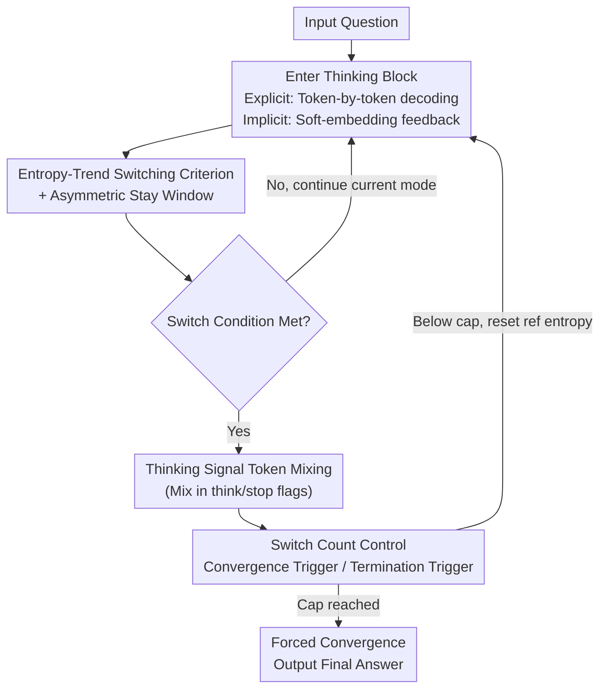

# SwiReasoning: Switch-Thinking in Latent and Explicit for Pareto-Superior Reasoning

**Conference**: ICLR 2026  
**arXiv**: [2510.05069](https://arxiv.org/abs/2510.05069)  
**Code**: [https://github.com/sdc17/SwiReasoning](https://github.com/sdc17/SwiReasoning)  
**Area**: Model Compression / Efficient Reasoning  
**Keywords**: Latent Reasoning, Explicit Reasoning, Mode Switching, Token Efficiency, Training-Free Framework

## TL;DR

Ours proposes SwiReasoning, a training-free LLM reasoning framework that dynamically switches between explicit (chain-of-thought) and implicit (latent space) reasoning modes through block-level confidence estimation based on entropy trends. It simultaneously improves accuracy (+1.8% to 3.1%) and token efficiency (+57% to 79%) in a Pareto-superior manner.

## Background & Motivation

The reasoning capability of Large Language Models (LLMs) is a central topic in current AI research. Existing reasoning enhancement methods primarily follow two paths:

**Explicit Reasoning**: Conducts discrete reasoning via Chain-of-Thought (CoT) steps. The advantage is interpretability, while the drawbacks include limitations imposed by natural language boundaries, restricted information density per step, and a tendency toward "overthinking," which generates redundant tokens.

**Implicit Reasoning**: Allows LLMs to reason continuously in the latent space. Each step can encode richer information, thereby enhancing token efficiency. Recent work has demonstrated the potential of this direction.

However, implicit reasoning faces two core challenges in a training-free setting:

- **Challenge 1: Precision Drop**. Pure implicit reasoning maintains multiple implicit paths to expand the search distribution, which scatters probability mass and introduces noise. This prevents convergence to a single high-confidence solution, thereby harming accuracy. It is essentially characterized by excessive exploration but insufficient exploitation.

- **Challenge 2: Persistent Overthinking**. Even without explicit text output, the problem of overthinking persists—models waste tokens without improving result quality, leading to decreased efficiency.

The core motivation of SwiReasoning is: **Can the model dynamically switch between explicit and implicit reasoning modes to utilize the convergence of explicit reasoning for "anchoring" solutions while leveraging the efficiency of implicit reasoning to accelerate exploration?**

## Method

### Overall Architecture

SwiReasoning segments the thinking process of a reasoning LLM into a sequence of alternating "thinking blocks": either an explicit block—where tokens are decoded one by one into readable text like standard CoT; or an implicit block—where instead of sampling a specific token, the entire next-token probability distribution is weighted back into all word embeddings. This soft embedding is then fed back as the next input ($\tilde{e}_t = \sum_{v} p_t[v]\, e(v)$, following the training-free approach of Soft-Thinking), preserving more uncertainty and higher information density per step. During inference, the framework monitors the entropy of the next-token distribution in real-time as a confidence signal to decide the mode for the next block: the more confident the model (decreasing entropy), the more it switches to explicit mode to "anchor" a path; the more uncertain (increasing entropy), the more it switches to implicit mode for parallel exploration. Simultaneously, a switch counter caps the total number of transitions, forcing answers at natural checkpoints to suppress overthinking. This process requires no weight updates and is a plug-and-play framework for any reasoning LLM.

### Key Designs

**1. Entropy-Trend Block-Level Confidence Switching Criterion and Asymmetric Stay Window**

Addressing the pain point where pure implicit reasoning fails to converge due to over-exploration, SwiReasoning uses entropy directly as a confidence probe without additional classifiers. Content between two switches is defined as a thinking block, where confidence is measured by $H_t = -\sum_{v} p_t[v]\log p_t[v]$. A reference entropy $\bar{H}$ is recorded at the start of each block. The criterion is minimalist: in an implicit block, if $H_t < \bar{H}$ (rising confidence), it switches back to explicit mode to converge the progress into a single path; in an explicit block, if $H_t > \bar{H}$ (falling confidence), it switches to implicit mode to re-expand exploration. To prevent oscillation from short-term entropy jitter, an **asymmetric** stay window is introduced: $W_{L\to E}=0$ implies an immediate switch to explicit mode upon entropy decrease (as latent mode is naturally divergent), while $W_{E\to L}>0$ requires the explicit mode to remain stable for several steps before switching to implicit mode (as explicit mode is naturally convergent and needs time to stabilize the logic chain).

**2. Thinking Signal Token Mixing**

To better align with the model's learned thinking rhythm, the embeddings of thinking markers (e.g., `<think>` / `</think>`) are mixed into the input at each switching point. The first step $t^\star$ of an implicit block biases toward "start thinking": $\tilde{e}_{t^\star} \leftarrow \alpha_{t^\star}\tilde{e}_{t^\star} + (1-\alpha_{t^\star})\,e_{\langle\text{think}\rangle}$. The first step $t^\dagger$ of an explicit block biases toward "end thinking" ($e_{\langle/\text{think}\rangle}$). Mixing coefficients $\alpha, \beta$ linearly increase to 1 as generation progresses. This aligns mode switching with the signals the model observed during pre-training, effectively signaling "gear shifts" to the model in its own language.

**3. Switch Count Control: Convergence Trigger + Termination Trigger**

To prevent redundant token consumption on simple tasks, a maximum Latent→Explicit switch limit $C_{\max}$ is set. When $\tfrac{1}{2}C_{\max}\le C_t\le C_{\max}$, a **convergence trigger** is activated, forcing a `</think>` at the next switch to encourage the model to finalize the answer. When $C_t > C_{\max}$, a **termination trigger** injects the prefix "The final answer is," followed by a maximum of $B$ tokens. This design leverages natural checkpoints where partial reasoning has already been integrated, allowing for earlier and often correct answers without wasting tokens.

### Loss & Training

Ours is entirely training-free and does not involve parameter updates or fine-tuning. Soft-embedding feedback, entropy calculation, window determination, and signal mixing are all executed online during inference, resulting in extremely low deployment barriers compared to methods requiring distillation.

## Key Experimental Results

### Main Results

Evaluations across Math, STEM, Coding, and General Reasoning benchmarks show consistent improvements across different model families and scales.

| Benchmark Category | Accuracy Gain | Description |
|--------------------|---------------|-------------|
| Mathematics        | +1.8% to 3.1% | MATH, GSM8K, etc. |
| STEM               | +1.8% to 3.1% | Across various STEM benchmarks |
| Coding             | +1.8% to 3.1% | Code reasoning tasks |
| General Reasoning  | +1.8% to 3.1% | Integrated reasoning benchmarks |

Token Efficiency Gains:

| Budget Constraint | Token Efficiency Gain | Description |
|-------------------|-----------------------|-------------|
| Normal Budget     | 57%                   | Baseline efficiency gain |
| Tight Budget      | 79%                   | Gains increase as budget tightens |

### Ablation Study

| Configuration | Key Metrics | Description |
|---------------|-------------|-------------|
| Pure Explicit | Baseline Accuracy | Standard CoT, high token consumption |
| Pure Implicit | Lower Accuracy | Over-exploration, lack of convergence |
| Random Switch | Partial Gain | Validates the necessity of dynamic switching |
| Fixed Interval| Moderate Gain | Inferior to adaptive strategy |
| SwiReasoning  | Optimal | Dynamic switching + count constraints |

### Key Findings

1.  **Pareto Superiority**: SwiReasoning outperforms baselines in both accuracy and efficiency, achieving Pareto-level improvements without sacrificing one for the other.
2.  **Cross-Family Generalization**: Stable gains are observed across different model families (e.g., Qwen, LLaMA) and scales, proving the method's universality.
3.  **Budget-Efficiency Correlation**: In resource-constrained scenarios, the efficiency advantage becomes more pronounced (79% vs 57%), indicating that dynamic resource allocation is more effective when resources are scarce.
4.  **Difficulty Adaptivity**: Simple problems naturally receive less computation (converging after few blocks), while difficult problems receive more up to the cap, achieving rational allocation of compute.

## Highlights & Insights

1.  **First Hybrid Explicit-Implicit Paradigm**: SwiReasoning integrates both modes rather than choosing one, utilizing explicit reasoning for "convergence confirmation" and implicit reasoning for "efficient search."
2.  **Training-Free Design**: As a plug-and-play inference framework, it can be applied to any reasoning LLM without modifying weights.
3.  **Entropy Trend as State Probe**: Using the entropy trend of next-token distributions to perceive internal states (exploration vs. convergence) is elegant and requires no auxiliary models.
4.  **Graceful Solution to Overthinking**: Limiting reasoning depth via switch counts is more elegant than post-processing truncation, as it allows deep thinking where needed but prevents infinite divergence.
5.  **Bridging Research Communities**: It connects latent reasoning and explicit CoT, providing a unified perspective for the two directions.

## Limitations & Future Work

1.  **Inference-Only Verification**: While being training-free is an advantage, specifically trained switching strategies might yield higher performance.
2.  **Signal Robustness**: Confidence estimation based solely on entropy trends might be inaccurate in certain scenarios (e.g., entropy fluctuations in multi-step reasoning middle stages).
3.  **Interpretability of Latent Blocks**: While the final output is readable, the "thinking" process within implicit blocks is unobservable, potentially limiting debugging.
4.  **Hyperparameter Sensitivity**: The maximum switch count $C_{\max}$ requires tuning for different tasks and lacks an automatic determination mechanism.
5.  **Unexplored Multi-modal Scenarios**: Current verification is limited to language tasks; performance in visual or multi-modal reasoning remains unknown.

## Related Work & Insights

- **Chain-of-Thought (CoT)**: The classic explicit path, used as a component in SwiReasoning.
- **Latent Reasoning / SIM-CoT / LaDiR**: Recent work in implicit reasoning which SwiReasoning fuses with explicit modes.
- **Token Efficiency Optimization**: Methods like Early Stopping CoT focus on reducing redundancy; SwiReasoning provides finer-grained control.
- **Test-time Compute**: Similar to Best-of-N or Self-Consistency, SwiReasoning optimizes within a single reasoning path.
- **Key Insight**: **Dynamic selection of reasoning modes** may be a universal paradigm for efficient LLM reasoning, potentially extending to more combinations in the future.

## Rating

- Novelty: ⭐⭐⭐⭐ (Hybrid dynamic switching is quite novel; entropy-based mechanism is clever)
- Experimental Thoroughness: ⭐⭐⭐⭐ (Multi-model/multi-benchmark evaluation, though could compare with more implicit baselines)
- Writing Quality: ⭐⭐⭐⭐ (Clear structure and motivation)
- Value: ⭐⭐⭐⭐⭐ (Training-free, plug-and-play, Pareto-superior—high practical value for LLM efficiency research)

<!-- RELATED:START -->

## Related Papers

- [\[ICLR 2026\] Efficient Reasoning with Balanced Thinking](efficient_reasoning_with_balanced_thinking.md)
- [\[ICLR 2026\] LS-Merge: Merging Language Models in Latent Space](ls-merge_merging_language_models_in_latent_space.md)
- [\[ICLR 2026\] FutureMind: Equipping Small Language Models with Strategic Thinking-Pattern Priors via Adaptive Knowledge Distillation](futuremind_equipping_small_language_models_with_strategic_thinking-pattern_prior.md)
- [\[ICLR 2026\] CARE: Covariance-Aware and Rank-Enhanced Decomposition for Enabling Multi-Head Latent Attention](care_covariance-aware_and_rank-enhanced_decomposition_for_enabling_multi-head_la.md)
- [\[ICLR 2026\] BeyondBench: Contamination-Resistant Evaluation of Reasoning in Language Models](beyondbench_contamination-resistant_evaluation_of_reasoning_in_language_models.md)

<!-- RELATED:END -->
