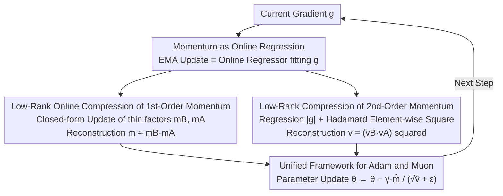

# Taming Momentum: Rethinking Optimizer States Through Low-Rank Approximation

**Conference**: ICLR 2026 Oral  
**arXiv**: [2602.24283](https://arxiv.org/abs/2602.24283)  
**Code**: [github.com/mrflogs/LoRA-Pre](https://github.com/mrflogs/LoRA-Pre)  
**Area**: Model Compression / Efficient Optimizers  
**Keywords**: Low-rank Optimizer, Momentum Compression, Pre-training Efficiency, LoRA, Adam, Muon

## TL;DR

This work reveals that momentum EMA updates are equivalent to gradient descent for online linear regression. Based on this insight, the authors propose LoRA-Pre, which compresses optimizer momentum through low-rank decomposition to achieve memory-efficient LLM pre-training and fine-tuning, reaching optimal performance across all model scales with only 1/8 the rank of baseline methods.

## Background & Motivation

- Optimizers like Adam maintain first- and second-order moments, resulting in memory footprints **three times larger than model weights**.
- Existing low-rank optimization methods (e.g., GaLore, Flora, Fira) compress optimizer states by projecting gradients into lower dimensions.
    - Periodic subspace updates lead to **optimization discontinuity and error accumulation**.
    - These methods cannot instantaneously adapt to changing gradient subspaces.
- An efficient momentum compression method capable of **continuous subspace adaptation** is required.

## Method

### Overall Architecture

The goal is not to eliminate model weights but to save the two additional momentum states maintained for each weight—elements that expand Adam's memory usage to 3x the model size. The entry point of this work is a neglected observation: the EMA update of momentum is essentially an online regressor fitting the current gradient. Since it performs regression, it can be compressed using low-rank decomposition like weights; however, instead of periodic re-projection, this low-rank representation is updated online at each step. The pipeline replaces the full-rank momentum $m$ with two thin factors $m_B m_A$, refreshes these factors online using closed-form rules at each step, and multiplies them back to approximate the original momentum during parameter updates. The "momentum as regression" insight handles both first- and second-order moments for both Adam and Muon.

### Key Designs

**1. Reinterpreting Momentum as Online Linear Regression: The Foundation**

Deconstructing the EMA momentum update reveals it is exactly one step of online gradient descent:

$$m_{t+1} = \underbrace{m_t}_{weight} - \underbrace{(1-\beta)}_{lr} \cdot \underbrace{(m_t - g)}_{gradient}$$

This minimizes the objective $\min_m L(m; g) = \frac{1}{2}\|m - g\|_F^2$ with learning rate $1-\beta$, where the gradient is $m_t - g$. By reinterpreting "momentum" as "an online regressor fitting gradients," compression becomes equivalent to replacing the regressor with a low-rank parameterization.

**2. Low-rank Online Compression of First-order Momentum: Regressors in Thin Factors**

Since momentum is regressing $g$, the full-rank momentum $m \in \mathbb{R}^{p\times q}$ is decomposed into two thin factors $m = m_B \cdot m_A$ ($m_B \in \mathbb{R}^{p\times r}$, $m_A \in \mathbb{R}^{r\times q}$, $r \ll \min(p,q)$). The regression objective becomes:

$$\min_{m_B, m_A} L(m_B, m_A; g) = \frac{1}{2}\|m_B m_A - g\|_F^2,$$

reducing memory from $p\times q$ to $(p+q)\times r$. Instead of backpropagation, Newton's method yields closed-form updates (Theorem 3.1):

$$m_B \leftarrow (1-\gamma_1)\, m_B + \gamma_1\, g\, m_A^T (m_A m_A^T)^{-1},$$
$$m_A \leftarrow (1-\gamma_1)\, m_A + \gamma_1\, (m_B^T m_B)^{-1} m_B^T g,$$

These rules maintain an EMA form, allowing online refreshing and continuous tracking of gradient subspaces, unlike the periodic re-projection in GaLore.

**3. Second-order Momentum Compression: Hadamard Square for Non-negativity**

Second-order momentum $v$ cannot be treated identically because Adam requires element-wise non-negativity for $\sqrt{v}$, which the low-rank product $v_B v_A$ cannot guarantee. The solution re-parameterizes $v$ as the element-wise square of a low-rank product $v = (v_B v_A)^{\circ 2}$ to regress gradient magnitudes:

$$\min_{v_B, v_A} L(v_B, v_A; g) = \frac{1}{2}\|v_B v_A - |g|\|_F^2.$$

The square naturally ensures element-wise positivity while $v_B v_A$ remains low-rank, fitting the second-order momentum into the same $(p+q)\times r$ budget.

**4. A Unified Framework for Adam and Muon**

This compression relies only on the premise that the optimizer maintains momentum, making it optimizer-agnostic. The low-rank online regression can be applied to Adam (compressing both $m$ and $v$) or Muon (compressing its specific momentum). LoRA-Pre is thus a general recipe for momentum compression rather than a single-optimizer patch.

## Key Experimental Results

### Main Results: Validation Perplexity on C4 Dataset for Llama Models (↓)

| Model | Full-rank Adam | GaLore | Flora | Fira | **LoRA-Pre** |
|------|---------------|--------|-------|------|-------------|
| 60M | Baseline | Runner-up | — | — | **Ours** |
| 130M | Baseline | Runner-up | — | — | **Ours** |
| 350M | Baseline | Runner-up | — | — | **Ours** |
| 1B | Baseline | Runner-up | — | — | **Ours** |

### Rank Efficiency Comparison

| Method | Required Rank (for comparable performance) |
|------|---------------------|
| GaLore | Baseline rank $r$ |
| Flora | Baseline rank $r$ |
| **LoRA-Pre** | **$r/8$** |

### Fine-tuning: MetaMathQA → GSM8K / MATH-500

| Method | Llama-3.1-8B | Llama-2-7B |
|------|-------------|------------|
| Standard LoRA | Baseline | Baseline |
| **LoRA-Pre** | **+3.14** | **+6.17** |

### Ablation Study

| Component | Effect |
|------|------|
| 1st-order compression only | Effective but suboptimal |
| 1st + 2nd-order compression | **Optimal** |
| Different rank $r$ | Robust to rank variations; $r/8$ suffices |
| Adam vs Muon variants | Both optimizers benefit |

### Key Findings

1. LoRA-Pre achieves the lowest validation perplexity across **all model scales**.
2. It requires only **1/8 the rank** of baseline methods to reach comparable or superior performance.
3. Effectively scales to fine-tuning scenarios, with a +6.17 point improvement on Llama-2-7B.
4. Closed-form update rules avoid backpropagation, ensuring computational efficiency.
5. Hadamard square re-parameterization for second-order momentum solves the positivity constraint.

## Highlights & Insights

- **Elegant Theoretical Contribution**: The EMA ↔ online linear regression equivalence reveals a new nature of momentum.
- **From Weight Compression to Optimizer Compression**: Successfully transfers the LoRA concept from model weights to optimizer states.
- **Continuous Subspace Adaptation**: Unlike periodic update methods like GaLore, LoRA-Pre adapts to the gradient subspace at every step.
- **High Rank Efficiency**: 1/8 rank means lower memory overhead and better performance.
- **Unified Framework**: Applicable to both Adam and Muon across pre-training and fine-tuning.

## Limitations & Future Work

- Computational overhead of $(m_A m_A^T)^{-1}$ or $(m_B^T m_B)^{-1}$ when $r$ is large.
- Approximation errors introduced by the Hadamard re-parameterization of second-order momentum.
- Validation limited to Llama architectures; cross-architecture generalization requires further study.
- Insufficient analysis of communication efficiency in distributed training scenarios.

## Related Work & Insights

- Low-rank Pre-training: GaLore (SVD projection), Flora (Random projection), Fira (SGD complementary subspace).
- Online Momentum Compression: MLorc, MoFaSGD, ADAPM.
- Parameter-Efficient Fine-Tuning: LoRA, LoRA+, DoRA, LoFT, LoRA-Pro.

## Rating

- **Novelty**: ⭐⭐⭐⭐⭐ — The EMA=online regression insight is highly elegant.
- **Technical Depth**: ⭐⭐⭐⭐⭐ — Rigorous theoretical derivation and beautiful closed-form solutions.
- **Experimental Thoroughness**: ⭐⭐⭐⭐ — Comprehensive coverage from 60M-1B pre-training to 7B-8B fine-tuning.
- **Value**: ⭐⭐⭐⭐⭐ — Directly reduces LLM training memory with high practical utility.

<!-- RELATED:START -->

## Related Papers

- [\[ICLR 2026\] GlowQ: Group-Shared Low-Rank Approximation for Quantized LLMs](glowq_group-shared_low-rank_approximation_for_quantized_llms.md)
- [\[ICLR 2026\] WSVD: Weighted Low-Rank Approximation for Fast and Efficient Execution of Low-Precision Vision-Learning Models](wsvd_weighted_low-rank_approximation_for_fast_and_efficient_execution_of_low-pre.md)
- [\[ICLR 2026\] FlexLoRA: Entropy-Guided Flexible Low-Rank Adaptation](flexlora_entropy-guided_flexible_low-rank_adaptation.md)
- [\[ICML 2026\] From Per-Image Low-Rank to Encoding Mismatch: Rethinking Feature Distillation in Vision Transformers](../../ICML2026/model_compression/from_per-image_low-rank_to_encoding_mismatch_rethinking_feature_distillation_in_.md)
- [\[ICLR 2026\] Stable-LoRA: Stabilizing Feature Learning of Low-Rank Adaptation](stable-lora_stabilizing_feature_learning_of_low-rank_adaptation.md)

<!-- RELATED:END -->
