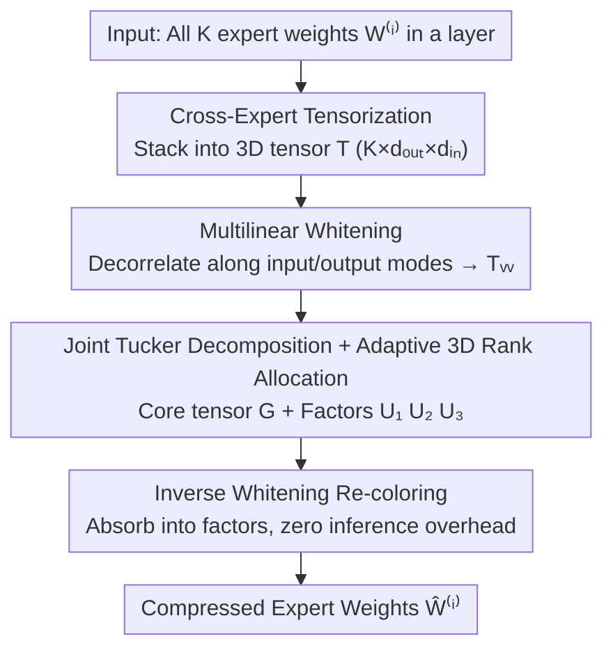

# TD-MoE: Tensor Decomposition for MoE Models

**Conference**: ICLR 2026  
**OpenReview**: [https://openreview.net/forum?id=D9cnZNZfxX](https://openreview.net/forum?id=D9cnZNZfxX)  
**Code**: None  
**Area**: Model Compression  
**Keywords**: MoE Compression, Tensor Decomposition, Tucker Decomposition, Inter-expert Redundancy, Whitening

## TL;DR
TD-MoE stacks all expert weights in an MoE layer into a three-dimensional tensor for joint Tucker decomposition, combined with multilinear whitening and adaptive 3D rank allocation. This captures "inter-expert structural redundancy" ignored by expert-wise methods, achieving nearly lossless performance at 20% compression and outperforming SVD-based SOTA by 11%~14% at 40%/60% compression.

## Background & Motivation
**Background**: Mixture-of-Experts (MoE) is a key mechanism for scaling LLMs to trillions of parameters—routing each token to only a few experts keeps compute manageable, but all expert weights must reside in VRAM, leading to massive memory overhead. To compress MoE, mainstream approaches include pruning, merging, quantization, and low-rank decomposition. Among these, **decomposition-based methods** are favored because they factorize dense weights into low-rank components without changing the architecture or routing, offering natural scalability. Representative works like MoE-SVD perform SVD on each expert's weight matrix, significantly reducing parameters while maintaining accuracy.

**Limitations of Prior Work**: However, almost all existing decomposition methods (including MoE-SVD and MoE-I²) operate at the **granularity of individual experts**—treating each expert as an isolated weight matrix to be truncated. MoE-SVD even relies on a strong assumption that expert redundancy is primarily concentrated in a shared input projection space, while functional specialization occurs only in output mapping. This expert-wise isolation treats experts within the same layer, which should be highly related, as independent individuals.

**Key Challenge**: Experts in the same layer are jointly optimized on related distributions, meaning their weight patterns are inherently correlated with significant **inter-expert structural redundancy**. Expert-wise decomposition only exploits **intra-expert** low-rankness and fails to see the shared structure **between** experts. This leads to a sharp performance collapse at high compression rates—the trade-off between compression and performance remains far from optimal.

**Goal**: Design a unified compression framework that simultaneously exploits "intra-expert + inter-expert" redundancy without changing routing or requiring post-compression finetuning, while accurately hitting a target compression budget.

**Key Insight**: The authors observe that SVD is essentially a second-order special case of tensor decomposition. By **stacking the $K$ expert weight matrices** of one layer along a new dimension into a 3D tensor, higher-order decomposition can be applied to model both intra-expert structure and inter-expert correlation in a single unified object—a dimension invisible to expert-wise methods.

**Core Idea**: Reformulate MoE compression from "expert-wise decomposition" to "joint tensor decomposition"—tensor stacking + Tucker decomposition + whitening + adaptive rank allocation. This approach uses a data-aware method to elegantly reduce inter-expert redundancy without making hard expert pruning or merging decisions.

## Method

### Overall Architecture
TD-MoE addresses the issue that "expert-wise decomposition misses inter-expert redundancy" by jointly compressing all expert weights in a layer as a **single 3D tensor**. Given a layer with $K$ expert weight matrices $W^{(i)}\in\mathbb{R}^{d_{out}\times d_{in}}$, the process consists of four serial steps: first, stack them along the expert dimension to form tensor $\mathcal{T}\in\mathbb{R}^{K\times d_{out}\times d_{in}}$; second, perform whitening on the input/output modes using statistics calculated from calibration data to obtain a well-conditioned tensor $\mathcal{T}_w$; third, apply Tucker decomposition to $\mathcal{T}_w$ to obtain a compact core tensor $\mathcal{G}$ and three factor matrices, with their rank triplet determined by an adaptive allocation scheme that satisfies a global compression budget; finally, absorb the inverse whitening matrices into the factors to complete "re-coloring," reconstructing the compressed expert weights. The entire process is performed offline, incurring zero extra overhead during inference and maintaining original routing behavior.

### Key Designs

**1. Cross-Expert Tensorization: Stacking Experts into a 3D Tensor to Expose Inter-Expert Redundancy**

This step addresses the fundamental pain point of "expert-wise isolation." Instead of decomposing each expert independently, the authors stack $K$ expert matrices along a new "expert mode" to form a 3D tensor $\mathcal{T}\in\mathbb{R}^{K\times d_{out}\times d_{in}}$—where mode-1 indices experts, mode-2 represents output features, and mode-3 represents input features. This seemingly simple rearrangement unifies the scattered set of experts into a single object, allowing the subsequent decomposition to **simultaneously** model intra-expert structure and inter-expert correlation. The essential difference from pruning/merging is that while pruning/merging requires hard discrete decisions ("which expert to keep/merge/drop"), tensorization hands the expert-mode redundancy to the decomposition to be compressed in a **data-driven, continuous** manner. Experts are neither deleted nor forced together; instead, they are encoded into a low-dimensional "expert mode factor." notably, while past uses of tensor decomposition in CNN/RNN reshaped single weight matrices into higher-order tensors, MoE experts are naturally a group of independent matrices, making stacking along the expert dimension a more natural higher-order organization that exposes inter-expert redundancy.

**2. Multilinear Whitening: Decorrelating Features Before Decomposition for Balanced Low-rank Approximation**

Decomposition directly on raw expert weights performs poorly because input activations are often highly correlated and the feature space is ill-conditioned. In such cases, the singular values of each $W^{(i)}$ do not faithfully reflect their true contribution to model behavior, leading to poor truncation decisions. The authors generalize 2D whitening to the tensor scenario: using a calibration set $D_{calib}$ to collect input activations $X$ and output gradients $\nabla_Y L$, they calculate input/output covariances $\Sigma_{in}=\frac{1}{N}X^TX$ and $\Sigma_{out}=\frac{1}{N}(\nabla_Y L)^T(\nabla_Y L)$. Then, they take the regularized square root inverse $S_{in}=(\Sigma_{in}+\epsilon I)^{-1/2}$ and $S_{out}=(\Sigma_{out}+\epsilon I)^{-1/2}$, and multiply the tensor along its input and output modes to obtain the whitened tensor:

$$\mathcal{T}_w = \mathcal{T}\times_2 S_{out}\times_3 S_{in}.$$

Unlike previous 2D whitening that only handled single matrices, this multilinear whitening can simultaneously (or separately) decorrelate input and output modes and explicitly adapt to input or output statistics. Ablation data is compelling: before whitening, the activation covariance spectrum is extremely ill-conditioned, with eigenvalues spanning nearly four orders of magnitude (e.g., from 9 to $5.4\times10^4$ in layer 9); after whitening, all eigenvalues converge to 1.0 with a deviation of less than $10^{-7}$. The off-diagonal correlation of 0.63~0.79 before whitening is also almost completely eliminated. The well-conditioned tensor makes Tucker truncation more stable, a key prerequisite for data-aware compression.

**3. Adaptive 3D Rank Allocation: Using Closed-form Solutions to Match Rank Triplets Precisely to Target Compression Rates**

Tucker decomposition approximates the tensor as the product of a core tensor $\mathcal{G}$ and three factor matrices $U_1\in\mathbb{R}^{K\times r_1}$, $U_2\in\mathbb{R}^{d_{out}\times r_2}$, and $U_3\in\mathbb{R}^{d_{in}\times r_3}$. The rank triplet $(r_1,r_2,r_3)$ simultaneously determines both the compression rate and reconstruction fidelity. Here, the three factors have clear interpretations in the MoE context: $U_1$ acts as $r_1$ "meta-experts" specifically compressing inter-expert redundancy; $U_2$ and $U_3$ define low-dimensional output/input subspaces. The total parameters after compression are $P_{tucker}=r_1r_2r_3+(Kr_1+d_{out}r_2+d_{in}r_3)$, compared to the original $P_{orig}=Kd_{out}d_{in}$. The problem is that searching for rank combinations in a 3D space is too costly. The authors provide a closed-form constraint: fixed $(r_1,r_2)$, the $r_3$ that satisfies the target compression rate $\rho^*$ can be directly solved from the budget equation:

$$r_3=\frac{(1-\rho^*)P_{orig}-(Kr_1+d_{out}r_2)}{r_1r_2+d_{in}},$$

and then projected to the valid range $1\le r_3\le d_{in}$. This reduces the 3D search to a 2D scan over $(r_1,r_2)$ with a 1D closed-form update for $r_3$, efficiently finding the rank triplet that "best fits the target model size" under strict parameter budgets, allowing any target compression rate to be accurately implemented.

**4. Inverse Whitening Re-coloring: Absorbing Whitening into Factors for Zero Inference Overhead**

While whitening improves decomposition quality, explicitly performing whitening/inverse whitening during inference would introduce extra compute. The authors' solution is to absorb the inverse whitening transformation directly into the Tucker factors: the original expert tensor can be recovered as $\mathcal{T}\approx\mathcal{G}\times_1 U_1\times_2(S_{out}^{-1}U_2)\times_3(S_{in}^{-1}U_3)$. Thus, during deployment, the "pre-colored" factors $U'^{(1)}=U_1$, $U'^{(2)}=S_{out}^{-1}U_2$, and $U'^{(3)}=S_{in}^{-1}U_3$ are stored directly. Whitening and re-coloring are entirely completed during the offline decomposition stage, so inference uses standard low-rank factors with zero runtime overhead. Combined with a randomized Tucker implementation, the single-step complexity is $O(d_{out}d_{in}r)$, decoupled from the number of experts $K$; whereas expert-wise SVD requires $E\cdot O(d_{out}d_{in}\min(d_{out},d_{in}))$, growing linearly with $K$. As expert counts increase, TD-MoE's scalability advantage becomes more pronounced.

### Loss & Training
TD-MoE is a **strictly post-training** method and does not perform any finetuning. The optimization goal is to maintain the original model's activation behavior over the calibration distribution:

$$\min_{\{\hat W^{(i)}\}}\ \mathbb{E}_{x\sim D_{calib}}\Big[\textstyle\sum_{i=1}^{K}\|W^{(i)}x-\hat W^{(i)}x\|_2^2\Big],$$

which is transformed into the Tucker reconstruction error under the Frobenius norm on the whitened tensor: $\min_{\mathcal{G},U_1,U_2,U_3}\|\mathcal{T}_w-\mathcal{G}\times_1 U_1\times_2 U_2\times_3 U_3\|_F^2$. In practice, 256 samples from WikiText-2 are used to calculate whitening statistics. Covariance eigenvalues below $10^{-3}$ are truncated for numerical stability. For Qwen2-57B-A14B, a full 3-mode decomposition is used, while for Mixtral-8×7B, a "preserve expert mode" scheme is used for a fair comparison with MoE-SVD.

## Key Experimental Results

### Main Results
Evaluated on Qwen2-57B-A14B (8+64 experts) and Mixtral-8×7B (8 experts), covering 7 common sense reasoning benchmarks and 3 language modeling perplexity datasets, all without finetuning. The table below shows the average accuracy for common sense reasoning (output-whitening variant):

| Model | Compression | Original | MoE-SVD | TD-MoE | Gain (Rel.) |
|------|--------|------|---------|--------|----------|
| Qwen2-57B-A14B | 20% | 0.59 | 0.56 | 0.58 | ↑4% |
| Qwen2-57B-A14B | 40% | 0.59 | 0.48 | 0.56 | ↑6%~17%* |
| Qwen2-57B-A14B | 60% | 0.59 | 0.47 | 0.51~0.52 | ↑11% |
| Mixtral-8×7B | 20% | 0.63 | 0.58 | 0.62 | ↑7% |
| Mixtral-8×7B | 40% | 0.63 | 0.50 | 0.57 | ↑14% |
| Mixtral-8×7B | 60% | 0.63 | 0.37 | 0.45 | ↑22%(input) |

*For 40%, the paper reports relative improvements of 6% in accuracy and 17% in perplexity (different metrics). Perplexity results are also leading; for Mixtral at 40% compression, TD-MoE(output) achieves WikiText2/PTB/C4 = 5.79/24.60/9.21, significantly better than MoE-SVD's 6.74/27.73/12.41. At 20% compression, the absolute drop compared to the original model for both models is < 1%, representing near-lossless performance.

### Ablation Study
| Configuration | Key Observation | Description |
|------|---------|------|
| Before vs. After Whitening (Table 2) | Eigenvalues from 4 orders of magnitude → all ≈1.0 (dev <$10^{-7}$) | Whitening flattens the ill-conditioned spectrum; off-diag correlation 0.63~0.79 → <$10^{-7}$ |
| + NF4 Quantization (Table 4) | 20% comp LM-PPL 9.81→9.70; inference Acc unchanged | Orthogonal and additive with quantization |
| + Structured Pruning (Table 4) | 20% comp pruned to 40% sparsity; Acc 0.66→0.61 smooth decline | Pruning by core slice energy in Tucker domain |
| Calib N / Truncation τ (Table 5) | N from 128→2k: ΔPPL≤0.03; τ over 4 orders: ΔPPL≤0.09 | Highly robust to hyperparameters |

### Key Findings
- **All three components are essential**: Joint cross-expert decomposition provides the ability to "see inter-expert redundancy," whitening ensures reliable truncation decisions, and rank allocation ensures accurate budget targets. Ablations show significant performance drops if any item is removed.
- **Input vs. Output whitening strengths**: Output-whitening is better at low compression rates (preserving principal directions of output distributions), while input-whitening is more stable at high compression (60%), suppressing the amplification of ill-conditioned input activations.
- **Scalability with experts**: Decomposition complexity $O(d_{out}d_{in}r)$ is decoupled from the number of experts, unlike expert-wise SVD which grows linearly with $K$. The scalability advantage is evident on the 64-expert Qwen2 model.
- **High Robustness**: It is nearly insensitive to calibration set size, truncation thresholds, or even corpus transfer (WikiText-2 → PTB), indicating that whitening allows the decomposition to work in a well-conditioned regime.

## Highlights & Insights
- **The value of perspective shift**: Reformulating "expert-wise decomposition" as "joint decomposition of stacked experts" exposes an invisible redundancy dimension—the $r_1$ "meta-experts" in $U_1$ are an elegant continuous encoding of inter-expert redundancy, avoiding the hard decisions of pruning/merging.
- **Practicality of closed-form rank allocation**: Reducing 3D rank search to a "2D scan + 1D closed-form solution" allows the method to precisely hit any target compression rate. This is very engineering-friendly for deployment (reversing configuration from a memory budget) and transferable to any Tucker/tensor compression scenario.
- **Whitening absorption = Zero inference overhead**: "Welding" the data-aware transformation into low-rank factors during the offline phase makes it a standard low-rank layer at deployment—this "offline absorption" trick can be reused in many compression methods requiring data calibration.
- **Orthogonality with quantization/pruning**: The Tucker domain is naturally suited for structured pruning based on core slice energy, which can then be combined with NF4 quantization for a composable compression pipeline.

## Limitations & Future Work
- **Dependency on calibration data**: Whitening statistics come from 256 WikiText-2 samples. Although shown to be robust to corpus transfer, performance under extreme distribution shifts has not been fully verified.
- **Slower decomposition phase**: Randomized Tucker is 1.3~2.2× slower than expert-wise SVD on Mixtral (though it is 2.5~4.6× faster on wider FFNs like Phi-3.5-MoE, and the entire process is offline and does not affect inference).
- **Significant drop at 60% high compression**: Despite being more resilient than baselines, all methods inevitably degrade at 60%, with accuracy dropping from 0.63 to 0.45~0.52, remaining some distance from practical use.
- **Unexplored handling of shared experts**: Whether the 8 shared experts in Qwen2 should be treated differently from the 64 standard experts is not explored in depth, which could be an area for further improvement.

## Related Work & Insights
- **vs. MoE-SVD**: MoE-SVD performs SVD per expert and assumes redundancy is concentrated in a "shared input projection space" while specialization is in output mapping—a strong and potentially inaccurate prior. TD-MoE makes no such assumptions and lets data decide how to compress inter/intra-expert redundancy via tensor decomposition, leading significantly at 40%/60% compression.
- **vs. MoE-I² / Pruning & Merging**: These methods rely on heuristics like similarity or activation frequency to make discrete "keep/merge/drop" decisions, which are complex and discrete. TD-MoE delegates expert-mode redundancy to factor matrix $U_1$ for continuous, data-driven reduction, resulting in smoother transitions.
- **vs. Classic Tensor Decomposition for CNN/RNN**: Previous methods reshaped single weight matrices into higher-order tensors (relying on the natural multi-dimensional structure of conv kernels). TD-MoE’s innovation lies in realizing that an MoE's "group of independent experts" is itself a stackable higher-order organization, and stacking along the expert dimension is the correct way to expose cross-expert redundancy.

## Rating
- Novelty: ⭐⭐⭐⭐⭐ Shifts MoE compression from expert-wise SVD to joint cross-expert Tucker decomposition; the perspective shift is clean and powerful.
- Experimental Thoroughness: ⭐⭐⭐⭐ Covered the two main MoEs + Phi-3.5, 10 tasks, multiple compression rates, and complete ablations for whitening/quantization/pruning/hyperparams; however, lacks end-to-end comparisons with some of the latest quantization/merging SOTA.
- Writing Quality: ⭐⭐⭐⭐ Formulas and diagrams are clear, and the motivations for the three components are well-explained; specific phrasing (like relative gain metrics) requires checking the tables for clarity.
- Value: ⭐⭐⭐⭐ No finetuning, no routing changes, zero inference overhead, and orthogonal to quantization/pruning—offers direct practical value for large-scale MoE deployment.

<!-- RELATED:START -->

## Related Papers

- [\[ICLR 2026\] LeSTD: LLM Compression via Learning-based Sparse Tensor Decomposition](lestd_llm_compression_via_learning-based_sparse_tensor_decomposition.md)
- [\[ICLR 2026\] KBVQ-MoE: KLT-guided SVD with Bias-Corrected Vector Quantization for MoE Large Language Models](kbvq-moe_klt-guided_svd_with_bias-corrected_vector_quantization_for_moe_large_la.md)
- [\[ICLR 2026\] REAP the Experts: Why Pruning Prevails for One-Shot MoE Compression](reap_the_experts_why_pruning_prevails_for_one-shot_moe_compression.md)
- [\[ICLR 2026\] Steering MoE LLMs via Expert (De)Activation](steering_moe_llms_via_expert_deactivation.md)
- [\[ICLR 2026\] MoBE: Mixture-of-Basis-Experts for Compressing MoE-based LLMs](mobe_mixture-of-basis-experts_for_compressing_moe-based_llms.md)

<!-- RELATED:END -->
