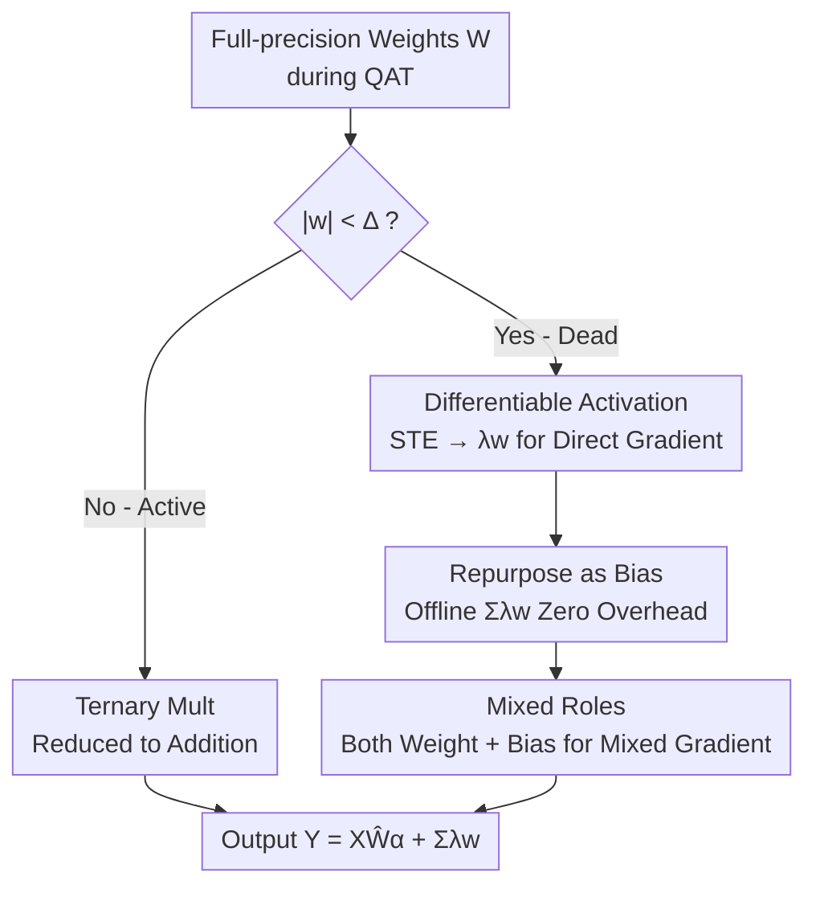

# Tequila: Trapping-free Ternary Quantization for Large Language Models

**Conference**: ICLR 2026  
**OpenReview**: [https://openreview.net/forum?id=9CZzD5LWdy](https://openreview.net/forum?id=9CZzD5LWdy)  
**Code**: https://github.com/Tencent/AngelSlim/tree/tequila/TernaryQuant  
**Area**: Model Compression  
**Keywords**: Ternary Quantization, Deadzone Trapping, Dynamic Bias, Quantization-Aware Training (QAT), Edge Deployment

## TL;DR
Addressing the issue in ternary quantization (compressing weights to $\{-1, 0, +1\}$) where many weights become "trapped" at the deadzone boundary and fail to receive effective gradients, this paper proposes Tequila. This method reactivates these "dead weights" as differentiable **dynamic biases**, allowing them to contribute signals in the forward pass and receive direct gradients in the backward pass. This improves accuracy on ARC by >4% over SOTA ternary methods with near-zero inference overhead, approaching full-precision performance (gap <1%) while achieving $3.0\times$ inference acceleration.

## Background & Motivation

**Background**: Quantization is the primary method for deploying LLMs on resource-constrained edge devices. However, most quantization methods (e.g., AWQ, GPTQ) rely on mixed-precision multiplication, requiring specialized hardware support found in server-grade GPUs, which is inefficient for edge hardware like smartphones or CPUs. Ternary quantization restricts weights to $\{-1, 0, +1\}$, reducing expensive multiplications to simple additions (accumulating inputs based on sign). Since most hardware natively supports this, it is an ideal path for on-device deployment.

**Limitations of Prior Work**: Ternary compression is highly aggressive, resulting in significant information loss. Even with cost-intensive Quantization-Aware Training (QAT) using massive amounts of data, it is difficult to match full-precision accuracy. BitNet required 4T tokens and still failed to reach full-precision levels; BitCPM4 required 100B tokens even starting from a pre-trained model. Consequently, ternary LLMs are hindered by both "accuracy degradation" and "explosive training costs."

**Key Challenge**: The authors identify the root cause as **deadzone trapping**. Ternary quantization creates a large deadzone between $(-\Delta, \Delta)$, where weights are quantized to 0. During training, these "dead weights" $\hat{w}_i=0$ are pruned in the forward pass, contributing nothing to the output $Y$ and loss $L$. As a result, the upstream gradient $\partial L/\partial Y$ is insensitive to them. Combined with the noise injected by the Straight-Through Estimator (STE), the gradients these weights receive are noisy and uninformative (extremely low GSNR). Consequently, they fail to escape the deadzone or oscillate at its boundary, leading to long-term "inactivation" of many weights and collapsing both model capacity and optimization efficiency.

**Goal**: To repurpose these dead weights to contribute forward signals and receive clean, effective gradients without sacrificing the hardware efficiency of "pure addition" ternary operations, thereby breaking the deadzone trap.

**Key Insight**: Rather than trying to "push" dead weights out of the deadzone (treating the symptoms), the authors suggest letting them participate in computation under a different identity. They observe that as long as dead weights contribute even a small but informative value to the output, the backward gradient path is established.

**Core Idea**: Repurpose weights in the deadzone as **dynamic biases**. They provide a continuous signal to the output as a bias in the forward pass and receive direct, informative gradients in the backward pass. Since this bias depends only on the weights and is independent of the input, it can be pre-computed offline and merged into the kernel, resulting in near-zero inference overhead.

## Method

### Overall Architecture

Tequila is not a entirely new quantizer but a **plug-and-play optimization module** built on top of existing ternary quantization (e.g., AbsMean / AbsMedian). Its mechanism evolves from "naive ternary" to the final solution in steps: first using **Minima Reactivation** to verify that activating dead weights is viable (noting that gradients still rely on noisy STE and bias depends on input); then using **Differentiable Activation** to replace STE with clean gradients; then **Offlining** the activation into pure bias to eliminate inference overhead; and finally using **Mixed Roles** to let dead weights serve as both weights and biases to gain both input information and direct gradients. The final forward pass is formulated as:

$$Y = X Q(W) + C(W) = X\hat{W}\alpha + \sum_{i\in D}\lambda w_i,$$

where $Q(W)$ is the standard ternary matrix multiplication (reduced to additions), and $C(W)=\sum_{i\in D}\lambda w_i$ is the bias contributed by the deadzone weights, effectively adding a residual-like connection for dead weights. $D$ is the set of indices for deadzone weights, and $\lambda$ is the activation coefficient (default $10^{-3}$).

### Key Designs

**1. Differentiable Activation: Replacing STE with $\lambda w_i$ scaling for a clean gradient path**

In naive ternary quantization, dead weights rely on STE for gradient estimation, which is essentially a crude approximation for the non-differentiable $\text{sign}(\cdot)$ operation, leading to high noise and unstable training. Minima Reactivation activates dead weights as signed constant minimal values $0^-/0^+$ (mapping any input $x$ to $\pm\varepsilon$), which provides forward signals and raises GSNR, but the $\text{sign}(\cdot)$ gradient still uses STE, yielding only marginal gains. Tequila replaces "mapping to constant $\pm\varepsilon$" with "linear scaling by $\lambda w_i$." The forward pass becomes:

$$Y \approx \alpha\sum_{i\in\bar D}\text{sign}(w_i)x_i + \lambda\sum_{i\in D}\text{sign}(x_i)w_i,$$

This activation function is smoothly differentiable with respect to $w_i$, **bypassing STE**. Dead weights thus receive direct gradients proportional to the downstream loss, leading to clearer optimization directions and more stable training.

**2. Repurposing as Bias: Approximating online input-dependent terms as offline pure biases for near-zero overhead**

The activation term $\lambda\sum_{i\in D}\text{sign}(x_i)w_i$ in Design 1 depends on input $x$, requiring calculation during every forward pass, which adds significant inference overhead. Tequila approximates this as an input-independent pure bias: $\lambda\sum_{i\in D}\text{sign}(x_i)w_i \approx \lambda\sum_{i\in D}w_i$. This is justified by two points: first, it remains faithful to the goal of letting dead weights contribute to the output, and bias is a perfect activation-free contribution; second, empirical evidence shows that the original input-dependent bias vector and the simplified pure bias vector maintain a cosine similarity $>70\%$ during training. This pure bias depends only on weights and can be **pre-computed offline and merged into the inference kernel**. The additional computational cost is $<0.1\%$, preserving the hardware efficiency of "pure addition" ternary operations.

**3. Mixed Roles: Weights as both Weights and Biases for mixed gradients with input information and clean signals**

If dead weights become pure biases $\sum_{i\in D}\lambda w_i$, gradients become clean, but valuable input-dependent information is lost (as the bias lacks $x$). Tequila allows activated dead weights to play dual roles: as dynamic biases in $C(W)$ and as participants in the ternary matrix multiplication. Thus, the gradient received is a superposition of two paths—the standard ternary path (with input) and the direct bias path (clean signal):

$$\frac{\partial L}{\partial w_i} = x_i\frac{\partial L}{\partial Y} + \lambda\frac{\partial L}{\partial Y}, \quad \forall i\in D.$$

Mixed gradients retain input information while benefiting from direct, informative gradient signals, which is more effective for optimization than a "pure bias" approach. Ablations show this design provides the largest contribution ($+1.9\%$). Through these three designs, Tequila maintains high and stable GSNR throughout training, achieving "trapping-free" optimization.

### Loss & Training
The training follows standard QAT: maintaining a full-precision copy of weights to accumulate gradients, using the ternary quantization function $Q(\cdot)$ (AbsMean, $\alpha=\frac{1}{n}\sum|w_i|$, $\Delta=\alpha/2$) for the forward pass, and backpropagating through full-precision gradients. Tequila simply adds the bias term $C(W)$ in the forward pass and modifies the backward gradient for deadzone weights without introducing new loss functions. Default $\lambda=10^{-3}$, learning rate $10^{-4}$, group size 128. QAT is performed using 10B tokens sampled from UltraFineWeb, quantizing all linear layers within the transformer.

## Key Experimental Results

### Main Results
On LLaMA-3.2-1B/3B, using 10B tokens for QAT, compared against various ternary quantization methods (average of six zero-shot benchmarks):

| Model | Method | ARC-e | ARC-c | Average |
|-------|--------|-------|-------|---------|
| 1B | BF16 (Reference) | 0.654 | 0.313 | 0.502 |
| 1B | AbsMean (SOTA Static) | 0.603 | 0.259 | 0.445 |
| 1B | **Ours+AbsMedian** | 0.645 | 0.308 | **0.477** |
| 3B | BF16 (Reference) | 0.745 | 0.422 | 0.580 |
| 3B | AbsMean (SOTA Static) | 0.672 | 0.329 | 0.510 |
| 3B | **Ours+AbsMean** | 0.702 | 0.346 | **0.530** |

Tequila outperforms all baselines on both 1B/3B models, with average gains $>2.6\%$; on ARC-e/ARC-c, the improvement is $>4\%$, reducing the gap with BF16 to $<1\%$.

Direct comparison with other established ternary LLMs (different training token budgets, average of 5 benchmarks):

| Model | Size | #Tokens | Average |
|-------|------|---------|---------|
| BitNet | 3B | 4T (est) | 0.527 |
| Spectra | 3.9B | 100B | 0.567 |
| **TequilaLLM** | 3B | **10B** | **0.576** |

TequilaLLM-3B achieves a $0.9\%$ higher average score than SOTA Spectra-3.9B using only 10% of the training tokens, while converging faster.

### Ablation Study
Decomposition for the 1B model on ARC-Easy (Baseline AbsMean 60.3%):

| Configuration | Accuracy | Description |
|---------------|----------|-------------|
| AbsMean | 60.3% | All activations disabled |
| Minima Reactivation | 61.5% | Activates forward signal only; gradient still uses STE (+1.2%) |
| Tequila w/o Mixed Gradients | — | Adds differentiable activation; dead weights as pure bias (+1.1%) |
| Tequila (Full) | 64.5% | Adds mixed gradients (+1.9%) |

### Key Findings
- **Mixed gradients contribute the most (+1.9%)**: This indicates that letting dead weights hold "Weight + Bias" dual roles to receive mixed gradients is more effective than acting as pure biases with a single gradient path.
- **Differentiable Activation > STE (+1.1%)**: Bypassing STE for direct backpropagation alleviates the deadzone trap better than mapping to constant minima.
- **Static quantization outperforms learnable quantization**: Methods like LSQ/SEQ/DLT generally perform worse than static methods like AbsMean—more learnable parameters slow down convergence and are prone to local optima, confirming the preference for static AbsMean in open-source ternary LLMs.
- **$\lambda$ Sensitivity**: The activation coefficient $\lambda$ is robust within a wide range, defaulting to $10^{-3}$; values too large or too small lead to performance drops.
- **Zero Inference Overhead**: Bias terms are pre-computed offline, with additional costs $<0.1\%$, achieving $3.0\times$ speedup on CPUs, consistent with pure ternary BitNet performance.

## Highlights & Insights
- **Turning "Defects" into "Resources"**: The deadzone was previously viewed as an inherent source of loss in ternary quantization; this paper repurposes those dead weights as dynamic biases. Changing their identity transforms them from "optimization burdens" to "capacity and gradient enhancers."
- **Offline Bias as the "Magic Touch"**: By using the empirical approximation "input-dependent bias $\approx$ pure bias (cosine similarity $>70\%$)," online overhead is reduced to an offline constant. This is key to achieving "zero overhead" while maintaining performance.
- **GSNR as a Diagnostic Tool**: Using Gradient Signal-to-Noise Ratio to quantify how "noisy" dead weight gradients are turns the abstract concept of "deadzone trapping" into an observable curve, streamlining diagnosis and validation.
- **Transferability**: The plug-and-play design can be applied to most ternary quantization schemes. The idea of using differentiable residual bypasses to provide gradients for suppressed parameters might extend to other extreme quantization or sparsity scenarios.

## Limitations & Future Work
- The bias approximation (input-dependent $\rightarrow$ pure bias) relies on the empirical observation of $>70\%$ cosine similarity. Whether this holds for deeper/larger models or different data distributions lacks theoretical guarantees.
- Experiments were mainly conducted at the 1B–4B scale with a 10B token budget; whether the deadzone trapping behavior and the benefits of this solution persist for larger models or longer training remains to be tested.
- While the bias term has zero inference overhead, the dual roles during training mean each deadzone weight follows an extra gradient path, slightly increasing training computation/memory (not quantified in the paper).
- $\lambda$ is a global fixed hyperparameter. Exploring whether it should be adaptive per layer/channel (given varying deadzone ratios) could be beneficial.

## Related Work & Insights
- **vs. Naive Ternary (TWN / AbsMean / BitNet)**: These methods allow dead weights to remain inactive and rely on STE for gradient estimation, leading to oscillations at the deadzone boundary. Tequila activates dead weights as differentiable dynamic biases, providing direct gradients and approaching full precision with an order of magnitude fewer training tokens.
- **vs. Minima Reactivation (Intermediate baseline)**: MR maps dead weights to signed constants $\pm\varepsilon$, providing forward signals, but gradients still use STE, and the bias is input-dependent. Tequila replaces constants with differentiable scaling $\lambda w$ and offlines the bias, solving both "noisy gradients" and "slow inference."
- **vs. Learnable Quantization (LSQ / SEQ / DLT)**: These treat $\alpha/\Delta$ as trainable parameters but converge slowly and hit local optima. Tequila does not change the quantization threshold but addresses optimization dynamics (deadzone gradients), serving as an orthogonal and complementary approach.

## Rating
- Novelty: ⭐⭐⭐⭐⭐ Repurposing deadzone weights as differentiable dynamic biases with zero offline overhead is a novel perspective.
- Experimental Thoroughness: ⭐⭐⭐⭐ Extensive multi-model/benchmark evaluations + ablations + GSNR/convergence/inference analysis, though the scale is capped at 4B.
- Writing Quality: ⭐⭐⭐⭐⭐ Logical flow from diagnosis of the deadzone trap to the three-step evolution is clear; figures and formulas are well-integrated.
- Value: ⭐⭐⭐⭐⭐ Achieving near full-precision performance with $10\%$ of tokens and $3\times$ speedup has high practical value for edge deployment.

<!-- RELATED:START -->

## Related Papers

- [\[ICLR 2026\] MicroMix: Efficient Mixed-Precision Quantization with Microscaling Formats for Large Language Models](micromix_efficient_mixed-precision_quantization_with_microscaling_formats_for_la.md)
- [\[ICLR 2026\] Quant-dLLM: Post-Training Extreme Low-Bit Quantization for Diffusion Large Language Models](quant-dllm_post-training_extreme_low-bit_quantization_for_diffusion_large_langua.md)
- [\[ICLR 2026\] QWHA: Quantization-Aware Walsh-Hadamard Adaptation for Parameter-Efficient Fine-Tuning on Large Language Models](qwha_quantization-aware_walsh-hadamard_adaptation_for_parameter-efficient_fine-t.md)
- [\[ICLR 2026\] KBVQ-MoE: KLT-guided SVD with Bias-Corrected Vector Quantization for MoE Large Language Models](kbvq-moe_klt-guided_svd_with_bias-corrected_vector_quantization_for_moe_large_la.md)
- [\[ACL 2025\] Spectra 1.1: Scaling Laws and Efficient Inference for Ternary Language Models](../../ACL2025/model_compression/scaling_laws_and_efficient_inference_for_ternary_language_models.md)

<!-- RELATED:END -->
