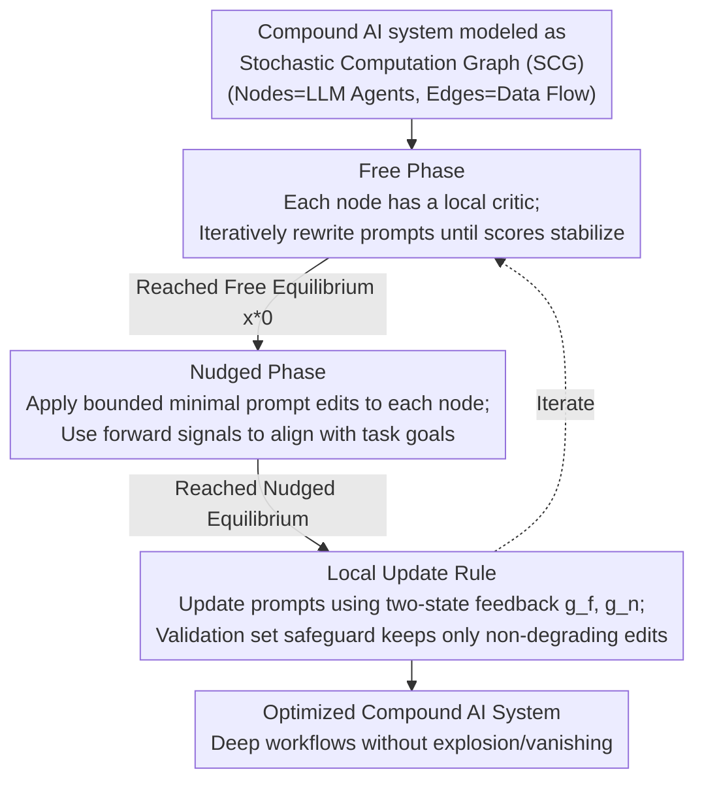

# Textual Equilibrium Propagation for Deep Compound AI Systems

**Conference**: ICLR 2026  
**arXiv**: [2601.21064](https://arxiv.org/abs/2601.21064)  
**Code**: Not disclosed  
**Area**: Model Compression / Compound AI System Optimization  
**Keywords**: Compound AI Systems, Textual Gradients, Equilibrium Propagation, Prompt Optimization, Multi-agent Workflows

## TL;DR

Ours proposes Textual Equilibrium Propagation (TEP), an optimization method for compound AI systems based on local learning principles. Through a two-phase design consisting of a Free Phase and a Nudged Phase, it avoids the gradient explosion/vanishing problems inherent in global textual backpropagation, significantly outperforming TextGrad on deep workflows.

## Background & Motivation

Modern compound AI systems consist of multiple modules (retrievers, tools, verifiers, etc.) working collaboratively, necessitating end-to-end optimization of the entire pipeline. TextGrad pioneered "Automatic Differentiation via Text," utilizing an LLM-as-judge to backpropagate textual feedback from downstream to upstream to update prompts.

However, as system depth increases, TextGrad faces two critical failure modes:

**Textual Gradient Explosion**: Feedback accumulates across layers, and message length grows exponentially ($\mathbb{E}[B(g_u)] \geq c\gamma^k, \gamma > 1$), eventually exceeding the LLM's context window. Furthermore, LLM-as-judge biases compound and amplify along the chain.

**Textual Gradient Vanishing**: When feedback is compressed to control length, specific actionable information is progressively lost ($\mathbb{E}[S(g_u)] \leq C\alpha^k, \alpha \in (0,1)$). Feedback received by upstream modules becomes vague, useless suggestions like "improve efficiency."

The fundamental cause of these problems is that global textual backpropagation is not scalable in deep compound AI systems.

## Method

### Overall Architecture

TEP addresses the issue where textual feedback chains from the terminal loss explode or vanish as compound AI systems grow deeper. It models the system as a Stochastic Computation Graph (SCG) $G=(V,E)$—where nodes are LLM agents and edges are data flows. The optimization goal is $J(\theta) = \mathbb{E}_{o \sim D_{\text{task}}} \mathbb{E}_{Z \sim P_\theta(\cdot | o)} [\ell(o, Z)]$. Borrowing from Equilibrium Propagation in energy-based models, it replaces the backpropagation chain with two "forward convergences": first, nodes reach a local equilibrium (Free Phase); then, a nudge aligned with the task objective shifts the system to a second equilibrium (Nudged Phase). Finally, prompts are updated using local feedback derived from these two states (Local Update Rule), iterating until stability is reached. Throughout the chain, feedback cycles only within individual nodes, keeping lengths naturally bounded.

### Key Designs

**1. Free Phase: Allowing each node to converge to local optima**

This addresses the first step where TextGrad feedback must propagate from the final loss, leading to cumulative loss of control in deep systems. TEP instead assigns each node $v$ a **local LLM critic**, which uses a structured rubric $\theta_v^{\text{critic}}$ (evaluating both task-agnostic quality metrics like clarity/completeness/consistency and task-related performance) and a sampling temperature $\theta_v^{\text{temp}} \sim \mathcal{U}(0.3, 0.9)$ to evaluate only the node's own output. It generates feedback $g_v = C(z_v, \theta_v^{\text{critic}})$, **completely independent of downstream gradients** $g'$. Nodes iteratively rewrite prompts based on this until scores stabilize across rounds, reaching a local "Free Equilibrium State" $x_\star^0(\theta)$. Since feedback stays within individual nodes, its length is naturally bounded.

**2. Nudged Phase: Using forward signals to align local optima with global goals**

Pure local convergence ensures self-consistency but may lead nodes to isolated optima that do not coordinate into a coherent global solution. Built upon the free equilibrium, TEP applies a **bounded proximal prompt edit** to each node. This edit strengthens local rubrics aligned with global task objectives. The key is that this alignment direction is introduced via **forward signals** (rather than a backward feedback chain), and the modification intensity is bounded to maintain the local optima achieved in the Free Phase. The system runs again with these nudges and iterates to a "Nudged Equilibrium State." The difference between the two states provides the usable learning signal for the task objective.

**3. Local Update Rule: Updating prompts via two-state feedback with validation safeguards**

With two equilibrium states, each node updates according to $\theta_v' = U_v(g_v^f, g_v^n, \theta_v)$, where $g_v^f$ and $g_v^n$ are the feedback signals from the Free Phase and Nudged Phase, respectively (both constrained in length and quality). $U_v$ is an LLM-defined update operator that maps these feedbacks into new prompt edits. This mirrors the classic Equilibrium Propagation idea of "approximating gradients with the difference between free and nudged states," though TEP has the LLM rewrite text by synthesizing both feedbacks rather than taking a numerical difference. Each update step is backed by **validation set selection**, retaining only edits that do not decrease validation performance to prevent critic bias from being erroneously solidified.

### Loss & Training

TEP does not use explicit numerical losses; instead, it optimizes implicitly via local LLM ratings and validation performance. It imposes two constraints on feedback corresponding to the failure modes: bounded length $B(g) \ll \text{context limit}$ (anti-explosion) and maintained quality $S(g) \geq \tau$ (anti-vanishing). Training involves approximately 20 iterations for the Free Phase and 40 for the Nudged Phase, treating black-box LLM components as modular units without requiring access to model parameters.

## Key Experimental Results

### Main Results

| Method | PubMedQA (Acc.) | STARK-PRIME (MRR) | HotpotQA (F1) | BigCodeBench (Pass) |
|------|----------------|-------------------|---------------|---------------------|
| CoT | 57.34±1.12 | 39.76±0.84 | 33.92±0.76 | 34.15±1.43 |
| DSPy | 60.26±0.40 | 41.40±0.04 | 44.90±0.32 | 33.81±2.75 |
| TextGrad | 56.96±2.24 | 41.31±1.67 | 24.86±1.19 | 35.71±0.10 |
| TextGrad+Sum | 56.12±1.85 | 40.72±1.21 | 24.12±1.25 | 35.12±0.67 |
| **TEP** | **62.02±1.31** | **42.72±0.65** | **48.72±1.32** | **38.97±0.39** |

TEP achieves the best performance across all four tasks, with an 8.1% improvement over the runner-up on HotpotQA and a 3.4% improvement on BigCodeBench.

### Ablation Study

| Configuration | HotpotQA F1 | BigCodeBench Pass@1 |
|------|-------------|---------------------|
| Full TEP | 48.72 | 38.97 |
| W/O Nudged Phase | 22.3 (-26.4) | Significant drop |
| W/O Free Phase | 36.8 (-11.9) | 36.3 (-2.7) |

Removing the Nudged Phase leads to severe degradation (a 26.4 point drop on HotpotQA), indicating that pure local equilibrium is insufficient for system-wide coordination. Removing the Free Phase also has a significant impact, as it provides a high-quality starting point for effective nudging.

### Key Findings

- **Depth Scaling Experiments**: TextGrad's feedback token count grows from 2K at scale=1 to 32K+ at scale=5 (exponential growth of approx. $2.2^s$); TEP maintains nearly constant token complexity.
- **Effective Update Rate**: The effective update rate for TextGrad+Sum drops from 36% to 5%, while TEP only experiences a slight decline from 37% to 33%.
- **De-optimization**: On GPQA, TEP reaches 44.5% (TextGrad 41.0%), and on Object Counting, it reaches 81.6% (TextGrad 74.2%).

## Highlights & Insights

1. **Precise Analogy**: Maps gradient issues in deep neural networks to textual feedback problems in compound AI systems, providing rigorous formal definitions (Textual Gradient Explosion and Vanishing).
2. **Bio-inspired**: Adapts Equilibrium Propagation from energy-based models to the textual space, representing an excellent case of cross-domain method transfer.
3. **High Practicality**: Maintains modular design for black-box LLM components without needing access to model parameters, making it applicable to any LLM combination.
4. **Increasing Advantage with Depth**: Unlike TextGrad, TEP's performance gains expand as the workflow depth increases.

## Limitations & Future Work

- The 20 Free Phase iterations and 40 Nudged Phase iterations introduce additional computational overhead.
- Scoring rubrics for local critics require manual design; different tasks may need different rubrics.
- Validation was only performed on fixed SCG structures, without exploring dynamic graph optimization.
- There is a lack of automated methods for selecting hyperparameters for nudge intensity.

## Related Work & Insights

- **TextGrad** (Yuksekgonul et al., 2025): Pioneer of global textual backpropagation.
- **DSPy** (Khattab et al., 2024): A framework for programmatic prompt compilation.
- **OPTIMAS** (Wu et al., 2025): Local training rewards but requires parameter fine-tuning.
- **Self-Refine** (Madaan et al., 2023): Iterative self-improvement.
- **Equilibrium Propagation** (Scellier & Bengio, 2017): Local learning principles for energy-based models.

## Rating

- Novelty: ⭐⭐⭐⭐ (Innovative analogy of Equilibrium Propagation to textual space)
- Theoretical Depth: ⭐⭐⭐⭐ (Rigorous definition of textual gradient failure modes and convergence proof)
- Experimental Results: ⭐⭐⭐⭐ (4 benchmarks + depth scaling analysis + ablation studies)
- Practicality: ⭐⭐⭐⭐ (Model-agnostic, applicable to arbitrary LLM pipelines)

<!-- RELATED:START -->

## Related Papers

- [\[ICLR 2026\] Automated Stateful Specialization for Adaptive Agent Systems](automated_stateful_specialization_for_adaptive_agent_systems.md)
- [\[ICLR 2026\] BEP: A Binary Error Propagation Algorithm for Binary Neural Networks Training](bep_a_binary_error_propagation_algorithm_for_binary_neural_networks_training.md)
- [\[ICLR 2026\] Rejuvenating Cross-Entropy Loss in Knowledge Distillation for Recommender Systems](rejuvenating_cross-entropy_loss_in_knowledge_distillation_for_recommender_system.md)
- [\[ICLR 2026\] Paper Copilot: Tracking the Evolution of Peer Review in AI Conferences](paper_copilot_tracking_the_evolution_of_peer_review_in_ai_conferences.md)
- [\[ICLR 2026\] Bridging Kolmogorov Complexity and Deep Learning: Asymptotically Optimal Description Length Objectives for Transformers](bridging_kolmogorov_complexity_and_deep_learning_asymptotically_optimal_descript.md)

<!-- RELATED:END -->
