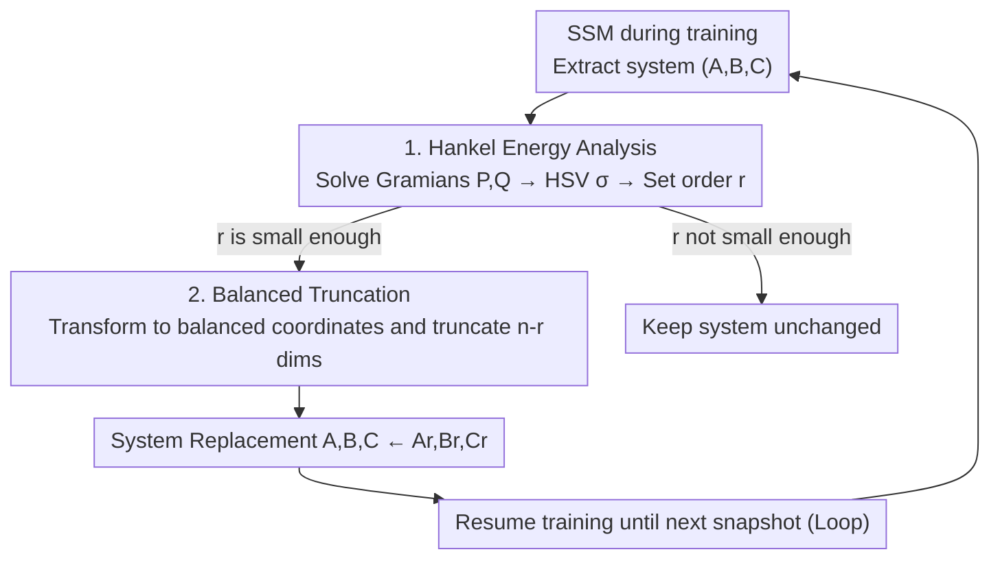

# The Curious Case of In-Training Compression of State Space Models

**Conference**: ICLR 2026  
**OpenReview**: [https://openreview.net/forum?id=LtzmeSMBTW](https://openreview.net/forum?id=LtzmeSMBTW)  
**Code**: https://github.com/camail-official/compressm  
**Area**: Model Compression  
**Keywords**: State Space Models, Balanced Truncation, Hankel Singular Values, In-Training Compression, Model Order Reduction

## TL;DR
This paper proposes COMPRESSM, which introduces "Balanced Truncation + Hankel Singular Value (HSV) analysis" from control theory into the training process of SSMs. By identifying and discarding state dimensions with low contribution to input-output mapping early in training, the model "starts big and shrinks during training," accelerating training while preserving critical structures that are lost when training small models from scratch.

## Background & Motivation

**Background**: State Space Models (SSMs, such as S4, LRU, and Mamba) have emerged as strong contenders for long-sequence modeling due to their parallelizable training and RNN-like inference speed. The core is a linear dynamical system $h(k{+}1)=Ah(k)+Bx(k),\ y(k)=Ch(k)+Dx(k)$, where the update cost scales with the state dimension $n$.

**Limitations of Prior Work**: The computational cost of SSMs is amplified by the state dimension $n$. Reducing $n$ is a direct way to save memory and time. However, existing structured compression methods—Knowledge Distillation, Post-Training Quantization, low-rank decomposition, and structured pruning—are almost exclusively performed **after training**. This means the expensive pre-training cost of the large model cannot be avoided.

**Key Challenge**: There is a trade-off between expressivity and computational cost. Directly training a model with a small state dimension is efficient but often fails to capture "task-critical structures" that only large models can learn, leading to significant performance degradation. To achieve high performance, one must typically pay for training a large model twice: once for pre-training and once for compression.

**Goal**: The objective is to reduce the state dimension **during the training process** rather than after, allowing the model to "benefit from the early expressivity of a large model while saving the computational cost of the remaining 90% of training."

**Key Insight**: The authors return to the control-theoretic roots of SSMs. Control theory provides a mature toolset—Hankel Singular Values (HSV)—to measure the "energy/importance" of each state direction. Balanced truncation can reduce a high-dimensional system to a low-dimensional one with provable error guarantees. A crucial observation is that the Hankel singular values of SSMs during training are **rank-preserving**, meaning dimensions that are unimportant early on typically do not become critical later.

**Core Idea**: Use Hankel singular values to score the energy of state dimensions early in training. Once the relative energy of certain dimensions falls below a threshold, balanced truncation is applied to prune them, making the SSM "smaller as it trains."

## Method

### Overall Architecture

COMPRESSM does not modify the external design of SSM layers (such as projections, non-linearities, convolutions, or skip connections). Instead, it acts **surgically** only on the internal discrete linear dynamical system $(A, B, C)$ within the SSM layer. The process is performed at fixed intervals during the early stages of training (usually the learning rate warm-up phase). For each SSM block (or per-channel for SISO systems), the model takes a snapshot, calculates the importance of state dimensions, truncates the unimportant ones, and resumes training with the "slimmed-down" system.

For a single block/channel, a complete reduction cycle involves: extracting $(A, B, C)$ → solving Lyapunov equations for reachability/observability Gramians $P, Q$ → calculating HSVs via $\sigma=\mathrm{sort}_\downarrow\sqrt{\mathrm{spec}(PQ)}$ → determining the reduced order $r$ based on an energy threshold → performing balanced transformation and truncation to $r$ if $r$ is sufficiently small → writing $(A_r, B_r, C_r)$ back to the weights.

### Key Designs

**1. Hankel Energy Analysis: Scoring State Dimensions via Control Theory**
Observing the numerical values of $A, B, C$ directly is insufficient to determine importance because the same input-output mapping has infinite equivalent realizations. Importance is quantified using Gramians: under stability, reachability, and observability assumptions, the discrete Lyapunov equations $APA^\top - P + BB^\top = 0$ (reachability $P$) and $A^\top QA - Q + C^\top C = 0$ (observability $Q$) are solved. The Hankel Singular Values

$$\sigma = \mathrm{sort}_\downarrow\left(\sqrt{\mathrm{spec}(PQ)}\right)$$

characterize the degree to which a state direction is "easily driven by input and strongly influences output." This is an intrinsic importance measure independent of the coordinate system. The reduction criterion finds the minimum $r$ that preserves $(1-\tau)$ of the total energy: $r=\min_k\{\,k:\sum_{i=1}^{k}\sigma_i\ge(1-\tau)\sum_{i=1}^{n}\sigma_i\,\}$. For modern SSMs with diagonal $A$, Gramians have closed-form solutions, making this step computationally negligible.

**2. Balanced Truncation: Coordinate Transformation and Dimensionality Reduction**
Identifying singular values is not enough; the low-energy dimensions must be removed without compromising stability. Balanced truncation uses a transformation matrix $T$ to convert the system to a **balanced realization**, where $P$ and $Q$ are equal and diagonal $W=\mathrm{diag}(\sigma)$. The system is then partitioned to keep only the top-left $r\times r$ subsystem: $(A_r, B_r, C_r) = (A_b[{:}r,{:}r],\,B_b[{:}r,:],\,C_b[:,{:}r])$. This method provides an **error guarantee**: the $H_\infty$ error between the original $G$ and truncated $\hat G$ is bounded: $\|G-\hat G\|_\infty\le 2\sum_{i=r+1}^{n}\sigma_i$.

**3. Spectral Stability: Justifying Early Truncation**
The risk of early truncation is that a dimension discarded early might become critical later. The authors use Weyl's Theorem to show that HSVs shift smoothly. By treating HSV as eigenvalues of a Hermitian matrix $H=(P^{1/2}QP^{1/2})^{1/2}$, they show $|\sigma_i(W')-\sigma_i(W)|\le\max_i|\sigma_i(\delta W)|$. Empirical tracking of HSV trajectories in LRU blocks reveals that after a short initial period, the relative ranking of HSVs stabilizes, and the cumulative energy of the bottom $r$ dimensions remains negligible.

**4. Pragmatic Variant: Validation-Guided Rollback**
To avoid manual tuning of the tolerance $\tau$, a variant is proposed: before each truncation (by a fixed ratio, e.g., 10%), a checkpoint is saved. After truncation, the model is trained for a few steps and evaluated on a validation set. If performance continues to improve, the truncation is kept; if performance drops, the model rolls back and stops further truncation.

## Loss & Training
The method introduces no additional loss terms and follows the standard SSM training pipeline. Truncation is triggered only during early training. For datasets like LRA, four equally spaced truncation attempts are made within the 10% learning rate warm-up phase. For sMNIST, which lacks LR decay, truncation attempts occur throughout. Truncation is only executed if the reduced dimension is less than 95% of the current dimension.

## Key Experimental Results

### Main Results
evaluated using LRU on sMNIST and the Long Range Arena (LRA) benchmark across 5 seeds.

| Dataset | Tolerance τ | COMPRESSM Final Dim | COMPRESSM Acc | Same-Dim Baseline Acc | Full-Dim Baseline |
|--------|--------|--------------------|------------------|------------------|-----------|
| CIFAR10 | $1.5\times10^{-1}$ | 57.4 | 84.4 | 78.2 | 86.5 (dim 384) |
| CIFAR10 | $1\times10^{-1}$ | 92.6 | 85.7 | 81.8 | 86.5 |
| sMNIST | $4\times10^{-2}$ | 12.7 | 95.9 | 92.6 | 97.3 (dim 256) |
| ListOps | $1\times10^{-1}$ | 81.8 | 51.8 | 46.3 | 49.7 |
| Pathfinder | $1\times10^{-1}$ | 51.2 | 97.9 | 97.3 | 98.3 |

In datasets where state dimension is strongly correlated with performance (CIFAR10, sMNIST, ListOps), COMPRESSM pulls small model performance close to the full-dimension baseline. On ListOps, the compressed model even outperforms the full-dimension baseline.

### Speed vs. Training Comparison

| CIFAR10 Config | State Dimension | Accuracy | Training Speedup |
|--------------|---------|--------|----------|
| Full-Dim Baseline | 384 | 86.5% | 1.0× |
| COMPRESSM | 92 | 85.7% | 1.5× |
| Direct Small Model | 92 | 81.8% | 1.6× |

Directly training a dim 92 model is only slightly faster than COMPRESSM (1.6x vs 1.5x) but suffers a ~4% accuracy drop, demonstrating the value of "starting big and shrinking."

### Key Findings
- **Utility depends on task sensitivity**: On tasks like Pathfinder where performance is insensitive to state dimension, COMPRESSM offers less advantage.
- **Value of Pragmatic Variant**: Validation monitoring ensures quality stays close to the baseline without manual tuning.
- **Training length is a prerequisite**: In-training truncation requires a sufficiently long training phase to execute snapshots safely.

## Highlights & Insights
- **Mature Theory as Compression Criteria**: Leveraging 50-year-old model order reduction techniques provides intrinsic importance measures and error bounds, removing the need for heuristic scoring.
- **"Start Big, Shrink During Training" Strategy**: Proves that capturing structures in high dimensions early and then carefully truncating is superior to training small models from scratch.
- **Spectral Stability as a Foundation**: Weyl's theorem justifies early, irreversible pruning by proving that singular values drift smoothly rather than jumping sporadically.

## Limitations & Future Work
- Theory and experiments are primarily based on LTI (Linear Time-Invariant) SSMs. Selective models like Mamba (LTV) are discussed but lack large-scale validation.
- Spectral stability is empirically strong but lacks a strict theoretical guarantee against extreme training dynamics.
- Experiments focus on sequence classification; utility for large-scale language or audio modeling remains to be verified.

## Related Work & Insights
- **vs. Post-Training Compression**: Traditional methods require training the full model to convergence; COMPRESSM saves costs by shifting compression to the early training phase.
- **vs. Direct Small Model Training**: Direct training misses key structures; COMPRESSM preserves them through balanced truncation, showing significant gains on CIFAR10/ListOps.
- **vs. Heuristic Pruning**: Replaces empirical scoring with HSVs which carry an $H_\infty$ error bound.

## Rating
- Novelty: ⭐⭐⭐⭐⭐ 
- Experimental Thoroughness: ⭐⭐⭐⭐ 
- Writing Quality: ⭐⭐⭐⭐ 
- Value: ⭐⭐⭐⭐ 

<!-- RELATED:START -->

## Related Papers

- [\[ICLR 2026\] AIRE-Prune: Asymptotic Impulse-Response Energy for State Pruning in State Space Models](aire-prune_asymptotic_impulse-response_energy_for_state_pruning_in_state_space_m.md)
- [\[ICLR 2026\] SSDi8: Accurate and Efficient 8-bit Quantization for State Space Duality](ssdi8_accurate_and_efficient_8-bit_quantization_for_state_space_duality.md)
- [\[NeurIPS 2025\] Hankel Singular Value Regularization for Highly Compressible State Space Models](../../NeurIPS2025/model_compression/hankel_singular_value_regularization_for_highly_compressible_state_space_models.md)
- [\[ICML 2025\] Parameter-Efficient Fine-Tuning of State Space Models](../../ICML2025/model_compression/parameter-efficient_fine-tuning_of_state_space_models.md)
- [\[CVPR 2025\] MambaIC: State Space Models for High-Performance Learned Image Compression](../../CVPR2025/model_compression/mambaic_state_space_models_for_high-performance_learned_image_compression.md)

<!-- RELATED:END -->
