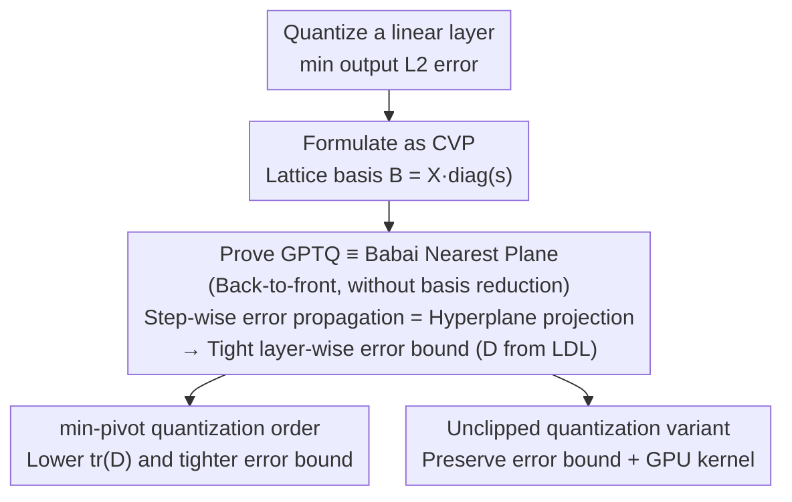

# The Geometry of LLM Quantization: GPTQ as Babai's Nearest Plane Algorithm

**Conference**: ICLR 2026  
**arXiv**: [2507.18553](https://arxiv.org/abs/2507.18553)  
**Code**: [GitHub](https://github.com/IST-DASLab/GPTQ-Babai)  
**Area**: Model Compression / Quantization  
**Keywords**: GPTQ, Quantization, Lattice Theory, Closest Vector Problem, Babai's Algorithm, Error Bound

## TL;DR

This paper provides the first proof that GPTQ (when executed back-to-front) is mathematically equivalent to the classical Babai's Nearest Plane algorithm in lattice theory. This equivalence yields a geometric interpretation and a layer-wise error upper bound, based on which an improved unclipped quantization method is designed.

## Background & Motivation

GPTQ is a standard method for LLM post-training quantization, capable of quantizing 16-bit weights to 4-bit in a single pass while maintaining near-baseline accuracy. However, GPTQ is only described as a sequence of greedy algebraic operations—quantizing weights one by one and optimally updating unquantized weights to compensate for errors—**lacking geometric intuition and worst-case guarantees**.

Core Problem: Why does a locally greedy rule perform so excellently on a global scale?

## Method

### Overall Architecture

The paper does not propose a new quantization framework but translates the greedy algebraic algorithm of GPTQ into the language of lattice theory, providing it with geometric imagery and worst-case guarantees. The logic flow is as follows: first, "quantizing a linear layer" is strictly formulated as a Closest Vector Problem (CVP) on a lattice; then, GPTQ executed back-to-front is proven to be step-by-step equivalent to the classical Babai's Nearest Plane algorithm. Consequently, every error propagation step in GPTQ corresponds to a geometric hyperplane projection. The approximation guarantees of Babai's algorithm are then applied to obtain a computable and tight layer-wise error upper bound—the quantization difficulty of a layer can be predicted by reading the diagonal matrix of the LDL decomposition of the Hessian. Following this error bound, the authors derive a quantization order (min-pivot order) that minimizes error and an unclipped quantization variant that preserves the validity of the bound, accompanied by a GPU inference kernel.

### Key Designs

**1. Formulating Quantization as Closest Vector Problem (CVP): Enabling Lattice Theory Tools**

Previously, GPTQ was viewed only as a "column-wise greedy algebraic operation," lacking a mathematical form suitable for existing theories. The authors rewrite it as a CVP: given calibration activations $\bm{X} \in \mathbb{R}^{n \times c}$, weights $\bm{W} \in \mathbb{R}^{c \times r}$, and quantization scales $\bm{S}$, column-wise quantization seeks an integer vector $\bm{z}_i$ to minimize the output error $\arg\min_{\bm{z}_i \in \mathbb{Z}_\dagger^c} \|\bm{X}\,\text{diag}(\bm{s}_i)\,\bm{z}_i - \bm{X}\bm{w}_i\|^2$. By setting the lattice basis as $\bm{B} = \bm{X}\,\text{diag}(\bm{s}_i)$ and the target vector as $\bm{y} = \bm{X}\bm{w}_i$, quantization becomes "finding the closest lattice point to $\bm{y}$ in the lattice $\{\bm{B}\bm{z}\}$"—which is exactly the CVP. Theorem 1 further clarifies that the error depends only on the Hessian $\bm{X}^\top\bm{X}$, meaning any factor satisfying $\bm{\mathcal{X}}^\top\bm{\mathcal{X}}=\bm{X}^\top\bm{X}$ can replace $\bm{X}$, allowing for more numerically convenient lattice bases.

**2. GPTQ ≡ Babai Nearest Plane: Error Propagation as Hyperplane Projection and Error Bounds**

This is the core conclusion. OBQ/GPTQ updates remaining weights to compensate for errors after each weight is quantized, previously viewed as an algebraic trick. Theorem 2 proves this step is geometrically equivalent to the Babai algorithm projecting the target vector onto the current nearest hyperplane: the update satisfies $\Delta \zeta_{j_1} = \frac{(\bm{B}^\top\bm{B})^{-1}[j_1, j_2]}{(\bm{B}^\top\bm{B})^{-1}[j_2, j_2]}\,\Delta \zeta_{j_2}$, meaning the perturbation from quantizing one coordinate is distributed to adjacent coordinates proportional to the inverse Hessian, exactly corresponding to the re-representation of the residual on the lattice basis after projection. Theorem 4 extends this to the global level: if the dimension order is aligned (GPTQ back-to-front, with lower triangular factors replaced by upper triangular ones), GPTQ produces identical results to Babai's Nearest Plane without basis reduction. A tight error bound is derived: in the unclipped setting ($\mathbb{Z}_\dagger = \mathbb{Z}$), Theorem 5 provides

$$\|\bm{X}\,\text{diag}(\bm{s}_i)\,\bm{z}_i - \bm{X}\bm{w}_i\|^2 \leq \tfrac{1}{4}(\bm{T}^{-1}\bm{s}_i)^\top \bm{D}\,(\bm{T}^{-1}\bm{s}_i),$$

where $\bm{D}$ is the diagonal matrix from the LDL decomposition of the permuted Hessian, and $\bm{T}$ is the corresponding unit lower triangular factor. Since the bound depends only on $\bm{D}$ and the scales, quantization difficulty can be predicted directly from the LDL diagonal elements. When weights are approximately uniformly distributed, the expected error is roughly $1/3$ of the worst case.

**3. min-pivot Quantization Order: Trading Short Residuals for Smaller tr(D)**

The error bound explicitly makes minimizing $\text{tr}(\bm{D})$ the optimization objective, which directly informs the choice of quantization order. While the original GPTQ act-order sorts by descending Hessian diagonals, this paper proposes the min-pivot order: selecting the smallest diagonal element as the pivot in each LDL (or Cholesky) step. Geometrically, this is equivalent to choosing the shortest residual vector for orthogonalization in Gram-Schmidt. It is computed in cubic time without increasing total quantization complexity, consistently yielding a lower $\text{tr}(\bm{D})$ than act-order. However, the authors note that downstream accuracy gains are modest—when the Hessian is well-conditioned, act-order already captures most of the benefits.

**4. Unclipped Quantization: Preserving Error Bounds with GPU Kernels**

The aforementioned error bound holds only when no clipping occurs. Original GPTQ clips overflowing integers back to the legal range, introducing large errors and violating the bound in Theorem 5. To address this, an unclipped variant is designed. Instead of simply increasing the scale (which loosens the bound), the authors use a non-uniform bit representation where inliers use low bits and rare outliers are stored separately. A binary search (targeting overflow density or total bits) automatically sets the scale to keep actual errors within the theoretical upper bound. A CUDA inference kernel handles both dense inliers and sparse outliers, making this variant deployable.

## Key Experimental Results

### Validation of GPTQ Error Bounds

| Setting | Relationship between Theoretical Bound and Actual Error |
|---------|---------------------------------------------------------|
| Unclipped + act-order | Actual error is consistently below the theoretical bound |
| Unclipped + min-pivot | $\text{tr}(\bm{D})$ is consistently reduced, with slight downstream gains |

### Comparison of Quantization Orders

| Permutation Strategy | tr(D) | Downstream Accuracy |
|----------------------|-------|-------------------|
| Default order | Baseline | Baseline |
| act-order | Lower | Improved (most gains captured for well-conditioned Hessians) |
| min-pivot | Consistently lower than act-order | Slightly better, but the gain is modest |

### Key Findings

- The unclipped method outperforms original GPTQ (with clipping) in certain scenarios.
- The equivalence proof is mathematically "tight"—performing a GPTQ update after a Babai projection does not change the result (Section C.4).
- min-pivot consistently reduces $\text{tr}(\bm{D})$, but downstream accuracy improvements are modest compared to act-order.
- Expected error is approximately 1/3 of the worst-case error (under uniform weight distribution).

## Highlights & Insights

1.  **Mathematical Elegance**: Connects the practical GPTQ algorithm to decades of lattice theory research, opening new directions for quantization design.
2.  **Theoretical Depth**: The discovery of error bounds allows for predicting quantization quality simply by reading the LDL diagonal matrix.
3.  **Counter-intuitive Insight**: GPTQ updates are algebraically redundant after a Babai projection; the two algorithms are fundamentally "tight" in their equivalence.
4.  **Practical Value**: The unclipped method combined with an efficient GPU kernel provides a deployable improvement.

## Limitations & Future Work

- The downstream accuracy gain of min-pivot order over act-order is relatively limited.
- The unclipped method requires extra integer bits for overflows, increasing representation complexity.
- The computational overhead of basis reduction (LLL/BKZ) on LLM-scale lattices remains unresolved.
- The study focuses on layer-wise errors and does not analyze the cumulative effects of error across layers.

## Related Work & Insights

- **GPTQ** (Frantar et al., 2023): Standard one-shot quantization for LLMs.
- **OBQ/OBC** (Frantar & Alistarh, 2022): Predecessors of GPTQ.
- **QuIP** (Chee et al., 2023): Proved error guarantees for GPTQ and proposed LDLQ.
- **Babai's Algorithm** (Babai, 1986): Polynomial-time approximation for CVP.
- **LLL Basis Reduction** (Lenstra et al., 1982): Classic algorithm for lattice basis reduction.

## Rating

- Novelty: ⭐⭐⭐⭐⭐ (Historic equivalence proof)
- Theory: ⭐⭐⭐⭐⭐ (Rigorous mathematical proofs + tight bounds)
- Experimental Thoroughness: ⭐⭐⭐ (Solid theoretical validation, though large-scale experiments are somewhat limited)
- Value: ⭐⭐⭐⭐ (Unclipped method + GPU kernel ready for deployment)

<!-- RELATED:START -->

## Related Papers

- [\[ICLR 2026\] The Lattice Geometry of Neural Network Quantization -- A Short Equivalence Proof of GPTQ and Babai's Algorithm](the_lattice_geometry_of_neural_network_quantization_--_a_short_equivalence_proof.md)
- [\[ICLR 2026\] Rethinking Residual Errors in Compensation-based LLM Quantization](rethinking_residual_errors_in_compensation-based_llm_quantization.md)
- [\[ICLR 2026\] TurboBoA: Faster and Exact Attention-aware Quantization without Backpropagation](turboboa_faster_and_exact_attention-aware_quantization_without_backpropagation.md)
- [\[ICLR 2026\] Inlier-Centric Post-Training Quantization for Object Detection Models](inlier-centric_post-training_quantization_for_object_detection_models.md)
- [\[ICLR 2026\] MOSS: Efficient and Accurate FP8 LLM Training with Microscaling and Automatic Scaling](moss_efficient_and_accurate_fp8_llm_training_with_microscaling_and_automatic_sca.md)

<!-- RELATED:END -->
