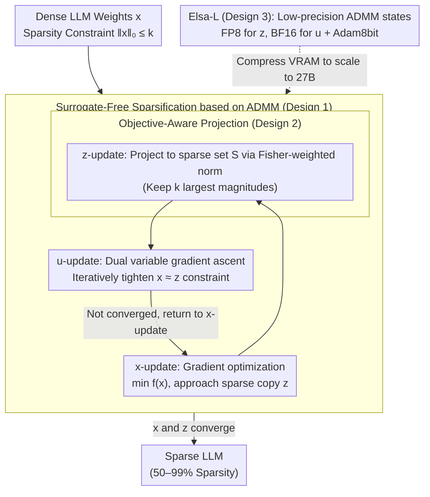

# The Unseen Frontier: Pushing the Limits of LLM Sparsity with Surrogate-Free ADMM

**Conference**: ICLR 2026  
**arXiv**: [2510.01650](https://arxiv.org/abs/2510.01650)  
**Code**: [https://github.com/log-postech/elsa](https://github.com/log-postech/elsa)  
**Area**: Model Compression  
**Keywords**: LLM Pruning, Extreme Sparsity, ADMM, Surrogate-free Objective, Network Compression

## TL;DR

The Elsa method is proposed to directly solve the sparsity-constrained problem through ADMM-based constrained optimization without surrogate objectives. It breaks the 50-60% "sparsity wall" bottleneck in LLM pruning, maintaining high model fidelity even at 90% sparsity.

## Background & Motivation

- **LLM Deployment Challenges**: Large Language Models are massive in size, requiring enormous memory, compute, and energy, which severely restricts their widespread deployment.
- **Pruning Bottlenecks**: Existing LLM pruning methods (SparseGPT, Wanda, ALPS, etc.) experience sharp performance degradation after reaching 50-60% sparsity, forming a so-called "sparsity wall."
- **Root Cause Analysis**: Current methods rely on surrogate objectives that minimize layer-wise reconstruction errors, leading to three critical flaws:
  1. **Accumulated Approximation Errors**: Layer-wise solving cannot achieve zero reconstruction error; small errors propagate through layers, causing overall performance collapse.
  2. **Global Suboptimality**: Independent layer-wise optimization restricts the search space, and previous layers cannot be adjusted once fixed.
  3. **Surrogate Objective Bias**: Minimizing the reconstruction error $\tilde{f}$ is not equivalent to minimizing the true language modeling objective $f$.

## Method

### Overall Architecture

Unlike SparseGPT or Wanda, which minimize reconstruction errors layer by layer, Elsa reformulates pruning as a global constrained optimization problem: directly minimizing the true language modeling objective $f(x)$ while enforcing the sparsity constraint $\|x\|_0 \leq k$, i.e., $x^{\star} = \arg\min f(x) \ \text{s.t.}\ \|x\|_0 \leq k$. Since the $\ell_0$ constraint is non-differentiable and coupled with the training objective, Elsa utilizes ADMM (Alternating Direction Method of Multipliers) for variable splitting. It introduces a sparse copy $z$ and a dual variable $u$ to decouple "optimizing weights" from "ensuring sparsity," cycling through three sub-problems: $x$-update uses gradient optimization to minimize the true loss $f$; $z$-update projects weights into a sparse set (using objective-aware Fisher projection); and $u$-update tightens the constraint. Iterations continue until $x$ and the sparse copy $z$ converge. For large models like 27B, Elsa-L stores ADMM states in low precision to fit the process into manageable VRAM.

### Key Designs

**1. Surrogate-Free Sparsification based on ADMM: Decoupling Sparsity from Training**

The root problem of existing methods lies in replacing the true objective $f$ with layer-wise reconstruction errors $\tilde f$, which leads to the "sparsity wall." Elsa introduces an auxiliary variable $z$ as a "sparse copy" and reformulates the problem into an augmented Lagrangian form:

$$\mathcal{L}_{\lambda}(x,z,u) = f(x) + I_{\mathcal{S}}(z) + \frac{\lambda}{2}\|x - z + u\|_2^2 - \frac{\lambda}{2}\|u\|_2^2,$$

where $I_{\mathcal{S}}$ is the indicator function for the sparse set and $u$ is the dual variable. Three sub-problems are solved alternately: the $x$-update minimizes the true objective $f$ via gradient optimization while being pulled toward the sparse copy $z$; the $z$-update projects the current solution back to the sparse set $\mathcal{S}$ (retaining the $k$ largest parameters); the $u$-update performs gradient ascent on the dual variable to tighten the constraint. This allowed model weights to be trained freely according to the true loss while sparsity is enforced by $z$ and $u$, avoiding global suboptimality. Under conditions where $f$ is lower-bounded, $\beta$-smooth, and $\mu$-weakly convex, this iteration is proven to converge to a $\lambda$-stationary point of the original constrained problem.

**2. Objective-Aware Projection: Aligning Weight Removal with the Loss Function**

If the $z$-update in Design 1 uses standard Euclidean pruning, it assumes all parameters are equally important. In reality, weights have varying impacts on the loss $f$. Elsa employs a Hessian-induced norm for this projection:

$$z^{t+1} = \arg\min_{z \in \mathcal{S}} \sum_{i \leq d} \hat{\mathbf{F}}_{ii} \big(z_i - (x_i^{t+1} + u_i^t)\big)^2,$$

where $\hat{\mathbf{F}}_{ii}$ is a diagonal approximation of the empirical Fisher Information Matrix (obtained via the Gauss-Newton approximation using gradient outer products). This acts as an "importance weight" for each parameter—directions sensitive to the loss are less likely to be pruned. Crucially, this second-order information requires no extra computation as it can be retrieved for free from the second-moment estimates already maintained by the Adam optimizer. This converts the projection from a purely geometric operation into one aligned with the training objective.

**3. Low-Precision State Expansion (Elsa-L): Scaling to 27B Models**

Naive Elsa requires storing the full model parameters, auxiliary variable $z$, and dual variable $u$, creating significant memory pressure for large models. Elsa-L quantizes these extra states: using FP8 for $z$, BF16 for $u$, and an Adam8bit optimizer for the $x$-update (storing one state in FP8 instead of FP32 saves 4$\times$ memory). Even with quantization errors, this variant maintains rigorous convergence proofs under additional error constraints, ensuring that scalability does not come at the cost of theoretical guarantees.

## Key Experimental Results

### Main Results: Perplexity vs. Sparsity

| Model | Method | 60% PPL | 70% PPL | 80% PPL | 90% PPL |
|------|------|---------|---------|---------|---------|
| OPT-125M | SparseGPT | 49.83 | - | >1000 | - |
| OPT-125M | Elsa | 42.99 | - | 47.45 | - |
| LLaMA-2-7B (90%) | Prev. SOTA | - | - | - | ~210 |
| LLaMA-2-7B (90%) | Elsa | - | - | - | 26.97 (Wiki) / 23.14 (C4) |
| LLaMA-2-13B (90%) | Others | - | - | - | >100 |
| LLaMA-2-13B (90%) | Elsa | - | - | - | 27.84 |

### Extreme Sparsity Experiments (LLaMA-2-7B)

| Sparsity | Method | Wiki PPL | C4 PPL |
|--------|------|----------|--------|
| 90% | Wanda + Full | 42.40 | 34.87 |
| 90% | Elsa | **26.97** | **23.14** |
| 95% | Wanda + Full | 84.30 | 53.62 |
| 95% | Elsa | **38.91** | **28.39** |
| 99% | Wanda + Full | 146.37 | 71.64 |
| 99% | Elsa | **55.94** | **40.10** |

### Deployment Efficiency (LLaMA-2-7B)

| Sparsity | Latency Gain | Throughput Gain | Memory Compression |
|--------|----------|----------|----------|
| 70% | 1.94× | 1.93× | 2.42× |
| 90% | 2.50× | 2.56× | 4.60× |
| 95% | 4.00× | 3.98× | 7.80× |

### Ablation Study Findings

- Objective-aware projection significantly improves performance compared to standard Euclidean projection.
- The Elsa method is consistently effective across all tested architectures (OPT, LLaMA-2/3, Gemma-2) and scales (125M-27B).
- In zero-shot downstream tasks at 90% sparsity, Elsa maintains optimal accuracy on 6 out of 7 tasks.

## Highlights & Insights

- **Breaking the Sparsity Wall**: It demonstrates for the first time that LLMs can maintain meaningful performance even at 90% or 99% sparsity.
- **Solid Theory**: Based on classic ADMM optimization theory with rigorous convergence guarantees.
- **Deep Problem Diagnosis**: Systematic analysis of the three root causes of failure in existing methods (error accumulation, local suboptimality, surrogate bias) with a unified solution.
- **High Practicality**: 90% sparsity results in a 2.5× reduction in latency and 4.6× memory compression.

## Limitations & Future Work

- Requires approximately 1.78 hours of training on 4 GPUs (LLaMA-2-7B, 90%), making its computational cost higher than one-shot pruning methods.
- Needs to store full model parameters and optimizer states, leading to higher memory requirements than layer-wise methods.
- Currently only validates unstructured and N:M semi-structured sparsity; other sparsity patterns are not extensively explored.
- Applicability to MoE architectures and multi-modal models has not yet been verified.

## Related Work & Insights

- **Layer-wise Pruning**: SparseGPT, Wanda, ALPS, L-ADMM, SAFE, SparseLLM.
- **ADMM Pruning**: L-ADMM uses layer-wise ADMM but remains limited by surrogate objectives.
- **Global Optimization Perspective**: This work is the first to successfully apply global surrogate-free ADMM sparsification to LLMs.
- **Quantization**: Orthogonal to quantization; Elsa-L itself utilizes low-precision techniques to improve scalability.

## Rating

| Dimension | Score |
|------|------|
| Novelty | ★★★★★ |
| Theoretical Depth | ★★★★☆ |
| Experimental Thoroughness | ★★★★★ |
| Value | ★★★★☆ |
| Writing Quality | ★★★★☆ |

<!-- RELATED:START -->

## Related Papers

- [\[ICLR 2026\] To Compress or Not? Pushing the Frontier of Lossless GenAI Model Weights Compression with Exponent Concentration](to_compress_or_not_pushing_the_frontier_of_lossless_genai_model_weights_compress.md)
- [\[ICLR 2026\] Alignment-Enhanced Integration of Connectivity and Spectral Sparsity in Dynamic Sparse Training of LLM](alignment-enhanced_integration_of_connectivity_and_spectral_sparsity_in_dynamic_.md)
- [\[ICLR 2026\] Is Finer Better? The Limits of Microscaling Formats in Large Language Models](is_finer_better_the_limits_of_microscaling_formats_in_large_language_models.md)
- [\[ICLR 2026\] Towards Reliable Benchmarking: A Contamination Free, Controllable Evaluation Framework for Multi-step LLM Function Calling](towards_reliable_benchmarking_a_contamination_free_controllable_evaluation_frame.md)
- [\[ICLR 2026\] Learnable Sparsity for Vision Generative Models](learnable_sparsity_for_vision_generative_models.md)

<!-- RELATED:END -->
